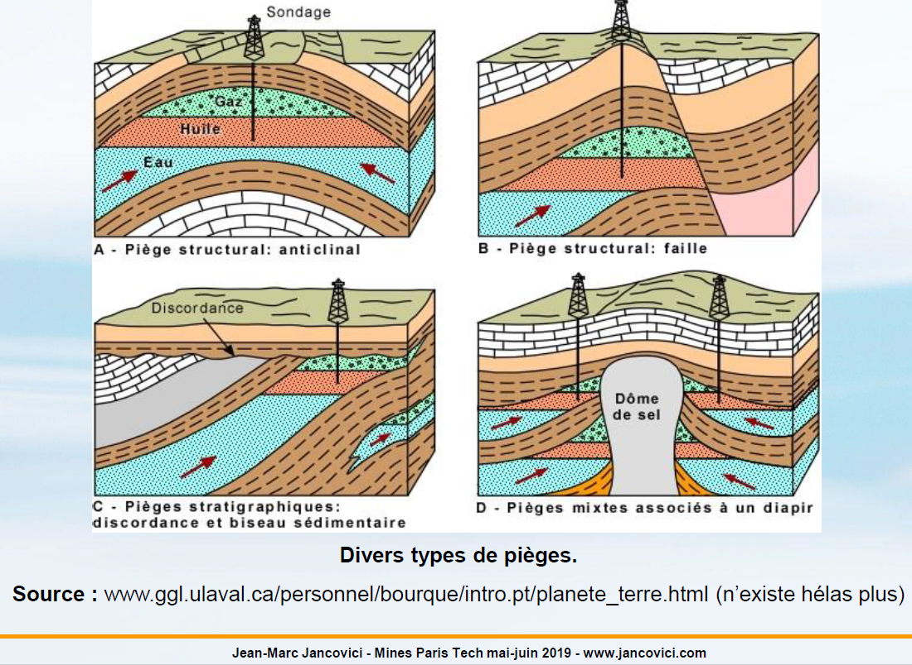
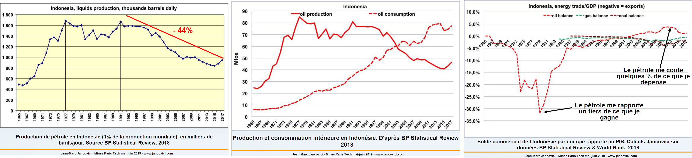
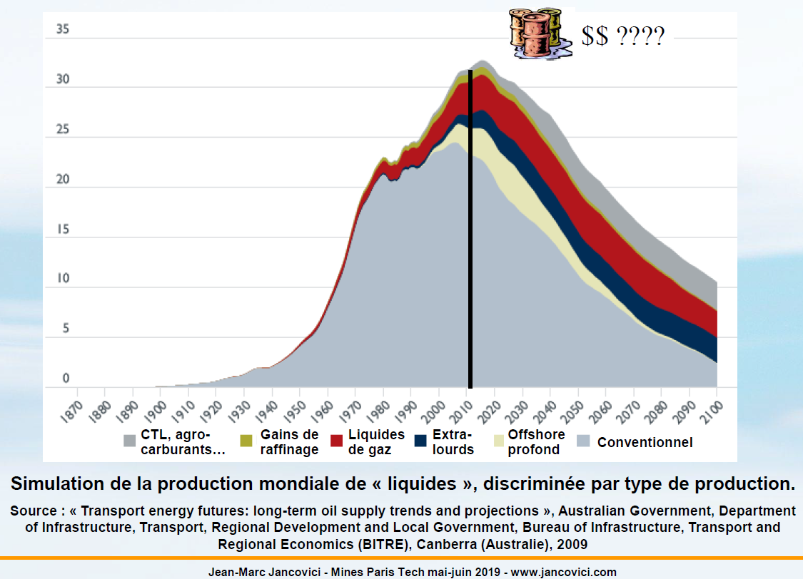

# ECC2 - Les énergies fossiles

Le monde dans lequel nous vivons (7-8 milliars d'homo industrialis) est du essentiellement aux énergies fossiles qui ont permis d'alimenter un parc de machines croissant, qui a permis de créer une production croissante qui nous a donné ce que l'on a coutume d'appeller notre niveau de vie.

Dans le paysage médiatique français, il arrive que les articles de journaux ne reflète pas cette réalité, on entend donc parfois que la France est un pays "tout nucléaire". Dans les débats sur l'énergie dans la presse française, le nucléaire est un élément absorbant du débat.

Ce graphique montre de quelle énergie primaire (i.e. énergie tiré de l'environnement), ce nourisse les machines utilisé en France selon le secteur ou se trouve les machines. La colonne Industrie représente les machines qui servent à fabriquer une partie des machines que l'on consomment, la colonne Transport correspond aux machines qui servent à déplacer des personnes ou des marchandises; les colonnes Tertiaire/Résidentiel correspondent aux machines qui sont dans les batiments (radiateur, cuisine, etc.), la colonne Agriculture correspond aux machines des champs. L'ordonné est en milliards de kWh (i.e. TWh) et il s'agit d'énergie finale (i.e. energie qui passe un compteur avant d'alimenter une machine, energie payé par le consomateur finale).

Encerclé en bleu, la totalité de ce qui vient des combustibles fossiles dans ce qui alimente le parc de machine qui structure l'activité du pays. On voit assez facilement que l'essentiel de l'énergie finale (particulier ou entreprise) est constitué d'un vecteur qui a été fabriquer a partir d'énergie fossile (carburant liquide, electricité fait avec du gaz, chaleur faite avec du gaz, etc.). En France, c'est essentiellement des carburants liquides et du gaz finale - utilisé directement pour le chauffage ou d'autre usage dans l'industrie - qui sont l'essentiel de nos combustibles fossiles. On utilise également un peu de charbon (10% du CO$_2$ mais pour une proportion moins grande en quantité d'enérgie). L'electricité qui vient du nucléaire en vert. Par exemple, dans le résidentiel, le bois et l'électricité du nucléaire représnete des approvisionnemnt énergetique du même ordre de grandeur.

L'essentiel de ce qui alimente le parc de machines en France comme ailleurs sont des énergies fossiles. Quand on résonne en terme de CO$_2$, on ne peut pas résonner exactement comme ca : la génération électrique se fait avec des machines de Carnot (=> Beaucoup de perte dans le système), mais sur l'énergie finale, c'est très très fossiles.

## Pétrole

Dans ces énergies fossiles, ce qui domine l'approvisionnement énergetique en France et dans les pays de la zone OCDE (i.e. ~ les pays anciennement industrialisés), c'est le pétrole.

Le pétrole, une fois qu'on la fait sortir de terre, on ne s'en sert pas tel quel. A peu prêt aucune machine (sauf par exemple les chars d'assaut) ne sait utilisé du pétrole brut. Donc on le rafine : on le fait passer dans un grand alambic, et on distille ce pétrole et en faire donc des fractions qui seront constitués de molécules qui ne sont pas de même longeurs en ce qui concerne la chaîne carbonné : on sépare les chaines carbonné entre des chaines courtes et des chaines longues.

Cette figure présente la décomposition d'un baril de pétrole en sortie de rafinerie. On a des produits légers : nafta et GPL. Le nafta est la base de la pétrochimie (i.e. chimie organique; toute la chimie organique sur Terre est à base gaz ou pétrole). On a de l'essence, du diesel, du fuel (qui sont exactement le même produit); on a du kerosène, les bitumes (avec lesquelles on recouvrent les routes), on a des cires et des huiles, du cote de pétrole (résidu solide qu'on a en fin de distillation et qui sert à alimenter l'énergie de la colonne de distillation en général : c'est recyclé sur place sauf quelque usage industriel divers et variés).

Si on regarde comment évolue la consommation du monde en produit distillé, on obtient la figure suiavnte. Toute en haut, on trouve L'Essence et l'essence aviation (l'essentiel c'est de l'essence), en dessous on trouve du gazoil et du fioul de chauffage (l'essentiel c'est du gazoil), en dessous on trouve du fioul (autrefois appellé fioul lourd) qui sert a la marine marchande, dans l'industrie et dans la génération électrique, enfin on a tout le reste (nafta, huiles, cires, bitume, coque de pétrole, etc.).

On voit que dans le monde la consommation de chacun de ces produits augmente.

En Europe, c'est un peu différent. Comme on a vu précédemment (ECC1), l'Europe est depuis 2005 sous stress d'approvisionnement en ce qui concerne son pétrole. Elle n'arrive plus à suivre la tendance mondiale. On voit que l'essentiel de ce que consomme l'Europe en terme de produit raffiné c'est du diesel, du fioul et du kerosène. C'est pas propre à la France.

> La dimunition d'utilisation de fioul lourd est du à la sortie du fioul dans la génération électrique et la sortie du fioul de l'industrie qui a était remplacé par du gaz (deux basculement principaux). Par ailleurs, on a progressivement adapté les raffineries. En gros dans une raffinerie, on rentre un paquet donné d'atomes de carbonne et d'atomes d'hydrogène et on les réarange de façon différente. [Grace à Lavoisier] Tout le carbonne qu'on ne retrouve pas dans les produits légers se retrouvent dans les produits lourds. Donc si on organise notre coupe de raffinerie (i.e. la manière dont se décompose les produits en sortie de raffinerie) en donnant de l'avantage a des produits plus légers que le fioul lourd, parce qu'on veut augmenter la part d'essence et de diesel, à ce moment, on va augmenter corrélativement la part de bitume, de cire et d'huile dont on ne sait pas nécessairement quoi faire. Donc il y a toujours un arbitrage qui se passe.
> L'une des raisons pour laquelle en France on a fiscalement avantagé le Diesel, c'est parce qu'à un moment en France, on consommé trop d'essence par rapport à ce que savait sortir les raffineries. Et donc a ce moment, on a chercher a favoriser le Diesel afin de rééquilibrer la donne notamment après les chocs pétroliers quand le fioul est sortie rapidement du chauffage des habitations. On s'est retrouvé avec beaucoup de fioul sur les bras sans savoir quoi en faire et donc on a essayé de le faire consommer par des voitures. Ce n'est donc pas "un complot des constructeurs" qui voulait mettre des particules fines partout, c'est juste un réequilibrage des produits en sortie des raffineries. Soit dit en passant, si on dit demain matin qu'on interdit le Diesel, on se retrouve avec 30% de la coupe de raffinerie sur les bras dont on ne sait pas quoi faire. On peut pas le mettre dans le chauffage (car on veut sortir le fioul du chauffage pour des raisons de climat), on ne le met pas dans l'industrie (pour les mêmes raisons).
> De plus une raffinerie, ce n'est pas quelquechose qui se "paramètre" d'un jour sur l'autre. Une fois qu'on a construit une raffinerie pour qu'elle est une décomposition donné en bitume, etc. En fait c'est des prises dans une colonne de distillation qui sont des prises physiques, a des hauteurs données dans la colonne de distillation. Donc on ne débranche pas le machin pour le mettre 10 mètres plus bas en disant je vais changer le fractionnement de la raffienrie. C'est des travaux lourd qui sont nécessaires pour effectuer ce genre de choses.

Si l'on regarde le monde dans son ensemble, en ce qui concerne les produits raffinés, ce qui l'est important de noté c'est que l'essentiel des produits raffinés sert les transports et en particulier les transport routiers (rappel: 98% du transport planétaire est fait avec du pétrole, l'électricité et le gaz sont marginales). Cela signifie que le pétrole est par essence de la mondialisation : pas de mondialisation sans pétrole et symétriquement, pour qu'il y est de la mondialisation, il faut du pétrole.

Cette figure présente une décomposition de la consommation de pétole par zone. Ce que l'on voit c'est que la consommation des Etats unis est raisonnablement constante et que c'est depuis longtemp dans cette décomposition le premier consommateur de pétrole dans le monde. Aujourd'hui encore, les Etats unis consomment pas loin d'1/5 du pétrole mondiale, ce qui fait beaucoup pour un pays qui fait pas 1/5 de la population mondiale mais plutôt 5%. On voit également les autres zones et on note évidemment l'essor de la Chine dans les périodes récentes.

## Gaz

A coté du pétrole, on consomme aussi du gaz.

Cette figure présente la décomposition de la destination du gaz utilisé dans le monde; on a en gros 3 paquets : Electricité, Industrie, Chauffage. En France, c'est la chauffage qui domine de très loin : environ 60% du gaz qu'on consomme est utilisé dans le chauffage.

## Charbon

Enfin on consomme également du charbon.

Cette figure présente la décomposition de charbon par pays depuis 1965. On y voit une grosse bosse qui correspond à l'essor industriel de la Chine. Mais avant elle, l'essor industriel de la Corée du Sud c'est fait exactement de la même manière : la Corée du Sud a multiplié s'est émission de CO$_2$ par 27 en 1965 et 2020. On a la exactement le même processus qui c'est produit pour la Chine qui était insignifiante dans la consommation de Charbon en 1965 et qui en utilise aujourd'hui la moitié.

L'essentiel du charbon qu'on utilise dans le monde sert a la production électrique : environ les 2/3. Dans le tier restant, on a une moitié en gros qui sert à la production d'acier (charbon métalurgique).

## Comparaison

Ces énergies ne sont pas égale en ce qui concernent leur rayonnement géographique. La seule énrgie mondiale que nous ayons - pour des raisons physique - est le pétrole. Le pétrole est la seule énergie pour laquelle on a plus des 2/3 de la production mondiale qui passe une frontière entre le pays de production et le pays de consommation. La raison à cela est que le pétrole est très dense par unité de volume. C'est la plus dense des énergies fossiles par unité de volume : 10kWh dans un Litre. Les autres énergies font pas ca : dans un Litre de gaz a température et pression ambiante on a environ 1000 fois moins et dans un Litre de Charbon on a environ 2 à 4 fois moins d'énergie (dépend de la qualité du Charbon). Par ailleurs, le pétrole est liquide et donc se transvase, donc se transporte et se stock extrémement facilement avec des déperditions d'énergie dans la chaine de logistique qui sont très faible.

En ce qui concerne le gaz, on a que 30% du gaz produit dans le monde qui passe une frontière entre pays de production et pays de consommation. Et la dedans, on a que 10% (10 sur 30) qui transite sous forme de gaz naturel liquéfié (GNL). Or le gaz naturel liquéfié qui se transporte dans des méthanier qui sont des espèces de grand frigo sur l'eau (comprimé et surtout froid pour que le méthane soit sous forme liquide). C'est la seule forme de transport qui est arbitrable a la demande comme le pétrole.

Par exemple pour le pétrole les navires peuvent changer de destination en cours de route en fonction des prix d'achats à destination. Il est possible de faire ca avec le pétrole (et ca se fait). Le multiple des échange du pétrole papier par rapport au pétrole physique est d'environ un facteur 100. C'est une autre manière de dire qu'une cargaison est négocié des dizaines de fois entre son point de départ et son point d'arrivé.

Alors que pour le gaz par pipeline, on ne peut pas faire ca. Une fois qu'on a créer un pipeline entre la Russie et l'Allemagne, on a qu'un seul producteur la Russie, et qu'un seul consommateur, l'Allemagne.

Les échanges internationaux de gaz par gazoduc sont des échanges très rigides (1 producteur et 1 consommateur). C'est la raison pour laquelle historiquement, le prix du gaz a était calé sur le prix du pétrole, parce que le gaz était un subtitut au pétrole et il fallait être absolument sûre tant du côté producteur que du côté consommateur que l'on aurait pas envie d'arrêter de consommer du gaz en fonction de ce qu'était le prix du pétrole (le meilleur moyen étant de rendre ces prix équivalent). C'est la façon dont les contrats de gaz se sont mis en place dans le monde et c'est la raison pour laquelle le gaz est a peut prêt partout sauf dans quelques exceptions indexé sur le prix du pétrole.

Il n'y a que 10% du charbon (or charbon métalurgique, qui est un charbon qui vaut chère parce qu'il sert a faire de l'acier, et qu'il n'y a que quelques mines qui savent faire du charbon métalurgique dans le monde, c'est à dire du charbon a très haute teneur en carbonne qui va servir ensuite a donner du coque) extrait d'une mine dans le monde qui passe une frontière entre le pays de production et le pays de consommation. Quand on va du pétrole au charbon en passant par le gaz, on va d'une énergie qui est mondiale par essence, à une énergie qui est domestique par essence. C'est aussi la raison pour laqulle dans les pays qui ne consomme pas de charbon en direct, ce qui est le cas de la France, on a tendance à oublier sa place chez les autres, car ce qui se passe dans un pays donné est raisonnablement indépendant de ce qui se passe dans les autres pays en ce qui concerne le charbon.

Ce qu'on voit sur la figure par exemple, c'est qu'alors que la Chine explose ca consommation de charbon, on a d'autres zones dans le monde qui augmente aussi, mais d'autres qui diminuent et si on prend l'ensemble du reste du monde, il n'y a pas de grande différence.

La consommation de Charbon est une affaire domestique, la consommation de gaz est une affaire régionale (en schématisant), et la consommation de pétrole une affaire mondiale.

## Energie fossile en France

En France, nous consommons des énergies fossiles.

La figure présente la consommation de pétrole dans le pays. Ce que l'on voit c'est que la consommation de pétrole a augmenter très très fortement jusqu'au choc pétrolier (qui sont pour rappel la marque de l'arrêt de la croissance de la quantité de pétrole consommé par les pays de l'OCDE : ce n'est pas juste une variation du prix, c'est aussi une variation instantané sur le volume qui a était extrémement structurante sur ce qui c'est passé ensuite dans l'économie). Ce que l'on voit sur cette figure, c'est qu'au moment des chocs pétroliers, une bonne partie du pétrole est utilisé dans l'industrie, une partie dans les transports, une bonne partie dans le chauffage (résidentiel et tertiaire), et toujours eu une partie dans l'agriculture (importante pour les agriculteurs mais marginal dans la consommation d'ensemble).

> Note sur la chute d'utilisation du pétrole dans le tertiaire vers 1984 : probable erreur ou "artefact statistique" (une partie des batiments qui est passé d'une catégorie à l'autre).

En terme de volume globale de ce qui est consommé dans les batiments, on voit que la consommation était beaucoup plus importante au moment des chocs pétroliers que aujourd'hui ou cela a était remplacé par du gaz et de l'électricité. Ce que l'on voit c'est qu'aujourd'hui, l'essentiel du pétrole qu'on consomme en France va dans les transports et c'est aussi la que le consommateur final est prêt a le payer le plus chère (donc pas étonannt en terme d'abritrage : si on est vendeur de produit raffiné, ce qu'on cherche à faire, c'est à le vendre la ou le consommateur est prêt à le payer le plus chère).

La figure présente la consommation de gaz dans le pays. Ce que l'on voit c'est que le premier poste de consommation de gaz utilisé en France, c'est le chauffage. Une partie importante est également utilisé dans l'Industrie ainsi qu'un petit morceaux qui va dans l'électricité (moitié de la petite partie en haut). A noté que depuis que la mer du Nord a passé son pic de production (2005), la consommation de gaz en France s'est arréter de croitre et qu'elle est globalement en décroissance pour l'ensemble batiment et industrie. Au moment ou la mer du Nord passe son pic, cela représente 60% de l'approvisionnement européen; aujourd'hui, c'est encore 50%; et on va voir dans pas longtemp que lorsque la Norvège va passer son pic, probablement que l'approvisionnement de la mer du Nord va descendre d'une grosse marche.

La figure présente la quantité de Charbon utilisée par secteur. Haut fourneaux et Cokeries représnete l'ensemble de ce qui est utilisé dans la sidérurgie. Les cokeries font du coke (traitement spéciale du charbon pour en faire du charbon presque pûre) et on utilise également du charbon qu'on enfourne directement tel que dans les industrie. Au dessus, on a l'électricité et les réseau de chaleur, mais qui a beaucoup diminué. Il reste quelque petits secteur mais le charbon en France n'est pas significatif : la consommation primaire totale de la France c'est 240 millions de tonnes équivalent pétrole et on est aujourd'hui a moins de 10.

## D'ou proviennent les énergies fossiles

Les combustibles fossiles sont des fossiles (i.e. restes de vie ancienne). Nous avons depuis très longtemp des océans sur Terre et dans ces océans, depuis très longtemp sont apparus et vivent des êtres uni ou pluri cellulaire; notamment des algues et du plancton. Ces êtres sont mortels; quand il meurt, l'essentiel d'entre eux sont décomposés dans la colonne d'eau, les restes ne tombent pas sur le plancher océanique, mais il y a quand même une petite partie de ces restes organiques qui tombent sur le plancher océanique.

En général le processus qui va être décrit se déroule plutôt prêt des côtes, la où la hauteur d'eau n'est pas très épaisse, car c'est la qu'on a les éléments minéraux qui permettent a la vie d'être la plus abondante. C'est donc la qu'il y a la plus grande probabilité que les restes organiques tombent sur le plancher sans s'être décomposer dans la colonne d'eau. Lorsque il tombe sur le plancher océanique, il vont se retrouver mélanger à des sédiments minéraux (poussière amené par le vent, des aluvions amenés par les rivières, des restes de coquilles pour les êtres qui en ont une [une bonne partie du plancton synthétise des coquilles en calcaire]).

Tout cela va se mélanger et si on est dans un endroit approprié : d'abord, ce sédiment va se compacter sous l'effet de son propre poids et ensuite la tectonique des plaques va entrainer cela dans les profondeurs ce qui va avoir pour effet de rapprocher ces éléments du radiateur qu'est le centre de la Terre (entretenue par la radiocativité naturelle des roches). Cela va engendrer une sucession de dégradation ou de décomposition de ce que l'on a dans le sédiment. Avec ce mouvement de sédimentation et d'entrainement vers les profondeurs, la partie minérale du sédiment va se transformer en ce qu'on appelle une roche mère (compactage et transformation en roche) et la partie organique qui est dans des petites inclusions dans ce sédiment va elle même subire un certain nombre de dégradations. Dans un premier temps, une dégradation bactérienne qui va expulser de l'eau et du gaz carbonique; Dans un deuxième temps, cette dégradation va devenir thermique, anaérobie, et a ce moment on a comme dans une raffnerie : un fractionnement de la matière organique qui est contenu dans la roche et qui va donner exactement comme dans une rafinerie, 3 types de chaîne organiques : on a du gaz, du liquide (qu'on appelle de l'huile), et du résidu solide (qui ressemble a du charbon et qui va rester contenu dans la roche). Primitivement, cette ensemble s'appelle du kérogène, et une fois qu'il a finit d'être pyroliser, on obtient du gaz, de l'huile, et du reste solide.

Une fois que ces composants fluides pour le gaz et le pétrole et solide ont était fait, il peut leur arriver deux choses : la première c'est qu'il reste la ou il sont parce que le sédiment a former une roche imperméable; la seconde c'est que la roche est perméable et à ce moment on va avoir à l'intérieur de la roche, sous l'effet de la pression, ce qu'on appelle une migration primaire. C'est à dire que le pétrole et le gaz qui ont étaient formé vont diffusé à l'intérieur de la roche et vont commencer a migrer à l'intérieur de la roche en remontant vers la surface (poussé par le gradient de pression). Si jamais la pyrolise est incomplète (i.e. le phénomène de tectonique et de dégradation a pris place il y a trop peu de temps), on a une roche riche en matière organique qui s'appelle des schistes bitumineux ($\neq$ sable bitumineux, en Anglais "oil shale" $\neq$ "shale oil").

Pour utiliser ce produit, on doit "finir de le chauffer a la main" (il y a une centrale électrique dans le monde qui fonctionne comme cela, avec un très très mauvais rendement énergetique puisque le produit a un pouvoir calorifique faible). On peut se servir de ces schistes bitumineux en amenant de grande quantité d'énergie pour finir artificiellement la transformation (et donc récupérer du pétrole), mais en général avec un rendement inférieur à 1. Certain imagine utiliser de la vapeur nucléaire pour faire ce genre de chose. Auquel cas on injecte un type d'energie dans le sol, on récupère un autre type d'énergie en sortie du sol, et comme c'est pas la même qui nous intéresse, on peut imaginer qu'économiquement, ca puisse valoir le coup. Cela ne va jamais énormément se développer.

Si on a pas du plancton mais qu'à la place on a des fougères; c'est ce qui s'est passer sur Terre à l'ère du charbon (carbonifère), à ce moment on a des veines de charbon. La veine de charbon quand elle se forme produit aussi du pétrole et produit aussi du gaz, exactement dans le même processus de décomposition et de pyrolise créer par la chaleur de la Terre. En générale, le pétrole s'échappe, mais une partie du partie du méthane reste absorbé dans la veine de charbon et c'est ce qui fait que quand a une exploitation charbonnière et qu'on remet la veine de charbon à la pression atmosphérique, le méthane se désorbe et si jamais on ne ventile pas les mines, on a des "coups de grisou". C'est a cause de ce processus de formation qu'on a du méthane qui est soit absorber dans le charbon soit carrément des poches dans les veines de charbon.

Par ce processus qui dure des millions d'années, on a donc la roche qui se trouve loin sous terre qui a emprisonné sa matière organique, qui a produit du pétrole et du gaz. Ce pétrole et ce gaz vont avoir tendance à migrer de facon primaire. Une fois qu'il y a eu expulsion des alvéoles, le pétrole et le gaz vont sortir de la roche mère et migrer vers la surface : c'est ce qu'on appelle la migration secondaire. L'essentiel du temps, cette migration vers la surface est complète; c'est à dire que depuis les 10 ~ 100 millions d'années que le pétrole a était formés, il migre vers la surface, arrive en surface et comme c'est un produit organique, il se décompose (mangé par les bactéries).

De temps en temps, dans sa migration vers la surface, il est coincé. C'est à dire qu'il y a une roche perméable (en général, sous la surface, il n'y a pas de trou) qui est surmonté par une imperméable; et à ce moment on a ce qu'on appelle (dans le jargon des géologues pétroliers) un piège : le pétrole qui est formé par la roche mère qui est en dessous migre jusqu'au moment ou il arrive dans la roche qui deviendra la roche réservoir. Au dessus, il ne peut pas aller plus haut car c'est une couche imperméable et il va donc s'accumuler dans la roche réservoir. En général, dans la roche réservoir, la porosité était remplis d'eau avant et ca explique pourquoi dans un réservoir de pétrole conventionnel, sous la partie imprégné de pétrole on a une partie imprégné d'eau.

Il se peut que le pétrole est était piéger à moins de 500 mètres sous terre auquel cas on appel ca du pétrole conventionnel. Si il est a plus de 500 mètres sous terre ou plus exactement à plus de 500 mètres sous l'eau, on appelle ca de l'offshore profond.

Quand le pétrole ne fait pas sa mgration primaire ou pas sa migration secondaire, il nous reste une roche mère contennant des hydrocarbures. Ce qui a donné lieu récemment au Etats-Unis a une explosion de la production de pétrole, c'est le pétrole issu de ces roches méres dont le pétrole ne s'était pas échapper (et qu'en anglais on appelle du shale oil et qu'en français on traduit mal par pétrole de schiste [ce n'est pas toujours un schiste qui est la roche mère]). On a en fait 2 types d'exploitation de pétrole de roche mère : on a le pétrole qui est vraiment dans la roche mère et le pétrole a migrer dans de petites inclusions poreuses qui sont dans la roche mère (à ce moment, cela ne s'appelle pas du shale oil mais du tight oil). Dans les deux cas de figure, comme le pétrole ne circule pas dans la roche, il faut crérer artificiellement la circulation dans la roche pour faire sortir le pétrole et c'est l'objet de la fracturation. La fracturation conduit a créer dans la roche mère un réseau de fissure qui permet au pétrole qui ne circule pas de se mettre a circuler. Cependant l'énergie de fracturation est un énergie significative, ce qui fait que le rendement énergetique de l'extraction du pétrole de roche mère est plus mauvais que le rendement énergetique de l'extraction du pétrole conventionnel.

Voila donc la facon dont se présente la formation du pétrole et du gaz. C'est le même processus pour le gaz : le gaz qui reste prisonnier dans la roche mère ou dans des inclusions dans la roche mère ou dans des réservoires qui ont residémentés s'appellent shale gas ou tight gas de la même manière.

La figure ci dessus présente quelques exemples de réservoirs. Quand les géologues cerchent du pétrole, ils ne cherchent pas au hasard : ils savent qu'ils doivent chercher dans des bassins sédimentaires; ils savent que si il y a du sel quelque part, il est possible que cela constitue une zone intéressante, etc.

Il arrive parfois que la fin de route du pétrole qui a était formé sous sol soit du sable qui est situé en surface. A ce moment, le pétrole va faire comme si c'était une roche poreuse sous terre, il va s'accumuler dans le sable. Mais comme le sable communique avec la surface, a ce moment le pétrole va perdre ses éléments les plus volatiles, et on se retrouve avec ce qu'on appelle des sables bitumineux (c'est ce qu'on a au Canada, dans la province de l'Athabasca). A ce moment, cela s'exploite comme des mines a ciel ouvert. Cela est a peu prêt équivalent a des mines à ciel ouvert de lignite : une grande surface [~ 5 * 10 km] ou l'on décapent tout ce qu'il y a au dessus; ont récupère cela avec des énormes excavatrices comme dans une exploitation de mine a ciel ouvert et l'on emmènent ca dans des upgrader qui sont des raffineries d'un genre particulier qui transforme ce mélange de bitume et de sable en quelquechose qui peut rentrer dans une voiture. Ce type d'exploitation a également un rendement énergetique qui est beaucoup plus mauvais que celui qu'on a dans une chaine pétrolière traditionnel car on a perdu les éléments les plus intéressant, les éléments les plus volatiles et donc on a un pétrole de moins bonne qualité.

Quand on a un réservoir conventionnel de pétrole et de gaz, l'histoire ne s'arrête pas nécessairement la. Comme le pétrole a était formé dans une région ou il y a de la subduction, l'histoire peut recommencer. Un réservoir de pétrole et de gaz peut lui même être entrainer vers les profondeurs et à ce moment, on a une nouvelle distillation qui survient ce qui fait que quand on cherche du pétrole du gaz, il y a ce qu'on appelle une fenêtre à huile : une profondeur ou on se dit, que a cet endroit, il va peut être y avoir du pétrole; et il y a une profondeur en dessous de laquelle si on trouve quelquechose c'est nécessairement essentiellement du gaz parce que c'est un ancien réservoir de pétrole qui a réentrainer vers les profondeurs ou la chaleur a fractionné le pétrole en molécules plus courtes. Historiquement, quand les pétroliers trouvé du gaz, c'était une calamité pour eux car le pétrole est facile a évacué d'un puit ou que l'on soit (on le met dans une cuve sur roue [un camion] et on l'embarque); en ce qui concerne le gaz, on ne met pas le gaz dans un camion puisque le gaz est 1000 fois moins dense que le pétrole a température et pression ordinaire, donc il faut avoir un tuyau pour pouvoir l'évacuer, et si on va faire un trou au milieu de l'Iran / du golf de Guiné et qu'on trouve du gaz, il n'y a pas de tuyau et on peut se demander ce qu'on en fait. C'est la raison pour laquelle dans les exploitations actuelles de gaz offshore aujourd'hui, on fait non seulement le puit mais aussi la plateforme de liquéfaction (si on avait juste le gaz, on ne saurait pas quoi en faire sans tuyau pour l'évacuer). C'est aussi la raison pour laquelle historiquement, les pétroliers laisser fuire le gaz dans l'atmosphère quand ils trouver un gisement combiné de pétrole et de gaz toujours pour la même raison parce qu'ils ne savaient pas quoi faire du gaz si ils étaient loin de toute infrastructure et donc il le laissait partir dans l'atmosphère. Depuis qu'on leur a dir que le méthane a un pouvoir de réchauffement beaucoup plus élevé que le $CO_2$, a minima, il le brûle.

Pour résumer, le processus de formation du pétrole est le suivant : des êtres vivants tombe au fonds de l’océan une fois mort, se mélange avec le sédiment minéral, sont enfouit par la tectonique des plaques, et sont chauffer par par la géothermie. Après 15 à 800 millions d’années et dans 0,0000000001% des cas, on obtient du pétrole.

On a qu'une toute petite partie de la matière organique qui a vécu sur terre qui se retrouve aujourd'hui sous forme de résidu pétrolier, gazier ou charbonnier. Le reste s'est décomposé naturellement ou bien s'est transformer sous forme de pétrole et gaz et a migrer jusqu'à la surface et a migrer jusqu'à la surface et s'est décomposer après. Si on prend la totalité du carbonne qui a était un moment contenu dans les êtres vivants et que l'on rapporte ca a ce qui est contenu dans les réservoirs fossiles, c'est une toute petite partie. C'est un processus d'accumulation qui porte sur un tout petit exhutoire de la chaîne.

Le processus de formation du pétrole est aussi gratuit que le processus d'apparition du vent. Nous n'avons pas payer le plancton qui a vécu dans l'océan il y a 300 millions d'années, nous n'avons pas payé la géothermie qui a distillé le kérogène, nous n'avons pas payer la tectonique des plaques qui a enfouis ca sous terre. Le pétrole est gratuit, exactement comme le vent, le charbon, le gaz, etc. Toutes les énergies sont gratuites.

On a ici une représentation de la fraction des réserves de pétrole de gaz en fonction de leur ancienneté. C'est une autre manière de dire que c'est le temps qu'il faut attendre pour que se reconstitue les réserves. Ce que l'on voit, c'est qu'une petite partie du pétrole et du gaz est raisonnablement jeune. Mais on peut avoir une fraction significative du pétrole sur Terre qui a plusieurs centaines de millions d'années. Le pétrole c'est donc quelquechose qui est renouvelable si on peut attendre quelques millions d'années.

> Parenthèse sur le confinement des déchets nucléaire : Quand on a un gisement de pétrole qui date de quelques dizaines de millions d'années, ce que l'on dit implicitement, c'est que pendant quelques dizaines de millions d'années, on a un produit qui est chaud et liquide qui est rester confiné au même endroit. Le réservoir a tenu pendant quelques dizaines de millions d'années. Donc le confinement géologique, si on s'y prend bien, c'est quelque chose qui tient très longtemps sans problème. C'est pas toujours le cas, mais si on s'y prend bien, ca tient très longtemp.

## Nomenclature

On ne peut pas manipuler de statistiques sans nomenclature. En ce qui concerne le pétrole, on ne peut pas le compter sans l'avoir préalablement définit. Ce n'est en fait pas simple, car dans le pétrole, on a des produits qui ne viennent pas du même endroit, qui ne s'appellent pas de la même façon et qui ne servent pas à la même chose. Historiquement, ce qu'il y avait dans le pétrole, c'était ce qui sortait des gisements de pétrole, sans traitement (au moment ou M. Drake commence a donné des coups de pioche a Tittusville, il a des puits éruptifs, il sort un produit liquide, il met cela dans des barils). La raison historique pour laquelle on compte le pétrole en baril (système métrique très particulier) c'est qu'au début de l'exploitation du pétrole, les récipients qu'on avait sous la main aux Etats-Unis c'était des barils qui servaient à contenir des harengs.

Avec le temps, on s'est rendu compte que d'un gisement de pétrole, on pouvait faire sortir d'autre chose. Il y a du gaz qui est dissout dans le pétrole. On ne met pas le méthane avec le pétrole mais il y a des gens qui compte avec le pétrole du gaz qui sort du gisement de pétrole qui s'appelle de l'éthane [$C_2H_6$], et du propane [$C_3H_8$] et du butane [$C_4H_{10}$] (qui sont des hydrocarbures saturés $C_2$, $C_3$, $C_4$).

Aujourd'hui, on a des statistiques dans lesquelles ces produits sont comptés avec le pétrole. $C_2$, $C_3$, $C_4$ portent un nom particulier : les liquides de gaz (ou Natural Gas Liquid). Cela s'appelle liquide de gaz (bien que l'éthane ne soit pas liquide a température et pression ambiante) parce que dans les usines de séparation des produits gazeux entre eux, on comprime et on refroidit (on fait de la distillation cryogénique en gros : le méthane est le dernier élément qui reste gazeux, c'est comme ca qu'on l'évacut et on fractionne et tout les autres deviennent liquide et on les évacue comme ca également). Les liquides de gaz on peut en avoir dans le pétrole (molécule dissoute dans le pétrole qui ne sont pas du méthane) mais on en a également plein dans le gaz. Tout les réservoirs de gaz qui ont étaient formés par des réservoires de pétroles qui se sont enfouis sous terre et ou le pétrole s'est fractionné sont en général des réservoires de gaz qu'on appelle humide, c'est à dire qu'il y a du méthane dedans mais aussi du butane, du propane et de l'éthane. Ces produits qu'on extrait avec le gaz sont comptés avec le pétrole.

On a également comme produit sortant avec le gaz, des produits qu'on appelle des condensats et qui sont des chaines carbonnées qui vont de $C_5$ à $C_8$ donc un peu plus légers que les produits distillés standard qui sorte de rafinerie et qui viennent également avec le gaz. Cela en général sont comptés avec le pétrole brut; Il est difficile de trouvé des statistiques dans lesquelles c'est discriminé du pétrole brut.

On voit ici les statistiques de l'agence américaine Energy Information Agency qui nous donne la production mondiale de pétrole en discriminant brut et condensat (i.e. pétrole qui sort sous forme liquide et les condensats), puis les liquides de gaz ($C_2$, $C_3$, $C_4$), puis les biocarburants. Mais quand on regard les statistiques BP statistical review, eux agrège les trois et appelle ca pétrole. On peut donc augmenter la production de pétrole avec du pétrole brut qui diminue, des liquides de gaz qui augmentent, et des biocarburants qui augmentent. Chez BP, cela s'appelle toujours "augmentation du pétrole". Si on veut avoir une attribution des causes clair et comprendre ce qu'il est entrain de ce passer, cette non discrimination se discute.

Si on regarde le pétrole brut sur ce graphique, on voit qu'il y a une longue période qui a commencé en 2005 ou ca n'augmente quasiment plus et que l'augmentation des années récentes est en fait moins rapide que l'augmentation sur la même période des liquides de gaz. Une partie de l'augmentation de la production dite de pétrole, quand on utilise les statistiques de BP ou de l'agence internationale de l'énergie (qui utilise la même nomenclature), ils mettent dans production de pétrole les liquides de gaz. Donc si on a une production de pétrole brut qui baisse et une production de gaz qui augmente, on peut se retrouver à l'arrivé avec la production de pétrole augmente.

Concernant les liquides de gaz, l'éthane et le propane sert de base pour la pétrochimie; le butane sert directement (réchaud, etc.). On cherche à séparer les liquides de gaz du méthane dans le gaz car on a des spécifications dans les appareils qui utilise le gaz (par exemple une cuisinière à gaz n'est pas configuré pour utilisé un gaz dans lequel on a une teneur variable de buthane, de propane et d'éthane; on a une spécification dans laquelle ca doit être du méthane pur à 99,9...%). C'est pour ca qu'on épure les produits. Par ailleurs, on les épure également parce qu'ils ont des utilisations particulières en chimie organique.

## Réserves

On trouve ici quelques ordre de grandeur pour comparer la matière organique de ce qui est aujourd'hui séquestrer sous le sol (c'est à dire de kérogène) et les masses respéctives de charbon, etc. On voit qu'à chaque fois, on a des processus de transformation qui ont de tout petits rendements. On a que de petites partie de ce qui prend place a une étape donné qui prend place à l'étape d'après. Les rendements dans cette affaire sont très faible.

Quelques éléments de nomenclature :

* Le pétrole et le gaz se trouve sous terre sous dans des réservoires. Un « réservoir » de pétrole et/ou de gaz met 50 à 500 millions d'années à se former.
* L'essentiel du temps, ce réservoir est une roche réservoir, il arrive que ce soit la roche mère elle même. Quand c'est une roche mère, elle est par essence sédimentaire (puisqu'elle s'est former par sédimentation), quand c'est une roche réservoir, c'est également une roche sédimentaire (puisque ce se forme dans les mêmes bassins, on a du calcaire, du grès, du sable). Il s'agit d'une **formation sédimentaire** (calcaire, grès, sable) plus ou moins poreuse (le pétrole impègne les pores en question), inégalement imprégnée par au plus 3 « étages » : gaz (qui contient des condensats), huile (qui contient du gaz dissous), eau. On peut avoir 2 étages seulement (pétrole et eau ou gaz et eau). Quand on a du pétrole et de l'eau, il y a toujours un peu de gaz qui est dissout dans le pétrole; ce qui veut dire que dans l'exploitation du pétrole on devra toujours séparer - en arrivant a pression atmosphérique - du gaz dissout et du pétrole.
* La **proportion d'huile dans la roche** (en poids) est typiquement de quelques pourcent à quelques dizaines de pourcent. Le cas typique est une dizaine de pourcent.
* Le pétrole contenu dans la roche s'appelle du pétrole « en place ». A cause de la capilarité (le pétrole est visqeux et les pores tout petit), on ne fera jamais sortir tout le pétrole en place d'une roche réservoire. De même qu'on ne fera jamais sortir tout le pétrole en place d'une roche mère. Dans le monde des pétroliers, on parle du taux de récuperation que l'on a dans un réservoire. Quand est fait une découverte, on cherche à éstimer ce taux de récuperation car il conditionne la rentabilité économique du gisement.
* En première approximation, plus le réservoir est situé profond sous terre et plus la fraction de gaz est élevée.
* Un pétrole « plus vieux que le pétrole » (qui s'est dégrader en surface), c'est du **bitume**.
* Les « schistes bitumineux » contiennent quelques % en volume de pétrole « plus jeune que le pétrole ». A ne pas confondre avec le « pétrole de schiste », qui désigne du pétrole mature disséminé dans une roche mère, ou logé dans des inclusions.

Quand on trouve un réservoir de pétrole conventionnel, on trouve quelque chose qui ressemble à ca :

Dit autrement, on est pas sous terre, on a pas les moyens d'avoir le réservoire sous le nez. On a les moyens d'exploration en surface. C'est une image qui parle aux spécialistes, ce n'est pas une image qui parle a chacun d'entre nous.

Quand on essaye de comprendre combien il y a de pétrole sous terre : "On fait le tour d'un hangar, on regarde par le trou de la serrure et on essaye de comprendre ce qu'il y a dans le hangar."

On sait maintenant faire un peu plus que ce que l'on faisait avant, mais ca ne nous dit toujours pas exactement ce qu'il y a dedans. Et donc pour savoir, on va faire des trous. Une fois qu'on a trouvé quelque chose dont on pense qu'on va trouver du pétrole, on fait un trou. Le trou s'appelle un forage d'exploration. On fait un trou on remonte une carotte et on regarde ce qu'il y a dedans.

Le pétrole en place dans la roche réservoir ou la roche mère, qu'il soit extractible ou non, une fois a peu près qualifier et quantifier, s'appelle une **ressource**. Cette quantité n'est jamais connue avec précision au moment de l'exploration (ni même après souvent), car elle va dépendre :

* Du volume de la roche poreuse (qui a rarement une forme simple)
* De sa porosité (qui varie d'un point à l'autre du réservoir)
* De la distribution de l'huile (qui peut très fortement varier au mètre près, et dépendre de la fraction expulsée pour les roches mères)
* De la viscosité de l'huile (qui peut aussi varier)

Ainsi, à chaque fois qu'on voit passer dans la presse "il y aurait tant de pétrole dans les sous-sols de tel pays", cela relève d'indication de cette nature, parcellaire, extrapolé. On imagine que ce qu'on a trouvé soit représentatif, mais ca relève toujours d'un raisonnement de type modélisation. Jamais nous auront une balance capable de peser ce qu'il y aurait dans le sous-sol de chaque pays.

La ressource peut être déjà découverte ou non. Une découverte ne « crée » pas de pétrole, elle permet simplement de savoir où il se trouve. Une fois découvert, le gisement peut être être en cours d'exploitation, en développement (les investissements sont en cours), ou rien de tout cela. Il n'est pas toujours simple de savoir si de multiples forages « positifs » dans une même zone appartiennent à un même réservoir qui communique de bout en bout, ou à plusieurs réservoirs, géologiquement séparés.

Pour un gisement ou réservoir donné dont l'exploitation a commencer, la **réserve prouvée** correspond à la quantité d'huile (le volume) qui est **extractible avec certitude** (P > 90%) **aux conditions techniques et économiques du moment**. C'est une estimation faite en mettant tout les paramètres dimensionnant à leur valeur la plus défavorable. Toutes choses égales par ailleurs :

* Elle varie avec la réévaluation du réservoir
* Elle augmente avec les progrès techniques
* Elle varie avec le prix, mais peu sur un réservoir donné (limite énergétique). La quantité de pétrole qui va sortir d'un réservoir dépend avant tout de l'infrastructure de production mise en place au début. Or cette infrastructure ne dépend pas du prix du pétrole ensuite. Donc assez peu sensible au prix pour un gisement qui est déjà en exploitation. En revanche le prix détermine le fait que l'on mettent des nouveaux. Ainsi, pour mettre de nouveau gisement de sable bitumineux au Canada, c'est mieux si le prix du baril atteint 80 ou 100 dollars. Si le prix du baril est à 30 dollars, on y va pas.
* Elle diminue avec le temps quand tous les autres paramètres sont stables, puisque avec le temps, on sort une partie du pétrole qui est contenu sous terre.

Les **réserves ultimes** correspondent à l'ensemble de ce qui peut sortir d'un gisement donné, du début à la fin de son exploitation (la définition vaut également pour les réserves mondiale). Par définition, les réserves ultimes correspondent donc à l'intégrale de la courbe de production entre $-\infty$ et $+\infty$ et **ne varient pas au cours du temps**. Elles ne varient pas avec la temps par contre, l'appréciation peut varier si on se rend compte que l'on s'est tromper sur un paramètre dimensionnant.

Les réserves ultimes **restantes** constituent la totalité du pétrole extractible restant. Les réserves prouvées en sont un sous ensemble.

Les réserves ultimes d'un réservoir ne sont connues avec certitude **qu'une fois l'exploitation terminée**. Si les réserves ultimes sont invariantes avec le temps, l'appréciation de ces réserves peut elle varier avec le temps.

Les réserves sont en fait assez peu sensibles au prix parce que beaucoup d'exploitation du pétrole conventionnel sont rentable quelque soit le prix du baril. On trouve ici les couts technique d'extraction pour un certain nombre de pays dans le monde. On voit que une bonne partie du pétrole sort entre 5 et 10 $ le baril de cout technique d'extraction. Le prix restant du baril (de 10 à ~ 80 \$), passe essentiellement en rentes (impôts, taxes, marges intermédiaires). Les marges intermédiaires ne sont pas la partie la plus importante; une bonne partie du prix du baril passe en taxe payé au pays producteurs. Quand on exploite du pétrole, on a généralement un accord de partage entre la compagnie qui exploite et le pays qui détient le pétrole. Par exemple, Total va en Iraq, Total négocie avec les iraqiens pour avoir le droit (un permis) d'exploiter le pétrole iraqiens, les iraqiens prennent une partie des revenus de l'exploitation. L'essentiel du prix du baril sur le marché part dans les pays producteurs. Ensuite arrivé à la pompe, il y a un supplément de prix qui part dans les poche du pays consommateur.

Il y a une différence fondamental entre le pétrole dit conventionnel et le pétrole dit de roche mère dans la structure des coûts. Dans un gisement de pétrole conventionnel (roche poreuse qui contient du pétrole), l'essentiel des coûts à lieu avant que le premier baril ne sorte : on a d'abord des coûts d'exploration (sismique, forage, etc.); suivi, une fois un site identifié, de la construction des infrastructures d'exploitation qui sont des engins qui coutent chères, surtout maintenant que le nouveau pétrole accessible est en général dans des zones compliqués (jungles, montagnes, offshore, zone arctique, etc.). On construit donc une plateforme d'extraction qui coutent très chères (à terre ou en mer), et derrière le pétrole va sortir.

> Anecdote de Kachagan : Kachagan est un gisement de pétrole qui se situe au Nord de la mer Caspienne et pour lequel le budget initial de développement (installation des infrastructures de production) était prévues à 5 milliards de dollars et c'est terminer à 50 milliards (multiplication par 10).

Dans ce genre de gisement conventionnel, une fois qu'on a construit les infrastructures de production (côuts capitaux de départ, capex), on a derrière des coûts d'exploitation (opex) qui sont raisonnablement modeste (ce que l'on voit sur la figure); on voit en noir, le profil de production.

En ce qui concerne le pétrole de roche mère, le profil de production d'un puit est le suivant : aprè que le puit soit mis en production, il faut environ 1 mois pour atteindre le maximum de production; et 1 an après avoir était mis en production, il est retomber à 50 à 20 % de production de son niveau initial. Du coup, pour conserver, un approvisionnement constant en provenance d'un champs, il faut rajouter des puits en permanance. Et donc le puit / la plateforme n'est plus devenu un élément de capital, c'est presque devenu un élément de charge courante. Quand on exploite un champ de pétrole ou de gaz de roche mère, le puit est un consommable. On a pas un puit comme une infrastructure en pètrole off-shore a quelques milliards de dollars, on rajoute en permanance des puits à quelques millions de dollars pour garantir le volume qui sort du champs. Ainsi, ce qui était des investissements pour un champ de pétrole conventionnel devient des charges courantes pour les gens qui exploitent des pétroles de roche mère. Dès qu'on s'arrête de rajouter des puits en permanance, on suit le même déclin que sur les exploitations conventionnels avec quelques charges d'exploitation résiduel.

A cause de cette particularité du pétrole et du gaz de roche mère, on a cette bizarerie qui est que depuis 2012, en moyenne, les exploitants de pétrole et de gaz de roche mère aux Etats-Unis perdent de l'argent. Chaque année, l'argent qu'ils doivent décaisser pour payer les gens qui vont faire des puits c'est plus que l'argent qu'ils vont gagner avec le pétrole qui sort des puits. De plus, ils doivent également payer la dette croissante qu'ils ont contractés pour survivre a l'époque ou ils ont commencés à faire des puits. Quand ils commencent à faire des puits, le pétrole est chère (plus de 100\$ le barril), du coup il s'endettent, avec des taux d'intérêt élevés; et lorsque les coûts d'exploitation baisse, ils ont une telle quantité d'intérêt a payés qu'ils ne gagnent pas d'argent.

Cette bizarerie financière dans le pétrole de roche mère aux Êtats-Unis pourrait entrainer un arrêt assez rapide de la croissance de production de pétrole dans ce secteur. Or c'est le seul endroit (Êtats-Unis), avec l'Iraq dans le monde ou la production de pétrole continue à croître. Donc ce qui est entrain de se passer en ce moment aux Êtats-Unis dans le pétrole de roche-mère conditionne l'évolution de la production mondiale de pétrole (et qui conditionne donc l'économie mondiale).

On a une approche probabiliste dans le dimensionnemnt de nos réserves. Si on met tout les paramètres dimensionnant au plus conservateur, on a ce qu'on appelle les réserves prouvées. Si on met tout les paramètres dimensionnant à la valeur qu'on estime la plus probable, on a les réserves ultimes. Si on met tout les paramètres dimensionnant à la valeur la plus optimiste possible, on a les réserves 3P (Prouvé + Probable + Possible); mais on a très peu de chance d'avoir ca.

La quantité totale de pétrole et de gaz extractible de terre dans les gisements dit conventionnels est a peu prêt connus aujourd'hui. Le reste a découvrir dans ce domaine est considérer comme étant très faible. Le pétrole est le gaz extractible sur Terre aujourd'hui ne rentre que dans deux catégories pour l'essentiel : ce que l'on a déjà extrait et ce qu'on a pas encore extrait mais qui est contenu dans des endroits qui sont déjà localisé, évalué, quantifié, etc.

Pour le charbon, ce n'est pas le cas; il y a une grande incertitude sur ce qui pourrait être contenu dans des endroits qui ne sont pas aujourd'hui dans les réserves prouvés (diverses sources pensent que le charbon en dehors des réserves prouvées pourrait être extraite si on avait envie de le faire, on a des chiffres non concordants; grosse barre d'erreur sur ce qui reste en dehors des réserves prouvées). Les réserves prouvé sont déclarés exactement sur le même principe que les réserves pétrolières (i.e. dans des gisement déjà en exploitation et ce qu'on est sûre de sortir à prix et techniques constants).

La chasse au pétrole est comme la chasse aux oeufs de paques, on trouve en premier les plus gros et les moins bien planqués. Ce qui veut dire qu'avec le temps, il nous reste à trouvé les plus petits et les mieux planqués (i.e. la ou il n'y a pas grand chose, ou bien si ils sont gros, ils sont extrêmement bien planqué ce qui veut dire qu'en terme de coup d'exploitation ca va être *chère*).

En ce qui concerne le pétrole et le gaz conventionnel, on a ici un histogramme qui nous donne l'historique des découvertes dans le monde depuis le début du XXé siècle. Ce que l'on voit sur cet histogramme de manière manifeste, c'est que depuis en gros les années 1960, les découvertes de pétrole et de gaz ont déclinés. Les découvertes de pétole et de gaz contenu dans des gisements dits conventionnel (roche poreuse imprégné, or roche mère) décline depuis maintenant plus de 50 ans. C'est une autre façon de dire qu'on a une tendance lourde qui est à l'oeuvre et que la probabilité qu'on découvre demain un énorme gisement dont on avait pas idée jusqu'à maintenant est quasi nulle.

Voila deux autres graphiques qui nous montre la même chose.

A partir de ces découvertes, si au moment de la découverte, on a correctement évalué la quantité de pétrole extractible, il sortira effectivement ce qu'on pense avoir découvert (en général les découvertes se comptent en pétrole extractible le plus probable, i.e. 2P). Si on a pas de chance, il en sortira la courbe 1P et si on a beaucoup de chance, il en sortira la courbe 3P.

Les régions du monde étant de mieux en mieux connus au fur et a mesure qu'elles sont de plus en plus explorés. Ce qu'on voit sur cette figure, c'est le cumul des découvertes en ordonnée en fonction du cumul des puits d'exploration qui ont était forés. Ce qu'on voit c'est que toutes ces courbes ont une asymptote horizontale (a un moment, on a tout découvert, on peut bien rajoutés des puits d'exploration, mais si il n'y a plus rien à découvrir, on ne découvre rien). On voit aussi que la découverte marginale tend à s'ammenuiser au cours du temps.

On voit ici un zoom sur la région Moyen-Orient. Sur la courbe précédente on pouvait avoir l'impression que la croissance pouvait continuer à monter en flèche, mais si on dézoom, ca donne cela. Il se trouve que le Moyen-Orient est un endroit ou on a découvert des champs super géants, dont le plus grand champ jamais découvert au monde, Ghawar, qui faisait 100 Milliards de baril à sa découverte ($\sim$ 3 ans de consommation actuelle). Le Moyen-Orient, c'est exactement comme le reste, il y a probablement encore des champs a découvrir si l'on cherche (à supposer qu'on doivent continuer à chercher à cause du climat), mais on à découvert l'essentiel.

Ce que l'on voit sur ce graphique, c'est que l'envie de chercher est très coréler au prix du pétrole. On a ici la quantité d'argent qu'on a investit dans les découvertes (budget d'exploration), et en noir le prix du baril. On voit qu'au moment ou le prix du baril monte, on cherche avec plus de frénésie; pour autant, ca ne veut pas dire qu'on trouve plus, puisqu'on a vu avec les courbes précédentes que les découvertes ont tendances à diminuer avec le temps. Donc, la raison pour laquelle les découvertes baissent, ce n'est pas parce que les pétroliers ont arrétêr de chercher et ne trouve plus rien, c'est juste qu'on a déjà trouvé tout les plus grands gisements.

Quand le prix monte, si un quelque chose est découvert, il a plus de valeur qu'avant. On a ici deux effets conjugués qui sont l'insuffisance d'offre et la hausse du prix (déclenché par une insuffisance d'offre). L'insuffisance d'offre nous dit que si on trouve quelque chose l'offre pourra être augmenter, et par ailleurs comme ca vaut chère, si on trouve quelque chose c'est tout bénéf. Si le prix augmente, les pétroliers vont donc chercher des gisements plus marginaux que si le prix est bas. Si le prix est bas, ce n'est pas la peine que les pétroliers cherchent, pusique si il trouve quelque chose, le bénéfice tirés sera moins important que le coût d'exploitation. A chaque fois que le prix monte, on a des franges marginales qui deviennent potentiellement intéressantes et donc les budgets d'exploration augmentent.

On a dans le prix du pétrole un phénomène d'oscillation qui est lié au fait que le cycle de développement d'un projet et le cycle de réponse du consommateur ne sont pas accordés, il y a un décalage de phase. Ce décalage de phase induit a une oscillation du prix du pétrole. Comme c'est une oscillation, il n'y a pas de début et pas de fin, on prend donc l'histoire à un moment donnée; à un moment donné, le prix et la consommation sont ce qu'ils sont; on a une consommation qui a envie d'augmenter un peu, à ce moment le prix augmente, à ce moment les pétroliers se disent comme le prix augmente, je vais investir plus pour augmenter l'offre, à ce moment l'offre augmente un peu, mais comme l'offre n'augmente pas tout de suite, le prix du pétrole continu d'augmenter, et à ce moment le consommateur réduit sa consommation, donc la hausse de l'offre se modère, voir baisse un peu, et au moment ou les nouveau projets arrivent sur le marché, a ce moment on a une offre devient un peu surabondantes, à ce moment le prix se cassent la gueule, à ce moment les pétroliers s'arrêtent d'investir, à ce moment sa resserent l'offre, mais comme le prix se cassent la gueule, le consommateur se dit je vais en consommer un peu plus. Donc les deux phénomènes oscillent en opositions ou en décalage de phase. Cette histoire ne nous dit pas quel est le volume, mais cela nous dit que livré à lui même, le prix oscille au rythme de réponse du consommateur et au rythme de développement de nouveau projet. Dans le shale oil, comme la réponse est beaucoup plus rapide (forer un puit va beaucoup plus vite), le phénomène shale oil *pourrait* ralentir le péhénomène d'oscillation.

On a ici un graphique qui nous dit a peu prêt la même chose. On a en rouge, les dépenses d'explorations des majors (compagnie internationales côtés), et en vert la production de ces mêmes sociétés. On voit que ce n'est pas parce qu'elles ont investit plus, que la production a suivit; en fait, elles ont surtout investit pour essayer de limiter le déclin.

Par ailleurs, les puits d'exploration ont tendances à valoir de plus en plus chère. On voit ici le coût d'un puit d'exploration et que c'est quelque chose qui a tendance à augmenter avec la difficulté du terrain sur lequel on va regarder.

On a donc des réserves qui sont à la fois déclarer par des compagnies et par des pays. La raison pour laquelle les compagnies déclare des réserves quand elles les déclarent, ce qui concerne a peu prêt 10% des opérateurs pétroliers dans le monde, c'est en général parce qu'elles sont côtés en bourse. A ce moment, il y a une obligation de déclarés les réserves prouvées, notamment au titre de la régulation américaine de la Securities and Exchange Commission. Quand on est un pays, notamment de l'OPEP, la communication des réserves sert à arbitrer les quotas de production entre pays de l'OPEP. Cette donnée a une importance assez forte pour les pays de l'OPEP puisque c'est avec les réserves prouvés que se répartissent les quotas de production. Dit autrement, si l'OPEP dit je vais produire tant au total, c'est au prorata des réserves de chacun. Quand il s'agit d'un pays comme l'Argentine, c'est les réserves des opérateurs internationnaux opérant en Argentine qui publit leurs réserves et qui sont agrégés pour faire les réserves de l'Argentine. Mais dans le cas des réserves d'un pays comme l'Arabie saoudite, ca ne marche pas comme cela, c'est l'état saoudien qui publit les réserves.

> L'OPEP (Organisation des Pays Exportateur de Pétrole, en anglais OPEC, Oil Producer Exporting Countries) est une organisation qui a était créer pour carteliser la production de pétrole. C'est un cartel qui sert a limité délibérément la quantité de prétrole disponible sur le marché en attribuant des quotas de production. L'OPEP a fait sa historiquement pour stabiliser les courts du pétrole, ce qui a très bien marché puisque pendant un siècle (entre 1870 et 1970) n'a pas varier, à 20 dollars constant le baril (variation en dollars de l'époque, mais pas en dollars constant). C'est essentiellement des pays du Moyen-Orient avec d'autres pays comme le Vénézuela, etc.

Les réserves prouvés diminuent avec le temps toute chose égale par ailleurs et augmentent avec les découvertes, avec les réevaluations, etc. Ce qui veut dire que quand on regarde les réseves d'une zone, il n'y a pas de raison particulière sauf coup de chance une année qu'elle soit constante d'une année sur l'autre. Une évolution normale des réserves d'un pays ressemblent donc a ce qu'on voit sur la figure : ca monte, ca dessent, etc.

* On voit cela sur le graphique des réserves en Argentine, en Inde.
* En Norvège, on voit que c'est monté très vite après les chocs pétroliers parce que la Mer du Nord est rentré en production dans les années 70, et à un moment, ca passe un maximum, puis ca dessent. Le prix très élevé des dernières années a relancer de l'exploration, a conduit les norvégiens a mettre en oeuvre des techniques de récuperation assisté qui font que on augmente un peu le volume qu'on considère qu'on va récupérer.
* Le Royaume-Uni a également une évolution normale.
* On voit que les réserves du Brésil on fortement augmenter par les découvertes, puis commence à diminuer.
* Aux Etats-Unis, on voit sur le graphique la montée des réserves à partir de 2008 avec l'apparition du shale oil.
* On observe sur le grapique montrant les réseves de l'ancienne URSS (CIS, Communauté des États indépendants) un comportement plus étrange : la hausse des réserves en 1990 et en 2006. On a en fait pas accès commodément à des chiffres sur les réseves. On a accès a ce qu'ils nous disent et ca s'arrêtent à peu prêt la.
* Pour le Vénézuela, le pétrole qui conduit à l'extraordianire augmentation des réseves à partir de 2007 est un pétrole particulier, extra-lourd qui ressemble à du miel et qui se situe dans un bassin qui s'appellent l'Orénoque. C'est un pétrole qui ne s'exploite pas avec des techniques classique : il faut le chauffer pour qu'il devienne suffisament fluide et qu'il remonte par les puits; ca demande une dépense d'énergie sur place et surtout des infrastructures qui sont très capitalistiques qui ne sont pas mise en oeuvre à large échelle aujourd'hui. Dit autrement, alors que le Vénézuela est en train de vider ces baignoirs de pétrole conventionnel, ils ont trouvés une énorme baignoir d'un produit qui lui va se vider beaucoup plus difficilement. Eux disent, ce n'est pas grave, les deux se valent, et ils réevaluent les réserves en ajoutant la baignoir qui va être très difficile à vider mais qui est très grosse. On peut ici se poser la question de s'avoir si cela est orthodoxe. Dit autrement, si on a un énorme héritage dont le testament dit qu'on ne pourra dépenser qu'un euros par jour, qu'est ce que cela vaut. C'est ici une affaire de convention.
* En ce qui concerne maintenant un des pays du Moyen-Orient, l'Iran, on voit des marches d'escalier. On voit que les réserves de ce pays qui sont exploité depuis des dizaines d'années ne font que croître et embellir. On a du pétrole sous terre, on en fait sortir une partie et en fin d'année il en reste plus : magie. A la question est-ce qu'il y a eu des découvertes, la réponse est non. Les découvertes majeurs dans ce pays sont toutes très anciennes. En 1985, alors que l'OPEP existe déjà, on a le contre choc pétrolier (dans les années 70, le prix du baril explose, et dans les années 80, il se casse la gueule), le prix du pétrole baissant, les recettes à l'exportation des pays pétroliers se casse la figure aussi. Un jour on a demandé au ministre du pétrole d'Arabie Saoudite quel est le bon prix du pétrole et il avait répondu : c'est le prix qui équillibre le budget de l'Arabie Saoudite. Dans ces pays, les recettes à l'exportation liés au pétrole représente une part dominante et massive des recettes budgétaires. Au moment du contre choc ou le prix du baril est divisé par trois, on a les recettes à l'exportation qui sont divisés par trois. A ce moment, on a un trick qui marche très bien pour que sa augmente, c'est de dire qu'en fait on a plus de réserves que ce qu'on avait dit. Comme les quotas de productions sont au prorata des réserves, instantanément on se retrouve avec le droit de produire plus et donc de gagner plus. C'est exactement ce que fait l'Iran à ce moment la.
* En Iraq, c'est pareil, au même moment, il se produit la même chose. On voit ensuite une courbe totalement plate pendant des années et des années. Si on croit la manière dont on définit les réserves, ca veut dire que ces pays la disent : la manière dont ont était réevaluer les réserves, les découvertes, etc. est très exactement la quantité de pétrole sorti des champs l'année dernière. Une année c'est possible, mais 6 ou 7 années de suite, ca commence à être plus bizar.
* On voit ensuite la Libye, on a exactement le même comportement. On voit qu'en 2017, la totalité des réserves atteint aujourd'hui 50Mds de barils alors qu'en 1994, les réseves étaient à 20Mds de baril. Et sachant que dans l'interval, on en a fait sortir 17 Mds et qu'il n'y a pas eu de découverte majeures dans le pays. Par ailleurs, la production de la Libye aujourd'hui est basse, voir très basse.
* En ce qui concerne les Emirats Arabes Unis, on retrouve le même effet du contre choc pétrolier, suivi d'une courbe plate qui reste stable à environ 100Mds de barils alors qu'entre temps, on en a fait sortir 30 Mds de terre, et qu'il n'y a pas eu de découverte majeurs.
* De la même manière en ce qui concerne l'Arabie Saoudite, on voit que les réserves reste à 250Mds de baril constant, alors que dans le même temps ils ont fait sortir 110Mds de baril de terre.

Ce qu'on peut voir sur ces graphiques, c'est qu'en ce qui concerne les pays du Moyen-Orient, a part éventuellement le patron de la compagnie pétrolière (et encore c'est pas sûre, se sont les ingénieurs terrain qui ont l'information primaire, qui se baladent sur le terrain, qui savent combien il reste de pétrole puit par puit), a peut prêt personne ne sait ce qu'il reste exactement. Un ancien numéro deux de la compagnie nationale saoudienne a dit un jour dans un colloque : Je pense qu'il y a 300 Mds de baril de pétrole au Moyen Orient qui n'existe pas dans les chiffres qui sont publiés (c'est à dire en gros, la totalité des réserves saoudiennes).

Il n'y a pas d'organisation internationale qui régule les informations sur les réserves. Les entités qui publient leurs réserves parce qu'elles sont côtés en bourse, ce sont les opérateurs pétroliers internationaux (Exxon, Shell, etc.). Les réseves rapportés ici sont soit celles publiés par les pays quand ils sont membre de l'OPEP, soit celles qui sont l'agrégat des réserves prouvés déclarés par les opérateurs internationaux présent dans les pays quand il s'agit de pays ouvert normaux (il y a toujours un opérateur international qui traine dans le coin, qui participe à l'exploitation du champ). Souvent, les champs sont opérés par plusieurs opérateurs qui s'unnissent entre eux. A ce moment, il y en a toujours un pour dire dans tel champ, il y a tant de réserve, ma part étant de tel pourcent, dans mes comptes, je compte tant. A ce moment les réserves des pays sont obtenus par aggrégat des réserves publiés par les opérateurs du pays. On ne peut pas retracer les réserves à partir de ce qui a était déclarés par les opérateurs individuellement parce que dans plein de pays, on a des opérateurs qui n'ont qu'une partie de l'exploitation (par exemple, en Arabie Saoudite, l'opérateur qui contrôle l'exploitation pétrolière du pays c'est Saoudi Aramco; or Saoudi Aramco n'a a peu prêt aucun gisement partagé avec un opérateur international). Donc ce système ne marche que lorsque la totalité ou la quasi totalité des gisements sont opérés ou partagés avec un opérateur international (et ca ne concerne pas typiquement les pays du Golf pour l'essentiel).

Les quotas de l'OPEP sont indirectement fixés par les pays eux même une fois qu'ils ont déclarés leurs réserves prouvées. C'est probablement la raison pour laquelle les réserves ne baissent pas : baisser ses réserves prouvés, c'est automatiquement baissé sa part revendiqués dans la production de l'ensemble. L'OPEP fixe un quota global (par exemple 30M de barils par jour) et une fois que l'OPEP a fixé ce quota global, à ce moment rentre en jeu la répartition au prorata des réserves prouvées.

Une fois les réserves inventorié au titre de chaque pays, on obtient cette figure. Depuis qu'on a commencé a extraire du pétrole de Terre, jamais les réserves prouvés n'ont baissé. En 1985, on voit l'effet du contre-choc pétrolier et les réserves du Moyen-Orient qui augmente fortement; la hausse de 1998 est dû à la découverte des sables bitumineux au Canada (grosse baignoire avec un petit robinet); et à partir de 2007, on voit la hausse des réserves dû à la découverte des extra-lourd au Venezuela (une autre grosse baignoire avec un petit robinet).

Quand on regarde les réserves prouvées estimées, on voit que la première compagnie internationale qui figure dans le classement, c'est Exxon Mobil (14e position), toutes les autres sont des compagnies nationales auquel on a attribué les réserves de leurs pays. Dit autrement, l'essentiel des réserves prouvées détenues dans le monde sont des réserves détenues par des opérateurs nationaux dans des pays pour lesquelles il n'y a pas un libre accès au champs pétroliers. Les réserves qui sont déclarés par les pétroliers côtés en bourse (IOC, International Oil Company) ne représentent qu'une toute petite partie de ce qui est détenue dans le monde.

Les réserves prouvés n'arrêtent pas d'augmenter. Est-ce que cela veut dire que la production ne va pas s'arrêter d'augmenter ? On peut dire non grâce aux mathématiques (Théorème de Rolle). Cette remarque s'applique également aux minerais de cuivre, au Tantal, au Valadium, au Tungstène, au Chrome, à l'Indium, etc. On a sous terre du pétrole qui met entre quelques dizaines et quelques centaines de millions d'années à ce former. Autrement dit dès qu'on a sous terre une ressource dont le stock de départ est donnée une fois pour toute (ce qu'on considère être vrai en première approximation pour le cas du pétrole à l'échelle des temps historiques). D'ici à ce que la civilisation industrielle des Hommes disparaissent (quelques décennies à quelques milliers d'années), le stock de pétrole ne se réévaluera pas de manière significative. Si la quantité de départ est donnée une fois pour toute, on ne peut pas avoir une extraction au cours du temps qui soit indéfiniment croissante. Ca nous donnerait une integrale qui est infini, or si le stock de départ est donnée une fois pour toute, ca veut dire que l'intégrale de la production est nécessairement finit; elle est en fait bornée et sa borne supérieur est le stock extractible de départ. De la même manière, on ne peut pas avoir une production annuelle indéfiniment constante. En fait, le théorème de Rolle nous montre que quand on a une fonction qui est positive est intégrable entre $-\infty$ et $+\infty$ (dit autrement, on sait qu'elle a une valeur finit), on peut montrer que sa valeur moyenne sur n'importe quelle intervalle non nulle est nulle à $-\infty$, nulle à $+\infty$, et passe par un maximum absolu entre les deux. La valeur moyenne de la production sur un intervalle non nulle, c'est par exemple une production annuelle. La production annuelle est déjà une intégrale, donc c'est déjà une moyenne (une moyenne, c'est une intégrale divisait par un horizon de temps). Donc la production annuelle de pétrole (la production de pétrole étant une fonction positive est intégrable, on peut faire un cumul, et ca ne peut aller que dans un seul sens, ca ne peut que sortir de sous terre et aller vers la surface) est nulle à moins l'infini, sera nulle à plus l'infini est passera par un maximale absolu entre les deux. Dit autrement, ceci est une démonstration que en ce qui concerne la production de pétrole, comme de gaz, comme de charbon, comme de minerai de cuivre, comme de minerai de fer, etc. on aura ce qu'on appelle un pic. C'est obligatoire, ce n'est pas optionnelle, ce n'est pas quelquechose qui tient du Malthusianisme, c'est juste un théorème de Mathématique appliqué à une ressource non renouvelable. Si le minerai de cuivre était le fruit d'une transmutation à large échelle qui a lieu dans les entraille de la Terre, on aurait pas ce discours, mais en l'occurence pour toutes les ressources qui ne se renouvellent pas dans les entrailles de la Terre, on aura un pic.

Les pétroliers le savent bien puisque en ce qui concerne un gisement donnée, on a toujours un pic. A un moment le gisement il ne produit pas (ne serait-ce quand le gisement n'a pas encore était découvert), puis il est mis en production, puis il se met à produire de plus en plus, passe par un maximum, puis sa décline, et on a à la fin un gisement qui est plié.

Cela vaut également pour un champ. Un champ est un ensemble de puits, donc si on somme un ensemble de courbe avec pic, on se retrouve de nouveau avec une courbe avec pic.

Cela vaut également pour un gros champs. Par exemple, Cantarell, au Mexique a était environ le dixième plus gros champ jamais découvert au Monde. La production du Mexique a était divisé quasiment par deux depuis que le champ a passé son pic, en 10 ou 15 ans.

Cela vaut également pour un pays. On a ici la production de pétrole conventionnel au Etats-Unis qui a picé en 1970 (or pétrole de roche mère).

On a ici un chameau à la place d'un dromadaire. C'est le cas du Royaume Uni. On voit un double pic (ce qui ne fait pas objection au théorème de Rolle), et on voit la production par champs également, et on voit ici très bien le processus oeuf de pâques : on voit que les champs qui produisent le plus (c'est à dire les plus gros), sont ceux que l'on voit au début de l'histoire; à la fin on a un croissant (plein de petites feuilles séparées par plein de petite interstices, un mille feuille). On a arréter de découvrir des grands champs.

On a ici le profil de production de puits de pétrole de roche mère. Celui-ci est dans le plus grand bassin actuellement en exploitation au Etats-Unis, qui s'appelle le Permien. Le Permien est aussi une ère géologique, et on appelle ce bassin le Permien car c'est dans cette période géologique que la roche sédimentaire s'est formée. C'est de la que vient l'essentiel de la production de pétrole de roche mère actuellement aux Etats-Unis. On voit sur ce graphique qu'après sa mise en production, la production du puits augmente très très vite, et au bout de même pas 1 ans, on est à moins de la moitié du pic qui est survenu quelques mois après le début de la mise en production.

On voit ici le même phénomène sur un autre bassin qui s'appelle le Niobrara.

On a ici l'effet mentionné précédemment qui est que pour avoir une production croissante, il faut ajouter des puits en permanence, et dès qu'on s'arrête d'ajouter des puits, la produciton se met à décliner très vite. On a une queue de production qui va durer trèss longtemps mais à des niveaux qui sont beaucoup plus bas que le niveau auquel on a démaré le puit.

Il y a un certain nombre de pays qui ont passé leur pics. Le Mexique a passé son pic il y a maintenant une décennie et la production a depuis baissé de 40%.

L'Argentine a passé son pic il y a une petite vigntaine d'années et la production a également baissé de manière significative. De ce fait, l'Argentine était importatrice de pétrole, est devenu exportatrice de pétrole et est désormais importatrice de pétrole.

L'Egypte a également passé son pic depuis longtemp, et sa production à depuis également baissée. On a sur le second graphique, la production et la consommation de l'Egypte. Au moment ou l'Egypte était dans une phase de production supérieur à la consommation, le pays a subventionné les carburants (il y a plein de pétrole qui sort des puits, on va donné aux égyptiens du pétrole pour vraiment pas chère) et puis arrive le moment ou la production devient inférieur à la consommation, et à ce moment, la subvention au carburant ne s'arrête pas. Le drame de l'Egypte (mais d'autre pays ont également connu la même histoire), c'est qu'on se met à subventionné les importations. On se retrouve avec un phénomène de déstabilisation de la demande de pétrole sur le marché mondiale. On a la un pays qui participe à la non correction par les prix de marchés de l'insuffisance d'offre (cf. question sur l'oscillation du prix) puisque comme c'est un pays ou la différence entre prix de marché et prix fixé à la pompe est payé par l'Etat, en fait, quand les prix s'envolent, c'est mauvais pour les finances de l'Etat mais ca ne change pas grand chose au comportement du consommateur.

On a ici un autre cas de figure identique qu'est l'Indonésie. L'Indonésie a était historiquement l'un des premier pays producteurs de pétrole et soit dit en passant, l'Indonésie explique l'attaque de Pearl Harbor. Avant guerre, en 1939, les Etats Unis contrôle 70% de la production mondiale de pétrole (source de la puissance américaine). Le Japon dépend notemment des approvisionnement américain. Au moment ou démarre la guerre, les américains commencent à être plus regardant sur l'approvisionnement pétrolier du Japon. A ce moment, les japonnais font un pari : ils vont s'approprier le pétrole indonésien par la force; la seule manière d'être sûre d'y arriver étant d'anéantir la flotte du Pacifique des américain. Le temps qu'il reconstruise leur marine de guerre, les japonnais auront sécuriser la route du pétrole vers l'Indonésie. Cela est documenté dans le livre Or Noir de Mathieu Auzanneau. L'Indonésie démarre le XXé siècle comme pays producteur de pétrole. Il subventionne les carburants, la consommation augmente. A partir d'environ 2003 il deviennent importateur et doivent subventionné leurs importations parce qu'ils ont passé leur pic (secondaire) depuis maintenant plusieurs décennies. Ils ont une production qui a était divisé par deux. A une époque le pétrole leur rapporté 30% de leur PIB, alors que maintenant, ca leur coûte 5% de leur PIB. Il y a eu un énorme effet de balancier dans ce pays : ils sont passé d'énorme source de recettes à l'exportation (parce que les carburants étaient subventionnés) à un gros poste de déficit.

Le Venezuela qui a passé son pic il y a très longtemps. Ils ont découvert une très grosse baignoir avec un petit robinet, et la question, c'est est-ce que le tout petit robinet va permettre de faire remonter la production au dessus du pic, et la réponse c'est que ce n'est pas complétement sûre.

L'Afrique au sens large a passé son pic en 2009 et à depuis perdu 20% de sa production. L'Afrique est un des endroits ou l'Europe se fournit (l'Algérie, le Nigeria, l'Angola, etc. sont des fournisseurs importants de l'Europe).

La Mer du Nord a passé son pic de production en 2000. Deuxième fournisseur important de l'Europe. Le troisième fournisseur important de l'Europe c'est la Russie et le ministre russe de l'énergie à dit dans la presse il y a quelque mois (ca vaut ce que cela vaut, ce n'est pas une vérité d'évangile) que la Russie devrait passé son pic de production dans les années qui viennent. La Russie représente 30% des importation européenne.

Les Etats-Unis ont passé leur pic de production de pétrole conventionnel en 1970 et il y a eu depuis l'effet Shale oil, que l'on voit sur ces graphiques (jusqu'en 2017 puis actualisé jusqu'en 2019). Tout le monde surveille ces courbes car il y a actuellement une baisse de la production de pétrole dans le Permien qui fait l'essentiel du Shale Oil au Etats-Unis. Tout le monde se demande si c'est le début de la fin pour le Shale Oil pour cause de surrendettement (les actionnaires disent "I want my monney back", les foreurs ont arréter de foré et vivent sur le prétrole qui est déjà produit). La production mondiale va donc potentiellement baissé, et tout le monde regarde donc de façon scrupuleurse ce qu'il se passe au Etats-Unis.

Depuis le début du cours et jusqu'à maintenant, on a compté le prétrole parfois en baril et ce parce que c'est ce que les gens avait sous la main quand ils ont commencé a exploité le pétrole aux Etats-Unis. sauf que le baril n'est pas une unité d'énergie, c'est une unité de volume. Un petit calcul nous montre que la quantité d'énergie a tendance a diminué au cours du temps. On le montre d'une autre manière : combien il faut de baril de pétrole il faut pour faire une tonne de pétrole. On voit sur ce graphique que cette quantité a tendance a légérement augmenté et c'est notamment le contre coup du faite qu'on met avec le pétrole des produit plus léger que le pétrole qui a volume identique pésent moins lourd mais qui aussi a volume identique a un contenu énergetique qui est plus faible. Quand on compte la production de pétrole en baril, on ne dit pas combien d'énergie ca amméne pour faire fonctionner l'exosquellete mondiale. En fait ce qu'on compte est un peu supérieur (avec le temps de plus en plus supérieur) à ce qui alimente l'exosquelette mondiale.

On voit sur ce graphique la production et la consommation américaine de pétrole. On peut voir que il y a encore un peu de marge avant que la production dépasse la consommation.

On peut passer d'exportateur a importateur comme en Indonésie. Sur autre chose que le pétrole, on a ici le cas de la Grande-Bretagne qui historiquement a connu le maximum absolu tout catégorie confondu de production de charbon par personne aux alentours de 1900. Ils avaient la production de charbon par tête la plus élevé qu'il n'y a jamais eu dans l'Histoire (très au dessus des chinois aujourd'hui) mais leur mines s'étant épuisé, ils ont commencé a importé du charbon. Le gaz était importé jusqu'à la mise en production de la Mer du Nord (on voit que les importations baisse; a un moment, il se mettent à exporter puis se remettent à importer). En ce qui concerne le pétrole c'est pareil, on a ici en creux le double pic de la Mer du Nord, ils exportaient beaucoup, ils exportent peu, ils réexportent beaucoup puis ils se sont mis a importé.

Sur le monde dans son ensemble, on a vu tout à l'heure que les découvertes de pétroles conventionnel sont en baissent. Or, le pétrole conventionnel constitue encore le gros de la production de pétrole dans le monde (plus de 75%, y compris en incluant les liquides de gaz). Ce qu'on voit sur ce graphique, c'est que quand on commence a avoir découvert et exploité une grande partie des gisements qui sont contenu dans une zone, on a la matérialisation d'un décallage constant entre le moment ou on découvre et le moment ou on sort de terre. Ce qu'on a sur ce graphique, c'est les années qui séparent une fraction données de ce qui va sortir comme pétrole qui a était découvert et le moment ou ce pétrole est effectivement extrait. Donc la totalité de ce qui est découvert, c'est les réserves ultimes, et on regarde le décalage en année entre le moment ou on découvre 30% des réserves ultimes et le moment ou on a extrait 30% des réserves ultimes. On voit que quand on est au tout début, quand on a découvert et extrait une petite partie des réserves ultimes, c'est une courbe qui varie, mais avec le temps ca finit par se stabiliser a une valeur raisonnablement constante. A ce moment on peut dire, sur ce bassin la, c'est à peu prêt cette valeur la qui va séparer le maximum de découverte du maximum de production. C'est comme ca que l'on date le pic de façon anticipative sur les gisements conventionnels.

Ca marche très bien pour les Etats-Unis, et c'est grâce à cela que Marion King Hubbert au début des années 50 prédit le pic de production de 1970. Il a eu raison à l'année prêt.

Ca marche également très bien pour la France. Sur ce graphique, on a décalé dans le temps pour montré la superposition de deux cycles de découverte et de production (7 ans).

Pour le monde dans son ensemble, on a le maximum des découvertes qui est dans les années 1960 et le maximum de production sera décalé a environ 50 ans (ca pourrait être un peu plus long). Ce que disent les spécialistes, c'est qu'on va vivre une période en plateau ondulé pendant une période mal définit (5, 10, 15 ans) qui a probablement commencé dans les années 2000 et qui va se prolonger jusqu'on ne sait pas quand et qui va être une période de forte oscillation des prix a cause du processus évoqué plus tôt. Derrière il y aura un déclin (par le théorème de Rolle). Si on veut respecter les accords sur le climat, il faut en plus que ca décline plus vite que ce que la géologie nous impose.

Dans cette affaire, il y a une confusion importante qui consiste a mélanger des durées et des volumes. Quand on dit : "Il nous reste 30 ans de pétrole", on fait quelquechose qui est illégitime : on compte un volume d'énergie résiduelle en années (sous-entendu : si on multiplie la consommation de l'année par une durée, on obtient le volume d'énergie qui reste, on parle donc en fait ici d'une intégrale). Il y a une première confusion dans cette histoire, c'est que l'intégrale dont on parle est la suivante :

Sauf que, aucune consommation ne va suivre une courbe de cette nature, sauf a avoir une peste bubonique géante qui survient la 40éme année et qui supprime tout les consommateur et donc toute consommation, on obtient pas 40 ans de pétrole come ca, on a pas 40 ans a consommation constante puis le 1er Janvier de la 40éme année ca passe à zéro. Donc compté en année peut avoir du sens si on désigne l'intégrale, mais ca nous donne une fausse idée de tranquilité, parce qu'à chaque fois qu'on entend on en a pour 40 ans de pétrole, on entend rester tranquille pour 40 ans. En fait pour être tranquille, il faudrait qu'on est encore mieux que ca, il faudrait qu'on est 40 ans croissant puisque ce qui nous assure la tranquilité, c'est la croissance donc une production croissante, donc en fait ce serait plutôt tranquille pour 32 ans :

En fait, la bonne manière de comprendre cela est donnée par cette courbe :

On peut très bien avoir 40 ans de pétrole au sens de l'intégrale vaut 40 fois la consommation de l'année et pour autant on est demain matin en production déclinante. Or ce qui va faire mal à l'économie, c'est pas le fait que l'intégrale vaille encore 40 ou 60 ans, c'est le fait que cette ressource qui est la ressource indispensable au échange donc à l'économie tel qu'elle est configurée aujourd'hui vienne à manqué demain au sens ou demain j'en ai 3% de moins. C'est ca qui est important. Le fait que il m'en reste entre guillemet pour 40 fois (i.e. le fait que le volume de ma baignoire soit 40 fois ce qui est sortie du robinet l'année dernière ne nous donne pas le débit future).

Quelque chose qui est plus intéressant a regarder, c'est la facon dont le débit du robinet a varié sur les 150 dernière années. Ici on a une courbe qui nous donnent une moyenne glissante sur 10 ans (assez heurté au début) qui nous donne la variation de la production mondiale de pétrole. Ce qu'on voit, c'est qu'il y a un siècle et demis avec des moyens technique très rudimentaire, on avait une production modniale de pétrole qui augmentait de 15% tout les ans en gros. On voit qu quelque décennies plus tard, avec des moyens technique qui sont beeaucoup plus sophistiqué, en fait, on ne sait pas faire mieux que 10% par an (ce qui est déjà énorme). On voit qu'un peu plus tard, avec des moyens encore plus sophistiqués, on descend a 5% par an. Puis au moment des chocs pétroliers, on descend longtemp à 0% puis à pas grand chose; malgrès les hydrocarbures de roche mère, qui sont des technique encore plus sophistiqué.

Pour la petite histoire, la première exploitation d'hydrocarbure de roche mère à eu lieu en 1826 aux Etats Unis dans une petite ville de l'Est américain qui s'appelle Fredonia ou avait était exploité du shell gas pour de l'éclairage municipale. Donc les hydrocarbures de roche mère sont connus depuis deux siècle. Ce que l'on a découvert très récemment, c'est une technique qui permet de les extraire du sol de façon a peu prêt intéressante, mais ce n'est pas la ressource elle même.

Si on se dit, ce qui compte, c'est la concavité de la courbe, c'est à dire sa dérivée seconde, on arrive pas très loin du moment ou la dérivé va s'annuler et donc on arrive au pic.

Ici, on a une décomposition (qui s'arrête en 2013) dans laquelle on a décomposé le pétrole conventionnelle, les condensats, les liquides de gaz et les extra lourds. Si on prend le "vrai pétrole", depuis le milieu des années 2000, ca c'est arréter de croitre. Ce qui croit, c'est les condensats, et les liquides de gaz, c'est à dire deux produits qui sortent avec le gaz.

On a ici une projection qui a était fait il y a une dizaine d'années sur la production mondiale de liquide. On voit le pétrole conventionnele au sens des gisements conventionnelles, c'est quelque chose qui va jusqu'au clair. Si on rajoute les sables bitumineux, ca monte jusqu'au bleu foncé. On voit que le maximum est au alentour des années 2020, mais ca va beaucoup dépendre des termes liquides de gaz et shale oil, mais ca ne va pas empécher a un moment le déclin de l'ensemble a cause du déclin du conventionnelle; ca va probablement plus ralentir le déclin.

Dans le rapport World Energy Outlook de l'Agence Internationale de l'Ernergie sortie en décembre 2018, on trouve la phrase suivante : Ca fait 10 ans que la production de pétrole conventionnelle dans le monde est passé par son maximum et depuis elle est en déclin. Cela signifie qu'en se qui concerne la partie qui n'est pas le shale oil, et qui n'est pas les sables bitumineux, nous avons un déclin qui a démarrer il y a 10 ans. Dans le même rapport, l'AIE nous dit qu'il y a un risque de réduction de l'offre (supply crunch), et qu'il n'y a pas ce qu'il faut pour monté l'offre au niveau de la demande si on ne multiplie pas par 3 la production actuelle de shale oil aux Etats-Unis. Quand on se tourne vers les projections de shale oil aux Etats Unis, les projections les plus optimistes table sur un fois 2 avant une stabilisation qui va durer ce qu'elle va durer. La réponse du système à cette affaire sera en gros une grosse déstabilisation économique.

La première chose qu'il faut avoir a l'esprit, c'est que la façon dont cette déstabilisation arrive, n'est pas une augmentation indéfinit du prix du baril. On apprend en cours d'économie : "Si il y en a moins, c'est plus chère, et si il en a plus, c'est moins chère". Selon ce principe, si on fait un graphique dans lequel on a la quantité totale de pétrole utilisé en absicce et en ordonnée, le prix du baril, on devrait obtenir la courbe en pointillés. Ce qu'on voit sur ce graphique c'est que la courbe prix / volume ne ressemble absolument pas à ca. La première chose que l'on voit c'est que la relation prix volume en ce qui concerne le pétrole n'est pas bijective. Ce n'est pas bijectif et ca évolue même avec 2 régimes totalement inélastique (c'est à dire que la valeur d'un des paramètres ne dépend absolument pas de la valeur de l'autre) et qui sont totalement ortogonaux. On a une très très longue période (1921 - 1973) durant laquelle le prix du baril est totalement indépendant du volume et est totalement stable. Les chocs pétroliers c'est un régime exactement inverse ou on a un volume a peu prêt constant et un prix totalement ératique. Puis arrive de nouveau une période ou on a un prix a peux prêt constant et un prix qui varie significativement. Et de nouveau, un épisode dans lequel on a un volume qui varie peu (l'essentiel de l'incrément c'est pas du pétrole, c'est plutôt du liquide de gaz, qui ne sont pas côtés sur le marché du Brent) avec un prix qui fait n'importe quoi.

Ce qu'on voit la, c'est le fait que la raréfaction du pétrole (et c'est également à cause du phénomène d'oscillation expliqué précédemment) ne se matérialisera pas par une envolée indéfinit des prix. Ce n'est pas ce qui va se passer. Ca ne s'est pas passé dans le passé, ca ne se passera pas dans le futur. Les deux indicateurs qui vont caractérisé une raréfaction du pétrole sont :

1. l'augmentation indéfinit des investissements (Capex) à consentir pour extraire un baril supplémentaire (dit autrement, c'est la hausse des investissements nécessaire pour faire un puits supplémentaire pour extraire du pétrole); les investissements croissants vu précédemment sont la marque d'un début de raréfaction.
2. une contraction de l'économie, une baisse du PIB.

Comme les gens qui font des projections sur les prix du baril utilisent des modèles dans lesquelles il y a des elasticités qui n'existent pas dans la vrai vie, on obtient ce genre de chose. On voit sur cette figure en rouge ce qu'a vraiment était la variation du prix du pétrole, toutes les autres courbes représente des projections qui figurent dans les rapports de l'agence internationale de l'énergie sur ce que sera le prix du pétrole plus tard. Dans le World Energy Outlook de 2018, on a de nouveau des projection de prix du pétrole sur 20 ans, évidemment ca ne vaut pas un clous.

Le prix n'a pas beaucoup d'importance. Ce qui a de l'importance, c'est le volume. On trouve sur ce graphique une corrélation à la fois une corrélation et un rapport de cause à effet. Le rapport de cause à effet est celui expliqué dans le premier cours : l'énergie c'est ce qui alimente les machines et les machines c'est ce qui alimente la production. En particulier, le pétrole qui permet les échanges entre machines, c'est à dire le pétrole c'est ce qui permet que le camion transporte le pot de yaourt qui a était fabriqués dans une usine de pot de yaourt jusque dans l'usine de Danone qui permet de le remplir de yaourt puis de nouveau jusque dans le supermarché ou on va l'acheté (en y allant d'ailleurs avec notre voiture qui consomme du pétrole). Le pétrole c'est ce qui permet cela : c'est donc le fluide qui permet l'organisation du système physique mondiale de production. Si demain matin on a plus de pétrole, même avec de l'electricité, il n'y a pas une seule marchandise qui est livré dans une usine, il n'y a pas une matière première qui est livré dans une usine, il n'y a pas un produit qui part d'une usine; et soit dit en passant, il n'y a pas 80% des français qui peuvent allez travailler le matin. Donc on a une dépendance de l'économie mondiale au transport donc au pétrole qui est absolument totale et qui se matérialise par cette courbe qu'on a la ou on a en rouge la variation annuelle (en fait une moyenne lissé sur 3 ans) de la quantité de pétrole qui sort des puits et en bleu la variation du PIB par personne dans le monde. Ce qu'on voit, c'est qu'avant les chocs pétroliers, les deux variations sont semblables en signe mais pas du tout en valeur, ce qui veut dire qu'avant les chocs pétroliers, l'économie était moins dépendante du pétroles qu'après. Après, on a eu deux processus que sont la mondialisation (qui a rallongé les chaînes logistique, donc rendu plus dépendante du pétrole) et l'efficacité énergetique (qui fait que chaque dollars utilise moins de pétrole, mais du coup quand on détruit un baril de pétrole, on détruit plus de dollars; on met plus de machine à l'arrêt aujourd'hui en ayant un baril de pétrole en moins que ca n'était le cas en 1960 parce que les machines sont plus efficaces; le revers de la médaille c'est qu'elles sont aussi plus dépendantes). Ce qu'on voit également de manière très intéressante sur ce graphique, c'est que la variation du pétrole se situe globalement légérement en avance de phase par rapport à la variation du PIB. Donc ca invalide l'idée qu'il y aurait une croissance qui vient de Mars et qu'on consomme du pétrole parce qu'on en a les moyens. En fait, la façon dont ca se passe, c'est comme on a les moyens de mettre les machines en action, du coup sa produit et on a du PIB. C'est bien dans ce sens la que les choses se passe. Le phénomène d'asservissement qui est "j'ai un peu plus d'argent, le pétrole est un peu moins chère, du coup j'en achète un peu plus" ne pilote pas la variation du PIB par contre il pilote la variation des prix décrit précédemment. Ce graphique nous dit que le jour ou le shale oil se casse la geule au Etats-Unis, la courbe rouge passe en négatif, et du coup, la courbe bleu passe en négatif, ce qui entrainera une récession. Tout ce qui a était dit dans ce cours sur le pétrole, c'est quelque chose qui va jouer un rôle centrale dans le monde dans lequel on va vivre.

Si on regarde maintenant la zone OCDE, on a ici l'évolution de la quantité d'énergie utilisé par énergie. On remarque que comme pour la France, après les chocs pétroliers, la courbe s'arrête de monter, ca reste globalement stable jusqu'en 2006 ou ca commence à décliner. La consommation de pétrole de la zone OCDE aujourd'hui est inférieur à ce qu'elle était en 2006 (2 ans avant la faillite de Lehman Brothers, 3 ans avant la crise financière de 2009) et quand on regarde bien l'enchainement chronologique de ce qui c'est passé dans ces années la, on a d'abord ralentissement énergetique puis ralentissement de la production (le PIB décelerre avant la crise financière), et après sa rattaque une montagne de dette qu'on avait commencé à créer après le premier choc pétrolier pour compenser une augmentation de la production qui ne savait déjà plus suivre l'augmentation de la redistribution.

En Europe, même motif, même punition. On voit au environ des années 2000 le pic de la Mer du Nord; en vert, les importations. Deux ans avant le pic de production du conventionnel, la production mondiale s'arrête quasiment de croître, à ce moment, les importations commencent à décroitre et à ce moment, l'Europe rentre en crise elle aussi.

On voit sur ce graphique d'ou vient le pétrole utilisé en France. La Russie représente un gros paquet, le Moyen-Orient, c'est pas énorme, pour l'Afrique subsaharienne, on a principalement le Nigeria et l'Angola. La Mer du Nord en contraction et en ce qui concerne l'Afrique du Nord, c'est principalement l'Algérie. L'Algérie est en période post-pic en ce qui concerne son pétrole, la Mer du Nord est post-pic, l'Afrique subsaharienne est post-pic. Il reste donc la Russie (cf. déclaration précédente du Ministre de l'énergie russe).

Le prix n'est pas l'indicateur dominant. L'importation de pétrole en France ne représente que quelque pourcent du PIB. Cependant, 100% du PIB en dépend. On a une dépendance totale de l'économie au moyen de transport et ce n'est pas parce que ca nous coûte 3% du PIB que ce n'est pas important.

Ce que l'on voit sur ce graphique, c'est la variation de l'approvisionnement énergtique par personne sur une durée très longue (1 siècle et demi), et en rouge on a la valeur moyenene par grande période avant et après les chocs pétroliers. On voit qu'après les chocs pétroliers, on a vraiment descendu une marche d'escalier en ce qui concerne la variation de cette approvisionnement énergetique. Ces chocs ont donc marqués une rupture dans le monde.

En ce qui concerne le gaz, même motif, même punition. Le gaz se découvre, ensuite il s'extrait, puis on a à nouveau un décalage dans le temps, des réévealuations, etc.

Quand on demande au gens quand est-ce que pourrait être le pic de production du gaz, ils répondent entre 2030 et 2040.

En ce qui concerne l'Europe, aujourd'hui encore, la moitié de notre gaz vient de la Mer du Nord qui a passé son pic en 2005. La quantité de gaz consommé par les européens qui était en augmentation constante jusqu'au pic de la Mer du Nord se met a décliner depuis. On peut se dire, c'est pas un problème, il n'y en a plus chez nous, faisons venir le gaz des russes. Sauf que, il faut 10 ans pour faire un gazoduc quand ca se passe entre guillemet bien (parce que les allemands et les russes sont pas très loin en passant via la Baltique, et les états intermédiaires en gros, il y a moyen des les controllés). Ce n'est pas toujours aussi simple et encore une fois, dans tout les cas c'est 10 ans. La dedans on a la Norvège qui n'a pas encore  passé son pic, mais quand elle va passer son pic, ca va se mettre à décliner beaucoup plus vite. De plus on boycott les russes, donc si ils mettent des nouveaux gisements en production à equi-distance des chinois et des européens, c'est pas complétement sûre qu'ils nous le vendent à nous. Comptons pas trop sur les russes pour les importations de gaz. Ou est-ce qu'on peut avoir du gaz ailleurs ? On peut avoir du gaz liquéfié, il faut construire les trains de liquéfactions, c'est très long. Les gazs liquéfiés pour le coup comme les bateaux se baladent partout, on est en concurrence avec les pays qui le payent le plus chère (les asiatiques au sens large, et les japonnais en particulier). Si je suis quatari et que je fais un train de liquéfaction de gaz, j'ai plutôt intéret a m'entendre avec les japonnais qu'avec les européens, parce que les japonnais payent a peu prêt deux fois plus chère. Tout ca pour dire que c'est pas complétement sûre qu'on est plein de gaz en Europe, et pour tout les gens qui se disent qu'on va remplacer n'importe quoi (charbon, nucléaire, etc.) par du gaz, il faut être sûre qu'on est le gaz.

Il y a enfin plusieurs raisons pour lesquelles on ne fait pas du shale gas chez nous. Aux Etats-Unis, l'état n'est pas propriétaire du sous-sol, il appartient sans limite de profondeur au propriétaire du sol. Dans tous les autres pays du monde, l'état est propriétaire du sous-sol. Il n'y a donc aux Etats-Unis pas de concession minière a demander à l'état. En France, il faut d'abord accorder un permis d'exploration, puis si la personne qui explore trouve quelque chose, il faut qu'on lui accorde un permis d'exploitation et comme ce n'est pas chez vous à 200 mètres de profondeur, la personne va devoir vous exproprier. Une autorisation d'exploitaiton en France est égale à une expropriation : c'est long (justice, etc.). Aux Etats-Unis, l'état n'a absolument pas son mot à dire. Le propriétaire du sol demande à un foreur de faire un trou et si il trouve du pétrole il se partage le résultat. C'est la raison pour laquelle les Etats-Unis est le pays le plus troué du monde. Il y a aujourd'hui 1,7 millions de puits de pétrole et de gaz en activité aux Etats-Unis. Il font 100.000 trous par ans. Aux Etats-Unis, la géologie s'y prête : ils ont vraiment une roche mère avec du gaz dedans. Enfin dernier point, dans l'essentiel des Etats-Unis, tout ce qu'on emmerde ce sont des chiens de prairies ou des vaches : c'est un pays extrêmement peu peuplés et puis c'est tout plat. Du coup on peut faire des pistes pour acheminer les camions pour acheminer le pétrole trouver. Si on reprend le cas de figure en France : un puit est égale à une expropriation; densément peuplé; si on trouve du pétrole, il faut faire une piste pour évacuer le pétrole trouvé, ce qui va emmerder les riverains, si il n'y a pas de riverais c'est qu'on est en zone montagneuse et donc ca va couter très chère de faire les pistes, etc. Les gens qui pensent que le shale gas va être un eldorado dans les pays européens se trompent très probablement. Si jamais on en fait sortir, l'ordre de grandeur de ce qui en sort correspond à la production européenne sur le schéma précédent. La probabilité que ce soit quelque chose qui change fondamentalement les ordres de grandeur en Europe est à peu prêt nulle. En France, l'ordre de grandeur de profondeur ou se trouve le gaz est d'environ 10 mètres.

En ce qui concerne les réserves de gaz français sur les territoires maritimes, Total a explorer pour trouver du pétrole offshore sur les côtes de Guyanne. Des réserves ont étaient identifiés, et il y a eu une controverse sur l'exploitation ou non de ce pétrole. Après pour trouver du pétrole et du gaz, il faut se trouver dans une zone sédimentaire; si vous êtes dans une zone volcanique par exemple, ca marche pas bien. Or la Martinique et la Guadeloupe sont des zones volcaniques, donc la probabilité de trouver beaucoup de pétrole la bas est pas très élevée. Il y a pas mal de pétrole dans le gold du Gabon, la il y a des exploitations offshore, et comme dit précédemment, comme il n'y a pas de gazoduc qui flotte à la surface de la mer, les exploitations de gaz offshore produisent nécessairement du gaz liquéfié qui est extrait par méthanier. La plateforme coûte environ 10 milliards pièce.

Sur cette figure, on voit la production de gaz par pays dans la mer du Nord. On voit que le seul pays qui n'a pas passé son pic est la Norvège et son pic est attendu pour environ 2020. La décompression des champs de gaz sous-terrain qui eux son à terre dans les Pays-Bas créent des micro-fracture et des micro-tremblement de terre en quantité croissante et donc le gouvernement hollandais a décider déliberément de diviser par 10 l'extraction de gaz de ces champs pour éviter des affaissement en quantité croissante avec évidemment les riverains au dessus qui sont pas très content.

On voit ici la production de gaz de la Norvège tel qu'elle est simulé par un certain nombre de gens.

Après il nous reste le charbon. Comme dit précédemment, le charbon est essentiellement une énergie domestique et sert essentiellement à produire de l'electricité. Soit dit en passant, une des raisons pour lesquelles la Chine met tant l'accent sur la voiture électrique, c'est pas que chez elle avec sa production d'électricité au Charbon on gagne énormément sur le CO2 ni même sur les particules fines (encore qu'elles sont émises ailleurs), mais ca que ca à déjà comme avantage de passer d'un pétrole importé à un charbon domestique. Avant même d'être un sujet de CO2 c'est avant tout un sujet de souveraineté énergetique entre autre sujet (également un sujet de renouveau industriel). On a ici les réserves prouvés (donc tel que déclarés) de charbon des 10 premiers détenteurs de réserves dans le monde. Il faut savoir que ces 10 pays possédent plus de 9/10éme des réserves de charbon dans le monde. Le charbon est éventuellement bien répartie par continent mais est extrémement mal réparti par pays. Comme par ailleurs, le charbon est l'énergie qui est la plus émissive de CO2 par kWh et que par ailleurs c'est la ressource fossile dont les quantités restantes extractible a "n'importe quel prix" est la plus importante, l'avenir climatique du monde est dans les mains de ces 10 pays : c'est eux qui décide ou non de façon souverraine d'utilisé leur charbon chez eux. La quantité de charbon de ces pays et l'utilisation qu'ils vont en faire est un des déterminants majeurs de ce qui va se passer en ce qui concerne le climat. On voit que les deux détenteurs majeurs sont les deux frères ennemis de toujours : la Russie et les Etats-Unis, avec au millieu la Chine. Si on rajoute l'Australie et l'Inde, on a environ 75% du charbon mondiale.

Il y a 2 types de charbon : en marron foncé, on a le hard coal (ouille, lanthracite, ou charbon vapeur) qui sont des charbon a haute teneur en carbonne et qui sont des charbons anciens. Ce sont des charbons qui sont descendu en général bas sous terre qui s'exploite en gallerie sous-terraine et qui sont allez au bout de leur processus de pyrolise. Ils sont riche en carbone, pauvre en cendres et pauvre en éléments volatiles. Quand le charbon et jeune, c'est l'exacte inverse il est riche en élément incombustible, riche en eau et est près de la surface. A ce moment, ca s'appelle brown coal (tourbe pour charbon très très jeune, charbon allemand ou lignite). Ce charbon s'exploite non pas en gallerie mais en mine a ciel ouvert. Si on regarde les mines de lignite allemande, on peut voir depuis l'espace des gros trous d'environ 5km sur 5km. La mine a ciel ouvert de Hambach est l'une des mines a ciel ouvert qui descend le plus bas au monde (quasiment 300 mètres sous le niveau de la mer). C'est la aussi qu'il y a la plus grosse excavatrice de charbon au monde (~ 150 mètres de haut, 200 mètre de long).

Si on agrége maintenant pétrole, charbon et gaz, voila à quoi ressemble les réserves mondiales. Ce qu'on voit c'est que dans les réserves mondiales, ce qui domine, c'est le charbon. On voit que les plus gros détenteurs de pétrole au monde, en dehors du cas particulier du Venezuela (grosse baignoir, petit robinet), sont des nains de jardins (exemple l'Arabie Saoudite) à coté du charbon posséder par les Etats-Unis. Il se trouve qu'en ce moment, on assisste depuis 10 ans à quelque chose d'intéressant, les Etats-Unis sont en train de diminuer la quantité de charbon qu'il utilise à cause du gaz. Ce qui c'est passé aux Etats-Unis, c'est que l'exploitation de gaz de roche mère (shale gas) a diminué les prix du gaz par trois et a du coup rendu les centrales à gaz plus rentables que les centrales à charbon; et donc les opérateurs basculent des centrales à charbon au centrale à gaz. Sous présidence Trump, il y a 50 centrales à charbon qui ont fermés aux Etats-Unis (soit beaucoup plus que sous présidence Obama), ce qui montre soit dit en passant deux choses : les déterminant de l'action ne sont pas dans le discours présidentielle, ils sont en fait un peu partout sauf dans le discours présidentielle a court terme en général; et deuxièmement, il faut se méfier de ce qui se passe à la surface des vagues parce que des fois il se passe des choses en dessous qui sont beaucoup plus déterminant. Aux Etats-Unis, l'élément vraiment déterminant a était l'effondrement des prix du gaz et donc le basculement du charbon vers le gaz dans la génération éléctrique.

Voila ce qui mit bout à bout, dans un projet mené au Shift il y a quelques années, on pouvait avoir comme approvisionnement maximal, au cours du temps, si on ne prend que comme seul contrainte la géologie (i.e. tout ce qui compte, c'est combien on peut en sortir du sous-sol et le théorème de Rolle). On regarde donc qu'elle est la limite haute de l'approvisionnement avec les seuls contraintes géologiques. En réponse, on a quelque chose qui ressemble à ce graphique. Dit autrement, la magie des exponentielle [Il y a une marre dans laquelle les nénuphars double de surface tout les jours et il a fallu 30 jours pour que les nénuphars occupe la moitié de la surface de la marre. Combien de temps reste il avant qu'il occupe la totalité de la surface de la marre ? Réponse : 1 jour.] fait que même si on déplace un peu vers le haut les ressources extractibles de ces combustibles fossiles, on ne décale pas le pic de 45 ans + 37 supplémentaires. La magie des exponentielle fait que le pic joue à quelques décennies tout au plus en fonction des hypothèses (même très favorables) sur la quantité totale de ressources extactible, sur les réserves ultimes. D'ici a ce qu'on passe de vie à trépa si l'espérance de vie est bien de 80 ans à la naissance, il est assez vraisemblable que l'on vive quelque en soit la cause le pic de production du gaz du pétrole et vraisemblablement du charbon.

En plus, si on se soucis du climat, il est souhaitable que ca arrive demain matin. Dit autrement, la contrainte climat est plus dure que la contrainte géologique sur la quantité de combustible fossile que l'on a le droit de sortir du sol et d'utiliser. Il n'empêche que cette voiture balais existe quand même et donc il n'existe pas d'émissions de CO2 qui pourait croitre indéfiniment.
