# ECC3 - Le Changement Climatique (1/2)

Laurent Fabius, premier ministre de la France, présidant la COP21 en décembre 2015 abat tel un commissaire priseur son marteau sur le pupitre et déclare accepté ou approuvé l'Accord de Paris. L'accord dit que les pays de la planète vont faire leurs meilleurs efforts pour que l'élévation de température reste bien en dessous de 2°C. Si cet accord avait une portée effective, pratique, on pourrait remplacer ce cours par une grande récréation en se disant que le problème est régler. Malheuresement, il va comme même falloir 2h30 pour expliquer que le problème est très très loin d'être régler.

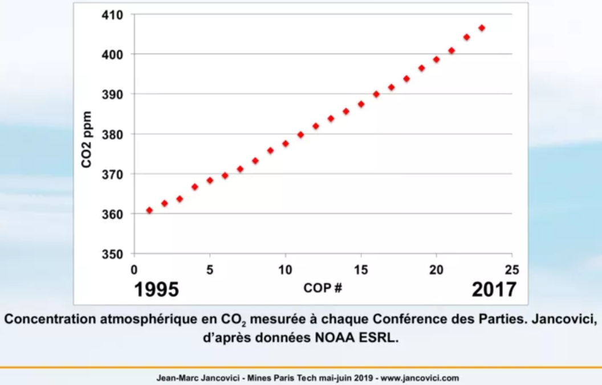

On voit ici une courbe de la concentration atmosphérique en CO2, en parti par volume (i.e. la fraction molaire de l'atmosphère en volume qui est composé de CO2), en millionièmes (ppm, partie par million). On peut regarder également sur ce graphique 300ppm, 300 millionnièmes, comme représentant 0.03%. Au lieu de graduer en fonction des années, l'axe des absices est gradué en fonction du numéro de la réunion annuelle de la conférence des parties de la convention climat. On reviendra sur la convention climat dans ce cours et le prochain. La convention climat est l'accord ONUsien que tout les pays de la planète on signé (en 1992) puis ratifié (en 1995) en disant que l'on aller s'occuper de la génération future.

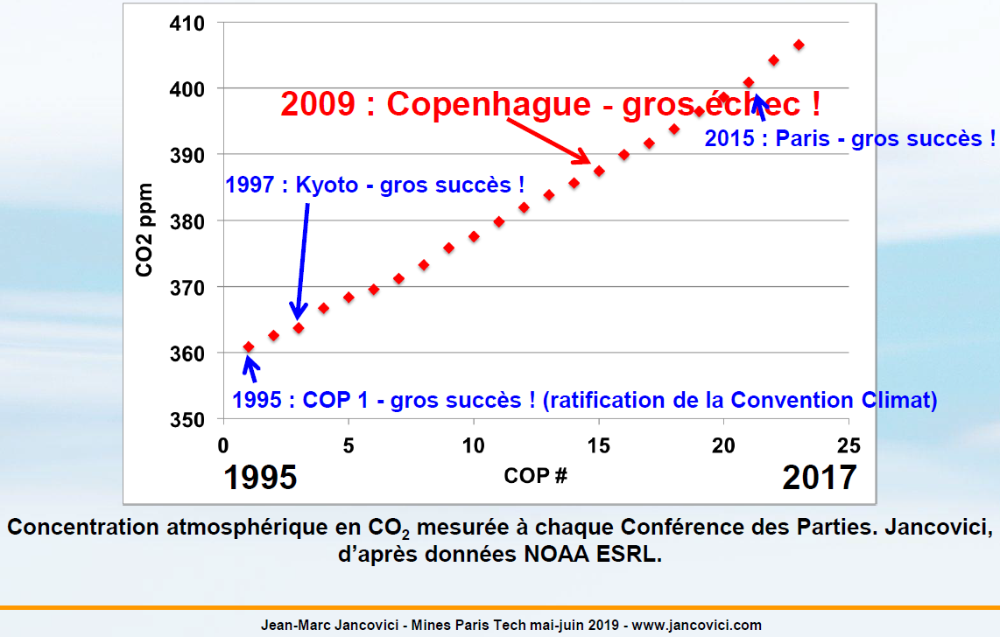

En 1995, la convention climat entre en vigueur et il y a la première réunion annuelle de la conférence des parties. Dans le jargon ONUsien un pays ou entité (e.g Union Européenne) qui signe ou qui ratifie une convention s'appelle une partie. Les parties à la convention sont donc les pays qui ont ratifiés la convention. En 1997 est signé le protocol de Kyoto, une annexe à la convention climat dans laquelle est dit qu'un certain nombre de pays dans le monde vont prendre des engagements quantitatifs de réduction (i.e. la France, ainsi que d'autre pays, disent "les émissions qui viennent de chez moi vont baissé de x% de tel année à tel année"). Cet accord a était annoncé comme un grand succès, on voit l'effet que cela a eu sur la concentration atmosphérique par la suite. En 2009 arrive Copenhague qualifiait d'énorme échec. En 2015 arrive Paris, qualifiait d'énorme succés.

Cette petite entrée en matière est la pour montré que malheuresement, jusqu'à maintenant, la quantité de bruit fait sur le changement climatique est un paramètre qui n'a pas d'influence sur ce qu'il se passe vraiment. Il y a donc deux processus décorrélés dans le monde : ce qui se passe vraiment au niveau des émissions et des processus climatique qui en découle, et la quantité de gens qui disent qu'il faudrait faire quelque chose. Ce sont deux processus pour le moment distinct, malheuresement.

## Le climat ce n'est pas la météo

Dans ce cours, on va parler de climat. Parler de climat, c'est parler de quelque chose qui est innacessible à nos sens. L'espèce humaine est une espèce qui fait confiance à ses sens (à une époque nos sens nous disaient qu'il fallait courrir pour échapper aux tigres à dent de sabre). On sait ce que sont les choses que nos sens nous indiquent dans notre environnement imédiat. En ce qui concerne les paramètres climatiques, ce que nos sens savent nous indiquer c'est la température qu'il fait tout de suite à l'endroit ou on est, éventuellement les précipitations, la luminosité, la nébulosité (i.e. les nuages), le vent, la pression, etc. Ces paramètres, apprécié de façon **locales** et **instantanné**, conduisent en science à ce qu'on appelle la **météo**. La météo, c'est l'évolution instantannée (ou dans un avenir très proche) et locale de choses qui parle à nos sens, c'est à dire les conditions qu'il va faire ici. Avec nos sens, nous ne percevons que la météo. La météo, c'est le temps qu'il fait "tout de suite et devant ma porte".

A contrario, le climat est quelque chose qui est inaccessible a nos sens de façon direct. Le climat désigne des conditions **moyennes** de
température ou de précipitations, et leurs variations les plus
régulières (saisons par exemple sur une zone plus ou moins vaste). Quand on parle de climat, on parle de moyenne, or une moyenne, c'est une construction intellectuelle. C'est une série ou une intégrale et ce n'est donc pas quelque chose que l'on observe dans la nature. C'est cette construction intellectuelle qui va permettre de comprendre si oui ou non on est en train de dériver hors norme par rapport à quelque chose qui est notre environnement habituelle. On voit comme même des manifestations indirectes du climat dans le monde qui nous entoure; par exemple, la végétation au Groenland et la végétation en Afrique ne sont pas les mêmes parce que le climat n'est pas le même. Des manifestations indirectes du climat, on en voit mais des manifestations directes (i.e. approché une moyenne par ses sens), on y arrive pas.

La confusion est possible parce que le climat utilise les **mêmes grandeurs** (on manipule les mêmes variables) que la météo : température, précipitations, vent, nébulosité, etc. Dans un cas on va regarder des valeurs instantannés et locales et dans l'autre cas, on va regarder des moyennes spatiales ou temporelles ou les deux, et les variations régulières de ces moyennes. Par exemple la variation saisionnière fait partie du climat. On a des variations saisonnières qui concerne la température (moyenne lattitude), qui concerne le fait qu'il y est du soleil (les pôles), ou qui concerne le fait qu'il y est beaucoup de pluie ou peu de pluie (plutôt les régions équatoriales). On a donc des variations saisonnières qui ne sont pas toujours les mêmes selon ou l'on est. Le climat change (et a toujours changé), mais pas aussi vite que la météo.

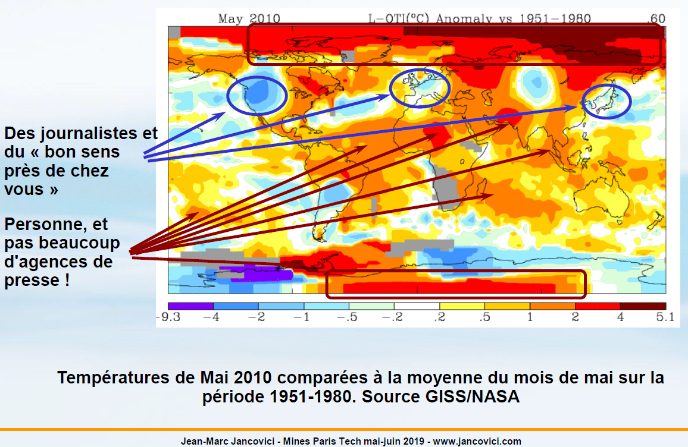

Il y a eu il y a quelques années, un article dans le journal ou des gens voulant se rendre intéressant disait : "Regardez, il ne va pas y avoir de réchauffement climatique parce qu'en ce moment, la planète ne se réchauffe pas, il fait froid". Sur cette figure, on voit un jour ou il se trouve que le hasard a fait que il y a eu des anomalies négatives (c'est à dire que la température est plus fraiche que la moyenne) dans toutes un tas d'endroit fortement peuplé (un bout d'Europe, un bout des Etats-Unis, un bout du Japon). Il se trouve que la ou il y a des Hommes, il y a des agences de presse, et des gens pour envoyer des communiqués de presse, donc des gens qui disent "la ou je suis il fait froid". Sauf qu'au même moment, ni les pinguins, ni les dauphins au milieu de l'Atlantique, n'ont pu dire "chez nous en ce moment il fait beaucoup plus chaud que la moyenne". Si on fait vraiment une moyenne, en prenant la ou il fait plus chaud et la ou il fait plus froid, la moyenne de l'ensemble de la surface planétaire est bien au dessus de sa valeur de référence. Il y a encore aujourd'hui des gens qui font se genre de confusion. C'est assez facile en faisant la confusion entre une valeur instantannée et une moyenne, ca ne tient qu'à ca. C'est très facile d'abusé les gens qui ne sont pas familiés du sujet et parce qu'on manipule les mêmes paramètres et parce que nos sens ne nous disent pas ce que c'est qu'une moyenne.

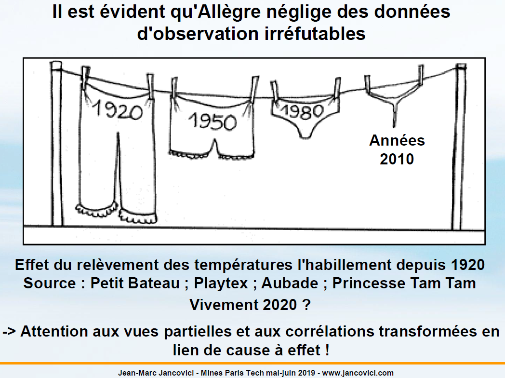

Un autre travers est assez classique quand on s'intéresse à ce sujets là, c'est de mal intérpréter une série. Par exemple l'effet du processus illustré sur la figure pourrait être le relévement des températures ou la baisse du nombre de bateau de pirate. C'est très facile de faire une mauvaise interprétation de ce qu'on est en train d'observer tant qu'on a pas compris les processus. Du coup, c'est très facile d'avoir une mauvaise conclusion.

## Influences sur le climat

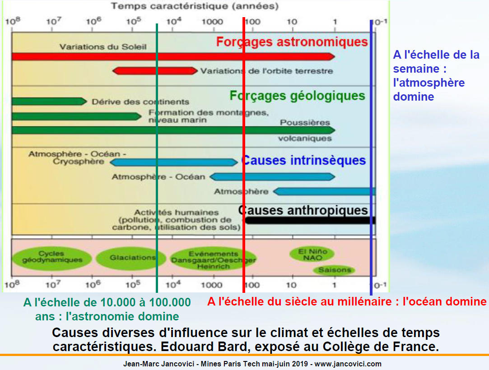

Le climat, c'est donc des valeurs moyennes spatialles et temporelles, mais mêmes ces moyennes sont amenées à changer. En fait le climat de la Terre, depuis que la Terre existe n'a jamais était stable sur des périodes géologiques. La période géologique (i.e. quelques millions d'années), on s'en fiche un peu quand on est un homme ou une femme et que notre espérance de vie si tout ce passe bien est de l'ordre de grandeur du siècle, si tout va mal, de quelques décennies. La Terre est passé par des époques très très contrasté en ce qui concerne son climat. Par exemple, il y a eu une époque ou il n'y avait pas d'oxygène dans l'atmosphère terrestre (composée de CO2, de méthane et d'azote). Il y a eu des époques ou la Terre était probablement quasiment totalement englacé (des calottes qui recouvrait la quasi-totalité de la Terre). Il y a eu une époque ou il n'y avait pas de continent, etc. En bref, la Terre est passée par des états extrémement variés. Si on regarde les quelques derniers millions d'années (c-a-d l'ère quaternaire), il y a eu même à ce moment là de grande oscillations climatique qui sont les glaciations / déglaciations, donc le climat n'est pas du tout rester stable.

Si on se place à des échelles de temps qui sont le millions d'années ou moins, on a un premier facteur de forcage qui s'appelle le forcage astronomique. Le forcage astronomique vient du fait que le système solaire est un ménage a 10 (et pas un ménage à 2) et que la Terre subit l'attraction des grosses planètes du système solaire. On est donc pas dans une elipse parfaite, régulière au cours du temps (celle qu'on calcul simplement en géométrie avec juste deux corps), on est dans un système à 10 corps qui entraîne des variations de l'orbite qui peuvent déformer le système climatique sur des échelles de temps qui sont de l'ordre de la centaine de milliers d'années.

Les continents ne sont pas toujours au même endroit, il y a une dérive des continents. En fonction de l'endroit ou est un continent, la reflection de la lumière solaire est plus ou moins importante. Par exemple, quand on des continents qui se rapproche des pôles, on peut avoir des calottes permanentes qui apparaissent (typiquement, le Groenland), et à ce moment on créer une surface très réflechissante, beaucoup plus que l'eau océanique qui se trouver la avant. L'installation de la calotte Antarctique il y a quelques dizaine de millions d'années (15 ~ 30) a refroidit le climat planétaire de quelques degrés, à cause de la création de ce grand miroir qui évacu une partie du rayonnement solaire sans qu'il est le temps de chauffer le sol.

Après, il y a des oscillations internes au compartiment fluides de l'atmosphère et notamment des processus qui sont liés à la circulation océanique à large échelle qui peuvent changer le climat sur de périodes de temps qui vont du siècle aux millénaires et évidemment, on a des dynamiques internes à l'atmosphère mais qui eux changent le climat sur des durées qui sont très très courte.

Enfin, maintenant, tout en bas, il y a nous, la cause anthropique. Nous sommes devenus un agent climatique, un agent qui force le système climatique.

Quand on fait de la météo, le seul compartiment qui réagit à l'échelle de la journée, c'est l'atmosphère. Donc en faisant un beau modèle d'atmosphère, on prend des gens de SupAéro, on les envoit à Météo France et on leur demande de faire un modèle de l'atmosphère et il nous prévoit correctement la météo. Par contre, si on veut regarder comment évolue le système à l'échelle du siècle, ca ne suffit plus de faire un bon modèle atmosphérique. Il faut savoir modéliser à ces échelles de temps d'autres compartiments de la planète et en particulier, de l'océan. L'océan c'est le compartiment fluide qui pilote l'évolution du système climatique à l'échelle du siècle beaucoup plus que l'atmosphère. Si on veut faire un bon modèle d'atmosphère, on lève le nez, au contraire, si on veut faire un bon modèle de climat, on baisse la tête.

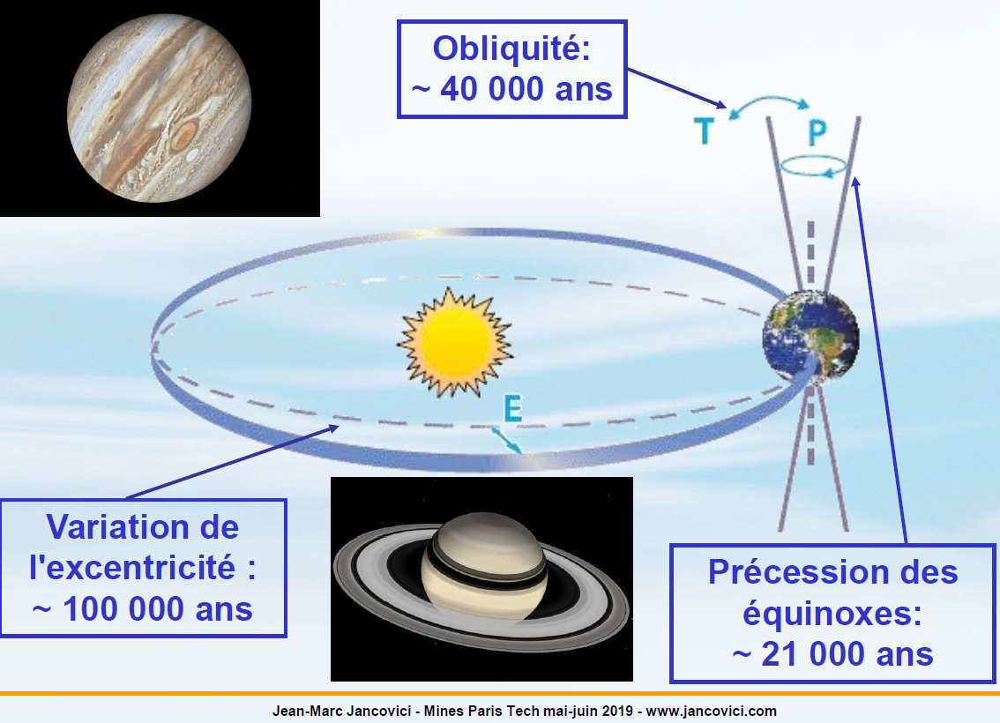

A des échelles de temps encore plus longue, ce sont les paramètres astronomiques qui dominent. La première variation des paramètres astronomiques est dû à l'attraction des grosses planètes du système solaire. On a 3 paramètres qui vont variés au cours du temps. (1) La Terre ne fait pas une ellipse exacte (une quasi-ellipse) dont l'excentricité est plus ou moins grande avec une quasi-périodicité de 100.000 ans. (2) L'axe de rotation de la Terre est plus ou moins incliné sur le plan de l'orbite. Si l'axe de rotation de la Terre était totalement perpendiculaire sur le plan de l'orbite, on aurait pas de saison, parce que l'inclinaison solaire serait toujours la même toute l'année donc la quantité de chaleur récupéré à une lattitude donnée serait toujours la même toute l'année. Soit dit en passant, climat vient du grec *Klima* qui veut dire inclinaison. Quand on a une inclinaison extrémement prononcée, selon la période de l'année ou l'on est, on à la tête au chaud ou les fesses au froid, ou l'inverse, et donc on a un très gros contraste entre les saisons. Plus l'axe se rapproche du plan de l'orbite est plus on a un contraste important entre les saisons. En particulier, on peut avoir des étés plus chaud et des hivers plus froids quand on se rapproche des moyennes lattitudes. (3) Enfin, la dernière chose qui se passe, c'est que comme une toupie, l'axe de rotation de la Terre tourne autour de la perpendiculaire au plan de l'orbite. Ce qui veut dire que comme on a un apogée et un périgé, on montre alternativement la tête ou les fesses (c-a-d l'émisphère nord ou l'emisphère sud) au plus près ou au plus loin du soleil. Avec une quasi-périodicité de 20.000 ans, on à plutôt l'émisphère nord qui est au plus près du Soleil ou plutôt l'emisphère sud.

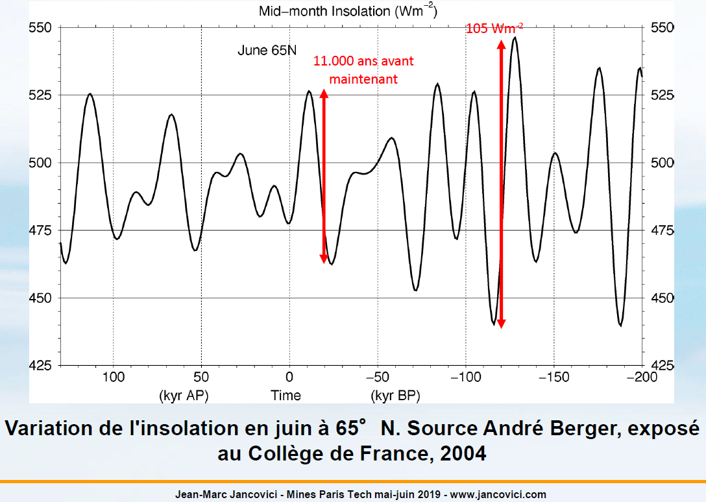

Quand on met tout cela bout à bout, on a notemment quelque chose qui varie de manière forte, c'est l'insolation à 65° nord. C'est la zone très sensible qui conditionne les entrées en glaciation ou les sorties de glaciation pendant l'ère quaternaire. C'est un endroit ou avec les variations de ces paramètres astronomiques, on peut avoir une variation très importante de l'insolation qui est reçu en particulier en été. Plus l'axe se redresse et moins il y a de contraste entre les saisons, et à ce moment, l'été est proportionnellement moins chaud. Quand on est suffisament près des pôles pour qu'il neige l'hiver, à ce moment on à la neige qui n'a plus envie de beaucoup fondre l'été, la neige se met à s'accumuler année après année, et on se met à rentrée en glaciation. Une des conditions d'entrée en glaciation, c'est que l'axe se redresse sur le plan de l'orbite. Corrélativement, quand il s'incline, c'est l'inverse, on a des étés très chaud et la neige se met à fondre. On voit sur cette figure des variations de l'insolation qui vont avec les entrées et les sorties de la dernière glaciations qui sont illustrés ici.

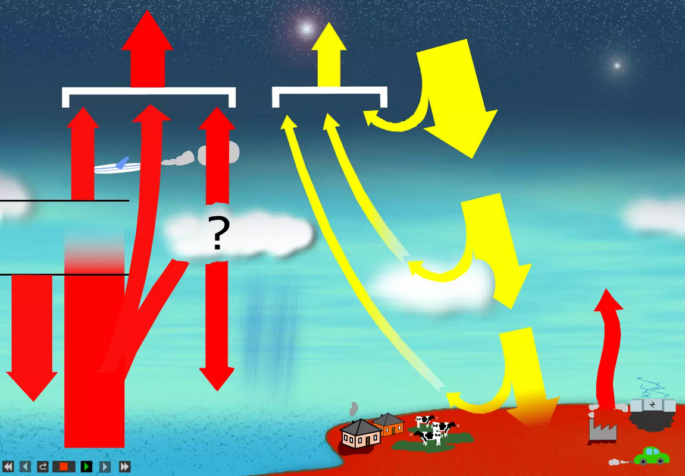

Dans tout ces paramètres, il y en a un qui est devenu le paramètre dominant. Cette figure présente une animation qui explique en quoi consiste la dynamique de l'effet de serre qui est un des procesus à l'oeuvre en ce qui concerne la formation du climat. On a ici une illustration simplifié de la surface terrestre constitué de sol émergé et d'océan et de l'apport énergetique qui permet à la machine climatique de fonctionner, c'est à dire de l'énergie solaire. La machine climatique est comme toutes les machines du monde soumise à la première loi de la thermodynamique, pour qu'elle fasse quelque chose, elle a besoin d'énergie. Cette énergie est essentiellement amené par le rayonnement solaire.

Le rayonnement solaire, quand il arrive à la surface de l'atmosphère, il y en a environ 1/3 qui est réfléchit vers l'espace par tout ce qui est brillant vue de l'espace. Si on regarde une photo sattellite de la Terre, on a deux types de surface particulièrement brillante : la neige et les déserts. Cela évacue environ 1/3 de l'énergie solaire incidente. Les 2/3 restants n'étant pas réfléchit, ils sont absorbés, et notemment par le sol. Le sol, comme dans tout système énergetique va récupérer de l'énergie qui est celle qu'il absorbe sous forme de rayonnement lumineux (ou de rayonnment électromagnétique pour être plus précis, 50% du rayonnement solaire étant de l'infra-rouge proche, il n'y a que 40% de visible, et 10% d'ultraviolet).

Le sol absorbant l'énergie solaire va chercher à se mettre à l'équillibre énergetique (i.e. de restituer en régime stationnaire l'énergie que lui a fournit le Soleil). Le sol a trois manière de se mettre à l'équillibre énergetique : (1) La chaleur de contact, avec de l'air au dessus d'un sol chaud, la chaleur se transfert directement par contact. (2) La chaleur latente de l'eau, évaporation / condensation. Quand on chauffe le sol qui se trouve être au 2/3 de l'eau, on va évaporer de l'eau et on se retrouve avec de la chaleur lattente qui est utilisé pour l'évaporation restitué dans l'atmosphère. (3) Le sol va rayonner de l'infrarouge. En effet, tout corps au dessus de 0 Kelvin rayonne quelque chose. Le Soleil qui en surface est à 6.000 Kelvin a un spectre dans lequel il y a beaucoup de visible, beaucoup d'infrarouge proche, un peu d'ultraviolet, la Terre qui est en moyenne à 310 Kelvin à un spectre qui est beaucoup plus long, i.e. déplacé vers des longeurs d'onde beaucoup plus importantes, et dans ces longeurs d'onde beaucoup plus importante, il y a essentiellement ce qu'on appelle de l'infrarouge lointain, qui est soit dit en passant a peu prêt le même rayonnement infrarouge que l'on emet nous et qui nous permet d'être vue avec une caméra infrarouge, ou qui permet de regarder les infrarouges qui s'échappent de la passoir thermique dans laquelle on habite si c'est le cas. Tout ca, c'est dans les mêmes longeurs d'onde.

Il se trouve que l'atmosphère qui est parfaitement transparente au rayonnement solaire incident (à l'exception des ultraviolets qui sont intercéptés par une espèce chimique qu'on trouve dans la stratosphère qu'est l'Ozone), l'essentiel du rayonnement solaire passe à travers l'atmosphère sans encombre alors que le rayonnement réémis par la planète est de l'infrarouge lointain pour lesquelles l'atmosphère va comporter des espèces qui sont très fortement opaque à ces infrarouges (i.e. qui disposent de raie d'absorption dans l'infrarouge lointain). Un gaz à effet de serre, c'est un gaz qui posséde des raies d'absorption dans l'infrarouge lointain émit par la planète. Comme l'atmosphère est essentiellement opaque à ces infrarouges elle va absorber l'énergie de ces infrarouge puisqu'elle les intercepte. Même motif, même punition, l'atmosphère va chercher elle aussi à se mettre à l'équilibre énergetique et pour se débarasser de l'énergie qu'elle absorbe quand elle est à l'équilibre énergetique, elle n'a qu'un seul moyen à sa disposition, elle va re-rayonner de l'infrarouge. Ce qui va se passer c'est que quand on intercepte les infrarouge émis de la surface, on les ré-émet, mais on va en ré-emmetre dans toutes les directions. Une partie part vers l'espace et va finir par mettre la planète à l'équillibre énergetique vue de l'espace mais une autre partie retourne au sol et donc contribue a un deuxième chauffage du sol après le chauffage direct dû au rayonnement solaire. En terme de Watt par mètre carré, le rayonnement infrarouge issu de l'effet de serre est presque aussi important que le rayonnement solaire mais comme $P = \sigma T^4$, évidemment ca ne double pas la température d'équilibre du sol, mais ca l'augmente comme même de 30°. Si l'effet de serre naturel n'existait pas, nous n'existerions pas parce que la terre serait trop loin du point triple de l'eau pour que la vie est pris place (ou du moins celle que l'on connait). Donc l'effet de serre naturel, c'est une très bonne chose, il a permis l'apparition de la vie, et soit dit en passant, par une espèce de magie de l'équilibre des processus, il a baissé à mesure que la puissance solaire augmenter (depuis que l'étoile Soleil c'est formé, sa puissance a augmenté) et il y a eu une espèce d'évolution corrélative à la fois de la puissance solaire et de l'effet de serre qui fait que la température de la planète n'est jamais descendu en dessous du point triple de l'eau.

La dessus, on arrive nous avec nos machines, nos vaches, etc. Ce faisant, nous allons mettre en route des activités qui créer des émissions additionnelles de gaz à effet de serre. La planète émet déjà des émissions de gaz à effet de serre, et nous en rajoutons. Comme ces gaz à effet de serre on la magnie de ne pas s'évacuer rapidement de l'atmosphère une fois qu'on les y a mis, à ce moment, nous allons augmenter la concentration atmosphérique en gaz à effet de serre. On va augmenter l'opacité de l'atmosphère au rayonnement infrarouge émis par la planète. En augmentant cela, on va intercepter encore mieux ce qui émis par le sol et de ce fait, on va encore plus réchauffer la basse atmosphère qui va encore plus ré-émettre dans tout les sens dont vers le sol. Donc on va intensifier le chauffage du sol. Comme on augmente le chauffage du sol, le sol va faire ce qu'il sait faire avec le rayonnement solaire de départ, il va augmenter tout les termes de restitution d'énergie du sol vers l'atmosphère : augmentation de la chaleur de contact, augmentation de l'évaporation/condensation, augmentation du rayonnement infrarouge émis et ce jusqu'à temps que ce qui arrive a passé à travers l'atmosphère (qu'on appelle la fenêtre atmosphérique) soit redevenu identique à ce qu'on avait avant d'augmenter les gazs à effet de serre dans l'atmosphère. Dit autrement, on va revenir à l'équilibre énergetique vue de l'espace, mais dans l'intervalle, on aura intensifier les flux d'énergie entre le sol et la basse atmosphère.

Ce que l'on comprend tout de suite en regardant cette animation, c'est que les phénomènes extrêmes (e.g. ouragan, orages, tornades) qui trouvent leur origine dans les mouvement convectif vont "faire quelque chose". Un ouragan, ca démarre par une convection importante, avec une température de surface de l'océan qui doit être élever pour qu'il y est beaucoup d'évaporation. Les orages, les tornades et tout ces phénomènes vont augmenter parce que la surface se réchauffe, l'évaporation augmente, mais corrélativement, comme une part croissante des infrarouge terrestre est absorbé près de la surface, il y en a moins pour réchauffer la stratosphère. Une des remarques de l'effet de serre, c'est que la température de surface augmente, mais la température de la stratosphère diminue. Du coup on va augmenter le gradient de température dans la basse couche de l'atmosphère (la troposphère, les premiers dix kilomètres) et si on augmente le gradient de température, on augmente la puissance convective. Donc on va nécessairement changé la dynamique des phénomènes extrême / intense sur le plan météorologique.

## Les climatologues

Une fois expliqué ce qu'est l'effet de serre, pour comprendre la suite, il faut savoir que comprendre l'évolution du climat sous l'effet des activités humaines, ca ne relève pas d'une seule discipline scientifique. On voit souvent trainés dans la presse le terme climatologue, dont on se dit que c'est un spécialiste de l'évolution du climat. En fait un sépcialiste de l'évolution du climat, ca n'existe pas en tant que tel, à aucun moment, il y a eu des disciplines qui s'appellait spécialiste de l'évolution du climat sous l'effet des évolutions humaines. Ce qu'il s'est passé sur les 30 dernières années, c'est qu'il y a une instance de mise en commun des compétences de tout un tas de gens, créer sous l'égide des nations unies et qui s'appelle le GIEC (Groupe Intergouvernemental sur l'Evolution du Climat, ou IPCC en anglais, Intergovernmental Panel on Climate Change) qui consiste a demander à des chercheurs de mettre bout à bout les trouvailles de tout un tas de discipline scientifique pour donner une vision globale de ce problème qu'est l'évolution du climat sous l'effet des activités humaines, mais cela ne relève pas d'une unique discipline scientifique. Par exemple, on a vu que le climat planétaire changer sous l'effet de l'attraction des planètes, on a donc besoin d'astrophysicien pour comprendre la mécanique céleste même sans autre planète du reste on en a besoin. On a besoin de dynamicien de l'atmosphère pour étudier les échanges surface-espace, de chimiste de l'atmosphère (ou aérologues) pour étudier la composition de l'air, d'océanographe, de glaciologues pour étudier les calottes polaires (e.g. Jean Jouzel est un glaciologue qui a fait sa thèse sur la teneur isotopique en Oxygène 18 dans les grêlons.), de vulcanologues, de géophysiciens pour étudier la dérive des continents, de biogéochimistes pour étudier le cycle des éléments (N, C, P, O, ...) et les paléoclimats, de biologistes pour étudiés la végétation, sans parler de toutes les sciences humaines, puisque l'homme est devenu un agent climatique.

En somme on a besoin de tout un tas de spécialité, et il a fallu un tour de force à la communauté scientifique pour demander à tout ces gens la de ce parler pour donner d'une seule voix, avec un guichet unique d'accès à l'information qui s'appelle le GIEC, une vision de ce qu'était l'évolution du climat sout les activités humaines. Quand on va interviewer un scientifique dans la presse. Aucun d'entre eux n'a à causse de son travail une vue sur l'ensemble de ses disciplines. Il peut en avoir une grace à ces lectures, mais ce n'est pas son travail qui va lui donner une expertise de même niveau sur tout ce qu'on a évoqué ici. C'est important de savoir que l'on a pas de climatologue; c'est quelque chose qui n'existe pas. Des fois on donne l'acception la plus proche de climatologue qu'on puisse trouver dans la communauté scientifique, c'est modélisateur. Le climatologue, c'est alors celui qui fait le modèle qui intègre les compétences de tout ses collègues.

## Histoire de l'effet de serre

L'effet de serre est identifié en 1824 par Joseph Fourrier, physicien français. Celui-ci publie "Remarques générales sur les températures du globe terrestre et des espaces planétaires", où il expose que la température du sol est augmentée par le rôle de l'atmosphère (i.e. il y a quelque chose dans l'atmosphère qui fait que les températures au sol sont plus élevés que si ce quelque chose n'existait pas).

Quelques décennies plus tard (en 1838), Claude Pouillet, physicien français, puis Joseph Tyndall, un irlandais, attribuent l'effet de serre naturel à la vapeur d'eau et au gaz carbonique. Ils identifient ainsi les deux principaux gaz à effet de serre que nous avons dans l'atmosphère. Pouillet affirme que toute variation de la quantité de vapeur d'eau, comme de CO2 doit se traduire par un changement climatique. Le fait qu'il y est un effet de serre et qu'il soit provoqué au premier ordre par la vapeur d'eau et le dioxyde de carbonne, cela à plus d'un siècle et demis.

En 1896, Svante Arrhenius, chimiste Suédois (Prix Nobel 1903, et qui se trouve être l'un des ancêtres de Greta Thunberg) prédit que l'utilisation intensive des combustibles fossiles engendrera un réchauffement climatique. Il fait un petit calcul d'ordre de grandeur et trouve qu'en doublant la quantité de CO2 dans l'air, la température augmente en moyenne de 4°C. En 1896, il y a donc dèjà un premier calcul d'ordre de grandeur qui tombe sur le bon résultat (paraît-il un peu par chance). Par ailleurs, Arrhenius comprend (probablement à cause du rayonnement du corps noir) que si on a un supplément d'effet de serre, c'est à dire un supplément d'interception des infrarouge terrestre que l'on a partout à la surface de la planète, l'augmentation de température qui en résultera, toutes choses égales par ailleurs, saura d'autant plus marqué que la température de départ est basse. C'est à dire que pour une même puissance re-rayonner vers le sol, plus la température de départ est basse, et plus l'élévation de température est importante ($T^4$). Arrhenius dit à ce moment là, quelque chose qui est parfaitement vrai et qui permet aujourd'hui de dire que c'est bien l'effet de serre qui est à l'oeuvre : si il y a plus d'effet de serre, la température s'élevera plus vite au pôles qu'au tropiques, or c'est exactement ce qu'il est en train de se passer, s'élevera plus vite la nuit que le jour, c'est également ce qui est en train de se passer, et s'élevera plus vite l'hiver que l'été, et c'est également ce qui est en train de se passer. Donc Arrhenius a compris ces deux choses la en 1896 (i.e. que la température moyenne augmentera de 4° et que la structure spatiale de cette élévation de température porte une signature particulière qui est bien celle qu'on retrouve aujourd'hui).

En 1922, Lewis Fry Richardson, un physicien anglais, tente une première expérience de modélisation du climat à partir des seules équations de la physique. Il imagine de faire une simulation numérique (sans ordinateur !), et prend des physiciens et les orchestre pour leur faire faire la résolution des équations de manière unitaire, les uns derrière les autres. Evidemment, cela ne marche pas.

Mais, en 1950, dès que le premier ordinateur est mis au point, des physiciens se jette dessus pour faire le premier modèle du comportement de l'atmosphère. Le premier ordinateur (ENIAC) est utilisé pour expérimenter le premier modèle numérique de prédiction météorologique.

L'idée que l'on puisse utilisé des outils numériques, c'est à dire des modèles, pour essayer de comprendre ce qu'il va se passer plus tard, ce n'est pas apparu avec la dernière version de jeux vidéo, c'est quelque chose qui est très très ancien au regard de la science climatique aussi.

Une date importante qui n'est pas renseigné ici (dans les années 1970) est le moment ou on a découvert les spectromètre de masse qui permette de faire des analyses isotopiques. Ces analyse isotopique étant absolument cruciale pour reconstituer les températures du passé. C'est à ce moment qu'on est capable d'analyser des sédiments, ou de manière générale, des échantillonages prélevés ici et là sur la croute terrestre dont les fameuses glaces polaires, et avec des analyses isotopiques, de reconstituer des marqueurs des climats passés.

## Atmosphère et GES

Un gaz à effet de serre à une définition simple, c'est un gaz qui possède des raies d'absorption dans l'infrarouge terrestre, i.e. un gaz capable d'absorber du rayonnement infrarouge émis par la Terre. Il se trouve que cette propriété physique n'est accessible qu'au gaz qui sont tri-atomique ou plus. Donc un gaz diatomique (ou monoatomique, a fortiori, un gaz rare) ne peut pas avoir de raie d'absorption dans l'infrarouge terrestre. L'oxygène, l'azote, l'argon, etc. sont transparent à l'infrarouge terrestre. Par contre la vapeur d'eau (triatomique, $H_2O$), le dioxyde de carbonne ou "gaz carbonique" (triatomique, $CO_2$), le méthane (5 atomes, $CH_4$), le protoxyde d'azote ou "gaz hilarant" (triatomique, $N_2O$) possèdent des raies d'absorption des infrarouge terrestre. Il y a également des molécules plus complexes, inventés par les Hommes, telles que les halocarbures, des hydrocarbures dont on a substitués tout ou partie de l'hydrogène par une molécule d'hallogène (e.g. du chlore, du fluor, du brome, etc.), qui sont également des gaz à effet de serre extêmement puissant ($C_x H_y F_z Cl_t$). Enfin, il y a un dernier gaz à effet de serre qu'est l'Ozone (le "couteau suisse de l'absorption", il fait tout); il sait absorber les infrarouges terrestres, il sait aussi absorber les ultraviolets du soleil.

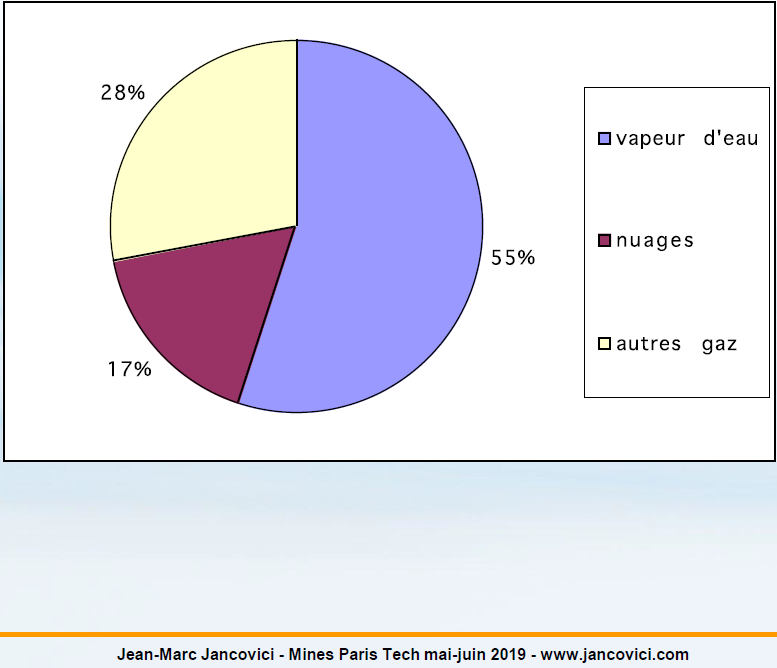

Comme on a trois gaz naturellement présent dans l'atmosphère qui sont des gazs à effet de serre (la vapeur d'eau, le dioxyde de carbone et le méthane), l'effet de serre est quelque chose de naturelle sur terre. L'atmosphère primitive de la Terre a notemment était formé par le volcanisme qui a conduit à de gros dégazage de CO2, donc dans l'atmosphère primitive de la Terre, on a déjà du CO2. L'effet de serre est une histoire vieille de 4.5 milliards d'années sur Terre.

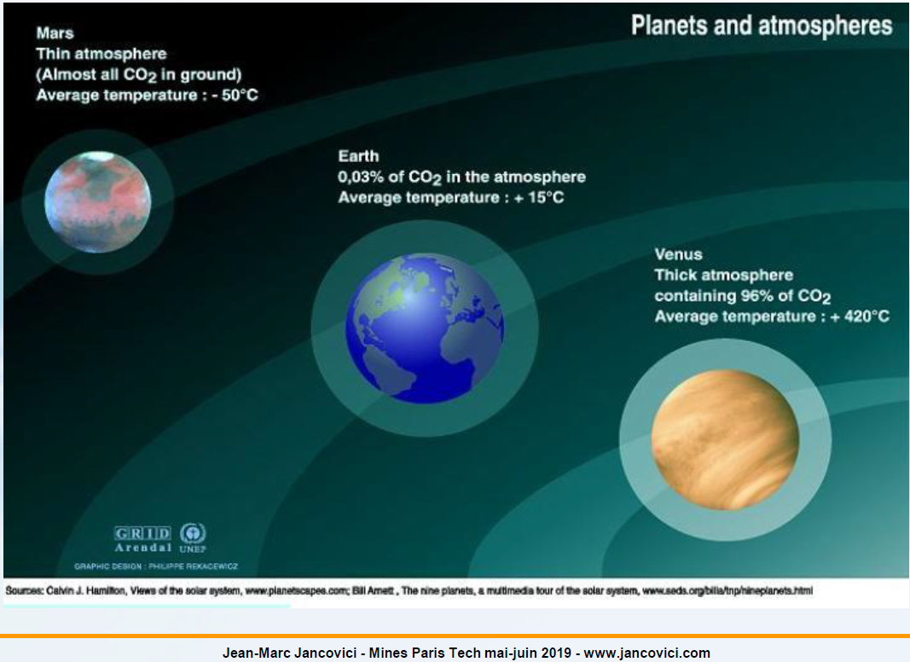

Soit dit en passant, cet effet de serre, comme il est dû au volcanisme primitif, on a une planète qui s'est également formé une atmsphère dans laquelle il y en avait beaucoup, c'est une planète tellurique, elle a une densité de matière proche de la notre, c'est Venus. Venus a vraisemblablement eu une atmosphère primitive qui s'est formé comme la notre, sauf que comme Venus n'a pas porté la vie, Venus n'a jamais eu les changements atmosphérique que nous avons connus sur Terre avec d'abord l'apparition de méthane à cause des bactéries primitives qu'on appelle les archés, puis l'apparition d'oxygène avec les plantes primitives, puis plus développé qui ont mangés le CO2 et qui ont créer de l'oxygène. L'atmosphère de Venus, elle a toujours 90 à 95% de CO2. A la surface de Venus, avec 90 à 95% de CO2, on a un effet de serre assez coqué, puisque la température de surface dépasse les 400°. La différence entre Venus et la Terre, c'est aussi que l'angle d'interception de Venus est plus important (Venus est plus prêt du Soleil), mais si on regarde quel est l'impact de cette angle d'interception plus important sur la température d'équillibre, on trouve quelques dizaine de degré seulement. Ca n'explique donc pas pourquoi on a 400° de plus par rapport à la température planétaire. Ce qui explique cette différence, c'est l'effet de serre de Venus, extrêmement puissant, puisque on a plus de 90% de CO2 dans l'atmosphère. Cela permet de comprendre que l'intensification de l'effet de serre peut très fortement changé le climat d'équillibre d'une planète.

## L'Homme, agent climatique

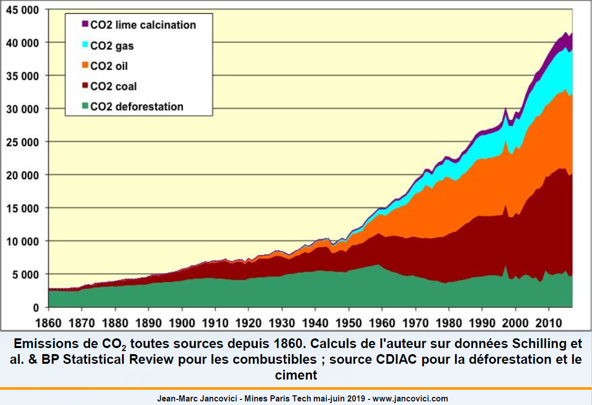

L'Homme a donc une action aujourd'hui sur la composition atmosphérique. La manière dont il a cet action, c'est au travers de ces émissions de gaz à effet de serre. Le premier gaz à effet de serre que nous émettons en importance, c'est le gaz carbonnique ou dioxyde de carbonne. Sur la figure, on voit les 5 causes d'émissions du dioxyde de carbonne qui sont d'origine humaine (en ordonné, millions de tonnes).

La première, c'est la déforestation : on coupe la forêt et on brule le bois, c'est principalement du défrichage, on coupe la forêt pour installé des surfaces à vocation agricole. Même quand le bois coupé est exploité, il y a seulement une petite partie du bois qui va vivre longtemp. Dans une forêt française par exemple, on a seulement 7% du bois d'un arbre qui est coupé qui est du bois d'oeuvre à longue durée de vie, tout le reste va rentré dans des produits à très courte durée de vie (e.g. papier, emballage, etc.), soit à durée de vie raisonnablement courte (e.g. le meuble ikea, qui va en général pas nous survivre). Une fois que le produit à finit sa vie, en général cela se retrouve dans l'atmosphère puisque le produit est brulé. Donc ce qu'on va retrouver c'est deux choses : à la fois le carbonne qui était contenu dans l'arbre et qui va rentré dans l'atmsphère, la deuxième chose que l'on retrouve c'est que quand on change un sol de forêt en sol agricole, on laboure et en labourant, on expose l'humus à l'oxygène de l'air et donc déstocké du carbonne par oxydation de façon accéléré, on diminue le contenu en carbonne du sol. C'est deux processus ajouté l'un à l'autre qui font les émissions de CO2 provenant de la déforestation. On constate que la déforestation est passé par une forme de maximum il y a quelques décennies, elle continue, elle est importante. La raison pour laquelle on a des fluctuations plus importantes vers la fin de série c'est tout simplement un biais de dépistage, on a des statistiques sur des pas de temps plus court que celle qu'on avait avant (avant, c'est lissé). Par ailleurs, apprécié la déforestation de manière statistique est un problème beaucoup plus compliqué qu'il n'y parait puisque cela se fait essentiellement avec des observations sattelitaire. Si on déforeste sur une parcelle qui est sous la résolution (i.e. sous le pixel de l'image), cela ne se voit pas, si on enlève un arbre sur deux et que la vue du dessus reste à peux prêt comme ils étaient avant, on ne le voit pas; en bref, il y a plein de choses que l'on ne peut pas voir avec l'imagerie sattelite. Donc savoir exactement combien d'arbre on a coupé, c'est plus compliqué qu'il n'y parait.

On a ensuite un deuxième terme qui est le dioxyde de carbonne qui vient de l'utilisation du charbon, un troisième qui vient de l'utilisation du pétrole et un quatrième qui vient de l'utilisation du gaz. Utilisé du charbon, comme du pétrole, comme du gaz, c'est une réaction exothermique provoqué par de l'oxydation. On prend un composé de carbonne et d'hydrogène (i.e. un hydrocarbure), dans des proportions variable (beaucoup de carbonne solide, moins de carbonne liquide, peu de carbonne gazeux), en l'oxydant ca nous donne une réaction exothermique qui nous permet d'alimenter des machines.

Enfin, on a un dernier terme qu'est la calcination du calcaire (en anglais lime calcination) qui est utilisé pour faire du ciment. Le ciment, c'est essentiellement de la chaux vive ($CaO$) avec tout un tas de poudre de perlimpinpin que l'on rajoute dedans (un peu de argile, etc.); la formule du calcuaire est $CaCO_3$. Si on fait de la maconnerie et qu'on ne met pas de gants, en fin de journée, on a les doigts complétement bouffé, c'est dû au fait que le ciment c'est de la chaux vive (plus quelques poudre de perlimpinpin), ca agresse la peau, c'est un oxydant; les liants hydraulique en général agresse la peau. Pour obtenir $CaO$ à partir de $CaCO_3$, c'est très simple, "on prend une paire de ciseau et on coupe en deux", on prend $CaCO_3$, on met $CaO$ d'un côté et $CO_2$ de l'autre. La grande paire de ciseau qui permet de casser la molécule en deux, c'est un four dans lequel on porte le calcaire à un peu plus de 1000° et on récupère d'un côté $CaO$ et de l'autre côté $CO_2$. Evidemment, on ne fait rien du $CO_2$, donc il part dans l'atmosphère. Ce que l'on a ici sous le terme lime calcination, c'est le $CO_2$ issus des four à ciment qui provient de cette rupture de la molécule de carbonnate de calcium en deux. Ca n'inclus pas le $CO_2$ provenant de l'énergie qui a était nécessaire pour chauffer le four.

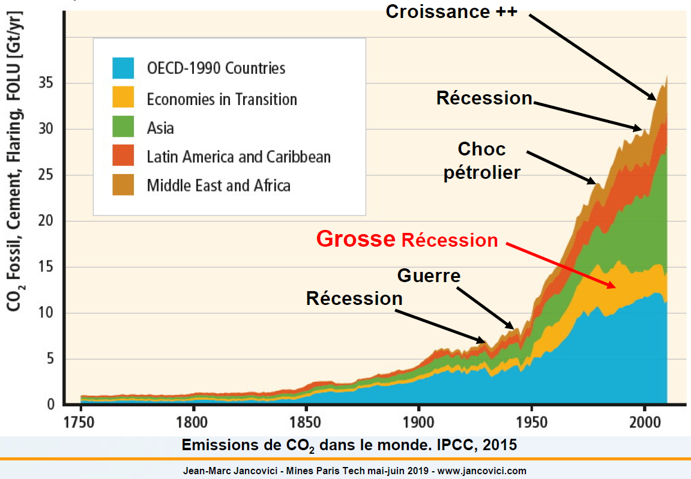

On a vu ici une vision par source, on va maintenant regarder une vision par zone. C'est un peu plus long comme échelle de temps, on part de 1750, on voit qu'à cette époque, des émissions il n'y en a pas beaucoup (mais comme même quelques unes). On va regarder comment évolue les émissions au fil du temps. Ce que l'on voit c'est que l'on a des émissions des pays anciennement industrialisés (OECD Countries) qui augmente, augmente, augmente et qui ont tendance depuis le pic énergetique (cf. Cours 1) à se stabiliser. Les économies en transition correspondent à l'ancien bloc communiste. En vert, on à l'Asie et notemment la Chine dont on voit qu'elle a dépassé la zone OCDE et que c'est aller extrêmemnt rapidement.

On voit quelques petites irrégularités, par exemple avec la récession de 1929, on voit ce que cela nous donne en évolution annuelle, un coup vers le bas et en tendance, pas grand chose. A la fois, le paroxysme de la crise de 1929 (dans l'année 1932) et le paroxysme de la guerre 39-45 (i.e. l'éradication industrielle de l'Allemagne et du Japon en 1945), sont les deux seuls épisodes au cours du XXé siècle ou les émissions annuelles de CO2 on baissés de 4% ou plus. Il y a eu deux années au cours du XXé siècle ou les émissions ont baissé de 4%, c'est 1932 et 1945. Si on est sérieux sur l'accord de Paris, il faudrait faire ca tout les ans à partir de maintenant, en démarrant la semaine prochaine pendant environ 30 ans. Il faut faire tout les ans dans le monde, un effort qui est dans le même ordre de grandeur que ce qu'on a obtenu pendant ces deux années la. En 1970, on a un choc pétrolier, en 2000, on a une petite récession qui ne dure pas très longtemp et une très forte croissance qui correspond au décollage industrielle de la Chine, en 1990 on a quelque chose qui a était très efficace pour faire baisser les émissions, c'est l'effondrement économique des pays communiste après la chute du mur. On verra dans le prochain cours que malheuresement cela marche très bien et c'est bien ca qui pourrait marcher in fine pour respecter le fait que le monde est finit.

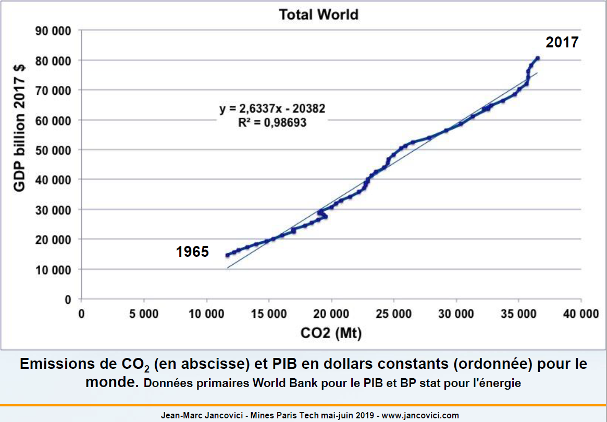

Pour le moment, on a drame dans cet histoire que voici. On a vue au cours du premier cours que plus de PIB voulait dire plus de flux productif, que le flux était par définition mesuré par l'énergie donc que ca voulait dire plus d'énergie et que comme l'énergie est essentiellement fossile, cela voulait dire plus de CO2. Ce que l'on voit sur ce graphique, c'est le drame des négotiations climat. Faire moins d'émissions de CO2 de manière massive, aujourd'hui **personne** ne sait concevoir cela sans faire une baisse significative du PIB. Le drame des négotiations climat est donc la.

Brice Lalonde a était candidat écologiste en France et à fait quelques pourcent de voix en 1981. Il a était ambassadeur climat de la France en 2009 et à fait toutes les COP. Brice a dit un jour : "Le problème des négotiations climat, c'est que depuis l'origine les pays occidentaux viennent en pensant qu'on va parler climat, les pays en développemnt viennent en pensant qu'on va parler développement, et c'est le développement qui gagne". Cela est dû au fait qu'on ne sait pas faire plus de PIB sans utiliser plus de machine et donc plus d'énergie. On verra dans les cours qui viennent si on peut utiliser que de l'énergie décarboné, et on verra que ce n'est pas si simple.

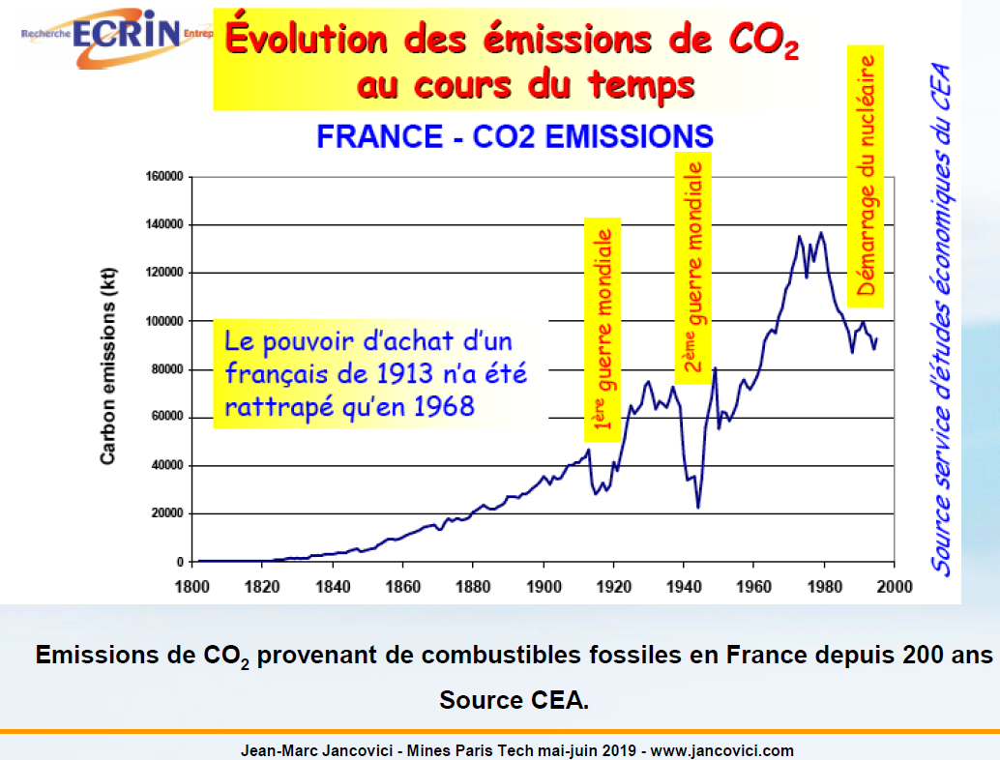

On a ici la trajectoire des émissions de CO2 de la France. On voit qu'en série longue, on est a peut prêt comme les autres, c'était tout petit, ca a augmenté, il y a des accidents et aucun des accidents n'empêche vraiment la hausse tant que la production économique croît. Il y a une chose qui a comme même bien calmé le jeu, c'est le programme nucléaire français. Cela étant, dès qu'on a la possibilité de faire croître le PIB, ce que l'on aimerait bien faire quand on est au gouvernement en ce moment (on y arrive pas, mais pas parce qu'on le souhaite), les émissions ont tendance à repartir à la hausse.

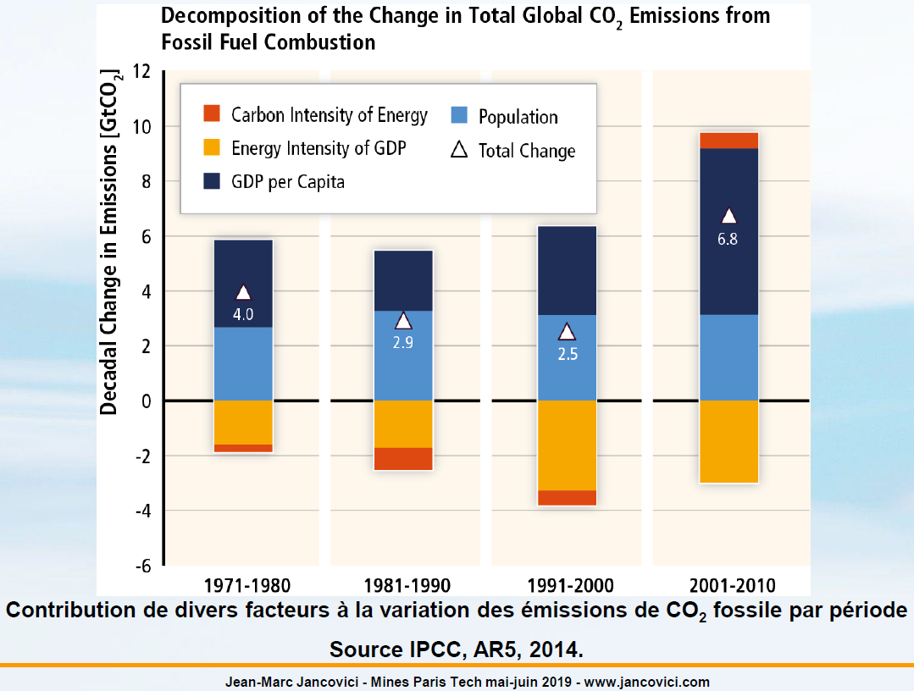

Ce graphique vient du dernier rapport du GIEC et donne la contrepartie de la variation des émissions sur les quatres dernières décennies en fonction de l'équation de Kaya; une équation qui décompose les émissions de CO2 en quatre termes que sont la population, le PIB par personne, l'intensité énergetique du PIB et l'efficacité CO2 de l'énergie. Ce que montre ce graphique, c'est qu'on a eu un rythme de variation des émissions toujours positif (i.e. une croissance des émissions sur les quatres dernières décennies) qui est représenter par la valeur du triangle blanc. Cela se décompose en une amélioration de l'efficacité énergetique de l'économie (jaune), une amélioration de l'efficacité carbonne de l'économie (rouge) sur les trois premières décennies de ce graphique, mais pas sur la dernière décennies (dû à l'essort industriel de la Chine et l'explosion du charbon), on a également deux autres termes qui sont la population (bleu clair) et la production par personne (bleu foncé); dit autrement, plus nous sommes nombreux, plus nous émmetons (c'est malheuresement arithmétique), et par ailleurs, plus nous créons de flux physique à base de machines par personne, c'est à dire plus nous créons de PIB par personne, plus nous avons une grande quantité d'énergie utilisée, et comme cette énergie est fossile, plus nous émmetons.

Dit autrement, depuis les quatres décennies qui viennent de s'écouler, l'augmentation démographique et l'augmentation de la transformation de l'environnement par personne (c'est le PIB par personne), sont allés plus vite que les gains que nos prédecesseurs ont pu faire dans les machines que nous utilisons pour vivre, c'est à dire la quantité de CO2 que l'on met dans l'air quand on utilise 1kWh et la quantité de machine ou la quantité de kWh qu'il faut utiliser pour faire 1 dollar de valeur ajoutée. Ce sont deux paramètres techniques qui ont constemment évolué moins vite dans le bon sens que les deux paramètres qui poussent les évolutions à la hausse, n'ont évolués dans l'autre sens.

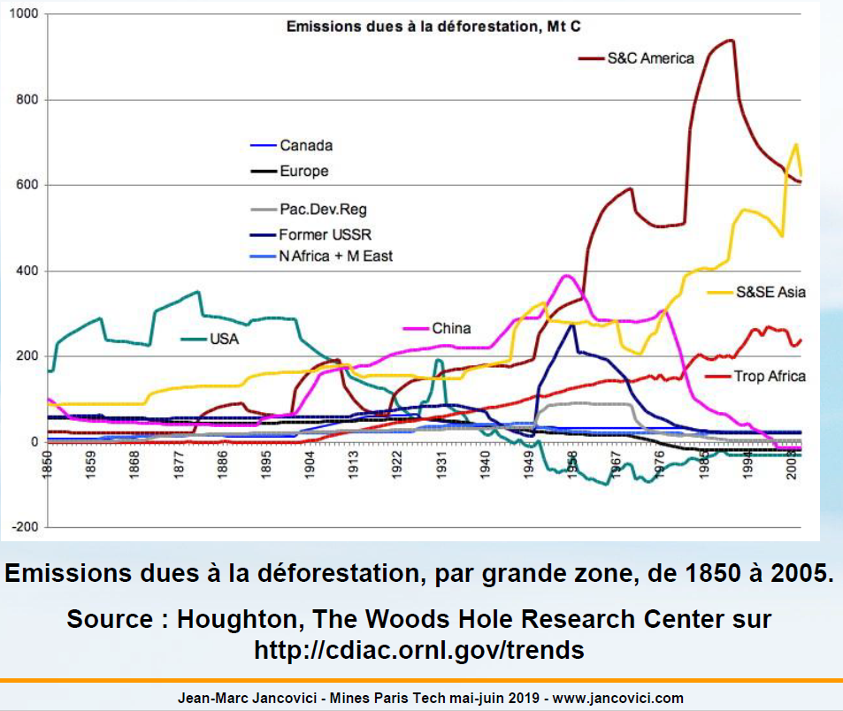

Petit zoom sur la déforestation. On voit que les zones qui ont déforestés ne sont pas les mêmes selon les époques. En particulier, il y a un siècle et demi, le champion du monde de la déforestation, c'était l'Amérique du Nord. Aujourd'hui, le champion du monde, c'est plutôt l'Asie du Sud-Est après que c'est était longtemp l'Amérique Latine. Cela étant, ca déforeste encore dans plein de pays dans le monde. La déforestation à deux déterminants très simple : le premier c'est que comme on déforeste pour augmenter les surface cultivable, c'est la taille de la population (plus la population croît, plus on déforeste); le deuxième déterminant, c'est plus un régime est carnée, plus on va avoir besoin de surface agricole importante pour nourrir les bêtes que l'on va manger, au lieu de manger directement les végétaux qui poussent, et donc plus on a besoin d'une surface par personne importante qui est évidemment prise la ou on peut la prendre, c'est à dire sur la forêt. Dit de manière plus résumé et plus cache, il y a deux drivers, deux déterminants essentiels à la déforestation, c'est l'augmentation de la population et l'augmentation de la part carnée dans l'alimentation.

Ce qui a poussé l'Amérique du Nord à diminué la déforestation, c'est qu'il y a moins de choses à coupées. En Europe, comme on l'a vu dans le premier cours, le minimum forestier a était en 1850 et 15% de couverture de la surface européenne. On s'est arréter de déforester parce qu'essentiellemnt il n'y avait plus rien à couper; 15% c'est aussi à peu de chose prêt les forêt qui couvre les montagnes, les très hautes lattitudes, etc. en bref, des zones ou on a pas envie de mettre des cultures. Même dans les montagnes, on peut déforester pour faire des cultures en terrasses comme dans les Sévénnes par exemple, mais cela rester minoritaire. En France par exemple, toute la Bosse a était déforester, toute la plaine Aquitaine a était déforester, la forêt landaise (qui a était replanté par derrière) etc. Quand on a toutes les plaines qui sont occupés, on arrête, à quelques exceptions prêt. Dit autrement, quand on trouve un équillibre entre la population et les surfaces cultivables, on arrête de déforester. Ou bien, cet équillibre est trouvé par la limitation qu'est la famine (les surfaces cultivables et les rendements font qu'on ne peut pas augmenter la taille de la population), ou bien le point d'équillibre se trouve avant et alors en particulier aux Etats-Unis, une chose qui a "sauver les forêts", c'est les tracteurs et les engrais, parce que quand on augmente les rendements à l'hectare des cultures, on a pas besoin d'aller chercher des surfaces ailleurs. Soit dit en passant, quand on dit qu'il faut faire de l'agriculture extensive, sa ce met à reposer le problème de la déforestation, parce que si on a le même régime alimentaire en provenance d'une surface moins productive, on a besoin de plus de surface. On a donc la un conflit d'objectif évident entre 3 choses qui sont la viande, les phyto-sanitaires / les engrais, et la déforestation.

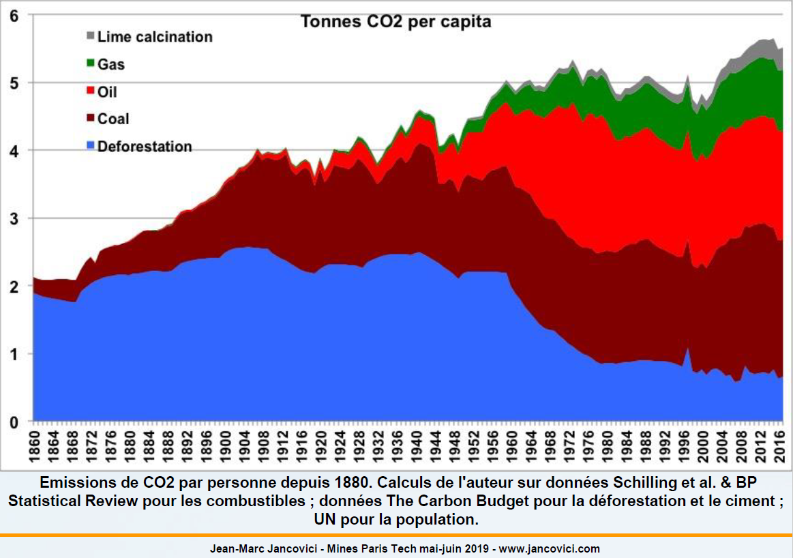

On observe sur cette figure une autre manière de voir les émissions de gaz à effet de serre qui ne sont pas les émissions de gaz à effet de serre de la population dans son ensemble, mais qui sont les émissions de gaz à effet de serre par personne. On pourrait se dire que c'est évident, c'était extrêmement faible au début de l'air industriel et ca a explosé après. Si l'on regarde le CO2 qui provient des combustibles fossiles, oui puisque le marqueur de l'air industriel c'est d'avoir justement utilisé des machines qui mangent des combustibles fossiles. Si on ajoute le CO2 issu de la déforestation, alors on voit que le tableau n'est pas du tout le même : en un siècle et demi, les émissions de CO2 par personne n'ont était multiplié "que" par deux et demi, alors que sur la même période, la population humaine a elle était multiplié par 5 ou 6. On voit que les émissions de CO2 par personne ont augmenté mais les émissions liées à la déforestation ont fortement baissé, les autres ont compensées.

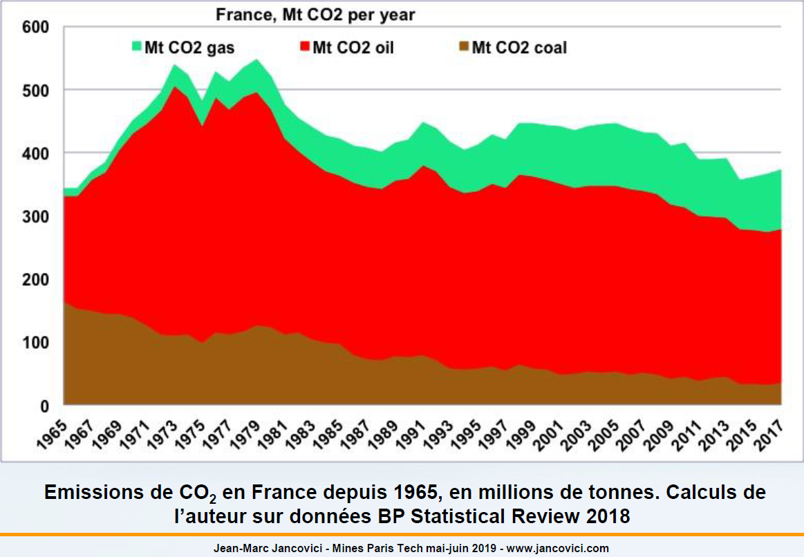

Petit zoom sur la France, on a ici les émissions de CO2 tricolore. On constate qu'ajourd'hui elles sont inférieurs à ce qu'elles étaient au moment du premier choc pétrolier, on a moins d'émissions de CO2. On voit en particulier que celle du pétrole et du charbon ont fortement baissées. Le pétrole a était chassé des usages industrielles et d'une partie du chauffage par le gaz et l'électricité. Le charbon a était chassé des usages industrielles : une fois que la France a eu finit de construire ces infrastructures, on a eu besoin de moins produire d'acier, or l'un des gros consommateur de charbon, c'est notre sidérurgie, on en a utilisé moins dans l'industrie et on a fait moins d'électricité au charbon. On voit par contre que le gaz avait tendance à augmenter ces émissions de CO2, ce qui a cesser d'être vrai depuis le milieu des années 2000. Ce qu'on voit c'est qu'on a comme même une tendance lourde sur ce graphique, les émissions brut de CO2 en France ont plutôt tendance à baissées depuis les chocs pétroliers. Ce graphique ne concerne que les émissions brut, il n'est pas comptabilisés ici les puits de carbonne dont la comptabilisation est très compliquée.

Si on voit passé dans le journal que les émissions ont augmentées depuis l'année dernière. Au regard de la série longue qu'on voit ici, on ne peut *rien en déduire*. Quand on regarde une évolution sur série longue, on voit que des choses montent, des choses descendent, etc., quand on regarde ce genre de choses, la seul conclusion qu'on peut en tirer, c'est rien. Ca n'empêche pas les gens qui ont besoin d'actualité d'y attribuer des causes, mais en fait sur une année, on en tire essentiellement la conclusion que "attendons de voir". Dans un monde qui est régit par la réaction de court terme, ne pas être capable de faire une attribution des causes précise sur ce qu'on est entrain d'observer, c'est évidemment ennuyeux.

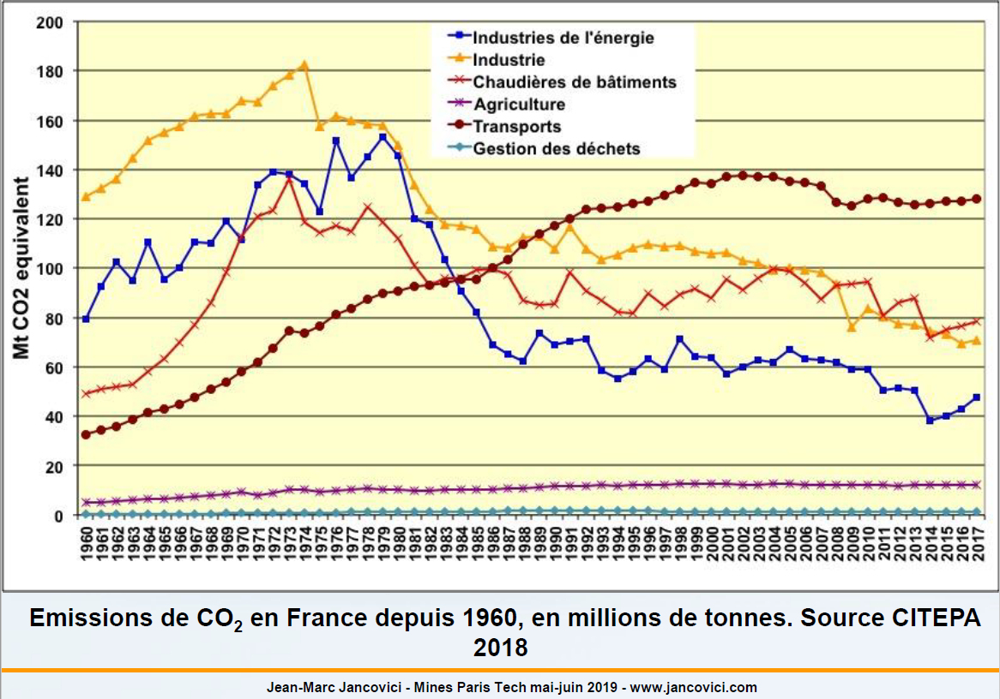

On a ici la même chose discriminé par secteur d'utilisation. Il y a quelques éléments frappants sur ce graphique. D'abord, ce que l'on voit, c'est que l'ordre dans lequel les émissions arrivent aujourd'hui n'est absolument pas l'ordre dans lequel cela arrivait au moment du maximum au premier choc pétrolier, à ce moment là, l'essentiel des émissions de CO2 était le fait de l'industrie, et pas du tout des transports comme c'est le cas aujourd'hui. Ce que l'on voit c'est que les émissions de l'industrie à partir des chocs pétroliers ont très fortement baissé, ce qui est une autre manière de dire que l'industrie est le secteur dans lequel la consommation est la plus sensible au prix, parce que en tant qu'ingénieur, dans sa vie personnelle, on compte beaucoup moins attentivement ce que l'on fait que dans sa vie professionnel. Dans la vie professionnel, les gens sont beaucoup moins sensible (malgrè ce que l'on apprend en économie, nous ne sommes pas que des êtres rationnels) au variation de prix que l'on peut l'être dans les entreprises ou l'on fait des tas de calculs extrêmement savant pour savoir si on ne peut pas gagner 3 centimes ici plutôt que d'en perdre 2 la. C'est la raison pour laquelle le secteur industriel est beaucoup plus sensible à des variations de prix que le secteur des particuliers, ca réagit plus vite. Du reste, on voit que la même variation du cours du pétrole appliqué à l'industrie dans les années 70 change fortement la donne alors que dans les transports, cela ne change a peut prêt rien, la consommation de pétrole dans les transports a évolué avant / après, a peut prêt de la même manière. Un deuxième endroit ou cela se met à bouger significativement, c'est les industries de l'énergie (i.e. centrale électrique et raffinerie), et c'est essentiellement le fait des centrales électriques. On avait de plus en plus de charbon de pétrole et de gaz dans les centrales électriques et on en a de moins en moins, notamment du pétrole, et on se met à tout remplacer par du nucléaire dont on voit l'effet à la fin des années 70. On voit également dans les batiments (résidentiel tertiaire, chaudière de batiment), que les émissions se mettent à baisser. Le seul secteur dans lequel les émissions ont continuer d'augmenter, c'est les transports, qui a tendance à baisser depuis le milieu des années 2000 et ce n'est pas un effet de la conscience climatique (parce que c'est un effet que l'on constate dans tout les autres pays européens à peut prêt au même moment), c'est un effet du stress régionale d'approvisionnement en hydrocarbure liquide tel qu'on l'a vu lors du cours précédent.

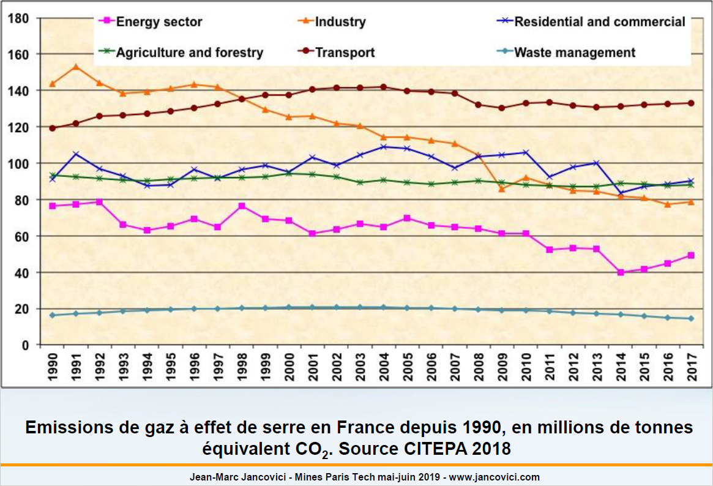

Si on prend tout les gazs à effet de serre confondus, voila comment cela se décompose. On a toujours les transports qui arrive en tête, mais par contre, on voit l'agriculture qui est tout en bas dans le graphique précédent et qui remonte beaucoup plus haut sur ce graphique (c'est liée au fait que ca émet d'autre gaz que simplement le CO2).

## Variation du CO2

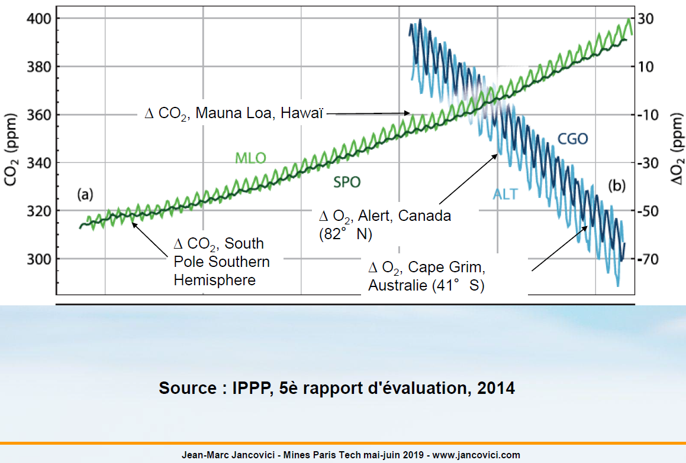

On a une cause naturelle qui pourrait conduire à augmenté la quantité de CO2 dans l'air qui est le volcanisme. Si le CO2 apparait dans l'air par le volcanisme, au moment ou on a une augmentation de la quantité de CO2 dans l'air, on n'a pas de raison particulière de constater une diminution corrélative de la teneur en oxygène. Ce que l'on voit sur ce graphique, en vert, c'est la variation de la quantité de CO2 dans l'air, avec la variation saisonnière; en bleu, on a la variation de la quantité d'oxygène dans l'air (évidemment sur une échelle extrêmement dillatés). On voit qu'il y a également une variation saisonnière qui est dû au fait que la Terre possède deux hémisphères qui sont dissimétriques en ce qui concerne les surfaces émergées; on a beaucoup plus de surface émergés dans l'hémisphère nord que l'on en a dans l'hemisphère sud; cela signifie que au moment ou c'est le printemps dans l'hémisphère nord et que les plantes sont en croissance, la végétation en croissance va pomper du CO2 en provenance de l'atmosphère, alors que de l'autre côté, dans l'hémisphère sud, on a beaucoup moins de plantes a feuillage caduc qui vont avoir des feuilles qui vont pourrir, ce qui conduit le CO2 a retourner dans l'atmosphère. Une feuille qui pourrie, c'est une feuille qui se décompose sous l'action microbienne, et le microbe respire (comme nous de l'oxygène) et la respiration microbienne remet du CO2 dans l'atmosphère. Quand c'est le printemps et l'été dans l'hemisphère nord, la teneur en CO2 de l'atmosphère planétaire à tendance à légérement baissés. Par contre quand c'est l'automne et l'hiver dans l'hemisphère nord, la teneur en CO2 de l'atmosphère à tendance à légérement ré-augmenter. Autour d'une tendance lourde qui est pilottée par nos émissions de CO2 on a une oscillation saisonnière que l'on voit très bien dans les relevés sur la teneur en CO2. Si cette oscillation saisonnière va corrélativement avec une oscillation saisonnière de l'oxygène, et que par ailleur, la tendance lourde à l'oxygène c'est un légère baisse de sa concentration, ca veut dire que toute molécule de CO2 qui apparait dans l'air a prit une molécule d'oxygène dans l'air, et donc cela veut dire que le CO2 n'a pu apparaitre que par oxydation d'un carbonne qui était disponible pour être oxydé. Or il y a deux endroit ou le carbonne est disponible pour être oxydé, la végétation (décomposition des feuilles mortes), et c'est ca la tendance, la combustion des combustibles fossiles. C'est normal que la combustion des combustibles fossiles retire un peu, on déstocke du carbonne de sous le sol et corrélativement on va déstocker un peu d'oxygène de l'atmosphère, on assemble les deux et ca nous fait plus de CO2. Donc ce que nous dit cette courbe sur l'oxygène, c'est que c'est bien un processus de combustion (ou d'oxydation du carbonne plus exactement), qui est à l'origine de l'apparition du surplus de CO2 dans l'air. C'est une des manière qu'on à de montrée que le surplus de CO2 qui apparait dans l'atmosphère vient bien de quelque chose qui se passe à la surface de la planète et pas parr exemple du volcanisme. Il y a une deuxième analyse qu'on est capable de faire sur ce CO2 qui montre que ca vient bien de chez nous grâce au Carbonne 14 qui se forme par transmutation de l'azote dans la haute atmosphère sous l'effet du rayonnement cosmique; ce carbonne 14 rentre après dans le cycle du carbonne et va donc être ingérer par des êtres vivants; quand on a des combustibles fossiles qui sont d'ancien être vivant, ca fait des dizaine de millions qu'il sont sous terre et ils ont totalement perdu leur carbonne 14; donc les émissions de CO2 qui viennent des combustibles fossiles doivent appauvrir l'atmosphère en carbonne 14; ce qui vient de la vie, c'est un cycle du carbonne 14 à durée de vie courte, l'arbre pousse, cela dure quelques dizaines / centaines années, il meurent, cela repart dans l'atmosphère, c'est une durée trop courte pour que cela change fondamentalement la teneur de l'atmosphère en carbonne 14; par contre quand on déstocke des combustibles fossiles et qu'on rajoute du CO2 qui lui est dépourvu de carbonne 14, ca nous change la teneur isotopique de l'atmosphère en carbonne 14. C'est aussi quelque chose que l'on constate actuellement et c'est aussi quelque chose qui permet de dire que l'augmentation en CO2 de l'atmosphère, ca vient bien de chez nous.

L'augmentation de CO2 dans l'atmosphère est donnée en ppm. On parle de faire passer la teneur en CO2 de 0.03% à 0.04% ou 0.05%, si on enlève 0.01% ou 0.02% d'oxygène de l'atmosphère, ca fait une différence de pression partielle sur l'oxygène qui est beaucoup plus faible que quand on va au ski. La diminution de la teneur en oxygène n'est donc pas suffisante pour que ce soit un problème. Par contre, l'augmentation de la teneur en CO2 de l'atmosphère à des niveaux plus élevés que ce dont on parle aujourd'hui (mais pas considérablement plus élevés), ca peut devenir un vrai problème. Aujourd'hui, on regarde si à 1000ppm de CO2 dans l'atmosphère, on commence pas à avoir des problèmes sanitaire récurent pour absolument tout le monde. Ce qui est sûre, c'est qu'à 10% de CO2 dans l'atmosphère, on meurt. Il y a une toxicité aigue du CO2, et c'est pas juste parce qu'on éttouffe, même avec 20% d'oxygène au même moment. Le CO2 dans l'atmosphère il vaut mieux pas qu'il y en est trop. On constate que quand on est dans une atmosphère vicié dans une pièce qui n'a pas était aéré, on peut avoir mal à la tête, c'est un des effet possible du CO2.

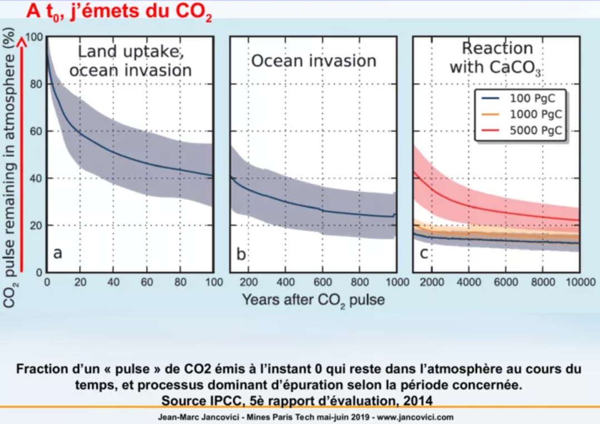

Le CO2 est un oxyde, di-oxyde de carbonne. On sait que les oxydes sont des molécules qui sont extrêmement stables. Le Fer, que l'on trouve aujourd'hui sous forme de $Fe_2O_3$ dans les gisements de minerais de fer, ca fait des milliards d'années (depuis que les continents sont apparus et que le fer c'est oxydé) que c'est sous forme d'oxyde de fer et que c'est rester comme ca, c'est extrêmement stable. Cette stabilité chimique du CO2 s'applique aussi au CO2 que nous avons mis dans l'atmosphère. Une fois que l'on a mis du CO2 dans l'atmosphère, il n'y a pas de processus chimique d'épuration de ce gaz. On a que deux processus d'épuration qui sont un processus physique (le CO2 peut se dissoudre dans l'eau océanique, c'est un équillibrage de pression partiel entre l'atmosphère et l'océan) et le CO2 peut être photo-synthétisé (i.e. métabolisé par une plante, mais c'est une réaction endothermique, il nous faut un photon). Spontanément, il n'y a pas de réaction chimique du CO2 avec n'importe quoi dans l'atmosphère. Le corollaire, c'est qu'une fois que le surplus de CO2 est créer dans l'atmosphère, son temps d'amortissement (le temps qu'il faut attendre pour que le surplus de CO2 s'évacue), après arrêt des émissions est extrêmement élevé. Ce que l'on voit sur cette figure, c'est qu'une fois qu'on arrête les émissions, un siècle après il y aura toujours 40% du surplus qui sera toujours au dessus de nos têtes, un millénaire après, on aura toujours 20% du surplus qui sera au-dessus de nos têtes et dix millénaires après, on aura toujours de l'ordre de 10% du surplus qui sera toujours au-dessus de nos têtes. Cela signifie que le processus du changement climatique n'a aucune réversibilité, aucune. Il n'y a pas bouton reset qui permettrait de recommencer l'expérience à zéro. C'est une expérience qui sera faite une fois et une seule. A cause de cette inertie absolument considérable du CO2 dans l'atmosphère, une autre chose que l'on peut garder en tête dès à présent c'est que, concernant les conséquences du changement climatique, au moment ou on considérera qu'elle sont intolérables, la seule garantie qu'on aura, c'est qu'elle seront pire derrière.

Une des conséquences du changement climatique c'est qu'on affaiblit les ecosystèmes terrestres, et donc c'est eco-système vont être moins capable de "manger" le CO2 qu'avant. On a un certain nombre de processus de rétro-action dans cette affaire qui sont des processus positif, c'est à dire d'amplification. Les premières conséquences du processus amplifie le processus. On en verra un certain nombre dans le prochain cours.

On a la évidemment la résultante de tout les effets, c'est émissions compte tenu du fait qu'il y a des absorptions (équillibrage de pression partielle atmosphère-océan, physique et réaction endothermique, photo-synthèse).

Cela s'applique à des échelle de temps qui dépasse l'entendement, et surtout qui dépasse le temps caractéristiques d'un mandat électoral dans les démocraties, et qui soit dit en passant dépasse aussi très largement la stratégie de long terme de notre employeur si il est côté en bourse. Les horizons de temps qui sont en cause dans ce processus (pour rappel non accessible à nos sens) ont un temps caractéristique qui va très au delà du temps caractéristique des modes de gestion que nous avons démocratisé (que nous avons rendu courant) à la surface de la planète.

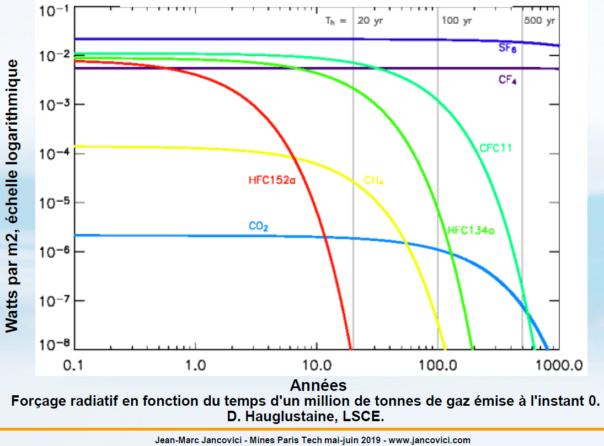

Il n'y a pas que le CO2 dans la vie, il y a d'autre émissions de gaz à effet de serre. Le CO2 reste dans l'atmosphère un certain temps puis sa concentration diminue assez fortement. Il y a d'autres gaz pour lesquelles l'effet radiatif instantannée est beaucoup plus fort, et qui peuvent éventuellement rester beaucoup plus longtemp. Un gaz important dans les discussions est le méthane qui a un forcage radiatif instantanné beaucoup plus important (i.e. quand on met un kilo de méthane dans l'atmosphère, cela intercepte beaucoup plus fortement les infrarouge terrestre que quand on met un kilos de CO2), par contre le méthane à lui un processus chimique d'épuration de l'atmosphère, il se fait manger par les radicaus hydroxyles et va donc y rester moins lontemp. C'est le seul gaz qui a un processus d'épuration chimique de l'atmosphère, pas les autres.

## Archives atmosphériques

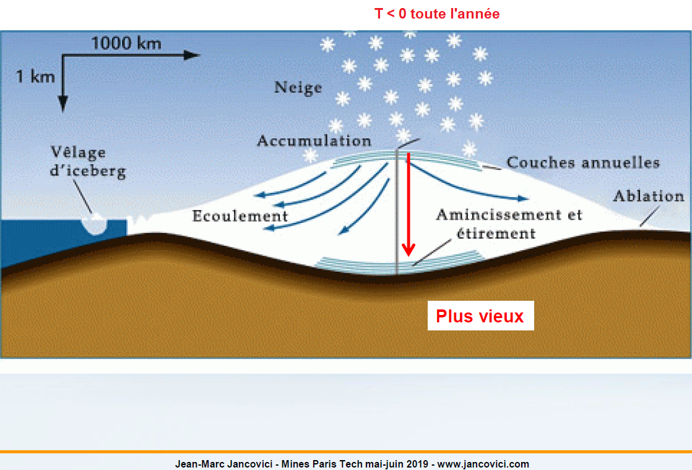

A ce stade, ce qu'on sait c'est que la quantité de CO2 depuis qu'on a des mesures expérimentales (i.e. depuis 1950) augmente rapidement dans l'atmosphère, mais on est pas encore capable de comparer cela avec ce qui se passait à des périodes plus anciennes. Pour comparer ca avec des périodes plus anciennes, on va avoir besoin de faire un petit tout aux pôles. Aux pôles, il y a quelque chose qui nous intéresse beaucoup en tant qu'archive climatique, c'est les calottes. Le processus de formation d'une calotte, on va prendre l'Antarctique, puisque pour le Groenland cela à cesser d'être vrai, sur l'essentiel de la surface on a des températures qui sont négatives toutes l'année, ce qui veut dire que quand il y a des précipitations, c'est nécessairement sous forme de neige. Par ailleurs, des précipitations il y en a très peu chaque année, l'Antarctique étant un endroit très froid, c'est également un endroit extrêmement sec. Quand la neige tombe année après année, on a des précipitations neigeuses et c'est précipitation neigeuse, comme elle ne fonde pas, ce qui va leur arriver, c'est qu'elle vont se tasser a cause du poid des chutes de neige successive et ce processus de tassement au bout de quelques siècles finit par transformer la neige en glace. On a un processus de transformation de neige en glace simplement par effet de pression. Au moment ou cette neige se transforme en glace, lors du processus de tassement, elle va emprisonner sous forme de petite bulle, l'air qui circule entre le flocons. On va donc retrouver dans la glace, prisonnière sous forme de petites bulles, l'atmosphère fossile qui date de l'époque de formation de la glace. Cette glace ne reste pas au même endroit, elle va en règle général flué vers l'océan, c'est un processus d'accumulation et par effet de gravité (sous le poid de sa propre glace) la glace étant un peu fluide et donc flue, et finit quelques temps après (milliers, dizaine de milliers, centaine de milliers d'années ou millions d'années) par donné des icebergs. Quand on choisit l'endroit ou se trouve le carottage, il se trouve qu'on a une petite portion de la glace qui dans ce processus, dans cette dynamique, elle flue essentiellement verticalement (i.e. elle s'enfonce sans aller vers les côtes). Ce qui veut dire que si on fait le trou pile au bon endroit, dans carotage vertical, on va au fur et à mesure de la profondeur de la carotte, récupérer de la glace de plus en plus ancienne, avec une atmosphère fossile de plus en plus ancienne. Toute les espèces chimiques contenus dans cette atmosphère qui sont stable une fois que la bulle s'est formé, ce qui est le cas du CO2 et qui est aussi soit dit en passant le cas du méthane (puisque une fois retiré du contact avec les radicaux hydroxiles de l'atmosphère, il cesse de disparaitre). Le méthane qu'on trouve dans les bulles d'air formé dans la glace, lui représente la concentration en méthane au moment ou la bulle s'est formé (en moyenne, sur quelques siècle).

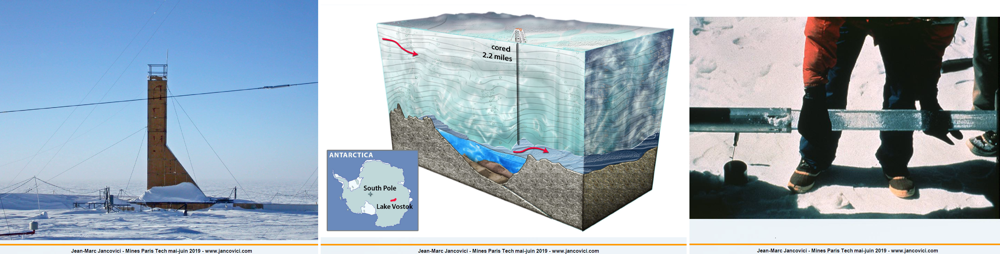

La manière dont on prélève une carotte, c'est très simple. On met un carottier (image de gauche) à la surface de la carotte, on fait un grand forage et on récupère une carotte de glace (image de droite). On la coupe en petit morceaux, on étiquette soigneusement chaque morceaux en notant à quelle profondeur il a était prélevé et on envoit ca au laboratoire à Grenoble et qui étudie ce qu'il y a dans les carottes. On trouve deux choses dans les carottes : à la fois la glace elle même, et en analysant la composition isotopique de l'eau (i.e. la fraction d'oxygène 18 ou la fraction de deutérium dans l'hydrogène de l'eau), on est capable de reconstituer la température planétaire de l'époque. En effet, au moment ou l'eau s'évapore, on a ce qu'on appelle un fractionnement isotopique, c'est à dire plus la température au lieu d'évaporation est chaude, plus la vapeur d'eau emporte en proportion plus d'oxygène 18 et plus de deutérium qui ensuite vont précipité partout dans le monde y compris en Antarctique pour former la neige de la calotte. La teneur isotopique en oxygène 18 et en deutérium dans la glace de calotte est donc un marqueur de la température planétaire. L'air dans les petites bulles va lui marquer la teneur en CO2, en méthane, en protoxyde d'azote, que l'on a dans l'atmosphère des temps anciens. Comme en Antarctique on va trouver de l'eau qui précipite après avoir était évaporer sur toute la surface de l'océan, globalement, c'est un marqueur de la température planétaire. C'est également un marqueur de la concentration en CO2 planétaire puisque comme la durée de vie du surplus de CO2 se compte en siècle ou en millénaire, alors que le temps de brassage inter-hemisphérique de l'atmosphère est de l'ordre de l'année, en gros, on émet du CO2 absolument n'importe où et les concentrations vont s'homogénéiser très vite et donc comme en plus à cette époque là, on a peu de source concentré de CO2 susceptible de perturbé localement la mesure (i.e. si on avait un volcan à côté de la carotte, ce serait emmerdant), on a un marqueur de la concentration en CO2 de l'atmosphère dans son ensemble.

On pouvait faire ca au Groenland pour les temps anciens, on ne peut plus faire ca au Groenland pour les temps moderne puisqu'il y a plein d'endroit ou maintenant la neige font en surface de la calotte et donc on a plus ce phénomène d'accumulation année après année qui nous donne des strates bien datées dans le temps. Une partie de ce qui tombe ruisselle, fiche le camp ailleurs, etc. en bref, ce n'est plus exploitable.

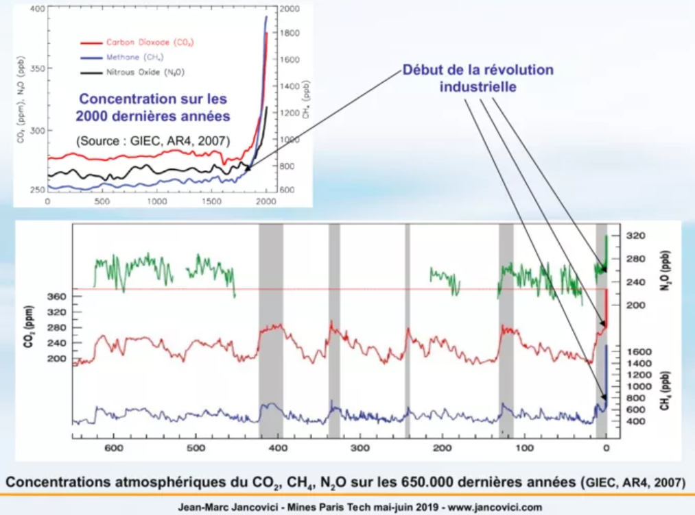

Ce qu'on voit sur le premier graphique, c'est la concentration en CO2, en méthane et en protoxyde d'azote (pas au même échelles). On voit que jusqu'au début de l'ère pré-industrielle, tout cela est stable et arrive l'ère industrielle et on voit la concentration qui se met à évolué de façon extrêmement rapide à la hausse. On sait aujourd'hui remonté avec la carotte la plus profonde qu'on est prélever en Antarctique à environ 800.000 ans. Sur 800.000 ans, on est capable de reconstituer la concentration en CO2 et en méthane que l'on à la. On peut voir à l'échelle, les surplus de concentration que nous avons déjà créer en l'espace d'un siècle et demi ou deux siècle. On voit que à l'échelle des temps géologiques ou les variations climatique ont engendré ou sont allé de pair avec des variations de gaz à effet de serre (la en l'occurence, c'est plutôt les forcages astronomiques change la température sur Terre, ce qui change la concentration d'équillibre des gazs à effets de serre). On voit qu'on est déjà totalement sorti de la variation naturelle avec ce qu'on a rajouté. On voit en période grisé, les périodes inter-glaciaires chaudes tel que celle qu'on avait commencé à vivre depuis il y a 10.000 ans, et on voit que cela correspond à des concentrations plus élevés des gazs à effet de serre. En ce qui concerne le CO2, c'est le processus de destockage du CO2 de l'océan qui est à l'oeuvre (l'eau chaude dissout moins bien le CO2 que l'eau froide). Quand on a un forcage astronomique qui réchauffe la température de la planète, ca nous réchauffe les océans, à ce moment les océans dégaze un peu de CO2 et ca nous réchauffe encore plus la planète. A un moment le phénomène finit par s'amortir et s'équillibre, mais on a un phénomène d'amplification. C'est la raison pour laquelle les sorties de glaciations vont beaucoup plus vite que les entrées en glaciation, parce qu'on a ce phénomène d'amplification, de rétroaction positive. En ce qui concerne le méthane, c'est plus chaud, c'est plus humide, pusique c'est un cycle de l'eau qui s'intensifie, donc plus de zone humide donc plus d'émission de méthane puisque le méthane naturel est essentiellement émis par les zones humides, c'est un marqueur des zones humides. Pour faire du méthane de manière naturelle, il faut un endroit ou la végétation pourri en gros, à l'abri de l'oxygène de l'air, typiquement les marécages, etc. Plus on augmente les zones humides, plus on augmente les émissions de méthane. Ce que l'on voit, c'est qu'avant même de parler d'avenir, la discontinuité que nous avons introduite dans l'atmosphère est extrêmement brutale au regard de ce qui ce passe sur les temps géologiques et à cause de la durée de vie du surplus de CO2 dans l'atmosphère, même avec des émissions qui demain matin baisse très fortement, nous sommes encore très très loin d'avoir vue la totalité des conséquences de ce que nous avons déjà fait. On est pas dans un système instantanné dans lequelle les conséquences sont imédiates après les émissions, ca va s'étaler sur des milliers d'années après les émissions. La question est donc évidemment ou est-ce qu'on est parti dans tout ca à l'avenir et ou est-ce qu'on s'arrête.

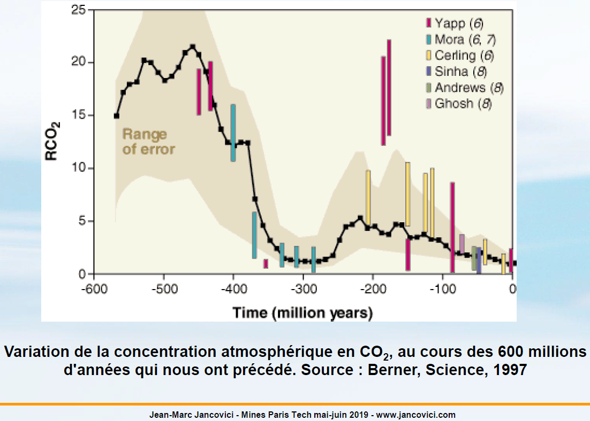

C'est pas aujourd'hui, et loin s'en faut la concentration en CO2 la plus élevé que nous ayons eu dans l'atmosphère planétaire. On a eu des époques géologiques anciennes ou la concentration en CO2 était beaucoup plus élevé qu'ajourd'hui. On voit sur cette figure, un marqueur de la quantité de CO2 que l'on a dans l'atmosphère depuis le début de l'ère primaire et c'est exprimer en multiple de la concentration actuelle. On voit donc qu'il y a des moments ou il y a eu 20 fois plus de CO2, il y a longtemps, mais ces époques là on aussi correspondu à des époques ou la puissance solaire était plus faible, et par ailleurs, à cette époque là, il y avait probablement très peu de vie sur les terres émergés. Les terres émergés était encore essentiellement des désert, la vie était essentiellement dans l'océan. Dans le changement climatique dont on parle aujourd'hui, la probabilité que celui-ci cause l'éradication de toute vie sur Terre parait assez faible, ce qui va être en jeu évidemment c'est ou se place le curseur sur les endroits ou cela se passe bien et les endroits ou cela se passe moins bien.

La quantité de CO2 depuis qu'on a des océans est un peu piloté par le rayonnement solaire puisque quand le rayonnement solaire conservé par la planète avec la variation de ses paramètre astronomique est plus importante, les océans se réchauffent, et cela dégaze un peu de CO2. On a la un processus de pilotage. Quand la végétation se porte bien (par exemple après l'apparition de la végétation au Cambrien), on a la corrélativement le CO2 qui baisse. On a des processus d'asservissement entre le rayonnement solaire, la quantité de végétation et le CO2 dans l'air. Mais ce qui est important ici, c'est la vitesse avec laquelle le processus évolue. C'est une affaire de vitesse cette histoire. Si on rentre dans un mur à 3kmh, on a une bosse, si on rentre dans un mur à 100kmh, on est mort. On parle la exactement de la même chose, il y a des déplacements du système qui ne sont pas génants puisque ils sont fait sur des durée lentes, et donc il y a des adaptations possibles; et il y a des déplacements du système qui se font sur des durées qui sont trop courte pour que le système puisse s'adapter dans de bonne conditions. On est malheuresement parti sur la deuxième option.

## Pouvoir de Réchauffement Global

$$PRG = \frac{\int_{0}^{N} F_{gaz}(t) dt}{\int_{0}^{N} F_{CO_2}(t) dt}$$

Une fois qu'on sait qu'on a pas que le CO2 dans les gaz à effet de serre, on a besoin d'une métrique. Si on avait qu'un seul gaz à effet de serre, par exemple le CO2, la métrique serait le poid de CO2, on mesurerait en poid de CO2 et il serait plus grave d'émettre 3 kilos que d'émettre 1 kilo. Mais comme on a plusieurs gaz à effet de serre, est-ce qu'il est plus grave 1 kilo de méthane ou est-ce qu'il est plus grave d'émettre 1 kilo de CO2 ? Si un patron nous dit on a 1000€ pour réduire quelque chose et on a la possibilité de réduire le méthane de 3% ou le CO2 de 10%, qu'est ce qu'on choisit ? On ne sait pas répondre à cette question, tant qu'on a pas une unité de comparaison, une monnaie, quelque chose qui nous permette de dire "cela c'est x fois plus grave, x fois moins grave que le CO2". Cette monnaie s'appelle le PRG (ou Pouvoir de Réchauffement Global, en anglais Global Warming Potential ou GWP), est une équation permettant de déterminer la notion "combien de fois le CO2 ?". Cela correspond au forcage radiatif cumulé que va nous amener une unité de gaz à effet de serre supplémentaire dans l'atmosphère. Plutôt que de regarder en absolu, on a choisit de regarder cette unité en relative. C'est en fait le rapport entre le forcage radiatif cumulé d'une unité de gaz à effet de serre sur une durée donnée, sur le forcage radiatif sur la même durée du même poid de CO2. Ce qui veut dire que par convention, le PRG du CO2 vaut 1 quelque soit l'horizon de temps concerné. Cette unité dépend de l'horizon de temps et dépend du forcage radiatif.

Par exemple, en reprenant la Figure 3.23, si on prend le gaz HFC512a (un halocarbure) et que l'on borne notre horizon de temps à une année, le PRG de ce gaz va être 10.000 fois supérieur au PRG du CO2; en revanche, si on borne notre horizon de temps à 1.000 ans, le gaz HFC512a se sera épuré beaucoup plus vite que le CO2 et donc son PRG (i.e. le rapport d'intégrale sur un horizon de temps donné) va avoir une valeur extrêmement différente. Il y a un débat sur quelle est la bonne échelle de temps. Selon l'échelle de temps que l'on prend; en particulier pour le méthane qui est à un siècle 25 fois plus nocif que le CO2 et à 20 ans il est 100 fois plus nocif que le CO2. Alors on s'intéresse à un siècle ou à 20 ans ? Si on prend 20 ans, la Nouvelle-Zélande qui émet plein de méthane, parce qu'elle à plein de mouton et de vache se met à hurler, pareil pour les pays qui cultive du riz (qui émet du méthane, une rizière étant un marécage artificielle, on a des débrits organiques qui se décompose à l'abri de l'oxygène de l'air, on a donc une décomposition anaérobie qui émet donc du méthane; toute décomposition anaérobie émettent du méthane; c'est le même principe que dans les méthaniseurs, on met de la matière végétale à l'abri de l'oxygène de l'air, qu'on fait manger à des bactéries primitives qui s'appellent des archées qui émettent du méthane), alors que si on prend un siècle, ce sont les pays qui ont plus de CO2 dans leurs inventaire d'émission qui se mettent à hurler. On voit que ce sujet qui peut paraître technique ou anecdotique pilote en fait la façon dont on va répartir la charge de l'effort en fonction des sources d'émissions.

## Slides non commentés

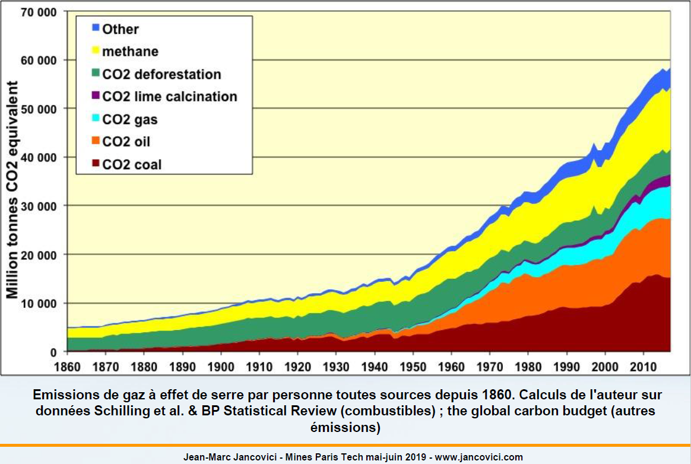
L'homme, agent climatique

Devenir neutres en 50 ans ?
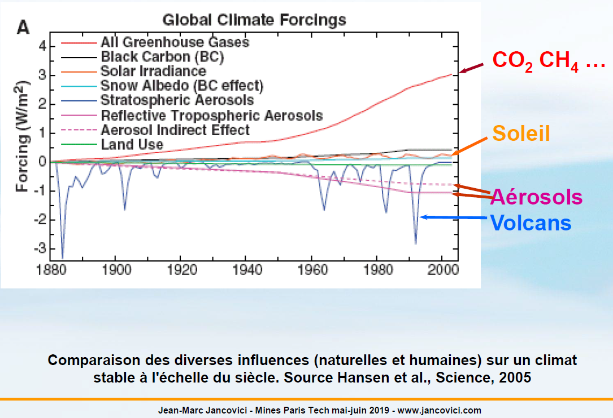
On sort la calculette : qui influe le plus ?
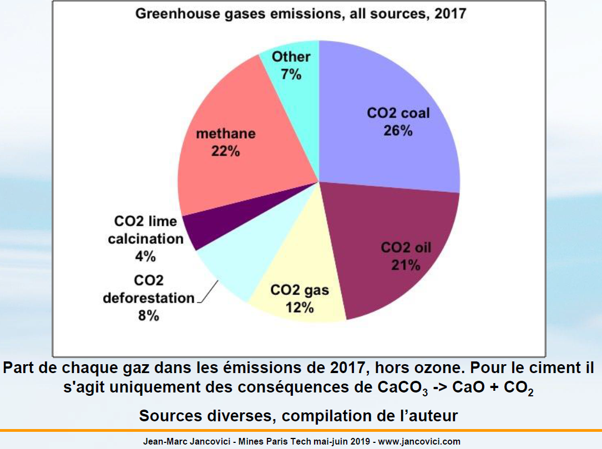
Contribution de chaque gaz aux émissions
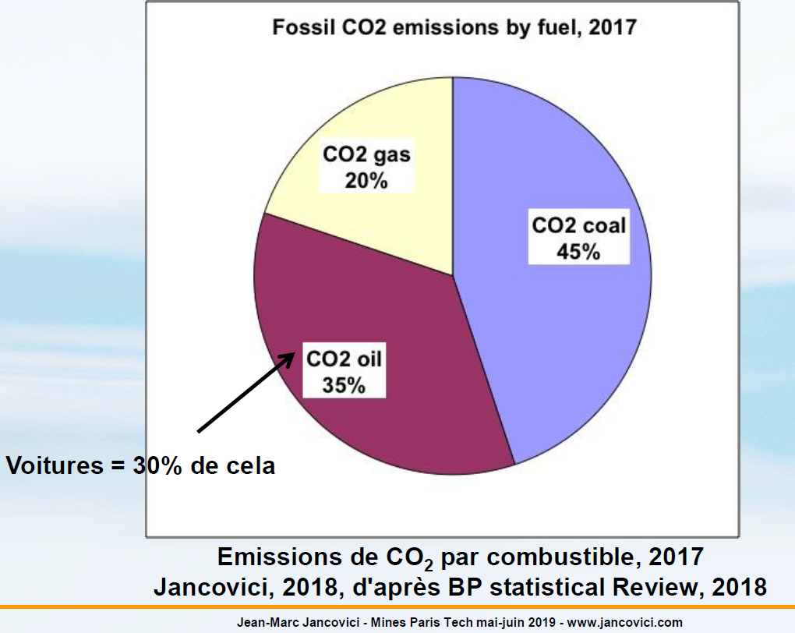
CO2 = pétrole = voitures ? Pas si simple...

## Comparaison des GES

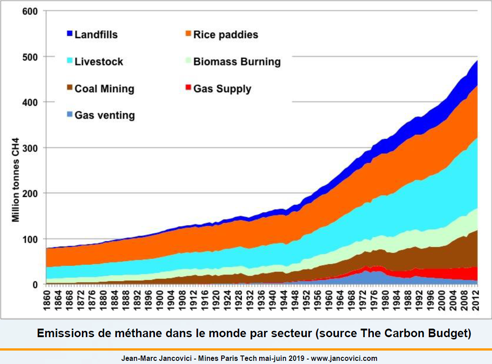

On va donc pouvoir comparer les émissions de gazs à effet de serre. On voit par exemple ici les émissions de **méthane**; on les comptes en tonnes de méthane ou plus exactement en millions de tonnes de méthane. Le méthane à pour origine différent secteur. On a : gas supply (la distribution de gaz, les fuites dans les réseaux de gaz, le gaz naturel étant du méthane), coal mining (les mines de charbon, quand on forme une veine de charbon, il y a du méthane qui est absorbé sur le charbon et donc quand on mine le charbon, on émet du méthane dans l'atmosphère parce qu'on ventile les mines pour éviter que les mineurs fassent boum), biomass burning (combustion de la biomasse qui émet du méthane parce que le méthane est un élément volatile qui se forme quand le bois prend feu, une partie de ce méthane n'est pas bruler au moment ou la combustion à lieu et fiche donc le camp dans l'atmosphère), livestock (le cheptelle des ruminants, on a essentiellement des vaches, 1.5 à 2 milliards de vaches sur Terre, représente la première biomasse des mammifères sur Terre, devant les Hommes, et les vaches rottent du méthane, le pètent très peu. Les vaches rottent du méthane qui se forme dans leur 4 estomacs à l'intérieur duquel un processus complexe de fermentation anaérobie est en place), rice paddies (les rizières), landfills (décharge, dans lesquelles se trouvent des déchets organiques, les déchets s'empillent les uns sur les autres et une partie de ses déchets fermentent à l'abri de l'oxygène de l'air et émettent donc du méthane. Dans l'essentiel des décharges des pays occidentaux, se méthane est capté mais c'est pas partout le cas dans le monde).

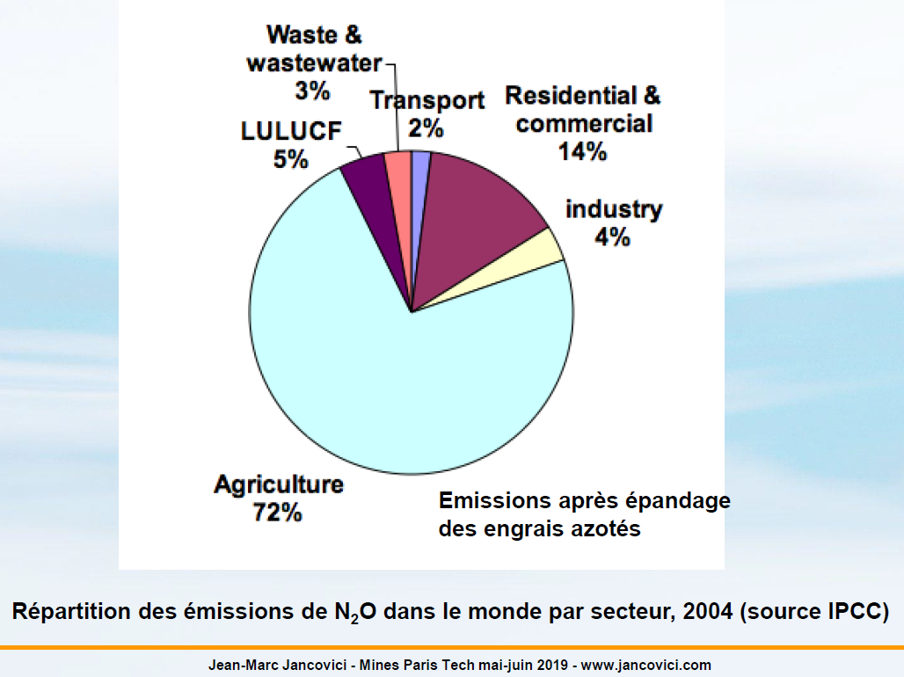

Même si ce diagramme est un peu ancien, les ordres de grandeurs des causes d'émissions de gaz n'ont pas beaucoup changé. Le **protoxyde d'azote** peut être issue de processus de combustion, processus dans lequel on oxyde quelque chose avec l'oxygène de l'air; cet oxygène de l'air n'est en général pas amené pur là ou ca brûle, on l'amène avec l'azote de l'air. Le processus de combustion va nous réaranger l'azote et l'oxygène sous forme d'oxyde d'azote. Les oxydes d'azote de la pollution automobile sont tout simplement l'azote qui est rentrer dans le moteur, qui s'est trouver dans la chambre de combustion du moteur, qui c'est recombiner avec de l'oxygène et qui ressort sous forme d'oxyde d'azote; une petite partie de cet oxyde d'azote est du protoxyde. C'est la même chose dans l'industrie et la même chose dans les chaudières de batiments. On a une cause essentiel qui est l'agriculture, qui utilise des engrais qui contiennet des molécules azotés et que ces molécules azotés, quand on les épands sur le sol (cela marche avec des engrais de synthèse ou avec le liziers des cochons ou le purin des vaches), il y a une petite partie des molécules qui vont formé du protoxyde d'azote sous l'effet de l'action microbienne des sols.

Les **halocarbures** sont des molécules qu'on a fait en replacant dans les hydrocarbure, de l'hydrogène par des halogènes. La raison pour laquelle on s'est amusé à faire cela, c'est que la liaison C-halogène est une liaison extrémement stable, ce qui veut dire que quand on fait ce genre de composés, en particulier quand ils sont saturés, on fait des molécules qui sont quasi-indestructible et donc qui ne sont pas toxiques. Ce sont des molécules qui ont remplacés d'autres usage a cause de leur propriété physique intéressante ou avant on utilisé des gazs qui était potentiellement toxique ou agressif. Dans les chaînes du froid, ca a remplacé le CO2 qu'on utilisé à un moment qui était un peu moins bon sur le plan thermodynamique et surtout l'amoniaque. On a donc préférer mettre dans les circuits frigorigène des molécules de gaz halogénés parce que si on en respire un grand coup, il nous arrive essentiellement rien. Pareil pour les gazs propulseurs des bombes aérosols, on a utilisé ces gazs à la place des hydrocarbures qu'on utilisait avant. Cela a également servi de gaz expanseur de mousse (e.g. dans un vieu frigo des années 50, la mousse isolante du frigo a était fait avec un gaz comme ca qui a servit de gaz expanseur), la mousse est truffé d'halocarbure donc si on détruit la mousse et qu'on expose cela à l'air, cela part dans l'atmosphère et cela augmente l'effet de serre. Enfin, cela sert également de solvant dans l'industrie des semi-conducteurs.

Le plus dangereux de ces halocarbures pour la couche d'ozone s'appelle le CFC a depuis était éradiquer. Le CFC est une molécule très stable (comme tout les autres), cloro-fluo-carbure, du chlore, du fluore et du carbonne, mais comme cette molécule était très stable, elle avait le temps de monté dans la haute atmosphère sans être agresser par quoi que ce soit sur le plan chimique; dans la haute atmosphère, c'est dissocié par les ultraviolets dure, et à ce moment, le chlore libérer par cette réaction agresse l'ozone stratosphérique. On a supprimé la production, mais pas les émissions, en effet, on a des CFC qui sont utilisés précisément comme gaz expanseur de mousse et donc qui sont encore dans des vieux frigo qui sont encore en train d'être démanteler aujourd'hui, on a donc pas complétement supprimé les émissions; il y a également un certain nombre de pays qui en ont fait un peu en douce. On a toujours des gazs de cette nature mais les émissions aujourd'hui sont beaucoup plus faible que ce qu'elle étaient dans les années 1950. Désormais interdits de production, les CFC ont été remplacés par des substituts aux doux noms de HFC, HCFC, PFC, etc. Ces gaz servent toujours dans les circuits de fluide réfrigérants, mais aussi comme gaz propulseurs, de gaz expanseurs (industries des mousses plastiques), de solvants (semi conducteurs), et viennent parfois de manière "indésirables" de certains procédés industriels (par exemple électrolyse de l'alumine).

## Ozone troposphérique et stratosphérique

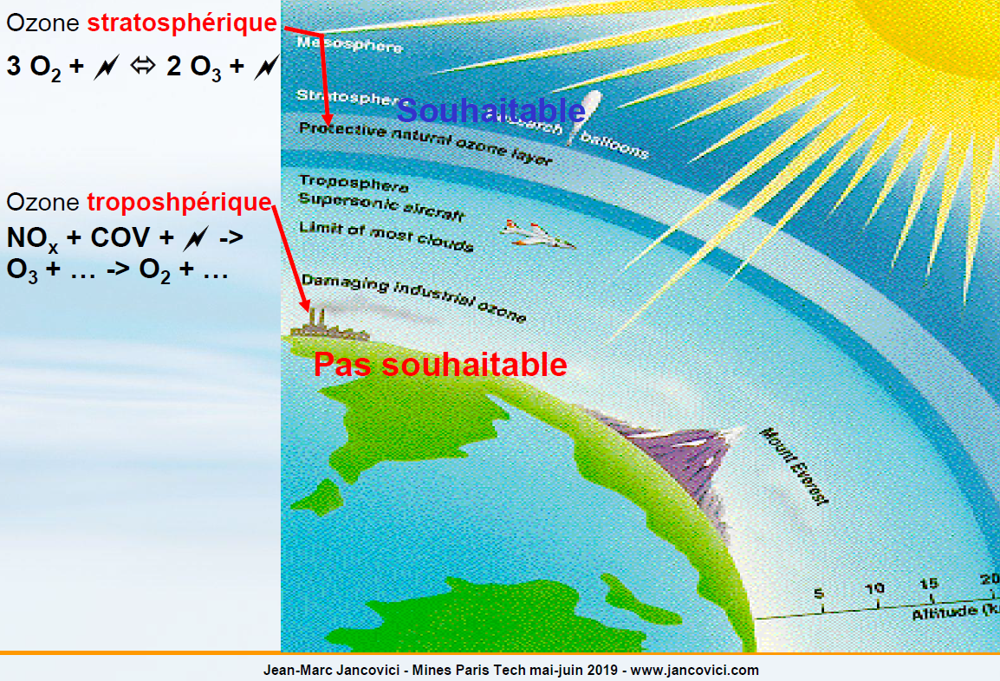

On a un autre gaz a effet de serre qui n'a pas d'émissions directe qui est l'ozone. L'ozone est présent à deux endroits; dans la haute atmosphère, celui la nous intéressent énormément a double titre : il intercepte les ultraviolets dure du soleil (qui sinon génerait la vie telle qu'on la connait sur Terre), et a un deuxième effet beaucoup plus méconnue qui est que comme il absorbe de l'énergie dans la haute atmosphère, il réchauffe la haute atmosphère et créer ce qu'on appelle une inversion de température, la température qui par effet thermodynamique de base diminue quand la pression diminue, quand on monte, jusqu'à la tropopose, c'est à dire jusqu'à la limite de la stratosphère, se met à se réchauffer quand on rentre dans la stratosphère. Cette inversion de température à quelque chose d'absolument fondamentale, c'est qu'elle limite la convection de la vapeur d'eau à la limite à la tropopose. Si cette inversion de température n'avait pas lieu, la vapeur d'eau ne s'arréterait pas à 15km du sol, elle continuerait à monter plus haut (donc se serait un peu génant pour les précipitation), et par ailleurs, la vapeur d'eau serait elle aussi exposer au ultraviolet dure du soleil qui aurait depuis longtemp dissocié l'eau en oxygène qui serait rester sur Terre et hydrogène qui aurait foutu le camp parce que la molécule est trop volatile. L'eau qui est arrivé sur Terre, si la couche d'ozone n'aurait pas créer cette inversion de température, elle aurait disparu. Cette ozone stratosphérique est formé par interaction de l'oxygène atmosphérique avec les ultraviolet, il a son propre cycle et ne bouge pas de la stratosphère. Plus près du sol, on a de l'ozone troposphérique, de l'ozone qui apparait près du sol. Celui la nous intéresse beaucoup moins, il n'apparait pas du tout pour les mêmes raisons, il apparait parce qu'on joue au petit chimiste en gros, on met dans l'atmosphère tout un cocktail de pollution, des oxydes d'azote, des composés organique volatile, on touille tout ca avec un peu de rayonnement solaire et on a de l'ozone qui apparait. Celui la on ne l'aime parce qu'il rentre dans nos poumons et participe à l'effet de serre.

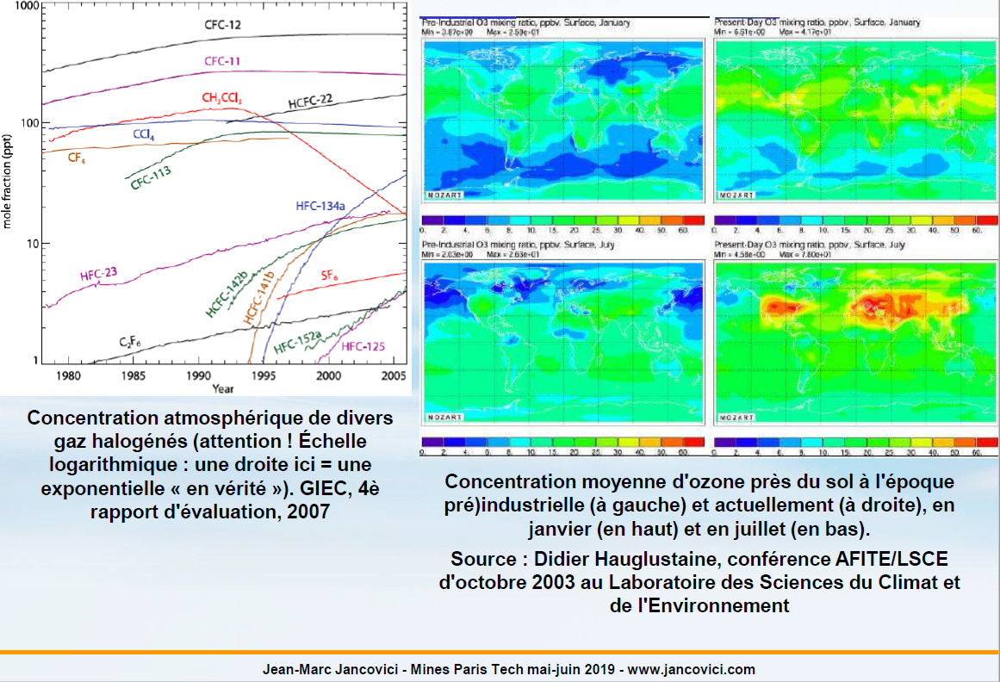

On a ici un graphique (à gauche) qui nous montre que la concentration d'à peut prêt n'importe quoi sur les halocarbures à fortement augmenté au cours des dernières décennies et (à gauche) des cartes qui nous compare la concentration de fond en ozone. On voit que cette concentration a fortement augmenté, c'est à dire que bien que l'ozone soit un oxydant très agressif (i.e. ca duré de vie dans l'atmosphère est courte, dès qu'il est formé il trouve un truck a bouffé et il se jette dessus), comme on continue à en produire en permanance, on a une concentration de fond en ozone qui est plus ou moins élevé, mais en permanance au dessus de nos tête.

L'ozone est un inhibiteur de croissance pour les plantes. Il faut du temps pour que l'ozone se forme; en région parisienne par exemple, ce n'est pas la ou on a la circulation routière qu'on a le maximum de la concentration en ozone, en général il lui faut le temps de se former donc le maximum de la concentration en ozone, en fonction du vent, c'est toujours un peu sous le vent de l'agglomération à 10, 20, 30km.

## Comparaison des émissions

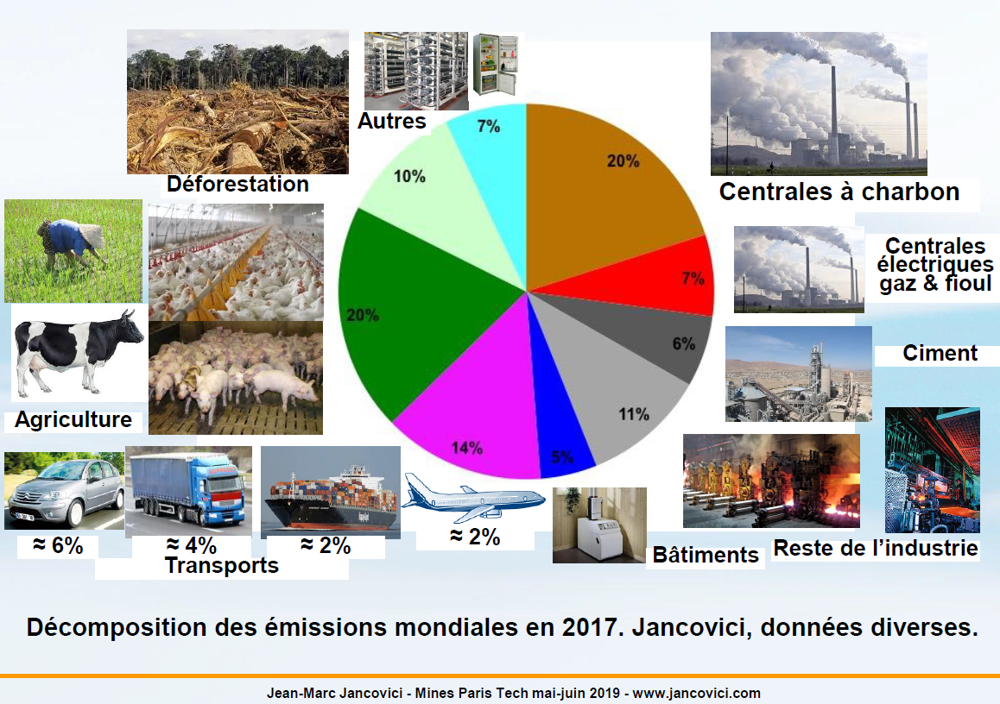

Une fois qu'on à le comparatif des gazs les uns avec les autres, on va pouvoir commencer à représenter les émissions de gazs à effet de serre sous forme de camembert. Des camemberts il y en a plein, on peut représenter par gazs, par source, par pays, etc. On va voir ici un certain nombre de camembert. On va commencer par un camembert dans lequel est attribué les émissions de gazs à effet de serre (tout gaz, CO2, méthane, etc.) à un certain nombre de secteurs d'activité; la totalité des activités produit 100% des émissions et on décompose cela de façon parlante par une vue globale. Les centrales à charbon (méthane émis par les mines de charbon inclus) représente aujourd'hui dans le monde 20% des émissions planétaire; dit autrement, 1 tonne équivalent CO2 sur cinq (par PRG à 100 ans) émise dans le monde vient d'une centrale à charbon ou de sa chaîne d'approvisionnement. Les centrales à gaz et à fioul représentent de l'ordre de 7% des émissions planétaires et ceux compris les émissions de méthane occasionnés par la chaîne gazière à l'amont. En rajoutant les combustibles utilisés par les cimenteries, la production de ciment représente 6% des émissions planétaires. A notez que les émissions françaises représentent 1,5%. Le reste de l'industrie représente 12% avec comptabilisés les émissions directes, mais non comptés les émissions de la production électrique utilisés par l'industrie, si on rajoute la production électrique utilisé par l'industrie, la part de l'industrie passe de 18% (cimenterie incluse) à ~25% ~30%. Une bonne partie de l'électricité passe évidemment dans les processus industriel. Dans ces 12% d'émissions causés par le reste de l'industrie, environ 4% est émis par les aciéries. Sachant qu'à peut prêt la moitié de l'acier dans le monde sert à faire des batiments et des infrastructures (ponts, etc.) et que la totalité du ciment sert à faire cela, cela signifie que construire des batiments et des ponts sur Terre représente un petit 10% des émissions planétaires. On retrouve la un élément de croissance démographique : si il y a plus de monde, on fait plus de batiment. Le chauffage des batiments représente 6% des émissions (une bonne partie des batiments dans le monde n'a pas besoin d'être chauffé, par exemple, un batiment dans le sud de la Californie, à Singapour ou à Lagos, son problème c'est pas d'être chauffé, son problème par contre est éventuellement d'être climatisé et à ce moment on ne retrouve pas les émissions dans le chauffage mais dans les émissions causés par la production électrique). Sur le chauffage directe, une bonne partie des batiments dans le monde n'en ont pas besoin. En France, on a pas la part très importante de production d'électricité par le charbon et on a une part de l'indutrie (ciment, etc.) qui est plus faible parce qu'on a finit de construire nos infrastructures et on construit à un rythme moins éffrené que dans les pays à forte croissance démographique. Par un effet de part de camembert plus petite à un certain nombre d'endroit, les autres parts sont corrélativement plus grosse; cela étant pour montré que les parts peuvent variés beaucoup en fonction des pays. La part rose constitue les émissions des transports. Dans la transport, la flotte mondiale des voitures est aux alentours de 6% des émissions, la flotte mondiale des camions, est aux alentours de 4%, la flotte mondiale de bateaux est aux alentours de 2% et la flotte mondiale des avions est aux alentours de 2% également (en dehors des gazs non CO2). Ce que l'on voit donc à ce stade, c'est que les usages de types machines, le parc mondiale de cimenterie c'est le même problème que le parc mondiale de voiture, le parc mondiale d'aciérie, c'est le même que le parc mondiale de camion. On voit également que les centrales à charbon c'est plus important que la totalité des moyens de transports dans le monde si on regarde les émissions. On commence donc la à avoir une base de comparaison qui nous dit si on en a envie de s'occuper du problème ou il faut qu'on tappe, et on voit que ce n'est pas juste on va supprimer les voitures, et on s'arrête la, le problème est plus compliqué que cela. 20% de nos émissions viennent du fait de manger, ce sont essentiellement des gazs hors CO2 (on retrouve les vaches, le reste du cheptelle de ruminant qui est plus minoritaire, les rizières, le protoxyde d'azote des champs et le CO2 des tracteurs mais qui est totalement minoritaire). On a ensuite la déforestation qui est un processus amont de l'activité agricole, ce qui veut dire que le fait de manger au sens large, c'est plutôt 30% des émissions planétaires. Enfin on retrouve des choses diverses avec par exemple, la gestion des déchets, les fuites de chaînes du froid, etc. qui représente de l'ordre de 7%. On a la une manière de représenter les émissions planétaires. en les représentant par grand ensemble d'émissions directes.

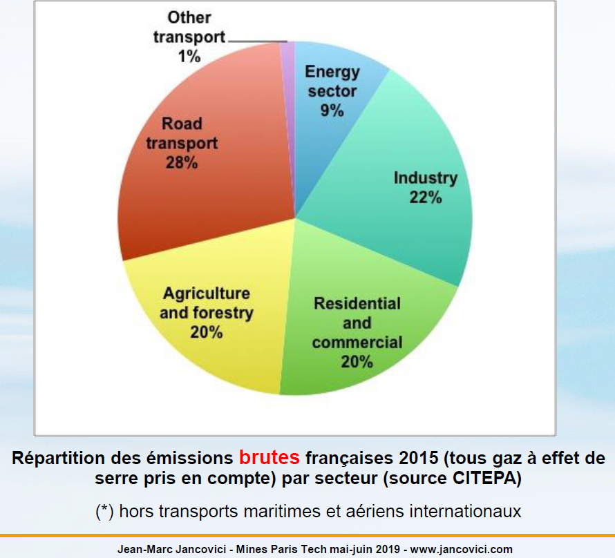

En France, on voit à quoi ressemble la répartition des émissions brutes sur ce graphique. On retrouve les mêmes part de camembert mais pas organisée de la même manière. Le transport arrive en tête, ensuite les batiments, l'agriculture et l'industrie a peut prêt à parité, enfin le secteur energetique car des centrales à charbon on en a très peu, et c'est ce qui fait la différence.

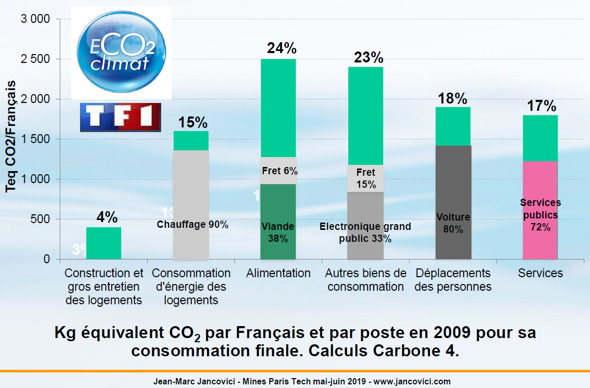

On a une autre manière de présenter les émissions de gaz à effet de serre qui sont les émissions qui sont issues de notre **empreinte carbonne**. Notre empreinte carbonne c'est, par opposition aux émissions qui sont dites territoriales (i.e. les émissions qui viennent de la France), les émissions qui sont la contrepartie de ce que l'on consomme. Quand on regarde les émissions présentés comme sur la figure précédente, on regarde les émissions qui prennent place sur le sol français. Or, dans les vetements que l'on porte par exemple, il y en a beaucoup qui ont était fabriqués à l'étranger (e.g. comme évoqué au premier cours, si on porte des fibres synthétiques, pour celles-ci, une partie des émissions viennent d'ailleurs, il a fallu extraire du pétrole, craquer les molécules de pétrole, faire du plastique, puis transformer et polymériser les monomères, et puis tout un tas de choses dont une partie n'a pas était fait en France). Si on achète aujourd'hui un ordinateur, cet ordinateur n'a pas était fait en France, donc les émissions de production de cet ordinateur sont essentiellement des émissions extra-teritoriale. Si on achète des tomates espagnoles, on achette des tomates qui ont engendrés des émissions (par exemple pour actionner des pompes, en brulant du gaz pour enrichir des serres en CO2 pour que les tomates poussent plus vite, etc.), tout cela n'ayant pas nécessairement prit place en France. Si on achette une voiture que un constructeur (même français) a fabriquer en Roumanie ou au Maroc, les émissions correspondante n'ont pas non plus prit place en France. Donc dans la vision des émissions territoriales, on ne regarde que ce qui est fait en France mais cela ne correspond pas nécessairement à ce que nous allons acheter et consommer. Cela correspond à ce qu'il s'est passé chez nous. Corrélativement, une partie des émissions de ce qui se passe chez nous sont au service de quelque chose qui va être consommé à l'extérieur. Par exemple quand on fabrique un Airbus chez nous, les émissions de fabrication de l'Airbus sont dans une vision consommation sont a imputés à la compagnie aérienne qui va nous acheter l'Airbus, qui n'est pas nécessairement une compagnie française et même essentiellement pas une compagnie française. Quand on fait du vin, si on exporte la bouteille, on à la des émissions qui ont lieu en France mais c'est pas nous qui allons nous régaler en buvant la bouteille. Les émissions territoriales, ce sont les émissions de ce qui se passe en France. Dans une vision consommation, on utilise quelque chose que l'on appelle l'empreinte carbonne que l'on voit ici et qui elle correspond aux émissions qui ont prit place pour que l'on puisse bénéficier du produit ou du service que l'on va utiliser. Pour les émissions domestiques d'un Français, si on reprend la courbe présentée en Figure 3.18 (Emissions de CO2 en France), et qu'on divise par la population, on tombe sur le chiffre d'un peu moins de 6 tonnes de CO2 par français et par an (juste pour le CO2), si on ajoute les gazs or CO2, on tombe plutôt sur 8 tonnes. Ces 6 tonnes correspondent au émissions domestiques. Sur la vision de l'empreinte carbonne par français, on voit que le totale fait plutôt 11 tonnes. On est au dessus des 8 tonnes présenté, la différence est dû aux émissions qui ont pris place à l'éxtérieur du pays et qui correspondent au bien de consommation qu'on a importé pour pouvoir les consommé chez nous. La vertu climatique de la France, il y a évidemment une question qui se pose, est-ce qu'elle s'apprécie au regard de nos émissions territoriales (on dit : "chez nous, on émet pas beaucoup") ou est-ce qu'elle s'apprécie au regard des émissions de la consommation (et à ce moment on dit "ce qu'on consomme chez nous, ca n'émet pas beaucoup"), et c'est un peu différent. L'empreinte carbonne de la Chine en terme d'émissions domestique sur le CO2 est devenu un peu supérieur à celle de la France, par contre comme on le voit en lisant les déméler récent des chinois avec Mr Trump, une partie de l'empreinte carbonne de la Chine, sert à l'exportation. Donc en vision consommation, les chinois sont en dessous de nous, en vision territoriale, ils sont maintenant légérement au dessus des français et en dessous des européens encore, mais pas beaucoup. Dans cette vision territoriale, on prend les émissions domestiques, on enlève ce qui sert l'exportation, on rajoute ce qui sert l'importation, en gros. Donc on passe de 6 à 8, à 11 tonnes et ce qu'on voit sur la décomposition de ce graphique, finalement c'est d'ou viennent, à quelles actes de la vie courante, sont associés les émissions que nous avons aujourd'hui. Finalement, ca pose la question de le citoyen-consommateur-électeur, ou est-ce qu'il va devoir faire des efforts seul ou en association avec les gens qui lui ont fournit les produits ou service pour que les émissions baissent.

Pour les émissions en France, une première partie vient du fait qu'on construit des logements, ont en construit quelques centaines de milliers chaque année. Chaque personne ne se fait pas construire un logement chaque année (ca marche pour les émirs du pétrole mais pas pour le français ordinaire), par contre, chaque année en France on a quelques centaines de milliers de logements qui sont construit. Si on dit rapporter au Français, on regarde ce que cela rapporte comme émissions, en gros, cela représente quelques centaines de kilo de CO2 par français et par an, c'est à dire la construction en gros de 1 à 1.5 mètres carré par français et par an. Les émissions de construction d'un logement, c'est quelques centaines (environ entre 200 et 400) de kilo de CO2 par mètre carrés (selon ce que l'on fait, logement individuel, logement collectif, etc.). Quand on fait construire une maison ou un appartement de 100 mètres carrés, c'est d'un seul coup 20 à 40 tonnes de CO2 qui parte dans l'atmosphère. Cela vient de l'acier qu'il faut fabriquer pour faire les fer à béton, du ciment qu'il faut fabriquer pour faire le béton, du plastique qui va servir dans tout le batiment (encadrement de fenêtre, les baches que l'on met par terre, l'étanchéité de la maison, etc.), des tuiles, des briques, etc.

Un deuxième élément est le comfort thermique et le confort énergetique du logement. Confère ce qu'on a vu au premier cours, bien qu'on disent que la France est un pays tout nucléaire, nous utilisons 4 fois plus d'énergie sous forme fossile dans le chauffage des batiments que d'énergie électrique. Une bonne partie des émissions de gaz à effet de serre qu'on va avoir dans les logements (essentiellement du CO2), vient du chauffage qui est produit en utilisant du gaz et du fioul. La partie verte correspond à la partie or chauffage qui pour le coup est purement électrique. En France, nous avons un facteur d'émission de l'électricité qui est très bas, même en tenant compte des importations (on importe de temps en temps de l'électricité). Si nous étions en Pologne, ce petit morceau vert serait multiplié par 8 à 10 et serait supérieur à la portion grise de la barre. C'est une des caractéristiques de la France qui a une électricité qui est peu carbonné. Si on va en Suisse, en Suède ou en Norvège, on va retrouver une importance de la consommation d'électricité dans les logements dans l'empreinte carbonne globale qui va être aussi raisonnablement faible. Par contre si on va dans des pays qui dans lesquelle l'électricité est carbonnés, et a fortiori dans des pays dans lesquelles en plus du chauffage on a de la climatisation (e.g. climat continental au milieu des Etats-Unis, on crève de froid l'hiver et on crève de chaud l'été, et les maisons sont mal isolées), on va avoir à la fois des émissions de chauffage importante et des émissions d'utilisation de l'électricité très importante potentiellement.

Un troisième élément correspond à l'alimentation. Ce que l'on constate c'est que sur ce graphique (d'autres analyse donnent un résultat un peu en dessous des biens de consommation, mais c'est les deux premiers postes qui ressortent), en gros, ce qui va arriver en premier dans l'empreinte carbonne d'un français, ce sont les émissions de gazs à effet de serre que l'on achette à la fois en bien courant (alimentation) et en bien durable (machine à laver, voiture, etc.). L'alimentation et les achats, c'est en gros la moitié de l'empreinte carbonne d'un français. A chaque fois qu'on va faire les soldes; quand on achette une fringue, un canapé; dès qu'on rentre dans un super marché et qu'on en ressort avec quelque chose, le compteur à CO2 s'est mise en route parce qu'il a fallu fabriquer l'un de ces 100.000 produits (ce qu'on a à peut prêt dans un supermarché). La chaîne s'est mise en route depuis l'extraction de la matière première jusqu'à la dernière livraison dans le supermarché pour que ce produit ou ce service existe. Dans l'alimentation et dans les achats, on a sur la figure le premier constituant dans chacun des cas de figure. Le fret n'a pas était affecter au produit parce qu'au moment ou a était fait cette analyse à Carbonne4, il n'a pas était possible d'imputé le fret par catégorie de marchandise, en effet, le fret n'est pas calculé au prorata des valeurs mais au prorata des tonnages, et les tonnages, c'est pas nécessairement les valeurs, un camion qui transporte des ordinateurs n'a pas la même valeur qu'un camion qui transporte des salades. Ce que l'on voit sur le graphique, c'est que la première barre de l'alimentation, c'est la viande, en particulier la viande rouge, et si l'on rajoute les produits lactés, qui sont un autre dérivé du cheptelle bovin, la part des émissions qui vient en France de l'existence d'un cheptelle bovin, c'est entre la moitié et les deux tiers de notre empreinte carbonne.

C'est une analyse en cycle de vie, donc ce qu'on va compté dans les émissions de la viande, ce sont les émissions agricole qui ont servi à faire pousser les végétaux qui on servit à nourrir l'animal, on a le diesel du tracteur, la fabrication des engrais azotés (craquant du gaz, c'est de la chimie de l'amoniac, la chimie de l'amoniac ca commence en produisant de l'hydrogène en craquant du méthane), les émissions de $N_2O$ en provenance des champs, puis les émissions du métabolisme de la vache, tout cela mis bout à bout et c'est ce qui nous donne l'empreinte carbonne de la viande dans la barre qu'on a la. Après, c'est une affaire d'imputation, le cheptel bovin nous produit de la viande, du lait (et d'autre produit transformé, e.g. fromage) et il y a une question de savoir comment on alloue cela, est-ce qu'on alloue cela économiquement, est-ce qu'on alloue ca massiquement (en sachant qu'une vache laitière nous fait 10 tonnes de lait par an pendant quelques années, et à la fin il nous reste 500 kilos de carcasse, est-ce que la viande est un déchet, à ce moment ca vaut zéro, est-ce que la viande c'est ce qu'on paye chère, etc.). Le principe dans ce diagramme c'est qu'on compte tout ce qui a était nécessaire du début jusqu'à la fin. Il y a donc une affaire d'allocation, par exemple, pour faire un kilo de compté, il faut 10 litres de lait, donc le contenu carbonne par kilo du compté est 10 fois supérieur au contenu carbonne par kilo du lait, ce qui est montré, c'est rapporté à l'unité de masse; on aurait pu prendre une autre échelle, par exemple rapporté à la calorie, rapporté à l'euro, etc. Il y a toujours une convention dans cette histoire, la c'est proposé par kilo. La calorie est probablement plus pertinent si on veut faire des comparaisons entre aliment. Le fait qu'on est tant pour le lait, et tant pour la viande, à un moment c'est une convention, si on regarde les races laitières, elles sont principalement utilisées pour produire du lait, donc on peut dire que la carcasse de la vache en fin de vie, c'est un déchet, on ferait du lait, même si personne ne nous achette la carcasse. Dans une analyse de cycle de vie, quand on a un déchet et qu'on valorise, on compte ca à zéro; si on dit que ca a comme même un peu de valeur, on peut compter ca au prorata de la masse, mais encore une fois, on a 30 tonnes de lait qui a était produit par la vache sur sa durée de vie, versus 500 kilo de carcasse à l'arrivé, ca nous fait donc pas beaucoup d'émission qui sont affectés à la viande. Si on aggrège ensemble les vaches laitières en fin de vie et les races à viande qui ne sont fait que pour la viande, on va avoir une valeur moyenne pour notre contenu carbonne par kilo de viande qui est beaucoup plus élevé. Donc ca dépend vraiment de la manière dont on fait nos calcul. Ce qui est intéressant sur ce graphique, c'est qu'on a pas discriminé, on prend les émissions de l'ensemble du cheptelle bovin et on dit que ca va dans la viande.

On voit ici une manière pour réfléchir sur les émissions et moi; dit autrement, la dedans, qu'est-ce qui est arbitrable par le consommateur, qu'est ce qui relève de mon libre-arbitre, qu'est ce qui est plus compliqué parce que cela relève de la manière dont la société est organisé dans un contexte ou on nous a modérémment demandé notre avis.

L'alimentation est donc le premier poste. C'est important d'insister la dessus parce que pendant très longtemp et encore aujourd'hui beaucoup, on présente souvent la question de la lutte contre le changement climatique comme un problème d'abord or climat (i.e. éolienne et panneau solaire), et quand on rentre dans le climat, de transport, on va beaucoup se focaliser sur le transport. Or ce qu'on voit ici, c'est que les deux premiers postes vue du consommateur finale sont pas la.

En 1990, la barre "Autres bien de consommation" faisait la hauteur de la portion verte et de la portion gris clair. Dit autrement, ce qu'il s'est passer en 1990 et 2010, c'est que les émissions qui sont la contrepartie de ce qu'on acheter avant, l'électronique, les chemises, les tables, les canapés, etc. est rester a peut prêt la même et on a rajouter à ca les émissions de fabrication de l'électronique. Aujourd'hui, les émissions du système numérique mondiale, c'est à dire la production annuelle des ordinateurs de toute nature, serveurs, ordinateures, smartphones, les éléments de réseaux nécessaires pour que ca communique, les datacenters, et l'électricité nécessaire pour alimenter tout cela dans une année, donc à la fois production annuelle de tout ces composants et l'électricité qui alimente tout cela tout les ans, cet ensemble d'émissions qui sont la contrepartie de tout ca, chaque année, c'est déjà 4% des émissions planétaires, c'est à dire la même chose que la flotte mondiale de camion, et ca augmente de 10% tout les ans. Donc si on veut un truck pas durable, le numérique c'est ce qu'on fait de plus emblématique dans le pas durable. L'idée qu'on a dématerialisé en mettant du numérique partout, malheuresement c'est l'exact inverse qu'on est entrain de faire. Ainsi ce compartiment gris foncé correspondant à l'électronique grand public n'existait pas il y a 20 ans.

On a ensuite la contrepartie des déplacements individuels, la dedans, les déplacements proffesionnels ne sont pas prit en compte, donc si un conférencier vient des Etats-Unis pour faire une conférence dans cet école en avion, ca ne sera pas dans l'empreinte carbonne de l'américain en question parce que c'est un déplacemnt proffessionnel. Ce que l'on voit c'est que l'essentiel c'est la voiture, mais que le gros paquet restant est essentiellement l'avion. L'avion, en 1990, n'existait à peut prêt pas et qui a explosé ces 15 dernières années. Soit dit en passant, ces émissions là ne sont pas dans les inventaires nationaux, parce que quand un avion d'Air France quitte un aéroport allemand, pour aller aux Etats-Unis avec un passager indiens, personne ne veut des émissions. Les français disent "ca a transporté un passager qui n'est pas de chez moi pour allez de l'Allemagne au Etats-Unis, donc ca peut pas être à moi", l'Allemagne va dire "ca peut pas être à moi puisqu'il allez aux Etats-Unis", les Etats-Unis disent "ca peut pas être à moi parce qu'il transporter l'indien", et l'indien dit "ca peut pas être à moi parce que je prenais un avion français". Le résultat des courses, c'est que ces émissions ne sont à personnes, ce n'est dans aucun inventaire nationale et ca se retrouve dans quelque chose qu'on appelle les soutes dans les diagrammes d'émissions, ce sont en fait les émissions dont personne ne veut parce que ca a prit place dans l'espace internationale. Si c'est soute aérienne, c'est un avion français transportant un indien d'Allemagne en Grande Bretagne, et si c'est soute maritime, c'est un porte container de Mersk (compagnie danoise), qui est parti de Anvers pour rallier Shangai en transportant des choses fabriqué en Corée.

Le train est imperceptible dans ce graphique. Le train en France est en gros 2% en ordre de grandeur de l'énergie utilisé par le transport aérien et routier, et en plus, c'est décarbonné. Le transport aérien domestique c'est quelques millions de passager par an (par exemple Paris-Toulouse, c'est environ 2,5 millions), soit environ 5 milliards de passager/kilomètre, le train c'est beaucoup plus important, c'est de l'ordre de 70.

Enfin la dernière barre présente les services publics. En effet, par exemple pour l'univesité, il a fallu construire l'école, il faut chauffer les amphitêatres, il faut que les profs viennent sur place, etc. L'éducation nationale occasionnent des émissions, elles emploi de l'ordre du million de personnes, elle chauffe énormément de batiments, etc. Deuxième gros poste d'émissions, la santé qui occasionnent probablement de l'ordre de 5% de l'empreinte carbonne du pays, il faut chauffé les hopitaux, fabriqué les médicaments, fabriqué les scanners, fabriqués les consommables, etc. Tout cela ce sont des choses qui vont concourrir à l'empreinte carbonne de l'hopital. Enfin, le dernier grand poste dans les services public, c'est l'armée, des gros objets qui consomment beaucoup beaucoup de kérosène ou de carburants. La consommation de pétrole de l'armée américaine, c'est entre le tiers et la moitié de la consommation de pétrole de la France. En France, on a une plus petite armée, mais qui représente comme même quelques pourcent. Cela, c'est quelque chose qui nous appartient à nous tous, dans notre empreinte carbonne, puisqu'on est tous bénéficiaire du faite qu'on ai un système de soin, un système d'éducation, une armée, etc.

On vient dans ce cours de voir la partie sur le changement climatique sur qu'est ce que c'est que le climat, que sont les émissions et dans le prochain cours, on verra, ce que ca fait au système climatique et quelles sont les conséquences.