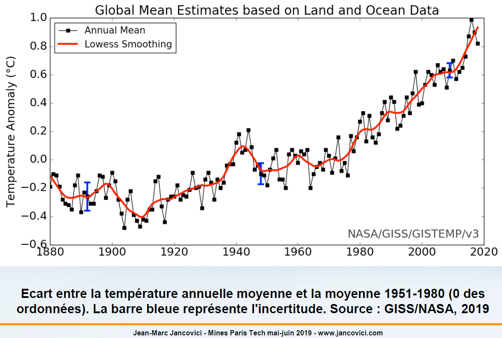
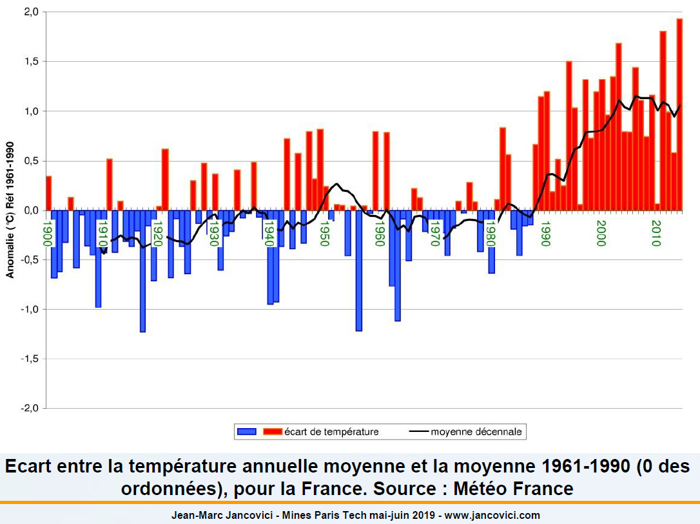
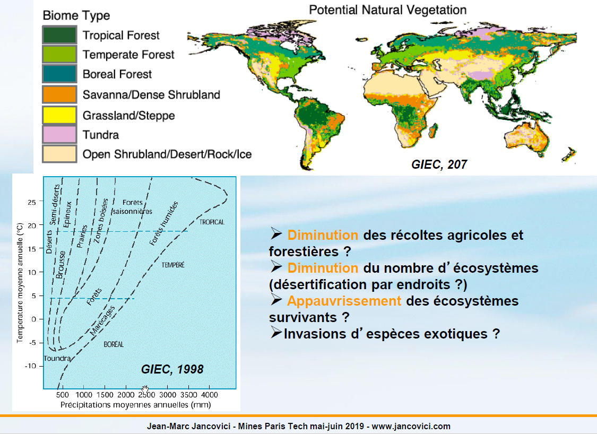
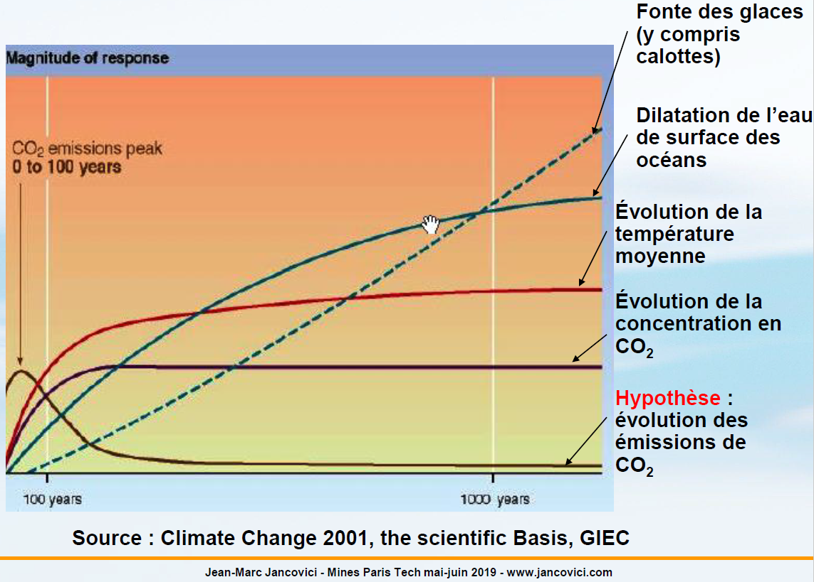

# ECC4 - Le Changement Climatique (2/2)

## Sommaire

[I - Aérosols](#aerosols)

On aurait pu intituler cette session "Apocalypse Now". On va voir ici les conséquences du changement climatique. Enfin pas "now" tout de suite, il y en a une partie qui vont attendre un peu. Dans le cours précédent, on a vu la dynamique à l'oeuvre dans ce qu'on appelle le changement climatique. Il y a une chose dont on a pas tout a fait le tour d'horizon de la dernière fois parce que dans les substances que l'Homme met dans l'atmosphère, il y a certes les gaz à effet de serre dont on a longuement parlé mais il y a également une autre catégorie de substance que les Hommes mettent dans l'atmosphère qui s'appelle des aérosols et des précurseurs d'aérosols.

##  Aérosols

Un aérosol, en langage physique, c'est tout simplement une suspension dans l'air de particule liquide ou solide. Tout les gens qui ont déjà passer un balai, on créer à cette occasion un aérosol, une suspension dans l'air de particule solide. Dans les éléments que l'Homme met dans l'atmosphère et qui peuvent créer des suspensions dans l'air, on a en fait à la fois des éléments qui sont émit directement sous forme de liquide ou de solide qui vont ensuite créer des suspensions (par exmple la suit, une suspension dans l'air de particules de carbonne) et on a des substances qui vont créer des aérosols une fois dans l'air, c'est émit sous forme gazeux et c'est une fois dans l'air qu'il se passe une réaction qui va transformer les substances chimiques en particules solide ou liquide. La dedans, on a une catégorie très importante qui est le dioxyde de souffre ($SO_2$) qui une fois dans l'atmosphère va créer des particules de sulfates qui sont des particules brillante et particulièrement réfléchissante pour la lumière solaire. Il y a donc cette particularité par exemple que les carburants souffré qui sont utilisé par la marine marchande on a court terme un effet refroidissant qui est plus important que l'effet réchauffant, cela est vrai uniquement a court terme puisque les aérosols finissent par être épuré de l'atmosphère notamment par les précipitations; par exemple pour les aérosols souffré, ca finit par donner des pluies acides (le sulfate se dissout dans l'eau et ca fait un peu d'acide sulfurique qu'on aime beaucoup une fois que ca arrive par terre).

Un autre effet important des aérosols, c'est que ces petites particules liquides ou solides peuvent servir de noyau de nucléation et favorisé la condensation de la vapeur d'eau pour former des nuages. On s'est rendu notamment qu'au dessus des zones très industrialisé, les nuages était formé de particule un peu plus fine et qui précipité un peu moins facilement, donc ca a un effet pas nécessairement sur la couverture nuageuse mais sur la tenue de cette couverture nuageuse. Les émissions humaines peuvent donc également modifié la nature des nuages que nous allons trouver au-dessus de nos tête. Quand les particules émises sont noires (e.g. la suie), évidemment, ca intensifie le réchauffement puisque ca augmente la quantité de rayonnement solaire absorbé, par contre quand les particules sont brillantes (e.g. les sulfates), c'est l'inverse, ca va augmenter l'albédo et donc diminuer la quantité de rayonnement solaire absorbé par la surface. Donc ces aérosols, il peuvent avoir un effet réchauffant ou refroidissant en fonction de leur nature, mais globalement, il partage tous la caractéristique d'être des espèces à durée de vie courte, qui vont avoir une influence sur les échanges d'énergie dans l'atmosphère qui sont des effets à raisonnablement court terme.

Sur la figure, on a un panorama des différentes substances qui sont émises dans l'atmosphère et qui on un effet sur la réflection du rayonnement solaire, essentiellement un effet refroidissant de court terme sauf pour la suie (soot ou black carbon en anglais).

## Bilan radiatif

Ce graphique que l'on trouve dans à peut prêt toute les éditions des rapports du GIEC, fait un bilan de l'ensemble des effets réchauffant et refroidissant de toutes les substances que l'humanité émet dans l'atmosphère. L'unité qu'on utilise pour faire le bilan radiatif de l'atmosphère c'est des Watts par mètre carré (W/m²); on aurait pu utiliser des watts tout court puisque l'atmosphère a une surface de contact avec le sol qui est donné, qui est connue (la surface de la Terre), mais en l'occurence, on préfère plutôt que de se balader avec des multiples des watts (e.g. $10^12$), on préfère raisonner en terme de W/m². L'ordre de grandeur du rayonnement solaire qui parvient au sol, c'est un peu plus de 200W/m². L'ordre de grandeur de l'effet de serre naturel, c'est environ 170W/m² et l'ordre de grandeur de l'effet de serre additionnel, c'est environ 2 à 3 W/m² si on fait prend en compte les effets plus et moins au total. Sur ce graphique, on voit les effets plus (notamment les gaz à effet de serre à longue durée de vie), un ensemble d'effet un peu plus ou un peu moins (Ozone, Albedo, etc.), puis en fin de graphique, la résultante avec la barre d'erreur qui vient surtout de la partie aérosol. Donc l'effet global de l'Homme sur les échanges d'énergie entre l'atmosphère et la surface de la Terre, c'est bien un effet de forcage positif (on rajoute de l'énergie), mais on a dans cette histoire les aérosols qui ont un effet négatifs, mais avec une ampleur mal évalués pour un certain nombre d'entre eux.

## Simulation climatique

Une fois qu'on sait qu'on a des effets réchauffant et refroidissant, on va voir maintenant, la logique d'une simulation climatique. Une simulation climatique demande de mettre en entrée deux choses qui sont : la représentation du système physique (i.e. un modèle de climat) et l'hypothèse avec laquelle on va perturber le système physique (i.e. des émissions). Historiquement, le cheminement qui était présenter était le suivant : on fait une hypothèse sur les émissions de gaz à effet de serre, cette hypothèse est elle même conditionnée par des hypothèses économique et autres (population, etc.) et ca conduit à avoir des trajectoires possibles en ce qui concerne les émissions futures. Dans le scénario d'émission ainsi fait, les émissions résultent de l'économie qui appelle de l'énergie, et donc par rapport a ce qu'on a vu au premier cours, il y a une inversion de causalité dans la façon de faire le scénario puisque normalement, on a de l'énergie et ca nous fait à la fois des émissions et de l'économie. La véritable hypothèse d'entrée, c'est pas l'économie qui appelle l'énergie, c'est l'énergie qui par ailleurs fait de l'économie et des émissions. Donc on devrait avoir deux sorties d'une même entrée qui sont le PIB et les émissions et non pas les émissions comme sortie du PIB. Il n'empêche que les scénarios d'émissions sont fait par des économistes, qui eux inverse le facteur limitant et qui nous disent il y a un PIB, et ce PIB appelle de l'énergie.

On a des scénarios d'émission, ces émissions montent et descendent, c'est des hypothèses par principe. Une fois qu'on a les émissions, on fait rentrer ca par un premier étage de modélisation dans laquelle on a des évolutions de la concentration en GES. En effet, le vrai forcage du climat c'est l'évolution de la concentration en GES; si on a des émissions qui augmentent et que dans le même temps, les puits augmentent, notre concentration ne bouge pas et donc il n'y a pas de forcage du système climatique; pour qu'il y est un forcage du système climatique, il faut que ce soit l'épaisseur de la couverture (i.e. la concentration) qui augmente. Aujourd'hui dans les rapport qui sont présentés par le GIEC, ce qu'on a c'est directement des évolutions sur la concentration, donc quand on voit écrit RCP quelque part maintenant, dans les documents scientifique qui parle de simulation climatique, ca veut dire Representative Concentration Pathway, et donc c'est directement des hypothèse qui sont fait sur l'évolution de la concentration, et de la, on dérive les scénarios d'émissions possibles. Cette évolution de la concentration, on va donc la donner à manger à un modèle de climat et ce modèle de climat va faire aïe plus ou moins fort et il va nous dire comment il fait aïe; donc il va nous dire ca chauffe, ca brule ici, ca se refroidit la, ca fait mal, ici on se prend une inondation, ici un ouragan, etc. Le modèle de climat va nous dire ce qu'il voit dans l'évolution du système climatique.

Dans les modèles les plus avancés, maintenant, on a une rétroaction entre la concentration et le modèle de climat. Par exemple, si on a un climat qui dérive de manière trop rapide et des ecosystèmes qui ne peuvent pas suivre, une partie des puits à CO2 s'affaiblissent, les eco-système meurent, on a moins de photo-synthèse, le CO2 est moins bien reprit de l'atmosphère, et du coup à émissions identique, on a la concentration qui augmente plus vite. Ces phénomènes d'asservissement sont prit en compte dans les modèles les plus récents. Par contre, ce que même les modèles les plus récents ne prennent pas en compte et ne prendront probablement jamais en compte, même ce qui prétendent faire du couplage avec l'économie, c'est la rétroaction sur les hypothèses d'entrée; c'est à dire qu'il n'y a pas un modèle qui nous dit : la le système climatique a dérivé tellement vite, que c'est pas compatible avec le fait qu'on maintiennent le PIB actuelle. Avec donc cette particularité, les simulations qui nous donnent les résultats les plus désagréables en ce qui concernent le réchauffement climatique vont avec les scénarios d'émissions les plus importants qui dans la façon dont ils sont rédigés aujourd'hui, vont aussi avec l'économie qui se porte le mieux. Donc on a quelque chose d'un peu étonnant, qui est que quelque part que plus le système climatique se dérègle, mieux l'économie se porte. C'est ca qu'on a en même temps, chronologiquement, dans la façon dont sont faite aujourd'hui les simulations. Il faut les émissions les plus importantes, donc l'économie dans les histoires racontées qui va le mieux pour que le climat se dérègle le plus. C'est une autre manière de dire que le climat ne peut jamais, dans la façon dont les simulations sont fait, portée atteinte au système économique, par construction.

Ce que seront les émissions futures, c'est évidemment impossible à prédire. On ne sait pas prédire combien il y aura d'Hommes dans 40 ans, on ne sait pas prédire combien il y aura de pétrole, de gaz et de charbon par personne, et on ne sait pas prédire combien les gens mangeront de viande par personne. Tout ce qu'on sait dire c'est que si c'est extrêmement différent de ce qui se passe aujourd'hui, c'est qu'il y aura déjà eu une catastrophe qui se sera chargé de réguler rapidement le système. C'est la seule chose qu'on sait dire, mais sinon, on ne sait pas le prédire. Ce que les gens qui font des simulations font, c'est que comme il ne savent pas prédire, il font des scénarios et donc il prennent plusieurs possibilités. Dans ce qu'on va voir à partir de maintenant, les résultats seront toujours sous condition de l'hypothèse qu'on a prit en entrée. Quelque chose d'essentielle est qu'il faut bien comprendre que les résultats que l'on va voir à partir de maintenant sont toujours sous condition des émissions. Du coup, une des raisons pour lesquelles il est impossible de prévoir de manière exacte les risques du changement climatique, c'est qu'il est impossible de prévoir de manière exacte ce que seront les émissions. Comme on ne peut pas prévoir les émissions, on ne pourrat jamais prévoir de manière exacte les conséquences.

Voici déjà ce que donne une mise en perspective du premier étage de la modélisation, c'est à dire passer des émissions à la concentration. Encore une fois maintenant, on fait le chemin à l'envers : on a des RCP, et de la, on dérive les trajectoires possibles sur les émissions; c'est comme cela que ca se fait aujourd'hui. On a ici donc une mise en perspective de la concentration de CO2 dans l'air, celle que l'on avait avant que nous commencions à faire joujou avec les moteurs à combustion interne et les machines à vapeur; celle qui a commencer à se déformer jusqu'à la fin du XXé siècle; et enfin les évolutions possibles au cours du XXIé siècle qui sont très différentes en fonction des scénarios d'émissions. Le scénario bas, jusqu'à maintenant, est prit ici comme des émissions qui reste constante. Le scénario du 1.5, en gros, c'est ce qu'on à déjà émis, c'est pas les émissions qui reste constante mais les émissions qui deviennent nul demain matin. On a des scénarios pour des émissions qui reste constante jusqu'à des émissions qui sont très fortement augmentées.

Jusqu'à maintenant, JMJ avait coutume d'appeller cela le "scénario polonais de l'an 2000" parce que le polonais est l'européen qui se repose encore aujourd'hui le plus sur le charbon en proportion, or ce qui reste à extraire du sous-sol c'est avant tout du charbon, et par ailleurs de l'an 2000, parce que ce scénario correspond à effectivement la consommation à 10 Milliards de terriens qui utiliserait par personne la même quantité d'énergie qu'un polonais de l'an 2000. Cela permet un peu de se figurer en terme socio-économique ce que signifie un tel scénario d'émission; ca veut donc juste dire une humanité de 10 Milliards d'individus qui considèrent que ce qui est acceptable, ce qui est normal, ce qui est standard, c'est de vivre comme un polonais de l'an 2000. Si on a cela, à la fois en terme de consommation d'énergie et de performance technique, à ce moment, on arrive à un scénario d'émission qui nous donne cette concentration en CO2 à la fin du XXIé siècle. Ce scénario permet que comme nous on a encore aujourd'hui un niveau de vie qui est supérieur à celui d'un polonais, ce qui est dit c'est que si 10 Milliards de terriens veulent vivre un peu moins bien que nous, avec le niveau de confort matérielle que l'on a aujourd'hui, voila ce que ca donne comme niveau d'émissions et donc comme niveau de concentration.

Une fois qu'on a une évolution de la concentration en CO2, on la met dans un modèle de climat. Un modèle de climat c'est une planète virtuelle, un modèle numérique (i.e. une représentation numérique de la planète) qui fonctionne sur ordinateur et qui est donc un modèle discret par construction, il y a des mailles (même très puissant, les ordinateurs n'aiment pas l'infini; tout ce qu'il savent faire, c'est gérer un nombre finit d'opération ou un nombre finit de points). La façon dont ca fonctionne, c'est qu'on découpe tout les compartiments fluide de la planète en boîte à chassure (i.e. en quasi-parrallépipède, un peu courbe), typiquement la longueur sur l'horizontal c'est quelques dizaines à centaines de kilomètres, par contre l'épaisseur sur la verticale c'est plutôt de l'ordre de la centaine de mètres. On va découper l'atmosphère et l'océan en boite à chaussure et on va, en ce qui concerne le sol, le représenter par des mailles, la aussi, qui ont des propriétés d'échange avec l'atmosphère selon qu'il s'agisse d'eau ou de terre, à l'évidence. Ces modèles ont était sophistiqué au cours du temps mais tous repose sur les équations de base de la physique. Une chose importante à savoir c'est que ce que l'on regarde avec ces modèles, c'est la façon dont ils convergent avec des concentrations en GES données et ca ne dépend pas de l'état initial avec lequel on les paramètres. Dit autrement, que la température moyenne l'année zéro soit 15, 16, ou 17 degrés, c'est pas le sujet, en fait ce qu'on va regarder c'est comment il converge au cours du temps avec ce qu'on leur a donné comme évolution sur la quantité de GES comprises dans l'atmosphère.

## Amélioration des modèles

Ces modèles se sont améliorés au cours du temps, en partie à mesure que la puissance informatique disponible augmente. Traditionnellement, les organismes météo font partie des acheteurs des super-calculateurs. En ce qui concerne les modèles de climat, il tourne avec une partie atmosphérique qui est exactement celle de la météo, c'est des mailles moins fines mais c'est les mêmes équation. Les quatres acronymes (ou sigles) que l'on a sur cette figure sont représentatifs des quatres premiers rapport d'évaluation du GIEC (F pour First Assessment Report, S pour second, T pour Third, et comme on avait déja utilisé F pour First, on utilise AR4 pour le quatrième rapport). Ce que l'on voit, c'est deux choses : d'abord que la taille de la maille à très nettement diminué; la deuxième chose que l'on voit c'est qu'il y a du relief qui est apparu. Initialement, le sol était plat, et ce qui était différencié, c'était l'eau et la terre, et sur la terre la végétation et la terre non recouverte mais ce n'était pas différencier au niveau du cycle du carbonne, c'était différencié au niveau de l'albédo surtout (i.e. pouvoir de réflection de la surface). On voit qu'avec le temps, on fait apparaitre du relief, c'est à dire qu'on fait apparaitre une capacité à différencié en altitude ce qui occupe une maille, si c'est de l'atmosphère ou si c'est du sol.

La deuxième chose qui a eu lieu en ce qui concerne les modèles, c'est qu'au fur et à mesure, ils se sont complexifiés en ce qui concerne les processus qui sont pris en compte. Au moment de la première génération de modèle, ils étaient essentiellement atmosphérique, et le reste des compartiments de la planète n'apparaissait pas, et donc les échanges avec l'océan était paramétrisé par exemple (i.e. il n'y avait pas de dynamique océanique, l'océan était vue comme une surface d'échange avec la planéte). Au fur et à mesure que les générations de modèles avancent, on se met à avoir de plus en plus de compartiment qui apparaissent (un océan, de la végétation, l'océan devient dynamique, les aérosols, etc.) et maintenant dans les modèles les plus récents on a l'essentiel de ce qui se passe sur la Terre (i.e. dans l'atmosphère et dans l'océan). On voit évidemment la couverture nuageuse qui est apparu, maintenant il y a de la chimie atmosphérique, on a le cycle du carbonne, etc. On a l'essentiel des grands processus qui sont représentés.

Quelque chose d'intéressant à noter soit dit en passant, c'est que l'amélioration de ces modèles a aucun moment n'a jamais changer fondamentalement les ordres de grandeur sur l'élévation de température qui résulte d'une augmentation donné de la concentration en CO2 dans l'atmosphère, tout simplement parce que cette élévation de température résulte au premier ordre de la quantité d'énergie supplémentaire qui est envoyé vers le sol, par un supplément d'effet de serre, et que cela repose sur un processus physique assez bien compris d'absorption / ré-émission par un gaz, et qu'une fois qu'on a la quantité d'énergie totale qui retourne au sol et qu'on sait faire le split entre ce qui est absorbé par l'océan et ce qui est absorbé par le sol, au premier ordre on a assez facilement notre élévation de température du sol. Donc la sophistication des modèles permet de mieux approcher un certain nombre de phénomènes locaux notamment, elle permet d'améliorer la résolution spatiale en ce qui concerne ce qui va se passer, par contre elle n'a pas changer au premier ordre les conséquences globales de ce qui va se passer et notamment l'élévation de la température moyenne, qui représente l'élévation de la quantité d'énergie contenu dans le système.

## Test des modèles

Les modèles climatiques, comme tout les modèles quand ils sont utilisés par des gens qui savent a peut prêt ce qu'ils font, la première chose qu'on fait quand on les a mis au point, c'est de les tester sur le passé. Quand on a un modèle, la première chose que l'on fait pour vérifier que ca marche, c'est de le confronter à ce qui c'est passer auparavant. Soit dit en passant, il n'y a pas un seul modèle économique qui passe la rampe de ce genre de truck, sauf si on modifie les paramètres années après années pour être sûr que ca colle, mais sinon, ca ne marche pas. En ce qui concerne les modèles physique, c'est exactement comme ca qu'ils sont calibrés, et donc c'est exactement comme ca qu'on calibre les modèles de climat.

Ce que l'on voit sur la figure (comme dans tout graphique du GIEC, il y a énormément d'information), c'est la façon dont un ensemble de modèle (environ une vingtaine ici) se confronte à ce qui a était observer en ce qui concerne l'évolution des températures. En ce qui concerne l'évolution des températures, on a sur chacun des graphiques qui représente soit une zone (en haut), soit l'ensemble des terres émergés et des océans (en bas), ce que nous raconte les modèles quand on les laissent évoluer avec une évolution des GES qui a était ce qu'elle est (en rose), on a ce qu'on vraiment donner les relevés de température (en noir), et ce qu'on voit c'est qu'a quelques anomalies près (e.g. diagramme Global Ocean avant 1950), les modèles nous reproduisent assez bien la tendance générale sur la variation des températures sur la période. Les mêmes modélisateurs se sont amusés a regarder ce qu'aurait donner le modèle (qui reproduit ce qui c'est passer) si les émissions de GES n'avait pas augmenter; a ce moment ca nous donne l'enveloppe bleu. L'enveloppe bleu c'est l'enveloppe de toutes les simulations qui sont faite avec des modèles de climat, dans un monde virtuel ou les Hommes n'ont pas émit de GES. A ce moment, ce qu'on voit, c'est que globalement les températures reste à peut prêt constante, le système reste à peut prêt stable, alors que quand on prend en compte les émissions de GES, le système dérive. Ce genre de test est quelque chose qui est absolument indispensable pour accorder de la crédibilité à ces outils numériques pour ce qu'ils vont raconter pour plus tard.

On peut trouver sur Internet des simulations, la pour le coup en temps-réel de ces modèles de climat qui simule la Terre vue de l'atmosphère. Il y a une comparaison entre des images sattelites réel d'un côté et une représentation avec un modèle numérique de l'autre. Quand on compare les deux, en double-aveugle, en général, les gens ne savent pas dire lequel est lequel. Aujourd'hui, il y a également une qualité de représentation extrêmement fine en ce qui concerne la capacité de ces modèles à représenter visuellement le système.

## Résultats des modèles

Une fois qu'il ont était capable de retracer le passé, on va donc parler d'avenir avec ces modèles. Ce que l'on a ici, c'est a nouveau un graphique qui est issu de l'avant dernier gros rapport du GIEC (2007). Cependant, les informations n'ont pas tellement changé dans le dernier rapport. L'intérêt de ce graphique c'est que ca nous discrimine très précisément la manière dont la température peut évoluer en fonction du scénario d'émission. Ce que l'on voit ici, c'est l'évolution de la température sur le XXé siècle (on constate qu'on a déjà une fraction de degré de gagné) et la façon dont la température évolue à l'avenir en fonction des hypothèses qu'on fait sur les émissions de GES.

On ne le voit pas bien sur ce graphique, mais quand même, ce que l'on voit c'est que toutes les simulations pour l'avenir, dans les 10 ans même si on arrête les émissions et dans les 20 à 30 ans quelque soit le scénario d'émissions si on les augmente, la trajectoire est exactement la même. Donc en gros, ce qui va se passer en 2040 est totalement indépendant de ce que seront nos émissions à partir de maintenant. Ce qui va se passer après 2040, va commencer à être différencié en fonction de nos émissions; mais on voit que avant, il n'y a pas de différences entre les scénario d'émissions. Donc il y a une conséquence absolument majeure, c'est que dans cette histoire, en ce qui concerne l'atténuation du changement climatique, on travaille au mieux pour ces enfants; en ce qui concerne l'adaptation au changement climatique, la on travail clairement pour soi.

L'hypothèse la plus basse dans ces simulations, c'est "la concentration reste constante"; en gros les émissions se mettent à décroître très rapidement à partir de demain matin et deviennent nulle bien avant la fin du siècle; la effectivement on tient les 1.5°; on est pas parti pour le faire. Après on a un scénario dans lequel on garde des émissions constantes en gros; c'est un scénario dans lequel on gagne 2° par rapport à 1990, mais on en gagne déjà quasiment 3 par rapport à l'ère pré-industrielle. Ce que l'on voit en gris à droite, c'est l'enveloppe de toutes les simulations (de tous les modèles) pour le scnéario bleu. Dit autrement, les 20 modèles qui sont utilisés avec ce même scénario, le plus conservateur nous dit qu'on va garder 1° par rapport à 1990 et le plus pessimisste nous dit qu'on va gagner 3° par rapport à 1990. Ce que nous dit donc ce graphique, c'est qu'il reste une variabilité liée aux hypothèses qu'on a fait dans le modèle parce qu'entre tout les modèles, on a pas exactement les mêmes options qui sont prises pour la représentation d'un certain nombre de processus, ou plus exactement pour les valeurs prises pour les paramètres ou les condition aux limites d'un certain nombre de processus; parce qu'on a des choses qui reste paramétrisé la dedans, les paramètres on essaye de les ajuster en fonction des observation passés, c'est comme ca qu'on essaye de recalibrer le modèle en permanance. Donc en fonction du modèle qui est utilisé, on voit qu'on a comme même une barre d'erreur qui est de l'ordre de 2° sur l'élévation de température qu'on a à l'arrivé sur ce scnéario. On est pas tout à fait dans l'épaisseur du trait, puisque les conséquences liées au changement climatique sont pas du tout les mêmes à +1° et à +3°.

Le scénario intermédiaire ici est un scénario qui est considéré comme scénario "charbon haut", les émissions double. Et on voit de la même manière dans la version basse on est qu'à 1.5°, mais dans la version haute on est à plus de 4°. Très souvent, une erreur est faite en face de cette incertitude qui est de se dire que si il subsiste une grande incertitude sur le fait qu'on court un grand danger, à ce moment on va attendre d'en savoir plus pour être sûr que c'est vraiment un grand danger. On peut prendre le parrallèle suivant : si un de nos copain à un moment ou il a beaucoup bu nous demande de traverser les champs Elysée à 5 heures du matin les yeux bandés, il y a une grande incertitude sur le fait qu'on va mourrir ou pas, mais c'est pas complétement sûre qu'on va le fair. Donc en fait, une grande incertitude, c'est représentatif d'un grand risque. Si il y a une grande incertitude, ca veut dire qu'on n'est pas capable de donner une borne supérieur sur ce que l'on risque. Donc l'idée qu'une grande incertitude c'est une grande police d'assurance qui signifie qu'il est urgent de ne rien faire est l'exact inverse de la conclusion qu'il faut tirer : une grande incertitude, c'est un grand risque, c'est un très grand risque. Enfin le scénario "polonais" est un scénario qui peut nous emmener au-delà de 6° avec la génération de modèle qui était utiliser à cette époque là. Maintenant on a plutôt coutûme de dire que c'est plutôt 5° mais ca ne change pas beaucoup les conclusions qu'on va avoir dérrière. On comprend donc que l'on a une dispersion liée au modèle qu'on utilise pour un même scénario.

Pour un même modèle, on peut faire plusieurs simulations avec des petits changements de paramètres dans le modèle; évidemment à chaque fois ca va nous donner une valeur un peu différente. On va donc avoir une distribution des résultats et on va considérer que la valeur que l'on va retenir c'est le sommet de notre Gaussienne si jamais nos résultats sont distribués de façon a peut prêt normale. On peut aussi considérer que pour une famille de modèle, on va regarder les sommets des Gaussiennes pour chacun des modèles et faire une moyenne de tout ca et considérer que c'est ce qu'on va retenir comme valeur pour la simulation multi-modèle (ce qu'on appelle multi-ensemble en anglais). En fait, ce qu'il faut comprendre avec ces simulations, c'est que quand on nous dit que pour tel scénario d'émissions, le réchauffement qu'on obtient derrière est de tant, en fait il faut comprendre que se tant, c'est la valeur la plus probable d'une distribution qui ressemble à une normale. Donc ce n'est pas une façon de garantir que ca ne peut pas être plus.

## Seulement quelques degrés de plus

Ce qui est indispensable avec l'élévation de température que l'on va avoir, c'est de confronter cela au passé. Pourquoi ? Imaginons que l'on prenne un être vivant, et que sur cet être vivant on augmente sa température de 4°, est-ce ennuyeux ? Eh bien ca dépend; si on prend un poisson rouge (un animal a sang froid), en lui infligeant une élévation de température de 4°, il s'en fout complétement. Si on inflige a certain animaux une variation de leur température interne de 4°, ca leur fait ni chaud ni froid, donc c'est vraiment pas grave. Maintenant si on prend un animal à sang chaud, l'Homme par exemple, et qu'on lui inflige une variation de température interne de 4°, il suffit d'attendre un peu et il meurt. Donc 4° en plus, est-ce que c'est grave docteur ? Pour le système climatique la réponse est exactement la même, ca dépend de la variation spontannée du système quand il est livré à lui même. Si on réalise que le système livré à lui-même varie de 4° d'une semaine sur l'autre c'est vraiment pas grave que l'action des Hommes provoque un réchauffement de 4° puisque ca rentre dans la variabilité naturelle du système, donc on s'en fiche complétement. Par contre si la variabilité du système n'est pas de 4° tout les quatres matin, ca devient très ennuyeux puisque on inflige une déstabilisation qui est inédite et donc qui aura des conséquences qui seront inédites.

Pour répondre à la question en ce qui concerne le système climatique, il faut être capable de reconstituer la manière dont il a varier dans le passé. Il y a toute une discipline de la science qui s'appelle la paléo-climatologie qui sert à reconstituer les variations de température du passé. Il y a trois grandes familles de technique pour faire ca, et à chaque fois c'est la science du trou, il faut commencer par faire des trous. Une première manière de faire des trous, c'est de faire des trous dans les arbres et si possible dans des arbres très vieux. On va mesurer l'épaisseur et la dureté des cernes d'arbres qui s'aggrége année après année dans le tronc. L'age du plus vieil arbre vivant aujourd'hui est d'a peut prêt 7000 ans; se sont des arbres qui vivent en général dans des zones qui sont extrêmement limite pour la vie, donc comme la neige en Antarctique ca croissent extrêmement peu tout les ans et on a un métabolisme très très ralentie. Dans ce tronc on peut faire des trous et on a donc 7000 ans d'archives climatiques, on a pas des archives globales mais une archive climatique la ou pousse l'arbre. Par ailleur l'arbre ne pousse pas en Hiver et donc à partir de cette archive climatique, on est capable de reconstituer les températures et les précipitations de la saison de pousse (i.e. Printemps / Eté). Mais de la on a déjà un proxy pour voir comment évolue le système climatique dans son ensemble sur l'année. Les arbres, il n'ent poussent pas beaucoup sur l'eau, donc cette méthode la marche bien pour reconstituer les températures terrestres. Dès qu'on a accès à des arbres ou à des tronc d'arbres fossilisés que l'on est capable de daté correctement, on a accès à une technique qui s'appelle la dendrochronologie qui permet de reconstituer les températures du passé.

A nouveau ces températures du passé se reconstitue avec une modélisation qui permet de passé des données d'observation (épaisseur et dureté des cernes d'abres) à une température existante. Les modèles qui permettent de faire ca on a nouveau un paramétrage propre qui fait que chaque chercheur qui fait ce genre d'analyse publie ses propres résultats. Sur la figure, on a une compilation qui a était publié dans le rapport du GIEC de 2007 dans laquelle des équipes ont chacun publié une reconstitution des températures de l'emisphère nord (le plus équipé en terre émergé) sur le dernier millénaire. Ce que l'on voit que sur le dernier millénaire, il y a deux points de covergence dans ces analyses, la première c'est que tous disent qu'a peut prêt aux alentours de l'an 1000, il a fait un peu plus chaud qu'au reste du millénaire, cette période est connu sous le nom de l'optimum médieval. Dans les conséquences qu'on a eu à ce moment là, c'est que les vikings ont sorti leur prospectus publicitaire et on dit "allez donc au Groenland, c'est tout vert", et en fait Groenland vient de Greenland (terre verte). L'histoire qui est souvent une histoire enfourché par les climatosceptiques pour dire "regarder le climat varrie naturellement, il y a eu un moment ou le Groenland était tout vert", évidemment que le Groenland était pas tout vert; il y a mille ans il y avait la même calotte glaciaire qu'aujourd'hui sur le Groenland. Par contre, on a une frange du Groenland ou il n'y a pas de glace, c'est la soit dit en passant qu'habite quelques inuit, esquimaux, etc, on a quelque banc rocheux. Et sur ces endroits qui était dépourvu de glace il y a mille comme aujourd'hui, la saison de pousse de l'herbe était un peu plus longue qu'aujourd'hui. Et donc on soupsonne les vikings de s'être débarasser de quelques personnes qu'il n'avaient plus envie de voir en les expediant la bas avec troupeaux, femmes et enfants. On peut lire l'histoire dans le bouquin de Jared Diamond *Collapse* ("il y a un certain nombre de trucks discutables dans son bouquin mais ca par contre c'est assez bien raconté, je pense que c'est assez juste") selon laquelle on a envoyé 5.000 vikings la bas avec leur troupeau, et au moment ou le climat s'est refroidit après l'optimum médieval, la saison de pousse a diminuée, les vaches sont mortes, et les vikings avec.

Les analyses convergent pour nous dire cela [l'optimum médieval], on voit qu'après ca se refroidit et on trouve à ce qu'on appelle le "petit age glaciaire" en Europe. Les canaux de Bruges gèle totalement l'Hiver, on se pêle de froid, la marquise de Sévigné allume du feu au mois d'aout, et c'est soit dit en passant a ce moment la qu'à lieu la Révolution Française. La Révolution française est née après une grande famine en France qui a fait entre 500.000 morts et 1 million de mort. C'est une époque ou les récoltes ne sont pas bonnes et donc ca déclenche des troubles parce que les gens n'aiment pas avoir le ventre vide. Ce que l'on voit également en troisième convergence, c'est qu'à partir du début de l'époque industrielle, toutes les analyses nous disent que ca se met à monter rapidement. Donc la première conclusion qu'ona arrive a tirer de cette analyse à l'échelle du millénaire, c'est qu'on est déjà ici dans un déplacement de température qui est totalement hors tendance, qui va beaucoup plus vite que toute tendance que l'on peut dégager la-dessus.

Après on peut remonter plus loin dans le temps. On peut remonter sur ce graphique jusqu'à 60 millions d'années; l'instant passé est à droite et l'instant présent à gauche. Si on regarde à 60 millions d'années, ce qu'on voit c'est que depuis cette époque est globalement un lent refroidissement du système climatique qui est notamment aller avec une diminution de la quantité de CO2 dans l'atmosphère. A des échelles de temps très très longue, effectivement, le climat a plutôt eu tendance a se refroidir. Ce qu'on voit également c'est qu'il y a longtemp le climat a pu être quasiment 10 degré plus chaud qu'aujourd'hui. Donc le fait que le climat soit plus chaud qu'aujourd'hui n'est pas nécessairement quelque chose qui est une première dans l'histoire planétaire, par contre ce qui est une première dans l'histoire planétaire, et c'est ce qu'on va détailler à partir de maintenant, c'est une variation de cette ampleur appliqué à une Humanité sédentaire de 8 milliards de bons Hommes. Ca c'est nouveau. Et si il y a eu des variations de grandes ampleurs dans le passé, a aucun moment elle n'ont empécher notre espèce de se développer, puisqu'on est la. Par contre entre ne pas porter atteinte à l'espèce, et ne porter atteinte à aucun représentant de l'espèce, il y a une petite différence. Dit autrement si le changement climatique en cours ne laisse que 5 millions de bon hommes survivant, c'est largement assez pour assurer la pérpétuation de l'espéce, ca ne pose pas de problème. Donc le sujet qu'on va voir à partir de maintenant, c'est pas tant "Est-ce que les Hommes vont passez à travers" (pour ca on a déjà la réponse, la réponse est OUI), c'est avoir une idée de dans quelles conditions, et combien d'entre eux; cela reste des questions ouvertes.

On va introduire maintenant une variation de température plus récente que celle qui s'est produite il y a 65 millions d'années avec ces cartes qui représente l'Europe. On a ici une représentation schématique des éco-systèmes installés qui sont donc le reflet du système climatique. Les eco-systèmes installés aujourd'hui (si on ne les supprime pas pour faire essentiellement des champs, des routes, des voies de chemin de fer, des usines, etc.) est composé en grande partie de forêts. Ca veut dire que le climat est suffisament humide pour qu'il pousse des grosses espèces végétales, et que par ailleurs, il fait ni trop froid ni trop chaud pour ne pas que le métabolisme de ces espèces soit génés. Il y a 20.000 ans, dans les évolutions du quaternaire, nous sommes au coeur de la dernière glaciaire, il fait beaucoup plus froid qu'aujourd'hui, et ainsi, le paysage de la planète et de l'Europe n'est pas du tout le même. La première chose que l'on voit ici, c'est qu'il n'y a pas de suédois, pas de danois, pas de finlandais, pas de nord-allemand et il n'y a pas d'écossais; tout ces braves gens sont sous la glace. On a une énorme calotte de 3 km d'épaisseur qui recouvre la totalité de la Scandinavie. Il n'y a pas non plus de québécois, puisque la totalité du Canada est aussi sous la glace. On a une énorme calotte de glace encore plus grosse que celle qui est posée sur la Scandinavie qui est posée sur le Canada. Cette glace est constitué d'eau et cette eau il a bien fallu la prendre quelque part. Il n'y a manifestement pas assez d'eau ni dans les lacs, ni dans les rivières, ni dans l'atmosphère pour faire autant de glace, donc le seul endroit ou l'on peut prendre toute cette eau pour faire toute cette glace, c'est la mer, et comme la mer est une grande baignoiree dont le fond n'a pas varié, si l'on prend de l'eau pour faire toute cette glace, le niveau de l'eau baisse et le niveau de l'eau est plus bas de 120 mètres, et donc il n'y a pas de Manche (le point bas de la Manche aujourd'hui c'est 114 mètres). On peut rentrer dans la grotte Cosquer à pied sec, une grotte qui se trouve en Méditerannée dont l'entrée est aujourd'hui immergés; il faut descendre à 30 mètres sous le niveau de l'eau pour rentrée dans la grotte; il y a un boyau ascendant, la grotte est préservé et on y trouve à l'intérieur des peintures (comme à Lascaux). A l'époque ou elle était habitée, on pouvait y rentrer à pieds secs, et donc ca veut dire que le niveau de l'eau était beaucoup plus bas. Le climat est beaucoup plus froid, donc il y a beaucoup moins d'évaporation, donc il est beaucoup plus sec. Dans ce climat beaucoup plus froid et beaucoup plus sec, la végétation installée en Europe ressemble à ce qu'on a aujourd'hui au nord de la Sibérie, c'est pas très gras (on a pas les chatoyant champs de blé ni la chatoyante forêt de Fontaibleau d'aujourd'hui). Dans ce genre d'éco-système, on arrive à faire vivre 100.000 bons hommes, c'est à dire 100.000 animaux en bouts de chaîne alimentaire; c'est à peut prêt la population humaine à l'époque en France, soit même pas le nombre d'étudiant en grandes écoles. Quand on passe du paysage de gauche au paysage de droite, on a un réchauffement climatique; ce réchauffement c'est 5 degrés en 5 à 10.000 ans. Donc on a un précédent historique de quelques degrés de réchauffement en valeur absolue, et on voit le genre de chose que ca produit en ce qui concerne le paysage. Une autre manière de dire ca, c'est que la variabilité naturelle du système, n'est pas du tout à l'échelle de ce que nous sommes en train de déclencher aujourd'hui. Le bon parallèle, c'est pas le poisson rouge qui va résister à tout, c'est bien nous qui ne résistons pas à une élévation de notre température interne pourvu qu'on la prolonge suffisament longtemps, c'est cela le bon parallèle.

Si on met en perspective maintenant ce qui c'est passé au dernier millénaire, ce qui c'est passé au dernier siècle, et ce qui pourrait se passer à l'avenir, voila a quoi ca ressemble. On a sur cette figure une reconstitution à partir de la dendrochronologie essentiellement de la température du siècle passé. C'est essentiellement fait avec des analyses. A partir de 1860, on a une mesure direct de l'élévation de température de la planète. L'invention du thermomètre date de 1492, sauf qu'en 1492, on a un thermomètre et on ne peut pas mesurer la température en tout point du globe avec un thermomètre. Il en faut beaucoup beaucoup beaucoup des thermomètre pour mesurer la température en tout point du globe. Par ailleurs la surface terrestre est en majorité constituée d'eau et on a pas beaucoup de villes et de champs à la surface de l'océan, on a donc pas une grosse population et donc beaucoup de thermomètre à la surface de l'océan. On a quand même des thermomètre à la surface de l'océan sur les bateaux. Depuis qu'on a des moteurs et des machines à vapeur, on a des thermomètres en entrée de prise d'eau pour mesurer la température de l'eau parce que ca nous sert à régler les machines. Même avant, il arrivé qu'on fasse des prélévements, sauf que ces prélévements ne sont fait que sur les routes commerciales puisque ces bateaux se baladent pour transporter des marchandises et donc il faut attendre qu'on est suffisament de route commerciale à la surface de la planète pour qu'on considère que les températures mésurées dans l'océan sont représentatives de la températures de l'eau. Avoir suffisament de thermomètre sur les terres émergés et suffisament de thermomètres sur les bateaux qui se baladent pour considérer qu'on a quelque chose qui commence à représenter à un échantillonage représentatif, on considère qu'avant 1860 ce n'est pas le cas. A partir de 1860, on est capable de proposer une mesure instrumentale de la température planétaire. On a donc sur cette figure une mise en perspective de 3 températures mesurés de manière différente et à des époques différentes : dans la première partie (avant 1860) par des analyses; entre 1860 et aujourd'hui, instrumentale; et pour le future, modèlisé, plus de thermomètre, on rentre dans la modélisation de ce qui ce passe plus tard. Ce que l'on voit sans l'ombre d'une discussion possible sur ce graphique, c'est que la variation de température à venir est quelque chose qui est sans commune mesure quelque soit le scénario retenu, avec la variabilité naturelle du système. Donc même à 2 degrés, nous allons voir une quantité considérable de disfonctionnement dans le système qui n'existait pas jusqu'à maintenant.

Sur cette figure, on voit la courbe qui nous donne la variation du système depuis le dernier maximum glaciaire. On y voit la reconstruction de la température du passé avec des analyses. Quand on est à l'échelle de la dizaine de milliers d'années, ce n'est plus les cernes d'arbres qu'on utilise, c'est la reconstruction avec les isotopes de l'oxygène et de l'hydrogène dans les calottes glaciaires (cf. cours 3). On voit que la température au début de l'Holocène était légérement supérieur a ce qu'elle était derrière (courbe bleu). On voit enfin à l'échelle ce qu'on a déjà fait aujourd'hui, et ce qu'on pourrait faire dans le siècle qui vient. On voit que manifestement l'image du mur est assez bonne. Une élévation de quelques degrés en un siècle, ca ressemble plus au mur qu'à une promenade de santé. Ca va vraiment provoqué des disfonctionnement majeur un peu partout dans le système.

Le forcage radiatif du rayonnement solaire est d'environ 230 W/m², l'effet de serre, c'est plutôt 170 W/m², mais tout cela est du même ordre de grandeur. Le forcage radiatif anthropique est aujourd'hui d'environ 2,5 W/m², ca augmente avec le temps, le nombre derrière les RCP représente le forcage radiatif en 2100 (e.g. le RCP4.5, c'est 4.5 W/m² en 2100). Cela suffit pour décrire le réchauffement qu'on va connaître. Par ailleurs, en ordre de grandeur, 1% d'augmentation de l'effet de serre, c'est 1 degré en plus, en gros; 4% d'augmentation, c'est 4 degré en plus, en gros, car le processus n'est pas du tout linéaire, mais ce sont des ordres de grandeur.

Quelque chose qui est important à garder en mémoire, c'est que cette élévation de température au sol, déjà en cours et qui va s'accélérer, fait de temps en temps une petite pause. Cette petite pause ne remet pas en cause ce qui se passe, tout simplement parce qu'il y a une petite illusion d'optique dans cette histoire. Beaucoup de gens considère que ce qui est représentatif de ce qui se passe en ce moment c'est l'élévation de température de l'atmosphère, alors en fait, l'élévation de température de l'atmosphère est la partie émergé de l'iceberg. Parce que ce que nous montre ce diagramme c'est ou va le supplément d'énergie qui vient du supplément d'effet de serre. Ce suplément d'énergie, ce qu'on voit sur cette image, c'est que plus de 90% réchauffe non pas l'atmosphère mais l'océan. C'est l'océan qui pilotte l'inertie du système à l'échelle de temps qui nous intéresse ici. Or il suffit que le switch qui répartie l'énergie entre l'océan et l'atmosphère change un peu une année donné; par exemple, on a une circulation qui enfouit la chaleur dans l'océan, il suffit qu'elle soit un peu plus active, ou au contraire un peu plus faible, et à ce moment, on va avoir ou bien une accélération de la température de surface ou au contraire un ralentissement de l'élévation, voir un léger refroidissement de la température de surface. La variabilité de la température atmosphérique dépend notamment de ce processus d'enfouissement de chaleur dans l'océan qui peut connaitre des petites variations à cause de petite variation de la circulation océanique. Ca ne fait pas obstacle au fait que globalement, le système emmagasine de plus en plus d'énergie. Mais si cette énergie est dans une couche intermédiaire de l'océan par exemple on en voit pas la traduction dans la température de surface. Dépend de la circulation océanique à large échelle; on a des processus convectif dans l'océan et quand l'eau qui était en surface passe en profondeur, elle emporte avec elle la chaleur et elle est remplacé en surface par de l'eau un peu plus froide qui vient des profondeurs. Donc il suffit que ce mouvement s'accélère ou ralentisse un peu et en gros on a un processus d'enfouissement de la chaleur de la surface vers les profondeurs qui s'accélèrent ou au contraire ralentit un peu. C'est un élément qui pilote la température de surface.

## Impacts du changement climatique

On va maintenant commencer à regarder les impacts de manière un peu plus détaillé. Deux choses qu'il faut garder en tête : (1) L'ampleur des impacts dépends de l'ampleur des émissions, donc tout ce qu'on va voir à partir de maintenant est qualitatif, semi-quantifié pour un certain nombre de conséquences (i.e. des gens font tourner des modèles et disent "tel impact on est capable de le mettre dans tel fourchette alors que si les émissions sont plus faibles, tel impact on le mettrait plutôt dans tel fourchette"); quelques exemples d'impacts étant :

* Impacts sur les écosystèmes (affaiblissements, disparitions, déplacements)
* Augmentation du niveau des océans
* Impacts sur les courants marins et donc sur les climats régionaux
* Modification des phénomènes extrêmes (dont pics de chaleur, précipitations intenses, sécheresses, etc.)
* Augmentation du « trou d'ozone »
* Impacts directs sur la santé humaine (déplacement des zones endémiques pour les maladies, conséquences des phénomènes brusques, etc.)
* Et encore acidification de l'océan, risques géopolitiques, etc.

(2) et surtout, ce qu'on va voir à partir de maintenant, c'est illustratif, c'est des choses sur lesquelles ont a déjà des indications, mais il y a plein d'éléments sur lesquelles on va "apprendre en marchant", c'est à dire qu'on se rendra compte une fois que c'est trop tard qu'il y tel coût qu'on avait pas vu venir qui est en train de se mettre en route, et ca il va y en avoir de plus en plus parce que le système est beaucoup trop complexe, trop chaotique, et trop fortement non-linéaire pour qu'on soit capable d'identifier risque par risque, géographie par géographie et date par date, ce qui pourrait se passer, ca ca restera à jamais impossible. Par exemple, il y a une éxpérience qu'on a fait souvent 3, 4, 5 milliards de fois chez les Hommes qu'est se marier, et pour autant, un couple qui se marie aujourd'hui, on est pas foutu de savoir ou il en sera dans 30 ans, alors on imagine bien qu'une éxpérience qu'on fait pour la première fois et qui est aussi complexe que celle la, il est totalement illusoire de prétendre dire à l'avance la totalité des conséquences que ca aura dans quelques dizaines d'années. Donc on peut avoir une idée (comme pour le couple, je sais pas si il sauront encore ensemble, il auront toujours deux bras et deux jambes sauf si on leur en a coupé un en cas d'accident, mais ils en auront pas 4), certaines choses qu'on est capable de dire, et puis il y a des choses qu'on est pas capable de dire (si notre couple aura 2, 3, 0 enfants, si ils seront toujours ensemble, si il habiteront ici ou là). Pour le climat c'est pareil ou pire, puisque c'est une expérience qu'on fait pour la première fois. Des expériences qu'on fait pour la première fois, c'est très très rare que ca donne des résultats qu'on est capable de prédire à l'avance, partout et tout le temps.

## Températures

Une fois dit cela, il y a comme même un certain nombre de constantes dans cette affaire. La première c'est que le réchauffement aura une structure spatiale qui est déjà a peut prêt connu. Ce que l'ont voit sur cette figure (DJF : Décembre, Janvier, Février; JJA : juin, juillet et aout) c'est que quelque soit la saison, l'élévation de température est plus marqué sur les terres émergés qu'elle ne l'est sur les océans parce que les océans ont plus d'inertie thermique. La deuxième chose que l'on voit, c'est que l'élévation de température est plus marqué dans les hautes lattitudes nord l'hiver que l'été; dit autrement l'élévation de température ira plus vite l'hiver que l'été. Ce que l'on voit également c'est que dans tout les cas de figure, il y a un endroit ou l'élévation de température est moins marqué qu'ailleurs dans l'hemisphère nord c'est au sud imédiat du Groenland, que ce soit l'été ou l'hiver. Donc la première des conséquences que l'on voit ici, c'est que si il y a un endroit ou ca va particulièrement chauffé, c'est en région Arctique, et si on suit l'actualité, on remarque que c'est en région Arctique qu'il y a de temps en temps des températures hallucinantes en Hiver (1er Janvier 2018, température positive au pôle nord).

L'élévation de température va dépendre du niveau d'émissions. On voit ici apparaitre le sigle RCP (Rrepresentative Concentration Pathway); le RCP2.6 est un scénario dans lequel le forcage radiatif anthropique en 2100 (par rapport à l'époque pré-industrielle; 0W/m²) est de 2.6W/m² soit à peut prêt celui qu'on a aujourd'hui en gros; le RCP 4.5, c'est quand on a 4.5W/m²; et le le RCP6.8, c'est quand on a 6.0W/m²; le RCP8.5 est le plus élevé des quatres scénarios et est enlever ici à dessein, c'est une manipulation assumé, du fait que ce scénario à RCP très élevé correspond à des émissions très élevée, c'est à dire une situation pour JMJ totalement virtuelle dans laquelle l'humanité se porterait de mieux en mieux, il y aurait de plus en plus d'Hommes avec une économie qui va de plus en plus importante alors même que le changement climatique est au maximum des conséquences possible et donc qu'il y a la moitié de la planère qui meurt de faim; donc c'est un peu compliqué de rabouter les deux donc on considère que celui-la ne sera pas décrit dans la suite. Ce scénario a une incohérence interne qui n'est pas liée au physicien mais qui est lié au fait que les scénarios sont fait par des économistes qui n'ont pas les limites physiques par construction en tête. A partir du moment ou l'économie ne dépend pas de facteur limitant qui viennent de la physique, il n'y a pas de raison qu'on s'empêche d'avoir une économie qui est extêmement importante avec une physique très limitée.

Les barres d'erreurs qu'on a vu tout à l'heure ne sont pas dû à cette absence de rétro-action sur l'économie, c'est uniquement la dynamique interne du modèle, c'est le fait qu'on est entre les modèles des hypothèses différentes. Un exemple trés connue, le plus emblématique, est dû à la paramétrisation des nuages. Le modèle standard à une maille qui fait 50 à 100 kilomètres de côté. On remarque que les nuages ne font pas 100 kilomètres de côté, et donc le nuage est un phénomène sous la maille. Donc pour tenir compte de la couverture nuageuse dans les modèles, on est obligé de paramétrer cette couverture. Dit autrement, ce que notre modèle va nous simuler, c'est la circulation de la vapeur d'eau dans l'atmosphère, et en fonction de la vapeur d'eau que l'on a dans la maille, on va paramétrer (ce n'est donc pas dynamique) la quantité de nuage que l'on a dans cette maille. En fonction des techniques qui sont utilisées par les différents modélisateurs pour faire cette paramétrisation, la quantité de nuage que l'on a pour une même concentration en vapeur d'eau, et le fait que ces nuages soit des nuages de basse altitude ou des nuages de hautes altitudes qui n'ont pas le même impact sur le climat, cela va varier d'un modèle à l'autre. Or ne serais-ce que cette paramétrisation la explique l'essentiel de la dispertion des résultats entre modèle, cela vient de la façon dont les modèles approchent la représentation des nuages. Ca na rien à voir avec la rétro-action du climat sur l'économie puisque celle la n'est pas prise en compte par construction dans les simulations.

En fonction de l'intensification de l'effet de serre, on a des réchauffement qui sont plus ou moins marqués, mais on retrouve à chaque fois ces constantes, c'est à dire que ca se réchauffe proportionnellement plus sur les continents que sur les océans, plus sur l'hemisphère nord que sur l'hémisphère sud et que l'on a toujours cette singularité la au sud du Groenland.

Les migrations font typiquement parti des conséquences de bout de chaîne qui sont des choses imprévisibles. Ce que l'on peut prévoir, c'est les facteur de pressions qui vont occasionner ce genre de chose. Plus on s'éloigne de la physique et plus on rentre dans des choses qui nous touchent nous. On ne vie pas dans un monde de températures, mais dans un monde d'Hommes, du fait qu'il y est des choses à manger ou pas, des animaux ou pas, et effectivement, du fait que les voisins déboulent chez nous ou pas. Le physicien lui vit dans un monde de paramètres physique et il a envie de rester dans son monde et de pas trop s'aventurer. A chaque fois qu'on s'aventure dans des conséquences qui sont plus proches de nous, on rajoute une couche de complexité au raisonnement et donc une couche d'incertitude. Ca veut pas dire que le risque n'est pas la, ca veut juste dire que c'est plus difficile de le formaliser.

Depuis 1860, on a des données d'observation sur la variation de la température. On y voit ici une traduction depuis 1880, on voit que depuis les 30 glorieuses (et même avant), il y a un accroissement très caractérisé de la température. Pour la période vers 1945 ou la température est transitoirement redescendu, une des hypothèse qui tient la corde, c'est que cette phase qui a correspondu au début des 30 glorieuses et donc au début de l'industrialisation accéllérée de l'humanité est également allez de paire avec une grande grande émissions de dioxyde de carbonne dans l'atmosphère, on utilisait de plus en plus de pétrole et de charbon, qui sont des combustibles souffré, il n'y avait pas encore les mesures anti-pollution qu'on a aujourd'hui, on épuré pas le dioxyde de souffre des fumées donc on a collé plein de sulfate dans l'atmosphère et donc on a un peu refroidit le climat à cause de cela. C'est ca une des explications qui tient la corde. On remarque que si on part de 1910 on a la même tendance avec un pic en 1945 et une accélération qui se prolonge derrière.

Fig How Skeptics view Global Warming

Ce que l'on voit également c'est que la tendance est très clair, mais ca n'empêche pas un certain nombre de gens même encore aujourd'hui de prendre la série courte qui les arrange en disant "regarder la température baisse, ca s'est arréter de monter". Evidemment, il faut regarder la série longue, il faut appliquer le bon filtre, il ne faut pas regarder la série courte. Des climatosceptiques il n'y en a pas forcément de moins en moins, ca dépend du pays ou l'on est. Il se trouve qu'il y a un pays qui n'est maintenant plus le premier, mais le deuxième émetteur de GES au monde, qui a une toute petite influence sur le reste des pays occidentaux puisqu'il détient pour le moment la monnaie de réserve par excellence qui s'appelle le dollar, et ce pays posséde la plus forte proportion de climato-sceptiques après l'Arabie Saoudite. En France, c'est à peut prêt 15% (des gens qui le sont "durement"). C'est très différencié en fonction de la région géographique. Cette animation est la pour rappeller que c'est très facile de manipuler des statistiques pour leur faire dire ce qu'elle ne disent pas. On a la un exemple particulièrement classique de ce genre de manipulation.

Il n'y a pas que la température globale qu'on peut analyser avec des relevé de température. Sur cette figure, on a une évolution de la température hemisphérique et on voit par exemple que les variations de températures de l'hemisphère sud sont globalement moins heurté et moins rapide que les variations de l'hemisphère nord. C'est la conséquence du fait qu'il y est plus de continent sur l'hemisphère nord et qu'il y a une évolution plus rapide en Arctique.

On a ici des moyennes différenciés entre les continents et l'océan. Au dessus des continents, on voit une baisse sur la période vers 1945 probablement dû à l'industrialisation croissante. On voit qu'au dessus de l'océan, ca évolue plus lentement qu'au dessus des continents, ce qui est tout a fait normal avec les différentes inertie thermiques.

On a ici la courbe pour le France. On voit que la France aujourd'hui a des anomalies de températures par rapport à la moyenne 61-90 qui sont toutes positives et qui en tendance augmente. Ce qui fait que par exemple, toute notre vie, on verra dans le journal a interval régulier "on vient de battre un record de température". Tant qu'il y aura des gens pour mesurer la température et des journaux pour imprimer des articles sur la température, on va battre périodiquement des records de température. Pour caractériser une variation, on met le 0 des ordinnées ou l'on veut (ici, moyenne trentenaire 1961-1990). En ce qui concerne le climat, on a tendance à considérer que la série minimale pour regarder ce qui se passe quelque part, c'est 30 ans.

Ici, on a une variation des températures hivernales et estivales en France depuis un siècle (la normale saisonnière étant la moyenne sur 30 ans 1961-1990). Ce que l'on voit (à garder en tête notamment pour le dimmensionnemant du système électrique) c'est que la variation de température en ce qui concerne l'hiver (qui est la même que celle qui concerne l'été, ca augmente) n'eclipse pas une variabilité annuelle qui a tendance à être plus importante que en ce qui concerne l'été. Par exemple en 2003 on a un point en été qui extrêmement singulier mais sinon les anomalies de températures se ressemble beaucoup d'une année sur l'autre, alors qu'en hiver, les anomalies de températures d'une année sur l'autre peuvent varier de façon beaucoup plus importante. Donc ce que nous dit ce graphique en particulier, c'est que le réchauffement climatique dans son ensemble n'empêche pas aujourd'hui la survenue de temps en temps d'hiver qui peuvent rester plus froid que la moyenne. C'est évidemment de moins en moins fréquent, mais ca ne l'empêche pas.

Une des manières de savoir si ce qui a déjà eu lieu comme réchauffement à la surface de la planète est bien dû à un supplément d'effet de serre, c'est certe de regarder si les modèles nous donne une élévation de température au sol qui est cohérente avec le supplément d'effet de serre qu'on a mis dans l'atmosphère, mais une autre manière d'avoir cette confirmation, c'est de regarder si la structure spatialle de cette élévation correspond à ce qu'on est en droit d'attendre d'un climat qui se réchauffe avec un supplément d'effet de serre. Dans un climat qui se réchauffe par supplément d'effet de serre, une des choses qu'on doit s'attendre à trouver, c'est une élévation de température plus marqué sur les continents, et particulièrement marqué en zone Arctique. Ici on a une reconstruction de la variation de température sur le XXé siècle, et on remarque que c'est ce qu'on observe aujourd'hui dans l'élévation de température qui est déjà observé. On voit également qu'on a bien cette singularité au sud du Groenland.

Une des conséquences du réchauffement des températures, c'est que bien évidemment, on va avoir une augmentation des températures maximales. A partir du moment ou les températures obéissent à une distribution, si l'on ne change pas la forme de la distribution et qu'on déplace la moyenne, on va voir apparaitre des événements qui dépassent la tempéarture maximale qu'on avait avant.

Maintenant, tant qu'on ne change pas la forme de la Gaussienne, la densité de probabilité pour les événements qui dépassent les anciennes température maximales sont pas extrémement importante, par contre si dans le même temps, on augmente la variabilité, alors la on va voir apparaitre une augmentation beaucoup plus importante des événements qui vont dépassés l'ancien maxima. Or il se trouve que malheuresement, on s'attend dans un climat qui se réchauffe à ce que la variabilité augmente aussi. C'est une des conséquences attendu. Ce qui veut dire que les événements extrêmement chaud ou extrêmement sec vont avoir tendance à augmenter plus vite que la moyenne.

Il y a un autre élément de variabilité qui peut rentrer en jeu, et on va voir la un exemple avec l'Europe. L'Europe est soumise à un régime de vent d'Ouest, il se trouve qu'au dessus de l'Atlantique, on a 4 régime de positionnement respectif de la dépression et de l'anticyclone qui peuvent se produire. On a un régime qu'on appelle le NAO- dans lequel on a l'anticyclone au nord et la dépression au sud; un régime NAO+ ou c'est l'exact inverse; un régime Atl. Ridge dans lequel on a une structuration Est-Ouest; et un régime Blocking ou c'est une structuration Est-Ouest inverse. On trouve sur les diagrammes bleu au milieu la fréquence d'occurence de ces situations année par année. Ce que nous disent ces graphiques, c'est que avec une variabilité annuelle forte, en gros, sur quelque décennies on a a peut prêt 25% de probabilité de se retrouver dans l'une des quatre situations. Dit autrement, si on regarde sur quelques décennies, et qu'on fait abstraction de la variation annuelle, les quatres règime surviennent chacun 25% du temps. Quand on est dans chacune de ces quatres situations, on voit sur les schémas de droite que les températures et les précipitations présentent des anomalies par rapport à la moyenne qui ne sont pas les mêmes. En rouge on a un surplus et en bleu un déficit, pour les températures et les précipitations ca ne s'interpréte pas de la même manière, et on voit que le surplus et le déficit sont pas du tout situé au même endroit en fonction de la situation que l'on a sur l'Atlantique. Donc par exemple en inversant la north atlantic oscillation (NAO), on voit que les surplus et les déficits sont en gros inverser sur la partie nord de l'Europe. De même en inversant les deux dernières situation, on voit que sur la partie nord de l'Europe, on a des situations extrêmement contrasté en ce qui concerne les précipitations. Une des questions à laquelle les modélisateurs ne savent pas répondre aujourd'hui, c'est est-ce que la fréquence d'occurence de chacune de ces quatres situations change dans un climat qui se réchauffe. Si la réponse est oui, ca veut dire qu'on a un phénomène d'amplification sur l'Europe par rapport à l'évolution globale, soit dans un sens, soit dans l'autre. Si la situation d'amplification va dans le sens de moins de précipitation et plus de température, on est beaucoup plus mal que si ca va dans l'autre sens (beaucoup plus mal parce qu'on a un impact direct sur ce qui se mange et un impact direct sur ce qui pousse). C'est très difficile aujourd'hui de savoir quoi que ce soit la dessus avec la modélisation.

On a ici une application, la distribution des températures en Suisse avec en haut la moyenne à la fin du XXé siècle, et en bas le climat future à la fin du XXIé siècle. Ce que l'on voit c'est que non seulement la distribution des températures à changé de moyenne mais on voit également que la variabilité a considérablement augmenté et donc que les températures extrêmement élevé vont pas être un peu plus fréquente, mais considérablement plus fréquente.

La canicule de 2003, dans un climat qui se réchauffe de quelques degré, ca devient l'été normale au sens statistique, c'est à dire que c'est l'été qui se départage 50% des été les plus frais de 50% des été les plus chaud. Dans les conséquences qu'on peut facilement imaginés, c'est dire adieu au forêts, adieu à une partie des récoltes, etc. Pour faire comprendre qu'une variation de quelques degrés de la moyenne planétaire, ca n'est pas du tout représentatif de la limite supérieur du supplément de température qu'on peut prendre dans les épisodes les plus chaud.

Dans les autres marques du réchauffement climatique au niveau du sol qui sont attendu (comme on a vu précédemment avec le processus physique à l'oeuvre : en interceptant la température plus près du sol, on va en avoir moins qui serait intercepter dans la haute atmosphère), on doit s'attendre a un refroidissement de la stratosphère. Ce que l'on voit sur cette courbe, c'est que depuis qu'on sait mesurer la température dans la stratosphère (depuis le début des ballons sondes), ce qu'on constate, c'est quelle baisse, et elle baisse d'une façon qui est logique avec le supplément d'effet de serre.

## Précipitations

La deuxième conséquence qu'il va y avoir avec le changement climatique, c'est une variation des précipitations. Comme on l'a vu avec l'animation du cours précédent, dans un climat plus chaud, on a globalement plus d'évaportation et donc plus de précipitations. Par contre, ces précipitations n'ont pas de raisons de ce répartir de façon homogène à la surface de la planète, ni spatiallement, ni temporellement. Et donc la grande question, c'est qu'est-ce qu'il ce passe pour l'évolution de ces précipitations. Il y a une difficulté de modélisation qui est liée à ce qui a était évoquer plus tôt sur les nuages, qui est que comme les précipitations sont associés à la couverture nuageuse, si on a du mal à paramétrer la couverture nuageuse, on a une incertitude qui est plus forte sur l'évolution des précipitations que sur l'élévation de la température. Il n'empêche qu'on a quand même quelques conclusions assez robustes. Ce que l'on voit sur cette figure c'est que globalement, les précipitations vont avoir tendance à augmenter fortement dans les hautes lattitudes nord; ca nous intéresse qu'à moitié puisqu'il n'y a pas beaucoup de monde qui vit la bas. Par contre, on voit aussi qu'il y a des régions ou les précipitations vont avoir tendance à baisser. Si on regarde cette carte de façon macroscopique, ce que l'on constate c'est que les précipitations augmente au hautes lattitudes ainsi que globalement dans la bande équatoriale; par contre elles vont avoir tendance à baisser fortement dans les bandes tropicales. La région du monde ou les précipitations vont le plus baisser, pas de chance c'est chez nous, le pourtour du bassin méditerannéen qui est notamment le fait d'un certain nombre de pays qui ne sont pas du tout auto-suffisant sur le plan alimentaire, qui aujourd'hui on besoin d'importer de la nourriture pour une population rapidement croissante.

Quand le GIEC présente ce genre de données, cela correspond à des tendances inter-modèles sur une vingtaine de modèles. C'est une conclusion malheuresement très robuste, tout les modèles convergent sur le fait que le pourtour du bassin méditerannéen va s'assécher. On a des endroits (en blanc sur la carte) ou il n'y a pas de convergence entre modèles.

Voir <https://www.youtube.com/watch?v=yiBrP7N9FkA> De Daech à la COP21, conférence de Jancovici à l'ESPCI Paris Tech le Jeudi 19 novembre 2015. Vidéo dans laquelle Jacovici explique ce qu'on a appeller le Printemps Arabe a un déterminant Energie-Climat extrêmement important. Il s'est agit la bas d'émeute de la faim dans des pays importateurs qui n'était pas capable de subventionner leurs importations pour leur population. Il s'est donc passé exactement pareil qu'en 1789 en France, émeute. La Syrie a un processus déclencheur qui n'est pas très très éloigné. On est parti pour que ce genre de processus se répète tout simplement parce que les précipitations vont continuer à s'affaiblir dans le pourtour du bassin méditerannéen et donc ca va rendre encore plus difficile l'auto-suffisance alimentaire de ces pays; et par ailleurs, la sécheresse va malheuresement avoir tendance à remonter vers le sud de l'Europe. Rien qu'ajourd'hui déjà, l'Espagne à une agriculture qui est pour parti alimenter par le pompage de nappe qui ne se renouvelle pas. C'est donc un problème qui va tout à fait concerner les européens sur leur propre sol aussi, dans pas si longtemp que ca.

On a pas que les précipitations qui compte, on a également la variation de l'évaporation, parce que la teneur en eau du sol, qui conditionne le fait que les plantes puissent pousser ou pas, est le résultat de ce qui tombe moins le résultat de ce qui s'évapore ou qui file rapidement. Par exemple, dans les zones de mousson ou la pluie est quelque chose d'absolument cruciale pour que les gens puissent survivre. On peut avoir des précipitations qui s'intensifie mais qui arrive après une période séche qui a était plus séche, donc un sol qui est plus imperméable, et à ce moment l'eau ruiselle sur le sol (fait des inondations soit dit en passant), mais n'est pas conserver par le sol et donc elle n'est "pas bonne" pour la végétation. L'idéal pour la végétation, c'est le petit crachin toute l'année bretons ou irlandais. Quand on a des épisodes qui sont très concentré, c'est pas très bon. On voit ici l'évaporation (plus c'est bleu, plus ca augmente) et on voit que dans un certain nombre de régions du monde, et en particulier sur l'essentiel des terres émergés, l'évaporation se balade quelque part entre la même chose qu'aujourd'hui à plus intense qu'aujourd'hui. Dans tout les cas de figure, même si il pleut plus, on va avoir une évaporation en particulier terrestre qui va avoir tendance à s'intensifier.

On a ici quelque chose qui est un composite de ce qui vient d'être développer; précipitation et évaporation; c'est l'évolution de l'humidité des sols. Cette information nous pilotte directement le rendement agricole et le fait que les éco-systèmes se portent bien ou pas. Les zones en pointillés représentent les zones ou les conclusions sont très robustes. On retrouve ici le fait que le pourtour du bassin méditeranéen a tendance à s'assécher. On voit également que le quart sud-ouest de l'Australie est en train de s'assécher, le sud-est aussi; et c'est la qu'on a des agriculteurs de temps en temps qui sont pas très heureux de ce qui arrive. On a déjà entendu parler des problèmes d'eau qu'il y a en Afrique du Sud, on voit que c'est cohérent avec ce que l'on a là. La très mauvaise nouvelle c'est que si on a le bassin amazonien qui s'asséche, c'est quelque chose qui va pas être bon du tout pour la forêt et on a là le plus grand stock de carbonne sur pied de la planète. On voit également que la sécheresse s'intensifie sur le sud des Etats-Unis et sur le Mexique. Le Mexique c'est comme l'Afrique du Nord : population en croissance, intensification des sécheresses et donc problème de disponibilité en eau; de la même manière, la question de savoir comment tout cela ce termine est un gros point d'interogation.

La vapeur d'eau est un des principales gaz à effet de serre, mais le phénomène décrit ici n'affecte pas le réchauffement climatique. La vapeur d'eau condense et ce qu'on a dans l'atmosphère, c'est une pression de vapeur saturante. Si on évapore plus, il pleut plus; ca n'augmente pas la pression de vapeur saturante; ca circule plus vite simplement. Ce qui conditionne la pression de vapeur saturante, c'est la température de l'atmosphère; plus la température est élevé, plus sa capacité en emport de vapeur d'eau, ou en concentration de vapeur d'eau dans l'atmosphère plus exactement est élevé (i.e. plus sa capacité a être humide est élevé).

La on est dans les paramètres physique encore, après par exemple, quand on va commencer à faire des simulations agronomiques avec l'évolution de ces paramètres physique, on rajoute un étage de complexité. Il faut demander aux agronomes comment ca marche quand on rajoute la biologie de la plante par dessus l'évolution de ces paramètres physique, et la réponse, c'est que c'est compliqué.

Ce que nous donne ce graphique, c'est l'évolution des phénomènes pluvieux intenses qui sont tel que ca a était constaté dans le passé. Ce que l'on voit, c'est qu'il y a déjà une tendance à l'augmentation (la ou c'est vert et bleu) dans un certain nombre d'endroits. Le surplus de précipitations peut arriver sous forme d'une augmentation des précipitations sur des lapses de temps extrêmement court, et ca, c'est perdu pour tout le monde parce que c'est de l'eau que les sols ne gardent pas, et en plus ca fait des dégats.

Ce que l'on voit ici, c'est l'évolution passé de l'indice de sécheresse des sols. On voit qu'il y a un certain nombre de régions dans le monde ou on retrouve des tendances qui sont prévus pour plus tard. On retrouve cela en Afrique du Sud, sur le pourtour méditeranéen, dans le Sahara, sur le sud-est et le sud-ouest de l'Australie, sur une partie du Brésil et sur le sud des Etats-Unis. Donc il y a déjà quelques régions dans le monde ou il semblerait qu'on est déjà des sols qui sont en train de s'assécher, comme on s'attend à l'avoir dans le cadre d'un climat qui se réchauffe.

En France, on a un phénomène de précipitations intense qui s'appelle les précipitations cévenols. Les épisodes cévenols sont des épisodes qui arrivent à la fin de l'été, à un moment ou la Méditerannée est encore chaude et ou la température sur la terre a commencé à se refroidir. Ils arrivent quand on a de l'air humide venu du sud, passé au dessus de la Mediterannée, donc chargé en eau, qui remonte en altitude, donc avec condensation de la vapeur d'eau, en rencontrant les Cévennes (i.e. en rencontrant les contreforts du Massif Central). A ce moment il pleut des trombes, le ministre de l'environnement chausse ses bottes et va visité la ville qui a était inondées. Une question qui se pose, c'est à partir du moment ou on a une température de surface qui se réchauffe, on va donc avoir une Mediterannée qui va rester chaude plus longtemps : est-ce que ca ne va pas augmenter ce genre d'épisode. La réponse c'est que pour le moment c'est compliqué de le dire, c'est pas complétement sûre que ce soit le cas. On a ici une série longue qui est fait par Météo France sur la quantité d'épisodes cévenolles en France avec deux seuils de cumul (190 et 150) et on voit que c'est pas clair que pour le moment il y est quelque chose qui soit franchement à la hausse.

Par contre, il y a quelque chose qui est sûre, et c'est donc quelque chose qu'il faut avoir en tête en ce qui concerne les conséquences, c'est que la quantité de biens à inondés augmente. La France est toujours en processus d'urbanisation : la taille des villes continue d'augmenter, on continue de construire chaque année quelques centaines de milliers de nouveaux de logements. Ces logements on les mets quelque part et on ne les mets pas en étage supplémentaires sur ce qui existe déjà. On occupe donc plus d'espace au sol. Il se trouve que dans le sud comme ailleurs, la quasi-totalité des villes a était construite avec un cours d'eau qui les traverse parce que historiquement, c'était l'accés à l'eau potable ou l'accès à l'eau pour autre chose (e.g. laver le linge). Donc presque toutes les villes de France on était construites sur un cours d'eau, les plus grosses sur des fleuves qui servait de voie de communication. A partir du moment ou le cours d'eau grossit rapidement parce qu'on a des épisodes cévenolles, si on a des choses trop près du cours d'eau, c'est inondé. Quand on a une pression foncière avec de nouveaux habitants qui veulent faire construire et qu'on a déjà construit tout les endroits qui allé bien, on donne alors des autorisations de construire dans des endroits qui vont moins bien, et notamment trop près du cours d'eau. On a donc des constructions additionnelles en quantité croissante qui se mettent là ou il ne faut pas parce que les élus sont pas capable de résister à la pression des électeurs, et à ce moment quand on a une inondation, il y a plus de choses qui cassent.

## Le vivant sur Terre

Jusqu'ici, on était dans les paramètres physiques. Pour résumer, la température va augmenter, pas partout de la même manière, il va y avoir plus d'énergie qui réchauffe l'océan que d'énergie qui réchauffe l'atmosphère, et ca va impacter le régime des pluies. On va maintenant s'intéresser a une première conséquence sur le vivant, parce que c'est ca qui nous intéresse vraiment. On a ici une carte qui nous représente le type d'écosystème qu'on a aujourd'hui à la surface de la planète si on les coupe pas pour faire autre chose et on a un diagramme qui nous donne le genre d'éco-système qu'on va trouver en fonction des précipitations et de la température. Ce que l'on constate, et c'est pour ca que c'est important d'avoir une bonne visibilité sur les précipitations, on change beaucoup plus vite de type d'éco-système si on modifie les précipitations que si on modifie la température. C'est pour ca que le point essentiel dans le changement climatique en cours, c'est pas tant les variations de températures que les variations de précipitations, qui vont avec évidemment.

La végétation va changer et malheursement elle ne en général va pas changer dans le bon sens, au sens ou on va avoir beaucoup plus de disparition que de création. En effet, le temps qu'il faut pour créer quelque chose est beaucoup plus long que le temps qu'il faut pour qu'il disparraisse. Les simulations qu'on va voir maintenant sont nécessairement des simulations partielles parce que les phénomènes qui sont les plus domageables pour les Hommes et les plantes, ca peut être les modifications de paramètres physiques (e.g. si il y a plus d'eau, c'est clair que les plantes crèvent), mais on peut également avoir une variation de la compétition entre espèces qui fait d'énorme dégat, et dans la compétition entre éspèces on a typiquement ce qu'on appelle les ravageurs (insectes, microbes, virus, champignons [on parle pas la des bolets mais de l'oïdium, du mildiou, etc.]). Ces processus là sont extrêmement difficilement modélisable. Dit autrement quelle est la fraction des chênes qui vont mourrir parce qu'ils vont être victimes d'attaque d'oïdium à un moment ou il faudrait pas dans un climat qui se réchauffe, il n'y a pas un modèle aujourd'hui qui sait nous dire ce genre de chose de façon fiable. Donc ici, les précautions qu'il faut avoir sur ce qu'on va voir, c'est que quelque part, c'est des bornes inférieurs et non des bornes supérieurs. On a à gauche la répartition du hêtre en France aujourd'hui; plus la densité est élévé plus on va vers le rouge. Donc en gros on a le droit d'avoir des hêtres partout en France, mais globalement, on en a plus facilement dans les Pyrénnées et dans les Alpes qu'à l'ouest. A gauche, on a la répartition des hêtres que l'on pourrait avoir en 2100 dans un climat qui est modifié par le plus faible scénario d'émission qu'on a vu jusqu'à maintenant. On voit donc qu'il y a tout un tas de région de France ou il n'est plus possible d'avoir des hêtres tout simplement parce qu'il fait trop sec.

Même répartition pour le sapin, le sapin aime bien les endroits ou il fait un peu frais l'hiver. On voit que frai l'hiver, c'est plus difficile dans un climat qui se modifie et donc on voit que les endroits ou on peut avoir des sapins se rétrecissent.

Voila une autre conséquence du réchauffement climatique, on a ici l'inflamabilité des forêts aujourd'hui, avec trois index. En corse et dans le sud-est ca brule très facilement, en Aquitaine ca brûle raisonnablement facilement, ailleurs pour le moment ca ne brûle pas. Ca c'est aujourd'hui et en 2040 on aura cela :

On voit qu'en 2040, l'inflamabilité de la forêt de Fontainbleau et celle de l'Aquitaine d'aujourd'hui. Donc il y aura des incendies dans la forêt de Fontainbleau. Ce que l'on voit c'est que l'Aquitaine brulera aussi facilement que le pourtour du bassin méditerannéen, etc. Pour rappel, en ce qui concerne l'atténuation du changement climatique, on travaille au mieux pour ces enfants; en ce qui concerne l'adaptation au changement climatique, on travail pour soi. Donc le fait par exemple que dès à présent, on va mettre dans la forêt de Fontaibleau, tout les dispositifs imaginables qui vont l'empécher de brûler, ca c'est quelque chose qu'on fait pour soi-même, pour sa propre génération. Le fait de demander au français, au allemands, au chinois, au indien, au américain et au russes, de moins émettre pour que la forêt de Fontaibleau brûle moins facilement, ca c'est quelque chose qu'on fait pour la génération qui suit; malheuresement à cause de l'inertie du système.

On continue dans les conséquences, on a ici un graphique à nouveau très riche en information (comme tout les graphiques du GIEC) qui nous donne par type d'espèces (rongeurs, mamifères, insectes, arbres, etc.) la plage de migration possible de l'espèce en kilomètres par décennies. Dit autrement, quand on réchauffe le climat, on pousse vers les pôles les zones climatiques en terme de températures. Là ou on avait les températures qu'on a aujourd'hui à 45 degré de lattitude, on va les retrouver dans quelques années ou quelques décennies à 48, 50, 55 degré de lattitude. On va donc pousser les zones favorables vers les pôles. Si on veut que nos espèces survivent, il faut qu'elles soient capable de migrer à la vitesse à laquelle les zones se déplacent (i.e. la vitesse à laquelle on va déplacer les paramètres climatique). Ce graphique nous donne les plages, les vitesses auxquelles ces espèces peuvent se déplacer en kilomètres par décennies. Ce que l'on a en barre noir épaisse horizontal, c'est la moyenne par catégorie d'espèce; les traits de couleurs nous donne les vitesses de déplacement associées au différents scénario d'émissions. On voit que en plaine (la ou c'est plat), ca va se déplacer plus vite qu'en moyenne; tout simplement parce que la ou on a du relief, on est pas obligé de monté en lattitude, on peut monter en altitude. Les espèces qu'on a dans les Alpes, resteront dans les Alpes sauf qu'elles seront plus haut en altitude. Par contre quand on est en plaine, ca va être pousser vers les pôles. On voit par exemple qu'en RCP6.0, on a une vitesse de déplacement vers les pôles qui excédent de beaucoup la vitesse de déplacement moyenne possible pour les arbres; par exemple, un chêne met 40 ou 50 ans à être sexuellement mature, et donc il ne fait pas des saut de puce tout les ans pour se déplacer vers les pôles, il faut que ca attende le franchissement d'une génération avant que ca aille s'installer ailleurs. Ce que nous dit ce graphique en gros, c'est qu'en RCP6.0 ou même en RCP4.5, on va perdre l'essentiel des forêts. En ce qui concerne les espèces herbacés, on va en perdre une partie. On conserve une partie des mammifères, par contre, s'il n'y a plus rien à manger pour les mammifères, ce schéma devient partiellement virtuel. Pour la base des éco-systèmes, c'est à dire les plantes, on a une vitesse de migration possible de ces espèces vers les pôles qui est très inférieur, pour l'essentiel des espèces, à la vitesse de déplacement des paramètres climatiques qu'on va observer. Quand on dit qu'on va observer une perte d'éco-système, c'est exactement à ca que c'est dû.

On a la un graphique qui nous parle non pas des ecosystèmes sauvages mais des eco-systèmes dirigés, c'est à dire de l'agriculture. L'agriculture est un eco-système mono-spécifique dirigé; on a une seul espèce, c'est celle qui pousse, les autres on s'en fout, même si maintenant c'est un peu moins vrai parce qu'on essaye de commencer à faire des choses différentes. Ce graphique nous donne la tendance actuelle sur la variation par décennies des rendements agricoles. On voit que dès à présent, on a deux espèces qui sont le blé et le maïs sur lesquelles on a déjà une tendance à la baisse sur les rendements agricoles. On a ici les quatres principales céréales cultivés dans le monde (blé, soja, riz et maïs), dont la production annuelle est de l'ordre d'un peu plus de 2 milliards de tonnes, et on voit donc qu'il n'y en a pas une qui en profite.

Ce graphique nous donne le résultat prospectif; ce que nous donne le résultat prospectif quand on fait des simulations, c'est que on s'attend avec une barre d'erreur importante, évidemment, à ce que les rendements agricoles continue à décroître à l'avenir sous l'effet du réchauffement climatique. On voit que la ou ca pourrait baisser le plus vite, c'est dans les régions tempérés si on a pas de mesures d'adaptation, sauf que dans les mesures d'aptation, on a par exemple l'irrigation, et c'est pas nécessairement quelque chose qui est facile à mettre en oeuvre, parce que si il s'arrête de pleuvoir de façon significative, si il pleut moins, l'irrigation n'est pas nécessairement beaucoup plus simple. C'est quelque chose d'absolument majeur, sur une planète dont la population a tendance à augmenter pour le moment, parce que comme le dit ce vieu dicton qui est à l'origine de 1789 : "Ventre affamé n'a point d'oreilles". Dit autrement, quand les gens ont pas à mangés, ils deviennent fous, et c'est normal. Donc le fait que les rendements agricoles baisse, a quel moment ca provoque soit des migrations, soit des guerres, soit des émeutes, soit des révolutions, ca on en a aucune idée, personne ne peut le dire, mais on sait que c'est n'importe quand entre maintenant et plus tard. C'est typiquement ca des choses qui nous prendront par surprise. Une partie des surprises viendront de là. Pour rappel, quand il y a une grosse incertitude, il y a un gros risque. Ca veut dire qu'on ne peut pas exclure la possibilité qu'on soit dans le pire des cas. Soit dit en passant, en 2018 en Europe, on a une baisse de rendement de 20 à 30% dans certaines cultures (pomme de terre, une partie des céréales, etc.); en Russie en 2010, on a une baisse de 45% de la production des céréales; et on est au début du XXIé siècle. Il peut y avoir des variations et des augmentations dans différentes régions, cependant, si on compare la Russie et la Pologne, c'est pas les mêmes surfaces cultivées, c'est pas les mêmes tonnages, ca ne sert pas les mêmes marchés, c'est pas nécessairement les mêmes céréales. On parle de variations annuelles, tant qu'on a des stocks, et les moyens énergetiques d'avoir des stocks (e.g. des frigos, etc.), c'est pas très grave; au Moyen-Age quand on avait pas les moyens d'avoir des stocks, si on avait une baisse de 40% de la production une année donnée, les gens mourraient de faim et faisait la révolution. Pour le moment, c'est l'énergie abondante qui nous permet de nous adapter à beaucoup de chose, mais confère le deuxième cours, l'énergie abondante elle n'est pas éternelle. Les conséquences du changement climatique vont s'intensifier dans la deuxième moitié du XXIé siècle, à un moment ou l'énergie abondante, pour partie, ne sera plus la, donc il va y avoir un effet de tenail. C'est pour ca aussi que les conséquences sont particulièrement difficile à prévoir. En général, les gens qui s'intéressent aux conséquences du réchauffement climatique, ils raisonnent comme beaucoup de spécialistes toute choses égales par ailleurs; donc pour eux ca fait pas l'ombre d'un doute qu'il y aura toujours des engrais, des tracteurs, de phyto-sanitaires efficaces, des chaînes du froid, etc. sauf que c'est pas sûre, ou plus exactement, c'est sûre que ce sera l'inverse au bout d'un certain temps, c'est juste une question de temps.

Dans les autres conséquences du changement climatique, on va changer la biodiversité microbienne. Quelque chose qui est facile à comprendre, c'est que quand on chauffe un bouillon de culture, tant qu'on le chauffe pas trop, si on le chauffe juste un peu, les petites bêtes aiment bien ca, et donc dans un monde qui globalement se réchauffe, on va avoir tendance à favoriser l'augmentation de la biodiversité mircobienne qui a tendance à, comme on peut le voir sur cette figure, être plus élevé quand on est dans des endroits chauds. La, c'est la bouteille à l'encre, on est pas capable d'en dire beaucoup plus, mais c'est évident ou viendrat des nouveautés en ce qui concerne les maladies, mais il n'y a pas que ca comme facteur déclencheur de nouvelle maladie, loin s'en faut.

On a ici sur l'image du bas, pour le Bangladesh, en haut, la variation des cas de choléra, et en bas, la variation de température de surface de l'eau du Pacifique. On voit que quand il y a une augmentation de la température de surface de l'eau du Pacifique, en l'occurence, du Pacifique Est, on a une augmentation du nombre de cas de choléra au Bangladesh. L'élévation de température du Pacifique Est s'appelle El Nino. Quand on est en condition El Nino, on a tendance à avoir une modification du régime des pluies, et du coup, on a une augmentation des eau saumâtre (i.e. des eau qui mélange les eau de mer et les eau douce) au Bangladesh qui favorise le développement du vibrio du choléra, et donc on a plus de gens qui sont malade du choléra. Voila typiquement le genre de conséquence dont personne n'aurait était capable de proposer à l'avance un raisonnement de cette nature; on peut comprendre après, mais c'est très difficile de prédire avant.

## Niveau de la mer

On va maintenant parler de l'élévation du niveau de la mer. On a ici une représentation très schématique des terres émergés, avec des montagnes, sur lesquelles il y a des glaciers pour certains, de l'océan, et des calottes glacières. Tout ca participe à la variation du niveau de l'eau. La première chose qui va se passer avec l'eau, c'est que la quantité de chaleur emaganisé par l'eau augmente, l'eau chaude à tendance a occupé plus de volume que l'eau froide puisque l'eau se dilatte quand elle chauffe. Comme le niveau du fond de la baignoire ne varie pas, le niveau de la baignoire augmente quand on chauffe l'eau, et donc le niveau de l'eau monte. La deuxième chose qui va faire monter le niveau de l'eau, c'est quand on va faire fondre un glaçon qui est posé sur la terre. On a une première série de glaçon posé sur la terre qui sont les glaciers des moyennes lattitudes, typiquement la Mer de Glace. Avant de prendre le train du Montenvers, quand on remonte vers la gare, il y a des escaliers en métal et le long des escaliers en métal, on a des pancartes qui nous disent à quel niveau était la Mer de Glace, il y a 5 ans, il y a 10 ans, il y a 20 ans, etc. et c'est extrêmement spectaculaire, ca perd quelques mètres tout les cinq ans, ca va à une vitesse hallucinante, en épaisseur évidemment et donc cette eau, puisqu'elle n'est plus dans la Mer de Glace, elle se retrouve dans la mer. Après, on a les calottes qui vont avoir un impact sur le niveau de l'eau. Les calottes peuvent avoir trois types d'impact sur le niveau de l'eau. La calotte va de 3000 mètres d'altitude au niveau de l'eau, puisque la ou elle vèle des icebergs, la ou elle se termine, on est au niveau de la mer, au sommet de la calotte on est à 3000 mètres d'altitude. Pour faire le lien avec la Mer de Glace, c'est comme entre la valet de Chamonix et le Mont Blanc, il fait pas exactement la même température. En bas de la calotte on va avoir fréquemment des températures positives, a ce moment la glace fond et contribue à l'élévation du niveau de la mer; mais au sommet de la calotte, on a souvent des températures négatives voir constemment des températures négatives, et donc la, la neige qui tombe, elle retire de l'eau à la mer. L'eau était dans le mer, elle s'évapore, elle tombe sur la calotte, elle reste sur la calotte. Cela fait baisser le niveau de la mer. Donc en ce qui concerne les calottes, il faut faire un bilan de masse qui est ce qui est tombe moins ce qui s'en va, et c'est la différence entre les deux si la calotte contribue à la hausse ou à la baisse du niveau de la mer. Quand la calotte se forme sur la Scandinavie, manifestement, ce qui va au sommet de la calotte est plus important que ce qui va au pied de la calotte et donc le niveau de la mer baisse. Aujourd'hui, c'est plutôt l'inverse, les calottes contribue à l'augmentation du niveau de la mer.

La fonte de la banquise, puisqu'on connait tous Archimède, n'a pas d'impact sur le niveau de l'eau. Quand on fait fondre de la glace qui flotte à la surface de l'eau, Monsieur Archimède nous dit que ca ne bouge pas le niveau de l'eau. Par contre, le physicien nous dit que ca a comme même un impact parce qu'on remplace une surface particulièrement réflechissante qu'est la banquise par une surface particulièrement absorbante qui est de l'eau de mer, et donc ca accélère le réchauffement de l'eau de mer qui entoure la calotte, et ca ca accélère la fonte ou la désagrégation de la calotte. Donc il n'y a pas d'effet direct, mais il y a un effet indirect.

La banquise en l'occurence fond. De notre vivant, tant qu'il y aura des journaux et des gens pour en parler, régulièrement, peut-être pas tout les ans, on nous dira, on vient de battre le record d'étendu minimum de la banquise a fin Septembre. Parce que le processus à commencer et qu'il va continuer, parce que l'élévation de température est plus marqué en Arctique que partout ailleurs.

Il y a également une diminution de l'épaisseur de la banquise qui est en cours. Non seulement elle diminue en étendu, mais elle diminue en épaisseur. On connait l'épaisseur de la banquise depuis les années 1970, cela grâce au millitaires et plus précisément au sous-marinier. Les gens qui opérait les sous-marin lanceur d'engins, tel que des missiles nucléaires, mesurait l'épaisseur de la banquise pour savoir s'il serait capable de faire surface à tout instant en se balladant sous la banquise, et donc il mesurait l'épaisseur de la banquise. On a donc des relevés, des séries longues sur plusieurs dizaines d'années sur l'épaisseur de la banquise et donc on sait comme ca qu'elle baisse.

La plus grosse surprise désagréable potentielle pour les siècles à venir vont venir des calottes. Le Groenland a commencer à fondre. On sait que le Groenland a commencer à fondre, d'abord parce qu'il y a des gens qui se ballade dessus, et surtout parce qu'on est capable de faire de l'altimétrie radar, c'est à dire qu'il y a des sattelites qui se balladent à quelques centaines de kilomètres de la Terre et qui mesure avec des radars l'épaisseur de la calotte (il font de l'altimétrie). Si l'épaisseur de la calotte diminue, c'est que la calotte a commencer à fondre. Une fois que la calotte a commencer à fondre, le processus s'auto-accélère. Il s'auto-accélère pour plusieurs raisons, la première c'est que quand la calotte fond, son sommet perd en altitude, le sommet est donc environner d'air plus chaud et donc ca fond encore plus vite; le deuxième processus par lequel ca s'auto-entretient, c'est que au sommet de la calotte, on a des poussières qui s'ont emmenés par le vent, ces poussières sont absorbantes pour le rayonnement solaire, or la neige en surface fond, mais les poussières non, donc plus sa fond, plus la concentration en poussière augmente, la poussière étant ammener avec la neige en permanance, donc on se retrouve avec une densité de poussière en surface qui augmente, donc une surface qui absorbe plus les rayonnements solaire, ce qui amplifie encore le processus. Et on a aussi le processus de fonte de la banquise qui élève aussi la température de manière accéléré. Donc une fois que ca a commencé, ca ne s'arrête plus. La calotte Groenlandaise est parti pour fondre, partiellement ou en totalité, dans les siècles qui viennent. En ce qui concerne l'Antarctique, on voit ici sur l'image de gauche, le résultat d'une altimétrie radar et on voit que l'Antarctique de l'ouest, (en particulier la partie rouge), a commencé également à perdre du volume. Ici, le processus qui est à l'oeuvre est un peu différent, il se trouve que l'Antarctique de l'ouest repose sur un socle rocheux qui est sous-marin et qui est déversant (i.e. plus on s'éloigne de la côte et plus il est profond). A partir du moment ou on a les langues terminales des glaciers qui commence à se rétracter parce que la température de la mer augmente et que la mer se soulève un peu, on a un processus de déstabilisation et de glace qui est rongé par en-dessous qui s'accélère. Par ailleurs, cette Antarctique de l'ouest est posé sur un socle qui est en pente, et donc c'est une espèce de système d'arc boutant : chaque glacier consolide les glaciers voisins. Quand on a les glaciers terminaux qui sont près de la mer qui commence à se déstabiliser, on a le système d'arc-boutant qui commence à se déstabiliser et donc il y a la possibilité pour l'Antarctique de l'ouest d'une désagrégation totale en quelques siècles si la température monte de plus de 2 degrés. Comme la température va monter de plus de 2 degrés, il est assez vraisemblable qu'on va mettre en route une désintegration partielle ou totale de l'Antarctique de l'ouest à l'échelle de quelques siècles.

On a ici des simulations récentes (2016), on voit qu'avec le scénario avec lequel on émet plus demain matin, tout va bien; mais avec le scénario 4.5, qui est pourtant un scénario pas très émissif, on a déjà une contribution de l'Antarctique possible de 5 mètres dans les siècles qui viennent; et avec le scénario le plus émissif, on monte carrément à 12 mètres. Les 5 à 6 mètres à plus de 2 degrés, on est raisonnablement assurer de se les prendre, dans le même temps, on se prend 3 à 6 mètres en provenance du Groenland, et dans le même temps, on se prend au moins 1 mètres sur la dilatation de l'eau de mer à cause de la température.

Pour donner une idée de ce que représente quelques mètres en plus dans l'océan mondiale, on a ici une carte ou est présent en bleu foncé les endroits qui sont noyés avec une élévation de 9 mètres du niveau de la mer, par exemple ici Bangkok.

On a ici le nord de l'Europe. On parler tout à l'heure d'immigration, là les flammands vont envahir les wallons. Jusqu'à il y a 6 mois, ce qui provenait de la communauté scientifique c'était "c'est un risque à l'horizon de quelques siècles". Vers Février 2020, il y a des publications qui sont sorti avec des gens qui disent que ca pourrait aller plus vite que ce qu'on imaginer. C'est pas la semaine prochaine, mais peut-être que déjà au bout d'un siècle, il va se passer des choses très significatives. La c'est pareil, on est rentré dans un grand point d'interogation, et la grande particularité du point d'interogation, c'est que personne ne peut répondre, mais donc que personne ne peut nous présenter une borne inférieur des emmerdements possibles. La grande incertitude, c'est un gros risque.

Est-ce que ca va se manifester de manière continu ? Non. On a aujourd'hui une idée de la hausse du niveau de l'eau qui est comme la marée qui monte sur la plage (c'est tout doux). En général on est sur la plage quand il fait beau et pas quand il y a une tempête force 10, et donc il n'y a pas trop de vent, l'eau monte doucement. On a tendance a oublié dans cette image la qu'après être monté, l'eau redescent; qu'elle ne monte pas plus eau qu'un certain niveau; que ca se passe alors qu'il fait beau; et que ca ne concerne que du sable, tout l'estran est couvert de sable, c'est une zone qui est prévu pour ca. En ce qui concerne la montée du niveau de la mer, les choses vont se présenter de façon un peu différente, parce qu'on a 1 milliards de choses construites par les Hommes en bord de mer. On a les ports, il ne supporte pas une élévation indéfinie du niveau de la mer. Si on a une élévation trop forte du niveau de la mer, on noie toutes les infrastructures qui sont installés sur les ports, on a plein d'entrepôts, des stocks de toute nature, des terminaux féroviaires, etc. On a également des raffinerie parce qu'une grande partie du pétrole est amené par tanker et comme c'est plus commode d'avoir le tanker sur l'eau qu'au millieu de la Bosse, les raffineries sont en bord de mer. On a également énormément de central électrique qui sont en bord d'eau pour le refroiddiseement. Par exemple toutes les centrales électriques japonnaise (pas juste nucléaire) sont en bord de mer en première approximation. On a des sillots agricoles parce qu'une bonne partie du commerce des céréales se fait par vraquier. Donc on a plein de trucks importants qui se trouve en bord de mer, et on a aussi quelques villes. Donc on a énormément de choses qui sont en bord de mer; c'est chose sont défendu contre les agressions de la mer puisque de temps en temps la mer se montre un peu méchante, on a une tempête, donc une grosse dépression, donc le niveau de la mer monte. Dans les conséquences des tempêtes on a en général des [surcotes](https://fr.wikipedia.org/wiki/Surcote) au moment de la tempête, le niveau de la mer monte énormément ce qui peut noyer tout un tas de choses qui se trouve derrière. La hausse du niveau de l'eau va rapprocher du bors de mer toutes les infrastructures dont on vient de parler, et c'est à l'occasion d'un phénomène extrême comme il y en a toujours eu et comme il y en aura toujours que a ce moment la mer passe par dessus les défences et fait d'énorme dégats dérrière. Donc la hausse du niveau de l'eau ne produira pas des conséquences douces et continues. C'est pas comme ca que ca va se passer, ca va se passer à l'occasion de phénomènes discontinue et violent. On a également sur les plaines basses quelque fois la conjonction d'une tempête (souvent l'hiver), et d'inondations terrestres parce qu'il a beaucoup plus; et à ce moment c'est la conjonction des deux qui ammènent de l'eau d'un côté et de l'autre et crack, on a un processus particulièrement destructeur.

## Modification de la circulation océanique

On a également dans les conséquences possibles, une modification de la circulation à large échelle que l'on a dans l'océan. A cause des [alizés](https://fr.wikipedia.org/wiki/Aliz%C3%A9) qui poussent en permanance l'eau dans le même sens à l'Equateur et de la [force de Coriolis](https://fr.wikipedia.org/wiki/Force_de_Coriolis), on a un grand mouvement de circulation dans les océans du globe qui s'organise en gros de la manière suivante : c'est un grand mouvement Est-Ouest en surface avec un contournement de l'Afrique par le sud, et un grand mouvement inverse en fond avec ici une plongée de l'eau. L'eau plonge au sud du Groenland parce qu'il se trouve que l'eau est particulièrement dense quand elle est particulièrement froide et particulièrement salée. Or au sud du Groenland, on a de l'eau qui s'est enrichi en sel parce que en remontant vers le nord de l'Atlantique, l'évaporation a conduit pour parti à des précipitations qui sont allés en Europe et qui n'ont pas ruisseler au même endroit de l'Atlantique; les fleuves mettent de l'eau douce pas à l'endroit ou l'eau est passé en perdant de l'eau douce et en se renforcant en sel; et quand on arrive au sud du Groenland (une région a formation de banquise), et au moment ou la banquise se forme, la banquise est de l'eau salée gelé, mais elle est moins salé que l'eau de mer qui lui a donnée naissance et elle expulse de la [saumure](https://fr.wikipedia.org/wiki/Saumure) au moment ou elle se forme. Ce qui veut dire que l'eau qui ne gêle pas se renforce brutalement en sel. A ce moment elle devient particulièrement froide, c'est l'hiver, et particulièrement salé, et elle plonge, elle devient plus dense que l'eau qui était en dessous et elle plonge. Cette plongé des eaux profondes, c'est un mouvement descendant qui fait siphon et c'est à cause de ce mouvement de siphon qu'on a la dérive nord-Atlantique qui remonte jusqu'au Groenland. Par ailleurs comme ce mouvement enfouis la chaleur de surface, c'est a cause de cela que le réchauffement est moins marqué au sud du Groenland, parce qu'on a une pompe à chaleur qui prend la chaleur en surface et qui l'enfouit, alors que cette pompe à chaleur n'existe pas dans le reste de l'océan. C'est l'existance de cette pompe à chaleur, au sens premier du terme ca pompe la chaleur, que l'on a un réchauffement qui est moins marqué tant que cette plongée des eaux profondes à lieu. Evidémment si cette plongée des eaux profondes s'arrête, et c'est une question, ca pourrait arriver, à ce moment la perte de chaleur de la surface par enfouissement s'arrête également, et à ce moment nous n'aurons plus cette singularité au sud du Groenland.

Est-ce que cette circulation pourrait s'affaiblir ? La réponse est oui parce que dans un monde soumis au réchauffement climatique, le réchauffement des tropiques est moins important que le réchauffement de l'Articque donc la différence de chaleur entre l'Arctique et les tropiques s'affaiblit et donc affaiblit la différence de potentiel entre les deux, et donc ca va affaiblir la circulation. Ce que nous montre les simulations, c'est qu'à peut prêt toutes prévoit la baisse de la circulation de la dérive nord-Atlantique. La dérive nord-Atlantique s'exprime en [sverdrups](https://fr.wikipedia.org/wiki/Sverdrup_(unit%C3%A9)), des millions de mètre cubes à la seconde; pour rappel le débit de la Seine c'est 400 mètres cubes à la seconde. Il y en a beaucoup qui pense que ca va baisser, mais il y en a aucune qui pense que ca va s'arrêter brutalement. Cela étant, il y a des épisodes dans le passé ou cette circulation s'est arréter brutalement en période glaciaire a des moments ou il y a eu des énormes débacle d'icebergs qui ont eu lieu dans l'Atlantique nord et qui on ammené tellement d'eau douce que l'eau n'était plus assez dense, parce qu'elle n'était plus assez salé, pour être capable de plongée. A ce moment, la circulation s'arrête. On le constate avec des modifications très rapide à très courte échelle de la végétation, en retrouvant les polènnes dans les carottages de sédiment près des côtes; on se rend compte que la végétation a changé du tout au tout en quelques dizaines d'années. C'est attribuable à une modification de cette circulation thermo-alline.

## Phénomènes extrêmes

Autres conséquences, les phénomènes extrêmes devraient s'intensifier et c'est un processus qui est déjà à l'oeuvre. Les phénomènes extrêmes sont liées à une convection entre une surface chaude et une stratosphère froide. Avec une stratosphère qui se refroidit et une surface qui se réchauffe et une évaporation qui augmente, on a globalement une pompe convective qui s'intensifie. On s'attend logiquement à tout ce qui est tornade, ouragan, cyclone, etc. augmentent.

On constate que le nombre de cyclones dans l'Atlantique nord a une tendance a légérement augmenté, mais surtout, leurs intensités a tendance à fortement augmenté. On a ici une évolution de l'intensité des phénomènes cyclonique et on voit que les phénomènes de catégorie 4 et 5 ont considérablement augmenté sur les dernières décennies. Dit autrement, pour le moment, ils se forment peut-être un peu plus de cyclones qu'avant, c'est pas très clair, par contre ce qui est très clair, c'est que l'on a des cyclones plus intenses qui apparaissent.

C'est ce à quoi on s'attend pour le réchauffement futur. On a ici une carte, par bassin puis pour l'ensemble de la planète. Le point important, c'est qu'on voit que les précipitations et le vent vont avoir tendance à augmenter en intensité. Dit autrement, il n'y aura pas nécessairement plus de phénomène cyclonique, par contre en moyenne, quand il se formeront, ils auront tendance à être plus destructeur.

Autre question qui est poser, est-ce qu'on va modifier l'oscillation El-Nino, La-Nina ? Alors pour le moment, la réponse est pas clair, il y a un début de tendance, mais enfin voila... C'est une question aussi parce que sa amplifie les extrêmes décennaux. Plus El-Nino et La-Nina ont intenses, et plus par rapport à une tendance, on a des extrêmes qui sont importants.

## Acidification des océans

Autre conséquence de ce qui est en train de se passer, l'océan va s'acidifier. Que l'océan s'acidifi est quelque chose qui est physique. Une partie du CO2 passe dans l'eau (équillibrage de pression partielle), et une fois que le CO2 est passé dans l'eau, il fait une réaction ou il va ammener de la formation d'hydrogénocarbonate et d'ion $H^+$, et donc il va acidifier l'eau. Le CO2 dans les temps anciens s'appeller l'acide carbonnique (si on lit les romans de Jules Verne, c'est comme ca que ca s'appellait). Donc si on met plus de CO2 dans l'eau, on acidifie l'eau.

Il se trouve que l'acidification que nous nous apprêtons à faire et la aussi extrêmement disruptive par rapport à ce qu'a était le pH de l'océan, au moins dans les 25 dernières millions d'années qui était remarquablement stable. On voit ici comment peut évoluer le pH à des horizons de temps très très court par rapport aux échelles géologiques.

Alors évidemment, il y a un certain nombre d'animaux dans l'océan qui sont habitués à ce pH très stable, à commencer par les coraux, mais également à commencer par un certain nombre d'espèces qui ont besoin de synthétiser du calcaire, et notamment de l'aragonite, une forme de calcaire (on a deux formes le calcite et l'aragonite) qui est synthétisé par un certain nombre d'espèces planctoniques qui se font des petites coquilles. Si elles sont plus capables de se faire ces petites coquilles, ces espèces disparaissent, elles meurent, donc une partie du plancton est à risque dans cette histoire la.

## Risques

En bout de chaîne, il y a nous. Ce graphique est la pour rappeller que les risques pour la santé, c'est à dire les risques pour la santé humaine, ils viennent à la fois de choses que nous avons déjà vu jusqu'à maintanant (si on mange pas, on meurt), mais après ils peuvent venir de risque indirects (si le voisin ne mange pas, le voisin se met en état de guerre, on va comme même être à risque à cause du changement climatique parce qu'on va avoir une conséquence qui n'est pas une conséquence physique direct, mais qui est une conséquence géopolitique). Il n'existe pas de logiciel fiable de prévisions des guerres, à moyen et long termes, ce n'est pas simple. Par contre, quelque chose qui est raisonnablement robuste comme conclusion, c'est qu'à partir du moment ou on a une mise sous tension globale du système, i.e. des gens qui sont globalement sous-stress de façon croissante à la surface de la planète, c'est pas très difficile de comprendre que globalement, les situations conflictuelles vont augmenter.

## Cycle du carbonne

On va voir maintenant l'asservissement du cycle du carbonne et du climat qui est une chose importante dans ce qui nous concerne. On a ici un diagramme qui nous représente les stocks et les flux de carbonne sur Terre avec en noir la situation tel qu'elle se présenter avant que les Hommes ne fassent quelque chose au climat, et en rouge, les modifications qui sont inetervenus au milieu des années 1990 par rapport à la situation pré-industrielle. Ce que nous dit ce graphique, c'est que par exemple en situation pré-industrielle, l'océan échange du carbonne avec l'atmosphère parce qu'il se trouve que la capacité à dissoudre du CO2 de l'eau de mer est plus élevé quand l'eau est froide. Donc partout à la surface de la Terre ou on a des courants qui refroidissent l'eau, on a un flux descendant de CO2. Par exemple le [Gulf Stream](https://fr.wikipedia.org/wiki/Gulf_Stream), enfin la [dérive nord atlantique](https://fr.wikipedia.org/wiki/D%C3%A9rive_nord_atlantique) plus exactement est une pompe à CO2. L'eau se refroidit en montant vers le Groenland, elle pompe du CO2. A l'inverse, le [courant du Labrador](https://fr.wikipedia.org/wiki/Courant_du_Labrador) qui est un courant qui vient du Nord, froid, et qui se réchauffe en descendant vers le sud, ca c'est un émetteur de CO2. Evidemment le CO2 qui a était absorbé à un moment, est ré-émis à un autre, le système s'équillibre. On a un deuxième flux naturel de CO2 entre l'atmosphère et les terres émergés qui est le cycle de la végétation. Pour croître, les plantes prennent du carbonne dans l'atmosphère sous forme de CO2, mais derrière, les plantes sont mangés, soit par des animaux macro-scopiques (nous par exemple), soit par des animaux micro-scopiques (comme la décomposition des végétaux morts), et à ce moment la respiration restitue ce CO2 à l'atmosphère. Dans la respiration, on a évidemment la respiration des micro-organismes. Ce que l'on constate c'est qu'avant qu'on tripote le système, les flux sont globalement équillibrés. Et puis arrive les Hommes qui font deux choses : déforester et déstocker des combustibles fossiles. Dans les deux cas, on va prendre du carbonne qui était dans un stocke (la végétation ou les combustibles fossiles), et le coller dans l'atmosphère. Ce faisant, on augmente la quantité de CO2 dans l'atmosphère, ce faisant, on augmente la tempéature de l'atmosphère. A ce moment, comme la température augmente, l'eau en surface se réchauffe et ca toute chose égale par ailleurs, ca envoie plus de CO2 dans l'air (processus qu'on a vu au moment de la variation naturelle du climat : quand c'est les paramètres astronomiques qui réchauffent le climat, ca nous envoie du CO2 dans l'air et ca amplifie le processus). Mais dans le même temps, comme on a plus de CO2 dans l'amosphère que dans l'océan en pression partielle, on va créer un flux descendant de l'atmosphère vers l'océan. Il se trouve que "coup de chance", actuellement, les deux sont à peut prêt équillibré. C'est un coup de chance puisque l'un vient d'une différence de pression partielle, l'autre vient d'une variation de température. En ce qui concerne les terres émergés, plus de CO2 dans l'air c'est plus de nourriture pour les plantes, donc les plantes on tendance à accroitre la photo-synthèse, c'est comme ca qu'on accélère le métabolisme des plants de tomates dans les serres nantaises, c'est en enrichissant l'atmosphère en CO2 (grâce à quoi 1 kilos de tomate de serre nantaise c'est quasiment 1 kilos de gaz). Mais dans le même temps, on a une augmentation de la température qui favorise le métabolisme microbien et donc la respiration des microbes, et donc l'émission de CO2 par les terres émergés. Mais avec le temps, il se trouve que l'augmentation de température va s'intensifier après que le CO2 s'arrête d'augmenter, et donc à ce moment on va avoir une intensification de l'émission de carbonne par les sols, on va avoir un affaiblissement de la photo-synthèse parce que les éco-systèmes vont de plus en plus mal supporter l'élévation de température et le stress hydrique et en ce qui concerne l'océan, on va avoir une intensification du CO2 rejeté par l'eau dans le même temps que les pressions partielles vont finir par s'équillibre et donc que le flux descendant va se calmer. Donc ce qu'on voit la, c'est qu'on a un ensemble de rétro-action positive qui font que le système a malheuresement une capacité à s'emballer à cause de la rétro-action du climat sur le cycle du carbonne. Ca finirat toujours par s'ammortir, ca finirat toujours par trouver un point d'équillibre. Mais malheuresement, le point d'équillibre est susceptible d'être trouver beaucoup plus haut.

<!--

-->

On va finir avec les échelles de temps caractéristiques de cette affaire. On a ici une mise en perspective de la façon dont les divers processus qu'on a vu vont s'échelonner dans le temps. On a en marron la manière dont les émissions de CO2 vont évoluer; on voit qu'elle augmentent, et au plus tard à cause de la limitation géologiques des stocks de combustibles fossiles, ca passe par un maximum et ca décroit (au plus tard à cause de cela, ca peut décroitre plus tôt il faut l'ésperer). A cause de l'inertie chimique (le CO2 est un oxyde, donc chimiquement stable) du CO2 dans l'atmosphère, on voit que c'est pas au moment ou on passe le maximum des émissions que on passe le maximum de la concentration. Donc au moment ou les émissions commencent à baisser, soit on est en stress énergetique, soit on a commencer à faire des efforts, de toute façon, la première chose que les gens vont voir, c'est que la concentration continue d'augmenter. C'est compliqué comme situation, ou bien on est de plus en plus mal, et on voit que la concentration augmente comme même parce qu'on a plus assez d'énergie, ou bien on a consommer à faire des efforts, et ce qu'on voit c'est que la concentration augmente comme même. Dans tout les cas de figure, ca va être une situation un peu compliqué à expliquer. La température va continuer à dériver, longtemp après que l'on est passé le maximum des émissions, très longtemps après que l'on est passer le maximum des émissions. Et enfin, en ce qui concerne la réponse des océans et de la cryosphère, les conséquences vont s'échelonner pendant des milliers d'années après que nous ayons passé le maximum des émissions. Le changement climatique est un système dans lequel il n'y a pas de possibilités de guérir. On peut prévenir, on peut s'adapter, on ne peut pas guérir au sens ou on ne peut pas supprimer la cause de la maladie. C'est ce qu'il faut avoir présent en tête.

## Conclusions

Quelque chose de pas très sympathique pour les jeunes générations, c'est un processus qui va malheuresement que croître et embellir, jusqu'à ce que l'on meurt, quoi qu'on fasse de toutes façon. On travaille pour ces enfants en ce qui concerne l'amortissement des conséquences. Il faut se garder de penser que ce qu'on ne connait pas est une absence de risques, parce qu'en général, c'est comme ca qu'on raisonne malheuresement, c'est pas comme ca qu'il faut raisonner en l'espèce. Et enfin, la dernière phrase reboucle avec le premier cours et elle est absolument essentielle : Une partie significative de notre vie va se passer dans un monde dans lequel l'accès à l'énergie deviendra un problème croissant pour une quantité croissante de personne dans le monde. Ce qui veut dire que la capacité de réponse aux problèmes va avoir tendance à s'affaiblir avec le temps. C'est une autre manière de dire qu'on devrait affecter nos moyens à s'occuper du problème tant qu'on en a encore, au lieu de penser que le temps joue pour nous et que demain, on aura des drones, des robots, et dieu-sait-quoi d'artificiel qui permettra de gérer le problème beaucoup plus facilement qu'ajourd'hui. En fait, comme c'est l'énergie qui est au premier ordre, le proxy de notre capacité à gérer n'importer quoi, si on en a moins, c'est pas des trouvailles techniques qui vont permettre de compenser ca au premier ordre.

* La connaissance des risques restera toujours partielle. Il faut faire avec.
* Attention à ne pas confondre conditionnels et futurs simples : tout ce qui est possible n'arrivera pas nécessairement, mais plus nous émettons, et plus le risque est sérieux.
* Attention aussi à ne pas confondre « ignorance » et « garantie qu'il ne se passera rien ». L'ignorance n'est pas une police d'assurance.
* Attention enfin à ne pas raisonner à capacité de réaction constante : ce qui fait notre capacité de résistance à l'adversité aujourd'hui, c'est essentiellement l'abondance de l'énergie, et ce qu'il restera de cette abondance dans un siècle est un énorme point d'interrogation.
