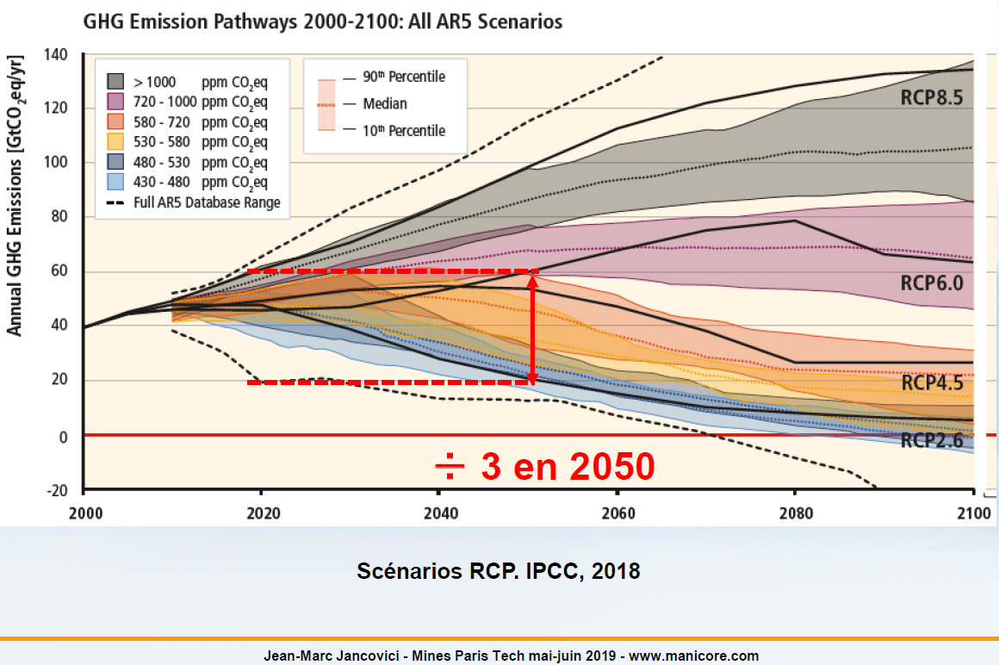
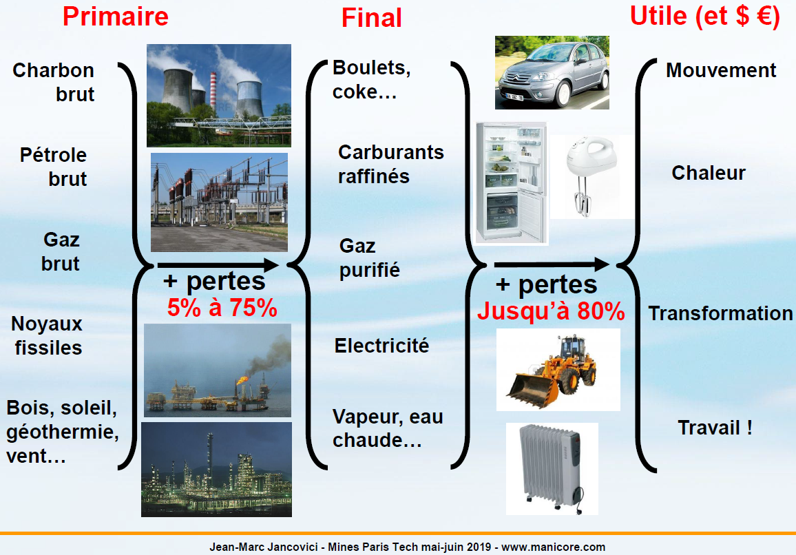
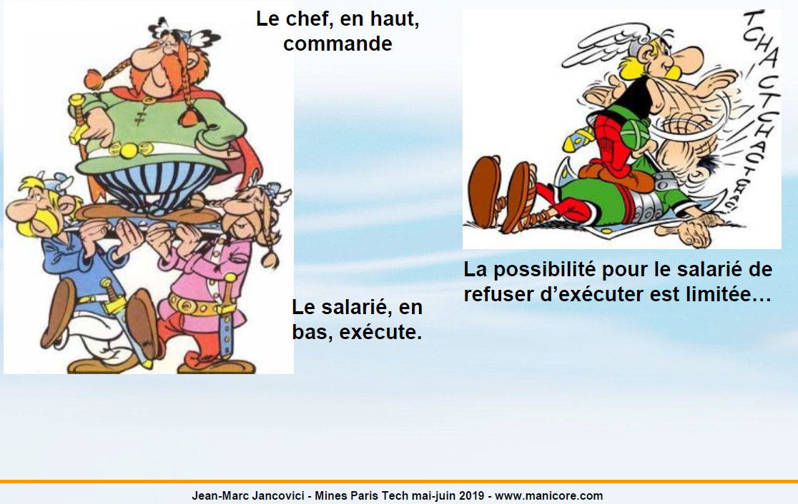
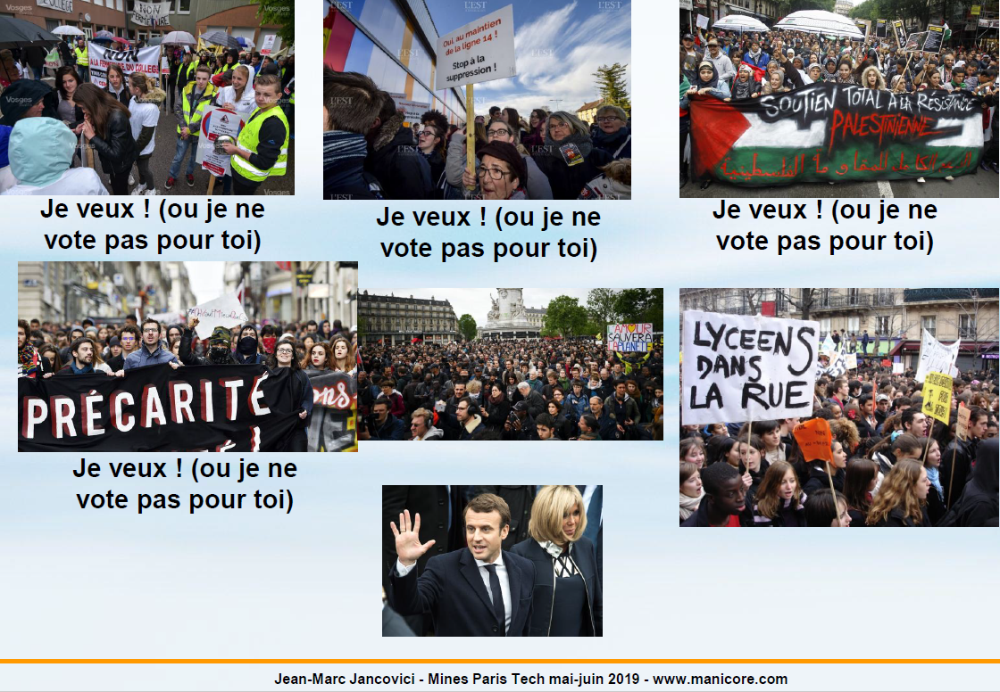
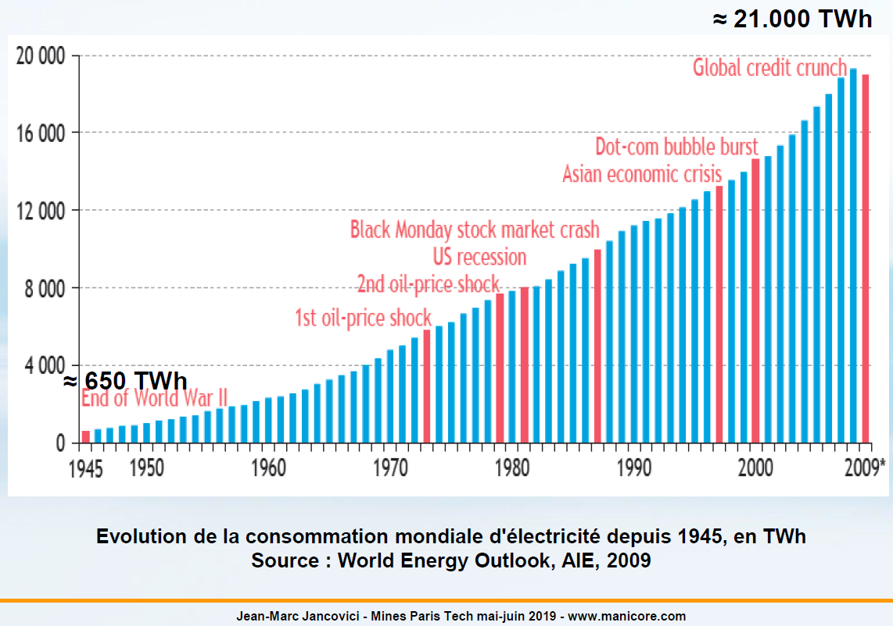

# ECC5 - Les économies d'énergie

On va aujourd'hui commencer à rentrer dans le charme ou l'absence de charme de la solution au problème. Pour résumer les cours précédents, on a inventer un système de corne d'abondance merveilleuse qui s'appelle la civilisation thermo-industrielle qui permet d'augmenter le pouvoir d'achat, qui permet d'augmenter le temps libre, qui permet d'augmenter la production de tout les gadgets qui nous passe par la tête (e.g. des taxis volants).

## Les raisons de faire des économies

Cette affaire la ce heurte à au moins deux limites physiques :

1. L'approvisionnement énergetique fossile n'est pas infini,
2. Notre activité met un peu partout des sous-produits indésirables, dont des GES dans l'atmosphère qui sont susceptibles d'engendrer des changements que nous allons trouver éventuellement pas très sympathique.

Dans la manière d'essayer de "résoudre le problème" qui est poser par la situation actuelle, il y a deux grandes familles de solutions. La première c'est d'essayer de faire fonctionner un système socialement stable avec moins d'énergie, c'est ce qu'on va regarder ici. La deuxième qu'on va un tout petit peu regarder ici aussi, et qu'on regardera les deux cours suivants, c'est comment on essaye de faire en sorte que cette énergie soit disponible en mettant moins de GES dans l'atmosphère. Il y a donc deux grandes familles : ou j'en utilise moins, ou j'essaye d'en utiliser de la moins carbonné. Le premier débat c'est le débat sur les économies d'énergie et le deuxième débat c'est le débat sur tout ce qui est décarbonnation de l'énergie (en particulier renouvelable et nucléaire).

Par ailleurs, il y a quelque chose de théorique pour les uns, et de plus pratique pour les autres dans cette discussions. Comme exposé dans les cours précédents, toutes les zones vont pas être logés à la même enseigne en ce qui concerne le calendrier de cette histoire. Pour tout le temps qui nous reste à vivre, nous ne pourront pas échapper à quelque chose concernant cette affaire : soit les économies et la décarbonnation on les gère, soit on les subie, mais de toute façon on passera pas à côté.

L'Europe, malheuresement pour nous, est après le Japon, la zone dans le monde qui est le plus pauvre en ressource énergetique. Le Japon n'a rien, c'est assez simple. L'Europe a encore la mer du Nord, ainsi que du charbon en Pologne et en Allemagne, mais enfin c'est pas assez pour assurer une croissance de la quantité d'énergie disponible à partir de maintenant, même si on se fiche du climat. Il y a donc une raison de faire des économies d'énergie, qui est souvent la raison la plus fréquemment mise en avant dans le débat médiatique (on parlera un peu des médias dans ce cours) qui est : "il faut faire quelque chose contre le changement climatique, mais il faut pas oublier qu'il y a une voiture-ballais dans cette histoire, et que cette voiture-ballais est déjà à l'oeuvre dans les pays de l'OCDE [ce que rappel ce graphique], qui est le fait que l'approvisionnement énergetique est déjà contraint pour une partie des énergies que nous utilisons". Pour rappel, en ce qui concerne l'Europe, l'approvisionnement de charbon est en déclin, climat ou pas climat, l'approvisionnement en pétrole est en déclin, climat ou pas climat, l'approvisionnement en gaz est en déclin, climat ou pas climat. Donc on a 80% de notre approvisionnement qui est de toute façon en déclin, en tendance. Dans la zone OCDE, on voit que depuis 2007 l'approvisionnement est passé par un maximum et depuis il ne retrouve pas le chemin de la croissance. Donc le fait de devoir faire fonctionner un système socialement stable avec moins d'énergie est déjà une équation qui est devant nous depuis une dizaine d'années dans ce qu'on appelle la zone OCDE (qu'on appellé autrefois les pays riche, i.e. Europe de l'ouest, l'Australie, le Japon, la Corée du Sud, la Turquie, toute l'Amérique du Nord). En ce qui concerne la partie amont, c'est à dire la nécessité de faire des économies parce que on a déjà un problème sur l'approvisionnement, pour nous c'est sous notre nez. Ce n'est pas sous le nez de la population riche et bien nourris qui font partie de la catégorie CSP+, les gens qui sont à l'abri du besoin (dont les parents qui sont pour l'essentiel enseignant, cadre supérieur, etc.), le panorama de l'élève type dans l'enseignement supérieur dans ce pays, donc on ne voit pas le problème chez nous. La question des économies forcés, c'est quelque chose qu'on ne voit pas chez nous; par contre si on regarde ce qu'il est entrain de se passer dans les zones périphériques des villes depuis 10 ans, le problème est déjà à l'oeuvre (baisse de revenu, augmentation des inégalités, augmentation du chomage, etc. les problèmes de types économiques se concentrent dans ses endroits là), mais on ne le voit pas chez nous sauf exception. Les working poor, les gens qui travaillent mais qui pour autant n'arrive pas à joindre les deux bouts, en France c'est quelque chose qu'on voit moins avec le salaire minimum élevé. En gros il faut faire des contrats jeunes, etc. des choses qui sont très spécifiques et dérogatoires du droit commun pour arriver, mais dans d'autre pays occidentaux, c'est comme ca que l'ajustement se fait aujourd'hui. Donc première raison de faire des économies, c'est que de toute façon il va y en avoir moins, et du coup, confère le premier cours, toute choses égale par ailleurs, il y aura moins d'économie, moins d'énergie, moins de machine, moins de PIB. Très souvent quand on parle des économies d'énergie ou des autres marges de manoeuvre que nous avons face au changement climatique, on continue à voir ca comme quelque chose qu'il faudrait se décider à faire la semaine prochaine, pour éviter des gros emmerdements en 2050, or en Europe, c'est déjà plus une option, les économies ont les fait déjà de toute façon en Europe.

La deuxième raison de faire des économies, c'est donc la question du changement climatique. Ce graphique nous superpose tout un tas de simulation fait avec des modèles de climat et réstituer dans le dernier rapport complet du GIEC. En gros, c'est simulations nous donne en abscicce les émissions cumulées de CO2 au cours du temps, et en ordonné, la réponse en température du système en fonction des émissions cumulées de CO2. On voit en gros qu'on a à faire à une droite et l'élévation de température, c'est l'élévation de température entre l'ère pré-industrielle et 2100. Dit autrement, avec l'inertie du CO2 dans l'atmosphère, c'est l'élévation de température embarqué dans les émissions qui ont déjà eu lieu. C'est comme ca qu'il faut lire le graphique. Donc si par exemple on s'arrête aux émissions cumulés d'aujourd'hui qui font à peut prêt 2200 milliards de tonnes de CO2, nous avons embarqué 1.5 degré de réchauffement. Dans les Accords de Paris, on a dit qu'on allait faire tout ce qu'on pouvait pour limiter le réchauffement à 1.5 degré, si on l'a déjà avec ce qu'on a émis, pourqoi est-ce qu'on discuterait à le limité à 1.5 plus tard, puisque de toute façon il est déjà la. On y reviendra juste après. En gros si on arrête les émissions demain matin, ce que nous dit ce graphique c'est qu'on prend 1.5 degré à la fin du siècle. Si on veut limiter le réchauffement à 2 degrés à la fin du siècle, à ce moment, on fait le chemin inverse, et ce qu'on voit c'est qu'il faut limiter les émissions à 3000 milliards de tonnes de CO2 dont 2200 ont déjà étaient émises. Donc en gros, il faut limiter les émissions pour la partie du siècle qu'il reste (entre maintenant et 2100) à 800 milliards de tonnes de CO2, c'est à dire en première approximation le tiers de ce qui a était émis pendant le siècle qui a précédé, avec une population en moyenne trois fois moins nombreuse. Ce qui veut dire que le droit à émettre de chacun d'entre nous sur ce qui nous reste à vivre, c'est le neuvième du droit à émettre qu'on eu nos grand-parents jusqu'au moment ou ils sont mort. On comprend qu'effectivement, si on veut faire quoi que ce soit d'approchant cette limite, il va falloir s'occuper en particulier de la quantité d'énergie qu'on utilise d'ou une deuxième justification en ce qui concerne les économies d'énergie.

1.5 degré avec les émissions passé, on est à peut prêt sûr de les avoir de toute façon. C'est un tout petit peu plus compliqué que ca. Ce que l'on voit sur cette figure, c'est quatres trajectoires d'émissions qui permettent de limité le réchauffement à 1.5 degré à la fin du siècle, et ce que l'on voit c'est que toutes ces trajectoires d'émissions ce qu'elles nous disent en gros c'est que tout ce qu'on aura émis à partir de maintenant et jusqu'au émission net deviennent nulle, derrière, il faut que ce soit compensé par des émissions négatives, dit autrement, par de la séquestration net pour compenser le surplus qu'on a transitoirement mis dans l'air. On a le droit d'utiliser l'atmosphère comme un stock tampon pendant quelques dizaines d'années pour rajouter du CO2 dedans, à condition que derrière on commence à le retirer, en net. Ca veut dire qu'à ce moment la, non seulement il faut qu'il n'y est plus une source de CO2 dans le monde, ou en tout cas plus beaucoup, mais en plus, il faut que ce qu'on avait déjà mis dans le passé, on le retire de l'atmosphère. On le retire de l'atmosphère avec deux marges de manoeuvre : AFOLU (Aforestation and Land Use, dit autrement c'est le changement d'usage des sols, le fait de tranformer des sols qui ne capte pas de carbonne en sol qui capte du carbonne. Donc c'est soit reforester des terres qui n'avait pas de forêt, à ce moment le fait qu'on créer un stock de forêt nous transfert un stock de carbonne de l'atmosphère vers le sol, ou bien on change nos pratique agricole, par exemple on labour moins, et à ce moment on remet du carbonne dans le sol) et BECCS (Biomass Energy and Carbon Capture and Sequestration, dit autrement, c'est des centrales électriques au bois et on capture le CO2 et on le remet sous terre; la forêt capte du CO2 de l'atmosphère, on prend le bois, donc le carbonne est passé de l'atmosphère dans le bois, on le fait bruler dans une centrale électrique, le CO2 de la centrale électrique on le capture et on le met sous terre. On a fait la totalité du chemin inverse, atmosphère vers sous-sol qu'aujourd'hui on fait dans l'autre sens combustible fossile / sous-sol vers atmosphère). On voit sur ce graphique qu'en gros dans l'esprit, ce qu'on a mis dans l'atmosphère jusqu'en 2050, il faut retirer derrière. Ce graphique s'arrête en 2100, mais derrière 2100 il faut continuer à séquestrer en net. Donc l'idée c'est qu'en gros, pour limiter le réchauffement à 1.5 degré en 2100, il faudrait qu'on s'arrête d'émettre demain matin, ce qui n'est pour le moment pas le cas.

Si on veut limiter à 2 degrés, c'est pas demain matin qu'il faut s'arréter d'émmetre, mais a peut prêt. On a ici la trajectoire d'émission sur le CO2 qu'il faut respecter pour tenir la limite des 2 degrés. Aujourd'hui, si on rajoute les autres GES au CO2, on est à peut prêt à 60 milliards de tonnes équivalent CO2 d'émissions par an et il faudrait qu'on soit au alentours de 20 en 2050 si on suit ce scénario bas qui permet par approche probabiliste (deux chance sur trois; le sommet de gaussienne vu au cours précédent) de limité le réchauffement à 2 degrés, mais même avec cette trajectoire, on a une chance sur trois d'éxcéder les deux degrés. Pour rappel, il y a une barre d'erreur dans les simulations climatiques, et donc il n'y a pas de résultat qui soit absolument garanti quand on regarde l'avenir, c'est des ordres de grandeur. Il faut donc retenir que d'ici à 2050, si on veut limiter le réchauffement à 2 degrés, il faut que les émissions planétaires soit divisés par 3, c'est l'ordre de grandeur qu'il faut avoir en tête. Si on est pas capable de limiter les émissions par 3 d'ici 2050 (i.e. en l'espace d'une génération, une génération et demi), c'est absolument certain que on ne tiendra pas les 2 degrés, parce que tout ca est une affaire de réchauffement embarqué, et de grande durée de vie du CO2 dans l'air.

On verra dans la suite du cours en quoi consiste techniquement la captation du CO2. Celle qu'on envisage aujourd'hui, c'est la captation du CO2 fossile. En gros, on a un combustible fossile qu'on retire du sous-sol, on le brule, et le CO2, au lieu de le laisser partir dans l'atmosphère, on le récupère et on le remet dans le sous-sol. On a la une opération blanche. Mais ca ne nous diminue pas la quantité de CO2 dans l'atmosphère. Ca nous empêche simplement de l'augmenter. Si on veut la diminuer, à ce moment, il faut récupérer le CO2 de l'atmosphère avec des plantes, bruler les plantes, prendre le CO2 de la combustion des plantes, capturé, et celui-la le mettre sous le sol. A ce moment on a fait en gros ce que la géologie a fait sur 50 millions d'années quand elle a fait du pétrole, elle a retiré du CO2 atmosphérique et la collé sous le sol, sous forme de stock de carbonne. BECCS c'est très exactement ca. C'est un moyen en gros de passé l'aspirateur à CO2 dans l'atmosphère. Mais c'est un moment qui marche sur le papier, on verra après toutes les limites qui font qu'il n'y aura pas ca partout dans les 30 ans qui viennent. Si on ne brûle pas le bois, on a pas d'énergie, l'idée ici c'est de les utiliser à la place du charbon, du gaz, ou de n'importe quoi d'autre pour faire de l'électricité. Si il se décompose dans leur coin, on a pas d'énergie, c'est un procédé qui est destinnée à remplacer, en particulier dans la génération électrique le charbon et le gaz. L'idée c'est qu'au lieu de déstocker du carbonne du sous-sol et de mettre le CO2 dans l'atmosphère, on fait le chemin inverse, en utilisant de la biomasse dont on capture le CO2 de combustion pour le mettre sous le sol.

## Représentation d'une division par 3

Pour donner une idée de ce que représente la conterpartie d'émissions divisé par 3 pour 9 milliards d'individus, on peut faire une petite règle de 3. La petite règle de 3 nous dit donc que 20 milliards de tonnes de CO2-eq pour 7 milliards d’individus, cela fait 3 tonnes de CO2 par personne; et pour 9 milliards (la taille de la population à l'horizon de 20 à 30 ans), on est plutôt à 2 tonnes de CO2 par personne. La question c'est qu'est ce qu'on fait avec 2 tonnes de CO2. En l'état actuel des technologies, l'une des choses suivantes suffit à atteindre le « droit maximal à émettre sur une année » (Source Jancovici, 2019) :

* **Faire 15 000 km en avion (un A/R Paris-Chicago).** Avec 2 tonnes de CO2, on peut faire son stage à l'étranger que la direction des études nous demande de faire, et le reste de l'année, on a pas le droit de vivre : on ne peut pas manger, on peut pas se vétir, on ne peut pas acheter de brosse à dent, on ne peut pas se déplacer, etc. Rien. Pour rappel, les déplacements en avion sont quelque chose d'extrêmement récent dans l'histoire des Hommes. En 1950, il y avait les boxeurs célèbres, les stars de cinéma et les ministres qui se déplacer en avion et ca s'arreter la. Même l'élève au Mines, il y a 50 ans, il ne prenait pas l'avion, ca n'existait pas. Le père de Jancovici qui est aller comme post-doc aux Etats-Unis y est aller en bateau. C'est quelque chose qui est extrêmement récent, et on voit qu'un vol en avion et crack, on a cramé tout notre quota, après c'est terminer. A noté que si on fait le même kilométrage annuel en plusieurs vols, c'est pire que de le faire en un seul vol, parce que ce qui consomme beaucoup de carburant proportionnellement c'est le décollage. Même si on dégage certains GES à très hautes altitudes, si on fait 1.000 km, au bout de 20 km, notre avion, il y est quasiment. Même dans un vol de 1.000km, l'avion monte au plafond très très vite.
Pour comparer avec les bateaux, si on prend le Queen Mary pour aller à Boston, c'est encore pire, il vaut encore mieux y aller en avion, par contre si on est passager supplémentaire sur cargo de bananes, la c'est parfait. Ca dépend à quoi sert le bateau en gros, s'il sert juste à transporter des croisiéristes retraités avec un membre d'équipage pour deux passagers, etc. c'est encore pire que l'avion.
Pour comparer avec le train, ca dépend de la manière dont on fait de l'électricité, mais en gros, 1 km.passager en avion, c'est de l'ordre de 150 grammes de CO2, 1 km.passager en train en France (en fonction du fait qu'on considère l'infrastructure amorti ou pas amorti, etc.) ca se ballade entre quelques grammes et quelques dizaines de grammes. En Allemagne, ca peut monter à quelques dizaines de grammes à cause du contenu carbonne de l'électricité, mais ca reste toujours inférieur à l'avion dans tout les cas de figure.
* **Consommer 4.000 kWh d'électricité en Allemagne mais 20.000 kWh en France (consommation annuelle moyenne par Français environ 8 000 kWh).** On a la possibilité de consommer quelques milliers ou dizaines de milliers de kWh d'électricité. Evidemment, le mode de production de l'electricté conditionne très largement le quota en question. Et du coup, ce qu'on voit ici en filigrane, c'est qu'évidemment il y a plein de gens qui rêve d'un monde dans lequel on pourrait produire plein d'électricité décarbonné, à ce moment on peut avoir plein de kWh et on est capable de substituer plein d'usage. On se met à faire fonctionner l'industrie, les transports, le confort thermique des batiments, etc. avec de l'électricité sans carbonne et on a "résolu notre problème". On en parlera les deux prochaines cours.
* **Acheter 10 à 500 kg de produits manufacturés (en France ~ 2.000 à 6.000 euros de produits industriels, 8 000 à 15 000 euros de services).** On a le droit d'acheter de quelques dizaines de kilos a quelques centaines de kilos de produirs manufacturés. Par exemple avec 2 tonnes, on a le droit d'acheter 4 ordinateurs ou 4 écrans de télévision connectés. Donc si une année, on achéte un ordinateur et une télévision, on a cramé la moitié de notre quota rien qu'avec ca. On a également le droit d'acheter quelques milliers d'euros de services (facture de téléphone, place de cinéma, etc.). On voit aussi que si par exemple on achète quelques kilos ou dizaine de kilos de vêtements, tables, chaises, ordinateurs, etc. à ce moment, on ne mange plus, on ne se déplace plus, on ne se chauffe plus, etc.
* **Construire 4 à 5 mètres carré de logement.** On a le droit de se faire construire un quart de chambre à coucher. Un mètre carré en structure béton, dans un logement collectif, dans un immeuble de type appartement, demande l'émission de 300 à 400 kilos de CO2. Avec 2 tonnes, on en construit donc environ 4 à 6. Ce qui veut également dire que l'année ou un ménage se fait construire une maison de 90 mètres carrés, ce qui est la taille classique d'une maison, alors cette année la, le ménage a émit 35 tonnes de CO2 au titre de la construction de son logement. Ces émissions, c'est celle des cimenteries, des aciéries, qu'il a fallut faire fonctionner pour faire le gros oeuvre de la maison, les briques, les tuiles, les fenêtres, du cablage électrique, etc. Et la dedans, on ne tient pas compte de la machine à laver et de l'écran connecté qu'on met à l'intérieur.
* **Brûler 7 000 kWh de gaz naturel, en tenant compte des émissions amont (quelques mois de chauffage d'un logement).** On a la possibilité d'utiliser du gaz, moins que de l'électricité en France, plus que de l'électricité dans un pays dans lequel l'électricité est très carbonné. C'est pour ca que les gaziers et les électriciens se battent comme des chiffoniers en permanance.
* **Parcourir ~ 6000 à 8000 km en zone urbaine en voiture « moyenne » (2 fois moins en 4x4).** Enfin, on a la possibilité de faire quelques milliers de kilomètres en voiture.

Tout c'est point sont séparés par des OU exclusifs. Donc si on part deux fois en vacance dans l'année en voiture, on ne mange plus, on ne s'habille plus, on ne se chauffe plus, on achète plus rien, et on ne prend pas l'avion pour aller faire son stage à l'étranger. Ca aussi, c'est pour nous faire toucher du doigt à quel point aujourd'hui nous sommes à des années lumières avec les habitudes que nous avons d'avoir quoi que ce soit qui puisse ressembler à une empreinte carbonne qui soit compatible avec le monde des 2 degrés qui est par ailleurs la promesse politique de tout un chacun en ce moment.

## Energie Primaire, Final, Utile

Une des manières qu'on a d'économiser de l'énergie, c'est d'améliorer l'efficacité du système énergetique : de l'énergie qu'on trouve dans la nature à l'énergie qui rentre dans une machine ou même qui nous rend service. Il y a 3 termes qui sont fréquents dans le monde énergetique qu'il faut avoir en tête. Le premier adjectif, c'est **primaire**. L'énergie primaire c'est l'énergie tel qu'on la trouve dans la nature. A cause de la loi de conservation de l'énergie, tout ce qu'on peut faire avec cette grandeur, c'est de trouver dans la nature de l'énergie déjà existante et de s'en servir à notre profit. Donc il faut qu'elle existe cette énergie. Dans l'énergie primaire on va trouver tout ce qui brûle : charbon, pétrole, bois, gaz, etc; on va trouver la force des éléments : la force de l'eau qui tombe, le vent qui souffle; on va trouver du rayonnement électromagnétique : le Soleil, on pourrait si on savait brancher les machines à laver sur les éclairs d'orage trouver de l'électricité (pour le moment on sait pas bien). L'énergie primaire c'est donc tout ce qu'on trouve dans la nature qui est une source d'énergie possible. Cette énergie primaire va alimenter notre système énergetique. Le système énergetique que dans les statistiques on appelle parfois Industrie de l'Energie, c'est tout l'appareil industriel que nous avons créer qui ne sert à rien d'autre que d'extraire de l'énergie primaire de l'environnement et d'en faire de l'énergie que l'on appelle **finale**, c'est à dire qui va pouvoir alimenter une machine or du système énergetique : un lave vaisselle, une voiture, un projecteur de cinéma, etc. Tout ca c'est des machines qui sont alimenter par de l'énergie qui sort du système énergetique. Le système énergetique est lui aussi soumis à la loi de conservation de l'énergie, donc l'énergie finale qui sort du système est au plus égale à l'énergie primaire, et en fait ce sera toujours inférieur à l'énergie primaire. Les pertes qu'on peut avoir quand on passe du système primaire au système finale peuvent être extrêmement élevées et en tout état de cause, elles sont toujours supérieur à 0%. Après, il y a une autre forme d'énergie dont on parle parfois qui est ce qu'on appelle l'énergie **utile**, c'est à dire celle qui nous rend vraiment un service. Prenons l'exemple d'un frigo : le frigo utilise de l'énergie final (de l'électricité), par contre il a lui même un rendement parce que ce qui nous intéresse en ce qui concerne le frigo, c'est pas qu'il consomme de l'électricité, c'est qu'il nous extrait des calories de l'intérieur du frigo; donc l'énergie utile dans cette histoire, c'est l'énergie de refroidissement. On a encore dans cette histoire un rendement de conversion entre final et utile. C'est pareil quand on a quelqu'un qui se déplace dans une voiture, l'énergie utile, c'est soit l'énergie de déplacement du bonhomme ($\frac{1}{2}mv^2$ appliqué au bonhomme), soit l'énergie de déplacement de la voiture ($\frac{1}{2}mv^2$ appliqué à la voiture), c'est beaucoup moins que l'énergie finale qu'on a mis dans le réservoir de la voiture.

Les pertes se baladent n'importe ou entre 5 et 75% pour primaire vers finale. 75% typiquement, c'est les turbines à combustion qu'on utilise pour l'hyper pointe (puissance maximale appelée en pointe) dans un réseau électrique, et qui sont en gros des moteurs d'avion, et ca a des rendements qui sont 20, 25, 30%; c'est des trucks dont on se sert 200 heures dans l'année donc c'est pas très grave. 5% c'est dans les très bon cas de figure, quand on a par exemple une éolienne avec très peut de frottement, ou bien un barrage avec très peu de frottements. Et entre les deux, on a toute la gamme, et dès qu'on fait de l'électricité avec une machine de Carnot, donc dès qu'on fait de l'électricité avec de la chaleur qui derrière va faire tourner un alternateur, a ce moment, on a un rendement qui dépasse rarement en cycle simple 45%. En cycle combiné sur le gaz on peut atteindre 55, 60, c'est à dire qu'on a deux cycle différents. Le rendement moyen d'une centrale à charbon dans le monde est le même que le rendement moyen d'une centrale nucléaire dans le monde, c'est à dire en gros 1/3. Dans la transformation finale vers utile, la aussi on a des pertes importantes. Par exemple dans un moteur de voiture, on a des pertes qui peuvent atteindre jusqu'à 80%, parce qu'évidemment on a jamais un rendement de 1, plus on est or de la plage optimale de régime (les moteurs sont ajustés pour des plages optimales de régime) et plus le rendement est mauvais.

Donc une façon de faire des économies c'est d'optimiser cette chaîne. Ainsi, pour la même quantité d'énergie utile à l'arrivé, on va utiliser beaucoup moins d'énergie primaire, et du coup mettre moins de CO2 dans l'atmosphère et moins dépendre des stocks d'énergie fossile. L'optimisation de cette chaîne est un moyen d'économiser de l'énergie.

En prenant un exemple, voila une partie de l'approvisionnement énergetique allemand. On a dans l'image du haut une excavatrice à lignite Bagger qui fait environ 100 mètres de hauteur (le petit point jaune est un bulldozer) qui se trouve dans la mine de Hambach près de Cologne. La mine la plus profonde en Allemagne est 300 mètres sous le niveau de la mer, c'est un truck qui fait 5 kilomètres sur 5 kilomètres, et on a un truck comme ca au milieu qui extrait la lignite (un charbon jeune, riche en eau et riche en cendre) qui va alimenter une centrale à charbon (image du bas). Les tours réfrigerantes ne sont pas l'apanache des centrales nucléaires, c'est juste l'apanache des centrales thermiques en bordures de rivières. Il y a plein de centrale nucléaire qui n'ont pas ce genre de tour, et il y a plein de centrale à charbon qui sont en bord de rivière et qui en ont. Quand on va de la lignite vers l'électricité, on a des pertes importantes et donc on va retrouver simplement 30 à 45% du contenu énergetique de notre lignite sous-forme d'électricité. Après on va transporter de l'électricité jusqu'à un endroit ou on s'en sert, la on va perdre de l'ordre de 8%. Après on va mettre ca dans un frigo, la en l'occurence le frigo c'est une pompe à chaleur donc avec un rendement thermodynamique supérieur à 1 et notre énergie utile, c'est ce qui va permettre de refroidir ce qu'il y a vraiment dans le frigo. La on est typiquement sur un exemple ou de bout en bout, le rendement peut être pas très éloigner de 1 parce que le COP (coefficient de performance) d'un frigo c'est 2 - 3 donc ca peut être pas très éloigner de 1 quand on va du primaire vers l'utile.

Si on prend maintenant un autre exemple, on va partir du pétrole, voici un endroit ou on récupère du pétrole de terre. Quand on récupère du pétrole de terre, on a déjà une perte puisque on a besoin d'énergie pour pomper le pétrole et l'extraire de terre. En fait l'énergie qui est nécessaire au pompage du pétrole de terre dans les mauvais cas de figure, ca atteint jusqu'à 1/3 du contenu énergetique du pétrole pompé. Dans les mauvais pétrole de schiste, la ou on a besoin de beaucoup fracturé, beaucoup pompé derrière, et pas tant de pétrole que ca a récupérer, ca peut être de l'ordre du tiers. Dans les sables bitumineux au Canada, on est aussi à des rendements qui sont de cette ordre là, on a besoin en gros de perdre 1/3 de l'énergie en cours de route. Ensuite, ce pétrole va être raffiner. Quand on raffine du pétrole, on en perd 15% parce que le raffinage c'est une distillation, et comme pour le cognac, il faut chauffer et donc on va perdre une partie de l'énergie contenu dans le pétrole inital pour éffectuer cette distillation et avoir des produits raffinés. On va mettre ces produits raffinés dans une voiture dont les rendements sont de 20 à 40% et avec ca on va transporter un bonhome (on peut considèrer que l'énergie utile, c'est pas l'énergie cinétique de la voiture, mais c'est l'énergie cinétique du bonhomme). Donc même si on s'arrête la, on a un rendement de chaîne qui est assez bas, et évidemment, la tentation est toujours de se dire, c'est pas la peine d'enquiquinner les consommateurs qui achette une voiture, on va embaucher les ingénieurs qui vont bien et leur demander de travailler la dessus et de nous optimiser tout ca. Quand on voit les pourcentages, c'est quelque chose dont on se dit c'est normal. C'est normal sauf que on a dans un premier temps quand on pompe du pétrole en provenance d'une roche poreuse, on lutte contre la capilarité, et on peut pas aller à 1 de rendement, c'est juste pas possible, on a des barrières physique. Ca a plutôt tendance a se dégrader au cours du temps puisque les nouveaux gisements qu'on trouve sont plutôt moins sympathique que les anciens. Dans la seconde étape, la raffinerie, on est limité par la quantité d'énergie qu'il faut pour distiller donc c'est pareil on peut pas aller à zéro perte. Et enfin, pour la voiture, on a une machine de Carnot donc c'est pareil, on ne peut pas être à zéro perte et on ne peut même pas améliorer de manière absolument considérable le rendement des moteurs. C'est une tentation forte quand on voit ce genre de chiffre mais il faut bien voir qu'il y a souvent des lois physique qui limitent par construction les rendements et c'est pas nécessairement très simple d'aller très au-delà.

On a ici le diagramme Primaire / Final de la France dans lequel on voit à gauche les énergies primaires qu'on utilise, à droite les énergies finale qu'on utilise. On voit que sur le pétrole, il y a très peu de perte intermédiaire; sur l'électricité primaire, il y en a énormément puisque c'est de la chaleur perdue.

## Efficacité, Sobriété, Pauvreté

La grande famille d'économie d'énergie qui est celle vers laquelle vont toujours en premier approche tous les gens qui s'intéresse à la question, c'est **l'efficacité énergetique**. L'efficacité énergetique consiste à obtenir exactement le même service en améliorant les rendements de chaîne de bout en bout. Donc typiquement, on a une voiture qui est toujours la même (même poid, même puissance), avec laquel on parcourt toujours la même distance, mais on a demander à Monsieur Peugeot, Monsieur Renault, et consort de se crever la cervelle pour que ca consomme moins de carburant. A l'arrivé quand on va pas faire plus de kilomètres et qu'on va pas acheter une voiture plus grosse, on va avoir le même service avec moins d'énergie. La voiture consomme moins grâce à des améliorations technique. De la même manière dans le logement, si on a le même espace habitable et qu'on demande à une société d'isoler correctement le logement, et a une autre société de nous faire une chaudière à condensation, etc. on aura le même confort thermique en ayant utilisé moins d'énergie. J'ai le même espace habitable, mais la performance thermique de mon logement est meilleure. Ca marche également évidemment pour les produits qu'on achette. Si ces affreux industriels pollueurs arrivent à nous faire les mêmes produits en ayant utilisé moins d'énergie, on a résolu une partie de notre problème, on a pas était obliger de toucher à notre consommation. J'achète la même quantité de poulets, de chemises et de billets de cinema mais ils ont été fabriqués avec des processus plus efficaces. Ainsi l'efficacité, c'est "J'obtiens les mêmes services avec moins d'énergie".

Une autre famille d'économie d'énergie est l'exact inverse : on ne demande pas à l'industriel de faire des progrès et on ne demande pas à la voiture d'être plus efficace, on décide déliberémment d'avoir moins de service : de conduire moins de kilomètres, ou dans une plus petite voiture (moins puissante ou moins grande), on diminue son espace habitable (co-location, appartement plus petit), on achète moins de produits, nos enfants vont moins tard à l’école et on accepte d’attendre à l'hôpital, etc. Cela s'appelle la **sobriété** : "J'utilise délibérément moins de services, et du coup il faut moins d'énergie pour me les fournir". Avec la sobriété en gros, on s'auto-inflige une limitation de ce qu'on consomme. Evidemment si on ne le consomme pas, il n'y a pas besoin de le fabriquer et à ce moment on a les économies d'énergie correspondantes au fait qu'on est pas eu besoin de le fabriquer.

Il y a une varaiante de la sobriété qui est celle qui arrive sans qu'on est demander d'avis et qui s'appelle la **pauvreté**. La pauvreté, c'est tout simplement "j'ai une limite qui s'impose à moi et qui m'empêche de consommer" et à ce moment évidemment, on économise l'énergie qui est nécessaire ou qui était nécessaire a ce qui était consommer avant. La grande différence entre la sobriété et la pauvreté n'est pas physique, dans les deux cas de figure on consomme moins, mais dans le premier cas on le désire et dans le deuxième cas on ne le désire pas. Donc évidemment dans le premier cas, ca se gére socialement plus simplement que dans le deuxième parce que quand on désire quelque chose, c'est comme même socialement un peu plus simple que quand on ne le désire pas. Mais, quelque chose d'essentiel à avoir en tête, c'est que dans les deux cas de figure, que ce soit sobriété ou pauvreté, c'est récessif parce que du coup on ne fabrique plus, donc on ne produit plus, donc le bout du PIB qui correspondait à la production disparait. Ainsi, la sobriété est quelque chose qui marche de manière généralisée à partir du moment ou on accepte l'idée que ca va avec le fait de faire décroitre le PIB (tel qu'il a était concu soit dit en passant; au moment ou le PIB a était concu, c'était vraiment pour mesurer des tables, des chaises et des verres). Faire décroitre le PIB ca a une toute petite conséquence de court terme, c'est que ca fait décroitre la base fiscale et donc on ne va pas voir un élu qui se présente devant les caméra en disant "c'est ca que je vais faire" parce que ca lui créer imédiatement un problème budgétaire de court terme qu'il ne sait pas résoudre. Donc la quasi-totalité du monde politique n'envisage absolument pas de généraliser ces deux choses la. Par ailleurs, généraliser ces deux choses suppose d'embarquer la totalité des consommateurs alors que de s'occuper de l'éfficacité, ca suppose juste de taper sur la tête de quelques industriels et de quelques ingénieurs, donc c'est comme même en terme de population qu'on met sous contraintes beaucoup plus petit numériquement. Comme dans les démocraties, chaque personne à un bulletin de vote, quelque soit ca position, en général, toute solution qui permet de minimiser le nombre de gens sur lequel on a besoin de tapper pour régler un problème est une solution préférentielle. Il y a donc très peu de discours sur la sobriété et la pauvreté.

Pour revenir au début de ce cours, à partir du moment ou on accepte l'idée que au plus pour des raisons géologiques, l'approvisionnement énergetique baissera de toute façon, il est assez simple de comprendre que tout ce qu'on ne fera pas ou qu'on ne réussira pas à faire au titre de l'efficacité et de la sobriété, ce fera au titre de la pauvreté. C'est simple, il n'y a que trois tiroir dans la commode. Ca se passe déjà quand un pays est sous contrainte énergetique la ou on voit augmenter les poches de pauvreté, d'inégalité, etc. c'est la que ca se passe.

## Bilan global

Dans le monde, la conversion Primaire vers Final nous fait perdre en gros à peut prêt 4 à 5 milliards de tonnes équivalent pétrole d'énergie, c'est à dire un gros 40% de l'énergie primaire. Donc c'est clair que vue de Mars, on se dit qu'il y a quelque chose à grater. Par contre, c'est essentiellement dû à la production électrique et la production électrique est aujourd'hui essentiellement faite avec des combustibles fossiles et donc la on a essentiellement la perte du au fait que c'est une machine de Carnot et on peut juste rien y faire. On peut un peu monter la température de la source chaude, mais on ne peut pas faire grand chose de plus.

Voila la décomposition de la production électrique dans le monde et ce que l'on voit c'est que aujourd'hui l'essentiel est fossil. En ordre de grandeur, pour faire 1 kWh d'électricité au charbon, on émet 1kg de CO2; le gaz est au alentour de 400g de CO2; le pétrole est plutôt aux alentours de 800g de CO2. Les deux grands modes décarbonné aujourd'hui en ce qui concerne l'électricité, c'est l'hydroélectricité et le nucléaire. Tout en haut enfin on a les nouvelles énergies renouvelables qui se balade n'importe ou entre 10 et 250 grammes de CO2 selon que l'on est avec une éolienne dont l'électricité n'a pas besoin d'être stocké (10g), ou avec un panneau solaire dont l'électricité à besoin d'être stocké sur batterie particulièrement performante (250g). Il y a une très grande plage de variation. Ce que l'on voit ici c'est que la quantité d'électricité qu'on utilise aujourd'hui dans le monde a considérablement augmenté par rapport à il y a quelques dizaine d'années. On est à peut prêt à 25.000 milliards de kWh et ce que l'on voit c'est que dans les nouvelles énergies renouvelables on a en fait le vent et la géothermie (biogaz / géothermie) qui sont les deux modes dominants.

## Equation de Kaya

Pour aller un peu plus loin, c'est à dire regarder à quelle niveau il faut placer les économies d'énergie, il y a maintenant une petite règle de 3 que l'on va regarder qui est connu sous le nom de l'équation de Kaya. L'économiste japonais Yoichi Kaya a un jour posé une équation de la baisse des émissions de CO2 sous la forme d'une règle de 3. Monsieur Kaya dit qu'on va commencer par dire que les émissions mondiale de CO2 sont égale à elle même, ce que normalement, même après une soirée bien arrosé, on devrait accepter sans trop discuté. Puis monsieur Kaya divise puis multiplie à droite par un terme non nul, qui est la quantité d'énergie qu'on utilise dans le monde : $CO_2 = \frac{CO_2}{TEP} \times TEP$. On fait donc apparraitre un premier terme qui est la quantité de CO2 libérée dans l'atmosphère par unité d'énergie disponible pour nous, par unité de machines en fonctionnement. On continue et on va multiplié et divisé par la production économique : $CO_2 = \frac{CO_2}{TEP} \times \frac{TEP}{PIB} \times PIB$; donc ici on fait apparraitre combien on a eu besoin de transformer l'environnement (l'énergie c'est la transformation de l'environnement) pour disposer d'un dollar de valeur ajoutée. Pour disposer de 1 dollar de quelque chose d'intéressant pour nous, à quelle hauteur exprimée en kWh on a eu besoin de transformer l'environnement. Enfin, on finit la règle de 3 en multipliant et en divisant par la population mondiale et donc on fait apparaitre la quantité de production / de service économique par personne multiplié par le nombre de personne : $CO_2 = \frac{CO_2}{TEP} \times \frac{TEP}{PIB} \times \frac{PIB}{POP} \times POP$. Et donc la ce que l'on voit, c'est qu'on peut dire que les émissions mondiales de CO2 (ou de GES soit dit en passant) sont le produit de quatre termes qui sont la population (toute chose égale par ailleurs, plus on est nombreux, plus ca émet), la production économique (plus on produit par personne, plus on transforme, plus on émet), la quantité d'énergie utilisée par unité de production économique (plus on utilise d'énergie par unité de production économique, plus les émissions de CO2 augmente, toute chose égale par ailleurs), et enfin la quantité de CO2 par unité d'énergie (plus notre unité d'énergie est riche en CO2, plus on émet). Avec ce qu'on a vu toute à l'heure, le terme de gauche on le met sous contrainte, c'est à dire que d'ici à 30 ans, le terme doit être divisé par 3, on rajoute que ca finira de toute façon par arrivé un jour, au titre du théorème qui nous montre que la quantité de combustible fossile qu'on utilise sur terre tend vers zéro à plus l'infini, de toute façon les émissions de CO2 tendent vers zéro à plus l'infini aussi, donc de toute façon viendra un moment ou dans l'histoire des Hommes les émissions de CO2 seront pour toujours inférieur au tiers de la valeur actuelle. On est sûre de ca, on ne peut pas dire quand, mais on en est sûre.

On va maintenant essayer de regarder ce qu'on peut faire sur les termes de droites. Si on divise les émissions de gaz carbonnique par 3, il faut qu'on retrouve la division par 3 dans la combinatoire des termes de droites. C'est le charme d'une égalité, ca doit rester égale des deux côtés de l'égalité. Une première option est de dire, on va diviser la population humaine par 3, en 30 ans, ca porte des noms pas très sympathique donc en général il y a peu de candidat, mais si la division par 3 des émissions de CO2 doit arriver de toute façon, tout ce qui n'est pas fait dans la réduction du contenu en CO2 de l'énergie, dans la réduction de l'intensité énergetique de l'économie, dans la production par personne, sera fait dans la population. C'est juste de l'arithmétique. Pour le moment, la population on se dit plutôt que ca va encore augmenter et qu'on est parti pour être 9 à 10 milliards sur Terre, ce qui fait en gros une augmentation de 30% par rapport à aujourd'hui. Donc on doit diviser le terme de droite par 3 mais on commence par multiplier le terme population par 1,3. Du coup les trois termes qui reste, on doit les diviser par 4. La deuxième option c'est donc de dire qu'on va diviser le PIB par personne par 4 dans les 30 ans qui viennent. Tout les gens qui se préoccupent de l'industrialisation du pays, des caisses de retraites, etc. disent "non non on ne peut pas faire ca, vous n'y pensez pas", en fait il faut que ca monte. Alors la les intérêts composés nous disent que si on part sur l'idée que dans le monde, on fait 2% par an, alors $1,02^{32}$ nous donne une petite multiplication par 2 à l'échelle des 32 ans qui viennent. Donc on veut multiplier le terme de droite par 3 et on commence par multiplier la population par 1,3 et par multiplier la production par personne par 2; la combinatoiree des deux c'est donc par 2,5. Donc si on doit diviser par 3 les émissions de CO2 et qu'on multiplie la population et la production par personne par 2,5; le produit des deux termes restants (contenu en CO2 de l'énergie, intensité énergetique de l'économie) doit être diviser par 7,5. Ces deux termes sont le boulot des ingénieurs : faire des machines plus efficaces et faire de l'énergie plus décarbonné. C'est un peu plus compliqué que ca, parce que si on demande aux précédents ingénieurs ce qu'ils ont fait sur ces deux termes, on voit que sur l'efficacité énergetique de l'économie, on a était capable de gagner 30% en un peu plus de 50 ans; et même si on regarde sur les 20 dernières années, on est plutôt à -10%, c'est à dire qu'on gagne péniblement un demi-point d'éfficacité énergetique par an actuellement sur les 20 dernières années. Nonobstant l'explosion du smart IT, qui doit rendre tout smart dans tout les sens, smart taxi volant, smart city, smart machin, et mettre de l'efficacité dans tout les sens. Manifestement, ca marche pas très bien puisque depuis qu'on met du smart machin dans tout les sens, l'efficacité a plutôt tendance à s'améliorer moins vite que plus vite macroscopiquement. Donc si on dit qu'on doit diviser les deux termes contenu en CO2 de l'énergie et intensité énergetique de l'économie par 7,5 et qu'on gagne péniblement 30% sur l'intensité énergetique de l'économie; on a encore un gros facteur 5 à trouver sur le contenu en CO2 de l'énergie; malheuresement c'est pas du tout ce qui c'est passer sur les 50 dernières années, on a gagner en gros 10% sur ce terme la. Depuis le boom ENR, on gagne rien. En fait, le boom ENR, c'est l'arbre qui cache la forêt, c'est à dire que dans le même temps que les ENR augmente, le charbon et le gaz continu d'augmenter, ce qui fait que le contenu carbonne moyen de l'énergie incrémentale est plutôt plus fort que le contenu carbonne moyen de l'énergie qui était déjà employé. Le boom des ENR des 15 dernières années est aller de pair avec le boom du charbon.

A partir du moment ou soit la géologie régionale ou mondiale, soit n'importe quelle contrainte, fait que le terme de gauche devient effectivement rapidement décroissant, tout ce qui n'est pas prit dans le contenu en CO2 de l'énergie et dans l'intensité énergetique de l'économie, sera prit dans la production par personne et dans la population. C'est juste des mathématiques. Donc dit autrement, les économies d'énergie faite par la réduction des termes $\frac{CO_2}{TEP}$ et $\frac{TEP}{PIB}$ sont évidemment les meilleurs, mais il y en a une partie qu'on va devoir prendre dans le terme $\frac{PIB}{POP}$, c'est à dire la sobriété et/ou la pauvreté; idéalement la sobriété parce que à tout prendre, c'est peut être mieux d'avoir un PIB en baisse, plutôt que de se faire la guerre, de mourrir de maladie, ou de mourrir de faim. Cette équation est la pour rappeler que l'arithmétique malheuresement nous dit que il n'y aura pas de voie avec le problème repousser éternellement à plus tard.

Voila maintenant quelques zoom pour montrer qu'en plus le problème se complique encore. On a ici l'efficacité énergetique pour le monde dans son ensemble, on voit que ca baisse.

Mais il y a des pays dans lesquelles ca se dégrade prit avec le temps. Par exemple, en ce qui concerne la Turquie, aujourd'hui, il faut plus d'énergie pour faire 1 dollar de valeur ajoutée qu'il n'en fallait il y a 50 ans. Eux, ils n'ont pas améliorer leurs économie, ils ont dégrader l'efficacité énergetique de leur économie. En ce qui concerne le Brésil, on a ici la courbe inverse, mais ca dit exactement la même chose, on a combien on fait de dollar de valeur ajoutée par kWh d'énergie, donc c'est présenter dans l'autre sens, donc quand ca baisse c'est que l'économie est de moins en moins efficace, on fait de moins en moins de dollars de valeur ajoutée avec la même quantité de kWh. Le Brésil, c'est pareil, l'économie est moins efficace aujourd'hui qu'elle ne l'était il y a 50 ans. Enfin, on a l'Espagne, on voit que son économie n'est pas plus efficace qu'elle ne l'était il y a 50 ans. C'est devenu un peu plus efficace, ca c'est dégrader, c'est redevenu un peu plus efficace, et ca c'est redégrader. C'est à peut prêt pareil. Donc se dire qu'avec le temps, tout devient toujours plus efficace, malheuresement, c'est pas aussi simple que ca. Dans le monde c'était pas vrai, l'efficacité c'était améliorer plus vite jusqu'en 2000 qu'après 2000. Et on a des pays, dans lesquelles depuis qu'on regarde ce genre de statistiques, on peut avoir la situation qui va dans le mauvais sens et non pas dans le bon sens.

En ce qui concerne l'efficacité carbonne de l'énergie (i.e. combien de grammes de CO2 on doit mettre dans l'atmosphère quand on utilise 1 kWh d'énergie primaire, il ne s'agit pas de l'électricité) ce qu'on voit c'est que ca s'améliorer lentement depuis le début des années 2000, et depuis le début des années 2000, en gros, ca c'est un peut dégrader, un peu améliorer, c'est flat. Donc ca c'est très contre-intuitif, par rapport au discours qu'on entend partout qui est que les énergies renouvelables sont en train de ce développer partout et donc la logique devrait être que l'énergie se décarbonne. Ce qu'on voit la c'est que c'est pas du tout le cas. Sur la période de baisse, on a eu comme facteur de décarbonnation de l'énergie qu'on utilise deux choses qui sont la montée en puissance du gaz qui est la moins carbonné des énergies fossiles, donc si on a le gaz qui se développe, du coup, la valeur moyenne du CO2 mis dans l'atmosphère pour 1 kWh d'énergie primaire a tendance à baisser un peu, et le deuxième facteur explicatif, c'est le développement de l'hydroélectricité (surtout au début) et du nucléaire. La montée à partir des années 2000 est dû à la montée du charbon, et la baisse qui suit correspond au développement des EnR, mais enfin on voit que tout ca sont des oscillations autour d'une valeur qui ne bouge pas dans les grandes largeurs.

Puis on a des pays dans lesquelles c'est très stable, par exemple l'Inde qui reste stable depuis des dizaines d'années.

Si on regarde ce paramètre sur une série beaucoup plus longue (la ici 1 siècle et demi), c'est un calcul fait à partir des séries longues d'énergie montré au premier cours, et en regardant comment à évolué le contenu carbonne de l'énergie utilisée par les Hommes depuis un siècle et demi. La en l'occurence, est compté la biomasse pour zéro, ce qui est discutable puisque une partie de la biomasse qu'on a utilisé était de la déforestation, donc on pose ceci mis à part. Ce que l'on voit, c'est que la révolution industrielle a précisement consister à carbonner l'énergie, i.e. mettre plus de combustible fossile dans ce qu'on utilisait. Pour rappel, il y a deux ou trois siècle, on était 100% EnR. Depuis le début du XXé siècle, on voit qu'en gros, avec des oscillations, cette valeur est restée à peut prêt constante. Donc il y a une forme de grande difficulté à sortir de l'énergie fossile dans la civilasation industrielle dans laquelle nous sommes. C'est très difficile dans sortir et c'est ce que nous montre cette série.

Ca n'empêche pas les discours sur la décarbonnation de l'économie de prendre place, conjugué à un discours sur la croissance du PIB, ce qui veut dire que comme le PIB c'est une transformation, on a besoin de plus d'énergie, donc on a besoin de beaucoup plus d'énergie avec beaucoup moins d'énergie fossile. Donc en gros pour conjugué les deux discours qui sont à la fois l'économie doit continuer à croitre et la quantité d'énergie fossile doit rapidement décroitre, ca veut dire qu'on devrait passer d'une évolution historique de l'utilisation de l'énergie qui est cette courbe qu'on a déjà vue, à une évolution futur d'ici à dans 30 ans qui ressemble aux prolongement des deux courbes de droite. C'est à dire qu'en bas, les combustibles fossiles se mettent à décroître de 3 à 4 % par an, ce qui ne pose pas de problème physiquement, que ca pose des problèmes économiques et sociaux tant qu'on veut, mais ca ne pose aucun problème physique de diminuer très fortement la quantité de combustible fossile, c'est physiquement possible, en revanche la seconde courbe c'est moins sûre que ca soit physiquement possible, il faudrait que dans le même temps, les énergies décarbonnés croissent de 7% par an tout les ans, dans les 32 ans qui viennent, sachant qu'une bonne partie de ces énergies décarbonnés restent dépendantes des énergies fossiles a un moment ou a un autre de la chaîne, plus ou moins fortement évidemment.

On va maintenant voir une altérnative à Kaya qui n'est plus du tout la même. On ne tue personne, donc on a toujours la population qui se prend 20 à 30%; on ne tue personne mais on essaye comme même de faire en sorte que la population croissent quand même un peu moins vite. C'est quelque chose qui est tout à fait faisable, pour ca, il faut que l'aide aux développement des pays riches soit vraiment de l'aide aux développement, et pas de l'aide en général aux chiffre d'affaire des entreprises des pays occidentaux (i.e. pour faire des routes et des ponts), et l'une des choses que les pays occidentaux peuvent faire d'utile à ce moment, c'est ce qui est l'éducation des femmes, le planning famillial et les systèmes de retraites qui sont trois mesure dont on sait que ca a un impact à la baisse sur la natalité. Donc au lieu de faire +30%, on fait +20%. On dit ensuite qu'on est content avec le PIB comme il est donc on l'arrête la, mais comme on est un peu communiste et qu'on considère que l'indien il a le même droit au PIB annuel que le français, évidemment, le PIB par personne en France est divisé par 3. On met le paquet sur les économies d'énergies au sens efficacité, parce que pour la sobriété on a déja pris notre part dans le terme précédent. Et enfin, on met le paquet sur la décarbonnation de l'énergie donc effectivement on construit à tire l'arrigot des barrages, des éoliennes, des centrales nucléaires, des panneaux solaires, avec de la capture et séquestration du CO2. A ce moment, on arrive a peut prêt à tenir la division par 3 sur le terme de gauche. Donc on a une petit idée de ce que signifie les objectifs du développement durable vue avec cette règle de 3.

Pour rappel, soit dit en passant, la pauvreté est un indicateur relatif, la pauvreté c'est "moins que x% du revenu médian". Donc la pauvreté c'est la part d'une distribution qui se trouve à gauche en dessous d'une fraction du revenu médian. On a deux ou trois manières différentes de supprimer la pauvreté. La première c'est de faire un Dirac : tout le monde gagne la même chose, à ce moment on est sûre qu'on a pas de pauvreté puisqu'on a personne à moins de x% du revenu médian, il gagne en valeur absolu toujours la même chose mais tout les autres on baisse leur revenus, cela baisse la pauvreté, mathématiquement. C'est la seule manière arithmétique qui résolve à la fois le problème du climat et le problème de la pauvreté : on appauvrit les riches, c'est la seule manière qui fonctionne. Si on enrichit les pauvres, ca marche pas, parce qu'à ce moment, on augmente la production et donc on augmente les émissions de CO2. Donc la seule manière de cocher toutes les cases des objectifs du développement durable, arithmétiquement, c'est d'appauvrir les riches.

## Réduction d'émissions et Démocraties

Ca c'était pour l'efficacité, on y reviendra après avec des exemples concrets. La deuxième chose qu'il faut faire donc c'est d'utiliser moins de combustibles fossiles. Si on veut utiliser moins de combustibles fossiles, il faut notemmant demander au gens qui détiennent aujourd'hui les réserves de combustibles fossiles de bien vouloir les laisser sous terre, de pas accorder de permis d'exploration, de permis d'exploitation, etc. On a ici un graphique qu'on a déjà vu précédemment et qui nous donne la hiérarchie des réserves de combustibles fossiles par pays en ayant discriminé charbon, pétrole, et gaz. Les premiers détenteurs de réserves liquides, le Venezuela étant un cas particulier parce que ce qu'il a dans son sous-sol, c'est pas sûre qu'il en sorte tout ca même si il le voulez, l'Arabie Saoudite est très en dessous de la totalité des réserves de charbon USA. Tout les pays qui était d'accord en 1997 pour prendre un engagement de limitation de leur propres émissions, ce qui nous donne quelque part le consentement à agir au nom du climat des pays en question, et donc c'est un pré-requis pour le consentement à laisser sous terre les réserves fossiles dont ils disposent. Dans tout ces pays la, on a en bleu 3 pays qui ont soit ratifiés tardivement, soit carrément laisser tomber leur ratification, le Canada est sorti, la Russie a ratifié extrêmement tardivement, et les Etats-Unis ont finit par sortir (ils n'ont jamais ratifié en fait). Tout les pays en rouge n'ont jamais prit d'engagements. Donc en gros, ce qu'on voit sur ce graphique, c'est que les gens qui sont d'accord pour agir au nom du climat, c'est essentiellement les gens qui n'ont pas de réserves chez eux. Pour rappel, le charbon qui représente l'essentiel des réserves extractibles restantes est une énergie essentiellement domestique (i.e. il s'extrait chez soi, et s'utilise chez soi). Donc tant que les pays sont souverain, ceux qui ont du charbon, il ne dépend que d'eux même d'extraire leur charbon et d'utiliser leur charbon pour faire de l'électricité. Ca ne dépend que d'eux. Il est assez peu probable que ou le Vietnam, ou la Thailande, ou le Brésil, ou l'Autriche déboule en Chine ou en Australie en disant "vous n'utiliserez pas votre charbon". Donc ces pays la, ils veulent utilisez leur charbon, ils l'utilisent, donc il faut les convaincre de pas l'utiliser ce qui est évidemment pas très simple.

L'essentiel des pays qui ont prit des engagements, c'est ceux qui n'ont pas les réserves, et par ailleurs, un autre élément dont il faut tenir compte, c'est que l'essentiel des émmeteurs sont des pays dans lesquelles on a actuellement un régime dit démocratique. On voit que sur ce camembert qui représente l'ensemble des régions du monde, a part quelque exceptions, la plus notable est la Chine et une bonne partie des pays du Moyen-Orient, mais sinon l'essentiel des autres pays sont des démocraties. On parle ici de démocratie en gros à partir du moment ou les gens votent; on peut dire qu'elles ne sont pas parfaite, la notion de démocratie parfaite est quelque chose qui reste un long débat parce que il n'y a pas de définition normative de ce qu'est une démocratie parfaite; qu'après on explique que le vote est trucké, mal organisé, etc. reste à savoir ce que serait un vote pas trucké, ou un vote parfait. "Un débat non démocratique en général est un débat qui conclut à autre chose que mon opinion". Donc la on a affaire à des démocraties, c'est à dire des endroits ou on vote.

Une démocratie, c'est un système qui n'est pas un système auquel on est habitué dans notre vie de tout les jours. Dans notre vie de tout les jours, on est habitué a être dans une institution dans laquelle il y a des règles, avec une autorité qui est capable d'éditer les règles, des gens derrière qui doivent respecter les règles, et des sanctions en cas de non respect des règles. Par exemple l'école des Mines à des règles, si on ne passe pas un examen on a zéro, si on a trop de zéros on a pas notre diplôme; comme on rentre pas dans l'école pour en ressortir sans diplôme, on fait les efforts minimums pour avoir le diplôme. C'est quelque chose qui a une hiérarchie, un vrai chef, et un pouvoir de sanction.

Tous on a tendance a penser qu'un système politique en démocratie ca fonctionne de la même manière, on a un vrai chef, il décide, et ensuite on s'éxecute. Mais enfét, pas du tout. Dans les livres qu'on ne saurait trop conseiller de lire, il y a un livre qui s'appelle "De la Démocratie en Amérique" écrit par Alexis de Tocqueville il y a maintenant deux siècles. Dans ce livre il décortique dans un premier tome (moins passionant), par le menu le pouvoir des juges en Amérique, dans un deuxième tome il fait une lecture sociologique extrêmement fine de la façon dont une démocratie poussera les Hommes à ce comporter, et reste complétement d'actualité. Donc une démocratie, c'est un système remontant ou plus exactement une pyramide inversée ou celui en bas est chargé d'écouter et d'arbitrer entre tout les gens qui vont lui dire "voila ce qu'il faut faire", et évidemment, ils sont pas tous d'accord entre eux, et tous ils votent, c'est à dire que tous ils décident si celui d'en bas il sera chef ou pas, ou plus exactement si il sera exécuteur testamentaire ou pas. Donc une démocratie, contrairement à une entreprise, une institution universitaire, ou une administration, c'est pas un endroit ou le chef est un vrai chef qui impose sa volonté à une population qui n'en voudrait pas. Le chef est un faux chef qui se fait élire donc qui a besoin d'être dans un rapport de séduction permanent avec les gens qui votent et qui va en fonction de ce qui est "dans l'air du temps" prendre des positions qui peuvent parfaitement changer du tout au tout en l'espace de 24 heures. Par exemple, au moment de la mise en place de la taxe carbonne, i.e. au moment ou les gilets jaunes ont commencé à brailler contre le prix de l'essence (à juste pour parti, on y reviendra), nous somme passé successivement en l'espace d'une semaine de "nous serons inflexible sur la taxe carbonne" à "on va remettre à plus tard" et a "on abandonne"; tout cela en l'espace d'une semaine. Donc ca c'est quelque chose qui est emblématique du fonctionnement dans une démocratie. L'élu est au service de ces électeurs au moins autant qu'ils leur demandent de s'éxécuter.

Notre ami Tocqueville qui avait passer la démocratie à la loupe nous a dit il y a maintenant deux siècles (1840), à cause de la façon dont le système est construit, par exemple on considère que tout le monde est égal sur la ligne de départ, donc si les gens sont pas égaux sur la ligne d'arrivée, c'est qu'il y a eu une injustice quelque part. Machin il a gagner plus que moi, c'est dégeulasse, il habite une plus belle maison, c'est dégeulasse, il a une plus grosse voiture, c'est dégeulasse. Ce que Tocqueville dit c'est que la démocratie rendra les gens rouspetteurs, consuméristes (j'ai le droit donc je le prend), jouisseurs, court-termistes, individualistes. Tocqueville écrit donc que la démocratie poussera à la consommation de masse (de produits médiocres). Or, la consommation de masse pousse au changement climatique. Comment fait-on pour garder la démocratie sans la consommation de masse ? Pas simple, à partir du moment ou on a le droit, comment on fait pour nous enlever le droit. Tocqueville avait également dit qu'en démocratie, il y aura une chose qui sera un lieu de pouvoir absolument majeur, c'est les médias (on peut y mettre les réseaux sociaux aujourd'hui), et que soit dit en passant, ce sera le seul pouvoir sans contre-pouvoir. La démocratie confèrera aux media un pouvoir central, permettra l'égalisation des droits des hommes et des femmes, verra l'avènement de la publicité. Une variante du court-termisme, en démocratie, ce qui ferra le "buzz", c'est les petites choses superficielles et effectivement, le rouge à lèvre de Kim Kardashian fait plus de vue sur youtube qu'une conférence philosophique sur ou allons nous dans les 50 ans qui viennent : « [en démocratie, on accordera un grand prix aux] conceptions superficielles de l'intelligence, [et peu à la réflexion] profonde et lente ». Du coup, ce que Tocqueville dit c'est que la démocratie sera myope, poussant structurellement les citoyens à peu se soucier des dangers de long terme, et qu'elle recelle donc en elle-même sa propre fragilité qui est d'être incapable de gérer correctement les grands dangers de long-terme. Evidemment, comme on est tous former à la logique élementaire, si la démocratie n'est pas capable d'accoucher du système qui permet de gérer le problème, la solution involontaire au problème ce passera de la démocratie (c'est la contraposé). A l'époque, la seule alternative que Tocqueville connaissait c'était la monarchie, qui est une dictature de père en fils, et effectivement, Tocqueville disait qu'en monarchie les gens sont fatalistes, ils se contentent de ce qu'ils ont et ils acceptent un système immuable. Confère ce que l'on a vu dans le premier cours avec la reconstitution du PIB sur deux millénaires, tant qu'il n'y avait pas de croissance, il n'y avait pas de démocratie; de fait, ce n'était pas la peine de la prommettre, il n'y avait pas d'élection parce qu'il n'y avait pas de démocratie. Ce que l'Histoire nous enseigne c'est que des systèmes adaptés à un contexte stable ou qui émerge plus exactement quand le contexte est stable sont des systèmes qui sont significativement plus coercitifs que la démocratie, parce qu'en démocratie dès qu'on promet plus à l'un, on ne sait pas promettre moins à l'autre, or dans un monde stable, c'est ce que l'on doit faire. C'est très difficile d'enlever en démocratie, tout ce qui consiste à enlever est quelque chose qui est extrêmement lent (e.g. temps de retraite). Les systèmes dans lesquelles ont a besoin d'enlever rapidement sont en général pas des démocraties. Une entreprise c'est un système dans lequel on a besoin d'enlever rapidement a un moment éventuellement, on fait de plus mauvaises affaires on malheuresement besoin de licencier du monde, on ne dit pas on va faire des élections pour savoir qui on licencie, on prend une décision et on le fait. On ne dit pas que c'est bien ou c'est mal, on observe juste que le système est adapté à des prises de décision plus rapide parce que la décision plus rapide est nécessaire, quand on est dans la nécessité d'enlever quelque chose a court terme. C'est pareil sur un bateau, on a un capitaine, et il ne fait pas un référendum tout les quatre matins pour savoir si on envoit la voile, on va à droite, à gauche, etc. "Le seul maitre a bord après Dieu". Donc quand on est dans un système dans lequel on a éventuellemnt besoin d'enlever quelque chose ou de prendre une mesure contraignante à court terme, l'Histoire nous montre que ce n'est jamais des systèmes démocratiques. Donc ce qui est dit ici, ce n'est pas juste pour le plaisir de philosopher, on a une vrai question sur laquelle on est pas du tout assez conscient dans le débat publique qui est : la démocratie a du mal a faire accoucher d'économies parce que les économies c'est des contraintes, sauf que si on ne sait pas gérer nous même la contrainte, l'Histoire nous enseigne que au moment ou le contexte est ce qui nous pousse à la contrainte, à ce moment, on est pas complétement sûre que ce système la perdure de façon longue.

La notion de court-termisme pour une entreprise dépend vraiment de la nature de l'entreprise, de son histoire, etc. Dans une société financiarisé, côté en bourse, ou encore plus quand on a un patron barder de stock options qui ne pense que à partir dans les cinq ans qui viennent en se disant "après je suis transquille", c'est beaucoup moins le cas dans les petites société patrimoniales, par exemple si on prend un vigneron, c'est des gens qui peuvent raisonner à 20-30 ans sans aucun problème. On a plein d'entreprise patrimoniale dans lesquelle les exigences de rendement sur capitaux et les horizons de temps n'ont rien à voir avec les sociétés côtés en bourse ou la les horizons de temps sont devenus très court, ce qui est un vrai problème, et il faudrait fortement appuyer sur le frein de ce côté la. On devrait supprimer les comptes trimestrielles, supprimer la cotation en continue, etc. Cela ferait énormément de bien notamment à la résolution des problèmes de long terme. On ne se fait pas de copain dans les cabinets d'audits en disant ca, mais très clairemnt on aurait besoin de freiner fortement le système, ca c'est très clair.

Dernier point en ce qui concerne la démocratie : le bulletin de vote ne dépend pas de vos connaissances préalables. Ca fait partie du cahier des charges, on ne nous fait pas passer un test de connaissance avant de nous demander notre avis sur le programme d'un candidat. Donc un candidat qui dit "je vais greffer un troisième bras à chacun", on ne nous fait pas passer un test de connaissance pour savoir si c'est faisable ou pas, et si il faut qu'il embauche Laurent Alexandre avant de voter pour lui. On vote avec ce que l'on sait.

Donc, comme l'avait dit Tocqueville, il y a quelque chose d'absolument centrale en démocratie qui s'appelle les médias. A nouveau, quelques petits calculs d'ordre de grandeur, on va tout notre vie vivre dans des mondes à l'information imparfaite. Une fois qu'on va sortir d'ici, on va vivre dans un monde à l'information imparfaite. L'univers proffessionnel ou personnel dans lequel on évolura nous demandera de discuter avec des gens qui ne seront jamais sur la même base de connaissance que nous et ou lui ou elle ou nous aura de toute façon une partie des connaissances manquantes pour faire le tour du problème dont on est entrain de discuter. On a sur cette figure des ordres de grandeur. L'information qu'on appelle "à la source", donc en gros on va venir en cours et consciensieusement et religieusement écouter pendant 24 heures, ce qui est beaucoup plus que ce que font la majeur partie des gens dans ce pays pour s'acculturer à ce problème la, ca va concerner une population de quelques dizaines à quelques centaines de milliers de personnes dans le pays. Si on regarde la population que va toucher JMJ directement sa vie durant, ca va se ballader autour de 50 à 100 mille personnes. En face de ca, si on s'appelle Gilles Boulot ou Laurent Delahousse, a ce moment, on va avoir quelques millions de personne en face de nous tout les soirs donc on voit qu'on est pas du tout sur les mêmes ordres de grandeur et en fait en démocratie, un des sujets centraux quand on pense que l'expertise est importante dans le débat public, c'est d'assurer le chemin qui va de en haut à gauche à en bas à droite, c'est à dire comment on fait pour que les gens qui sont des relais d'information, essaye de relayer ce qui est important, et non pas ce qui est nouveau, et c'est pas gagner tout les jours. Donc il faut faire attention au fait que ce qu'il y a dans le journal n'est pas représentatif de ce qui est important dans le monde et que la manière dont la population va réagir à un problème donné ce fait beaucoup plus au regard de ce qu'il y a dans le journal, ou ce qui circule dans les réseaux sociaux avec beaucoup d'audience (c'est pareil), que au regard des faits. Si il y a discordance entre les deux, c'est la représentation médiatique des faits qui gagne, c'est pas les faits.

Si on prend la vulgarisation de ce qu'on sait sur le changement climatique, la totalité de ce qui a était publié dans les revues scientifique sur quelque chose qui a de près ou de loin un rapport avec le changement climatique induit par les Hommes, c'est des centaines de milliers de pages de littérature scientifique. Quand on en fait un rapport du GIEC de 2000 pages que probablement si il y a plus de 5 personnes dans la salle qui lit une fraction significative d'un des rapports du GIEC, ce serait un grand maximum, on a déjà opérer un taux de compression de quelques centaines entre toute la matière disponible et un rapport de 2000 pages. Si on passe au résumé pour décideurs, qu'une toute petite partie des décideurs vont lire; il y a une vidéo qui tourne dans laquelle on voit un étudiant qui interpelle des politiques et qui leur demande : "qui d'entre vous à lu le résumé pour décideurs du dernier rapport du GIEC"; il y a entre zéro et une main qui se lève (cf. [Vidéo](https://www.francetvinfo.fr/monde/environnement/cop24/video-qui-a-lu-le-rapport-du-giec-quand-une-question-d-un-militant-ecologiste-plonge-les-deputes-luxembourgeois-dans-l-embarras_3200935.html)). Si on posait la même question aux députés français, on aurait de la même manière trois mains qui se lèvent. Et pourtant, on a rajouter un taux de compression de 50 par rapport à l'information disponible et quand on en fait un article dans le journal, en gros, on essaye de faire passer des centaines d'heure de cours en une demi seconde. Donc on a aussi un énorme sujet liées au fait qu'une information courte est une information incomplète par construction.

* Matière première sur le climat : 400 000 pages de littérature scientifique.
* $\rightarrow$ Rapport du GIEC : 2000 pages de littérature scientifique (taux de compression 200 environ, soit de 100 heures à 30 minutes).
* $\rightarrow$ Le résumé pour décideur 40 pages (taux de compression 50 environ, on passe de 30 minutes à 36 secondes).
* $\rightarrow$ Un article dans le journal 1-2 pages (taux de compression 20 environ, on passe de 36 secondes à 1,8 seconde).

Pour la petite histoire, il faut rappeller qu'un média c'est une entreprise humaine comme les autres. Donc il n'y a ni plus ni moins de rigeur dans un média qu'il n'y en a ailleurs. Quand on lit un article dans le journal, quand on voit un sujet à la télé, ou quand on écoute une émission à la radio, on ne sait pas pourquoi c'est ce sujet plutôt qu'autre chose parce qu'il y a plein de chose importante dans le monde en permanance; on ne sait pas pourquoi on a interviewé M. Dupont et pas M. Durand; est-ce que dans ce qui a était dit, on a retenu correctement les propos tenus et ils ont été correctement interprétés (Par exemple, dans un sujet, c'est à dire dans la partie reportage d'un journal télévisé qui fait 1min30 à 2min, ou on nous parle par exemple des fraises bio sous serre, on va interviewé une ou deux personnes que l'on va voir à l'écran 20 secondes. Le temps d'interview pour arriver à ces 20 secondes est en général de 30 minutes. Ce n'est clairement pas la personne interviewé qui décide de ce qu'il va y a voir dans les 20 secondes en question, en choisissant ce qui lui semble le plus important. C'est le journaliste qui interview qui décide de ce qu'il va y avoir dans les 20 secondes retenus. Le présentateur ne dira pas avant chaque sujet : "Et je vous rappelle que ce qui apparait à l'écran c'est ce que le journaliste a décider, et on ne sait pas si la personne interviewé considère que c'est le plus important ou pas".); évidemment, le système est asservis, c'est à dire que au moment ou les gens rentre en fonction dans la presse, ils ont un avis, un parti pris (nous en avons tous, tout le temps) qui va évidemment conditionné la façon dont il vont traités les sujets.

**Le journal n'est jamais une source oposable.** Le journal, ca nous sert a nous donner une première information. Si on veut mettre en avant cette information dans n'importe quelle processus dans lequel on a besoin de quelque chose de fiable et vérifié, on est obligé d'aller regarder par nous-même derrière, d'aller retrouver l'information à la source, d'aller vérifier que cette information à la source elle-même est a peut-prêt crédible, etc. Dit autrement, un journal, c'est la fin d'un téléphone arabe, il y a toujours des distorsions entre le début de la chaîne et la fin, et c'est la raison pour laquelle il ne faut pas croire un journal : c'est la fin d'un téléphone arabe dont on ne connait ni le nombre de maillons intermédiaire ni la qualité de transmission entre chaque maillon.

## Carbon Capture and Sequestration

On revient à la technique et avant de parler des économies d'énergie, on va parler des économies de CO2 avec la capture et séquestration du CO2 qui est l'une des manières d'économiser de l'énergie. Pour émettre moins de gaz à effet de serre, il y a deux moyens : (1) basculer, toutes choses égales par ailleurs, sur des énergies émettant moins de CO2 ou pas du tout (transition charbon vers gaz, capture du CO2, renouvelables et nucléaires); (2) utiliser, à mix énergétique constant, moins d'énergie (économies d'énergie).

Ce graphique nous rappelle que dans les scénarisations qui sont faites sur la part économies d'énergie versus décarbonnation de l'énergie dans les scénarios aujourd'hui bas carbonne, en gros, c'est du 30/70 c'est à dire que dans les trajectoires qui sont faites et qui disent qu'on va tenir les 2 degrés en baissant les émissions suffisament, en gros, c'est 30% sur les économies d'énergie, l'efficacité énergetique, et c'est 70% sur renouvelables, CCS, nucléaire.

Une première manière de décarbonner de l'énergie, c'est tout bêtement de rester dans les énergies fossiles et de passer du charbon au gaz. On a sur cette figure les émissions de GES (elles sont pas en CO2 mais en carbone, donc en gros c'est quatre fois moins mais peu importe c'est la hiérarchie qui compte). On voit que quand on passe du charbon au gaz, en gros on gagne un facteur deux en ce qui concerne les émissions de combustion et donc partout ou on a du charbon, si on le remplace par du gaz, toute chose égale par ailleurs, on baisse les émissions de CO2. Soit dit en passant, il y a un exemple emblématique de pays qui a baissé ces émissions de CO2 sur les 10 dernières années en faisant ca, c'est les Etats-Unis. Les Etats-Unis ont très fortement baissé la consommation de charbon dans la production électrique qu'ils ont remplacés pour l'essentiel par du gaz et c'est du au fait qu'avec l'essor du gaz de schiste au Etats-Unis le prix du gaz c'est effondré, et du coup, c'est devenu plus rentable pour les électriciens d'utilisé du gaz que du charbon, donc ils sont passé du charbon au gaz. Ca a contribué de manière significative à la baisse des émissions de CO2 des Etats-Unis sur les 10 dernières années. En Europe, c'est la raison également pour laquelle les gaziers sont très allants sur l'idée d'avoir un prix du CO2 parce que si on met un prix du CO2 sur la production électrique, ca pénalise l'électricité au charbon (1 kg de CO2 par kWh électrique) par rapport à l'électricité au gaz (0,4 kg de CO2 par kWh électrique) et donc ca permet le basculement du charbon vers le gaz. Or les gaziers qui sont aussi les pétroliers soit dit en passant, ils vendent du gaz mais ils ne vendent pas de charbon. C'est la raison pour laquelle le patron de Total (Total produit plus de gaz que de pétrole), début 2018, a fait des grandes sorties dans la presse en disant "il faut un prix du CO2 sur la production électrique" et il a même très justement dit "il faut que ce soit 30€ la tonne" parce que 30€ la tonne c'est le prix qui fait basculer économiquement du charbon vers le gaz. C'est effectivement un moyen de diviser les émissions de la production électrique par trois si elle est faite au charbon initialement. Ca reste fossile mais c'est un moyen de décarbonner l'énergie. C'est un moyen sauf que pas de chance, les grosses réserves de carbone sont du côté des trucks trè carbonnés, donc c'est une marche de manoeuvre, on peut s'en servir, transitoirement mais pas définitivement.

Après on peut séquestrer le CO2. Séquestrer le CO2, ca veut dire le capturer la ou il est émis (Capture et Séquestration) et ensuite le stocker dans un endroit ou il ne sortira plus, ou du moins, plus avant que les Hommes ne meurent, et après il fait ce qu'il veut. Dans les endroits ou l'on pense stocker ce CO2, on en a sous terre et sous l'océan. Sous l'océan, l'idée, c'est de le mettre sous forme supercritique et de le stocker sous la forme de lacs de CO2 au fond de l'océan, mais c'est comme même une idée que maintenant beaucoup de gens ont abandonnés, donc on oublie. Le CO2 a cette particularité thermodynamique qu'il devient supercritique quand il est à haute pression, c'est un état intermédiaire entre le gaz et le liquide, et à ce moment il est très peu visqeux et dense comme un fluide, donc on en injecte de plus grande quantité que si il était gazeux évidemment.

Par contre, les endroits ou on pense pouvoir en mettre sous terre, c'est soit des réservoirs d'hydrocarbure épuisés, donc il y avait des roches poreuses, dedans il y avait du pétrole ou du gaz, il n'y a plus de pétrole ou de gaz, donc il y a la place et à cette place on met du CO2. C'est d'autant plus intéressant de mettre du CO2 la dedans qu'en plus ca nous permet de lessiver le pétrole qui y reste. Aux Etats-Unis, il y a depuis très longtemp un réseau de gazoducs en surface qui transporte du CO2 qui sert au pétrolier (le CO2 est un produit commercial aux Etats-Unis) à lessiver les réservoires de pétrole pour faire mieux sortir le pétrole. Evidemment ici on stocke du CO2 mais dans le même temps on fait resortir des combustibles fossiles qui vont ré-émmettre du CO2. Mais par contre, si on veut juste mettre du CO2 sans faire ressortir du pétrole, on peut dans les réservoirs d'hydrocarbure épuisés. On peut également, dans les aquifères salins profond; sous terre, il y a en générale de l'eau un peu partout; donc quand on a un aquifère, typiquement, du sable imprégné d'eau, c'est des endroits ou on peut injecter du CO2, on peut également injecter du CO2 dans les coulés basaltiques, donc on a un certain nombre d'endroit dans lesquelle on peut mettre du CO2.

On peut très bien transformer le CO2 et réutiliser le carbone, mais à ce moment il faut casser l'énergie de liaison C-O et donc on a besoin de plus d'énergie pour casser l'énergie de liaison que ce qu'on va récupérer derrière. Donc on on peut refaire du carbone et de l'oxygène, mais pour ca il nous faut de l'énergie. On ne peut pas avoir une réaction exo-thermique de transformation du CO2, ca c'est interdit. La création du CO2 est exo-thermique, et une fois qu'on a créer notre CO2, il est stable. Il y a des gens qui proposent de faire de la méthanation, c'est à dire de récupérer le carbonne du CO2, de mélanger ca avec de l'hydrogène, qu'on a par ailleurs récupérer en électrolysant, alors les rendements de ce genre de chose sont de l'ordre de 20%. On en parlera au moment des énergies décarbonés, mais l'idée de stocker l'électricité de cette façon par rapport au fait d'avoir des centrales nucléaires pilotables, c'est beaucoup moins chère d'avoir du nucléaire. Les dispositifs imaginés pour faire ce genre de chose le sont par des gens qui ne veulent pas de nucléaire en général, par exemple les gaziers, ils sont très contents parce que comme ca on peut continuer à utiliser leurs réseaux ou par exemple les gens qui sont férocement contre le nucléaire et qui veulent tout sauf du nucléaire. Mais si on veut bien du nucléaire, en fait le plus pratique et de très loin, puisqu'en plus c'est ce qui marche déjà, donc on a pas besoin de faire des plans sur la comette, c'est d'utiliser du nucléaire, et de faire des systèmes pilotables, ce qu'on sait faire en France.

La séquestration prend assez peu d'énergie parce qu'une fois que le CO2 est sous forme supercritique le poids de la colonne de CO2 est à peut prêt suffisant pour assurer l'injection du CO2 dans la couche. La grosse consommation d'énergie associé à cela, c'est la capture, parce que ce que l'on veut c'est injecter que le CO2, si on fait de la combustion à l'air, dans la fumée on a plein d'azotes et on a aucune envie de mettre l'azote sous terre. Donc ce que l'on fait a ce moment, c'est que d'abord les fumées on doit les épurer pour qu'il ne reste une poussière, pas de suies, etc., ensuite une fois que notre fumée est épurer, on la fait passer sur un lit d'amine qui sont des molécules qui vont absorbé le CO2 de façon sélective, donc en gros la fumée passe à travers un bain d'amine, le CO2 est absorbé, l'azote s'en va, et on va chauffer le bain d'amine derrière pour désorber le CO2, et à ce moment, on va désorber que du CO2, donc on va récupérer du CO2 pur, que l'on va comprimer, acheminer jusqu'au point d'injection, et injecter sous forme supercritique. La grosse consommation d'énergie du processus, c'est réchauffer les amines. L'injection elle même, c'est environ quelques pourcent de l'énergie de départ. Par contre, la capture du CO2, c'est 20 à 30 % de l'énergie de départ. Donc la on a une grosse pénalité énergetique à ce moment la.

On capture et après il faut acheminer jusqu'à un point d'injection. Si on a une centrale qui est construite sur un bassin sédimentaire (typiquement en Mer du Nord), on peut injecter pas loin de la centrale; si notre centrale est construite sur un massif granitique, un aquifère salin, on va avoir un peu de mal à en trouver un et donc ca veut dire qu'il va falloir transporter le CO2 dans des tuyaux, et donc ca veut dire qu'il faut (1) les construire, (2) accepter ces infrastructures en surface. Donc on a un sujet qui est aussi un sujet d'infrastucture de transport.

On ne séquestre pas directement du bois dans le sol parce que c'est plus compliqué de mettre du bois dans une roche que de mettre quelque chose de liquide. Un réservoir de pétrole, c'est de la craie, ou du grès ou du sable. Donc faire rentrer une buche dans un morceau de grès c'est comme même pas très simple. C'est plus simple de faire rentrer du liquide. Cela étant, on comprend que ca ne rentre pas si vite que ca, donc ca veut dire que pour injecter de très très grande quantité de CO2 dans le sol, il faut multiplier les puits d'injection (un peu comme les puits de gaz de schiste aux Etats-Unis, sauf que ca va dans l'autre sens) parce que par puits d'injection on a pas un débit extrêmement élevé.

BECSS c'est ce qui est représenté sur la figure si ce qui fait fonctioner la centrale électrique c'est de la biomasse. C'est une variante de ca mais avec de la biomasse au lieu que ca fonctionne avec du gaz ou du charbon. Si on fait fonctionner avec du gaz ou du charbon, on est en circuit fermer : ca sort du sol, ca va dans la centrale, ca retourne dans le sol. Si on fait fonctionner avec de la biomasse, on est en circuit d'injection, ca vient de l'atmosphère et des forêts, ca va dans la centrale, et ca passe sous le sol. Le point de départ et le point d'arrivé ne sont pas les mêmes.

Pour en revenir à la question du rendement, en fait la grosse limitation de la capture, c'est la pénalité énergetique. Imaginons qu'on est une centrale électrique qui est aujourd'hui dimensionné pour fournir une certaine quantité d'électricité. On applique de la capture et séquestration, du coup 30% du charbon ou du gaz qu'on enfourne dans la centrale sert à autre chose et du coup notre rendement électrique baisse de 30% : on a 30% d'électricité en moins à l'arrivée. Le rendement électricité / chaleur primaire passe de 45 à 35 % (donc moins de PIB ou plus de combustible). Comment est-ce qu'on gère 30% d'économie d'électricité imposé ? La vrai limitation de la capture et séquestration elle est la, elle est pas dans le fait qu'il faut payer 60€ la tonne de CO2 pour que ce soit rentable pour l'électricien, le vrai sujet, c'est qu'à l'aval on a moins d'électricité, donc on a moins de machines qui fonctionne, donc on a un problème économique. On peut dire, c'est parfait, on inverse le problème et on augmente la puissance de la centrale de 40%; alors on peut le faire, sauf que si c'est une centrale à charbon, il faut augmenter la taille du Bagger qu'on a vu tout à l'heure de 40%, il faut augmenter le convoyeur qui va jusqu'à la centrale de 40%, il faut augmenter la capacité des bruleurs de 40%, il faut augmenter l'évacuation des cendre de 40% (la grosse centrale de tout à l'heure elle fait 10.000 tonnes de cendres par jour), etc. Donc en fait, on a de gros problèmes logistiques sur notre centrale que l'on ne sait pas résoudre à bref délais. Donc la limitation de la capture et séquestration sur la production électrique, le fait que ca coute chère n'est pas le problème, le problème c'est qu'on a une perte physique qu'aujourd'hui on ne sait pas gérer. C'est la pénalité énergetique qui pose un problème.

Pour ces raisons, il y a peu d'exploitations commerciales aujourd'hui, l'exemple le plus connu étant Sleipner en Mer du Nord. De même, à cause de cela, ce n'est pas commode de faire un rétrofit sur les centrales existantes. De plus, bien évidemment, c'est un dispositif qui ne peut s'utiliser que sur les sources concentrés (pas d'applications sur les sources diffuses : résidentiel, tertiaire, transports). Les sources concentrés, ca fait comme même un paquet de source, par exemple 20% des émissions mondiale de GES viennent des centrales à charbon et serait élligible, 6% viennent des cimenteries et serait élligible, 7% les centrales à gaz et à pétrole et serait élligible. Donc on a en gros 40% des émissions mondiales qui serait élligibles. Par ailleurs, comme ca a un coût et que ca a des conséquences très importantes à la fois à l'amont et à l'aval, aucun électricien ne fera jamais rien dans les bons ordres de grandeur si on ne lui en colle pas l'obligation. Donc la CCS, c'est quelque chose qui ne se développera jamais de manière significative si il n'y a pas par voie réglementaire l'obligation de le faire. Si c'est pas obligatoire, quelqu'en soit les conséquences, ca ne se fera pas. Faire payer 60€ la tonne de CO2 revient à une obligation. On finira ce cours en expliquant que une manière de matérialiser la contrainte, ca peut arriver soit par un prix, soit par une réglementation, et en fait la réglementation matérialise un cout d'ajustement, donc c'est une forme de prix, mais un peu différent.

Donc on peut décarbonner avec la CCS et décarbonner avec les autres marges de manoeuvre sur la production électrique dont on parlera dans les prochains cours.

## Exemples d'efficacité

Arès on peut faire de l'efficacité à l'autre bout de la chaîne et on va voir la quelques exemples. On peut parfaitement aujourd'hui construire un batiment neuf qui soit extrêmement performant, pas nécessairement n'importe ou, parce que pour qu'il soit performant, il faut correctement l'orienter par rapport au Soleil. Si la parcelle ou on construit fait que l'orientation du logement que l'on va construire, on ne peut pas mettre la face Sud au Sud, etc. parce que la parcelle est ainsi disposé qu'on ne peut pas s'y prendre comme ca, on ne peut pas nécessairement bénéficier de tout les apports thermiques et donc avoir quelque chose d'aussi efficace que ca devrait être. Mais, techniquement, dans de bonne condition, c'est pas très difficile de faire ca. Ici on a par exemple une maison passive en Suède, passive veut dire qu'il n'y a pas de dispositif de chauffage, et on est en Suède ou il fait raisonnablement froid l'hiver, donc ca marche.

En fait, ca fait longtemps qu'on améliore l'éfficacité des batiments. Notamment à la suite du choc pétrolier, on a commencer à faire ca en France. On a ici par exemple un logement qui date d'il y a quelque dizaine d'années, quand il avait un chauffage central, il consomme plus de 200kWh par mètre carré et par an pour assurer son chauffage. Après on a fait des logements qui était plus efficace, et soit dit en passant quand on fait des logements collectifs, ce qui est le cas quand urbanise, intrinséquement, c'est plus efficace et on est descendu à quelques dizaines de kWh par mètre carré et par an, avant même de parler de la réglementation actuelle. Donc on voit qu'on fait déjà des choses plus efficace et on pourrais ce dire que du coup on va faire des économies.

Mais, il se trouve que dans le même temps, d'abord, il y a un certain nombre de batiments qui n'était pas chauffé, donc la performance intrinsèque n'avait pas de sens puisqu'il n'y avait pas de chauffage. Si on leur donne un chauffage a ces batiments existants, on va augmenter la consommation d'énergie. Ensuite, on a augmenter la surface habitable par personne. La surface habitable par personne est aujourd'hui de quasiment 40 mètre carré, avant les chocs pétrolier elle était de 23. Ensuite, on a augmenter le taux d'équipement de tout un tas de truck, c'est à dire que dans la maison de notre grand-mère quand elle avait notre age, il n'y avait pas tout l'équipement électroménager qu'on trouve aujourd'hui dans notre logement à nous. Ensuite, on a évidemment augmenter la quantité de logement. Ce qui fait que la quantité d'énergie totale qu'on utilise dans le batiment est rester a peut prêt constante, et la quantité d'énergie fossile qu'on utilise dans le batiment n'a pas considérablement diminuer, elle a changer de nature : on a moins de charbon, on utilisait plus de charbon il y a quelques dizaines d'années; moins de fioul; plus de gaz; et plus d'électricité. Globalement, on utilise à peut prêt la même quantité d'énergie aujourd'hui dans le batiment que c'était le cas il y a quelques dizaines d'années. Par ailleurs, il y a une chose qu'il faut se sortir de la tête, on entend souvent dire que le neuf remplace de l'ancien, mais c'est pas vrai, le neuf neuf se rajoute à l'ancien. En France, on construit chaque année quelque centaine de milliers de logement. On a un parc existant qui est de 30 millions de résidence principale. Donc on pourrait se dire que c'est 1% qu'on remplace chaque année, mais en fait non, c'est 1% qu'on rajoute chaque année, ce qui correspond soit dit en passant à l'accroissement naturelle de la population, et au divorces. Le vrai taux de renouvellement, c'est plutôt de l'ordre de 1 pour 1000. Donc on ne peut pas compter sur la rotation naturelle du parc en se disant que l'efficacité dans la construction neuf fera le job sur le parc existant, il suffit d'attendre. En fait il y a très peu de renouvellement du parc existant.

Sur les voitures c'est pareil, on a fait des progrès considérable sur une voiture donnée. La on voit à gauche presque la voiture dans laquelle JMJ a apprit à conduire, et à droite, on voit la petite voiture de la société moderne. Si on regarde la quantité de carburant consommé par litre de cylindré, on a fait d'énorme progrès. Si on regarde la quantité de carburant par kilomètre heure de vitesse maximale, on a fait d'énorme progrès. Si on regarde la quantité de carburant consommé par unité de puissance du moteur, on a fait d'énorme progrès. Et enfin, si on regarde la quantité de carburant consommé par kilo de masse, on a aussi fait d'énorme progrès. Sauf que l'engin gauche consommé 5 litres au 100, et l'engin à droite consomme 5 litres au 100. Donc en fait, ce qu'on a fait avec les voitures, c'est pas d'économiser sur une voiture, c'est d'augmenter la performance à consommation constante. De même que sur les batiments, puisqu'on a a peut prêt la même quantité d'énergie consommé, pas tout a fait pour la même population, mais presque en ordre de grandeur; on a augmenter l'espace habitable et la quantité d'équipements du logement à consommation constante. Ce que laissait à elle même, l'efficacité énergetique nous offre en général, c'est un accroissement des performances à consommation constante, voire à consommation croissante parce que nous sommes en démocratie et qu'on a droit d'acheter ce que l'on veut.

En l'occurence à gauche c'était de l'essence et à droite c'est plutôt du diesel, mais peut importe, c'est le même ordre de grandeur. Si on avait vraiment appliqué les multiples que l'on a sur la figure, on aurait toujours des deux chevaux aujourd'hui, donc les voitures qu'on aurait plaffonerait à 90km/h, ferait 500 kg, et effectivement elle consommerait 2 litres aux 100. Mais c'est pas du tout ca qu'on a fait.

Dans le même temps, le parc de véhicule dans le monde augmente fortement, et du coup, la quantité de carburant que nous utilisons dans le monde a tendance à augmenter pour le moment. Donc la question de savoir si on fait des économies est une question intéressante et pour le moment la réponse dans le monde, c'est non on ne fait pas d'économie.

Sauf quand on est obligé, en Europe on a commencé à devenir un tout petit peu des pauvres du pétrole, c'est à dire des économies forcées. On a ici l'approvisionnement européen en pétrole depuis 1965, et ce que l'on voit c'est que depuis 2006, on a perdu quasiment 14% d'approvisionnement pétrolier. Ca se fait en deux temps, une baisse jusqu'en 2013-2014, une hausse depuis avec l'approvisionnement en pétrole de schiste et comme le prix du pétrole étant très fortement remonté à partir de 2008, on a a la fois le pétrole de schiste qui se met à produire de façon importante parce que les prix du pétrole sont élevé, tout un tas de projet, notamment dans la Mer du Nord qui consiste à mieux râcler les réservoirs qui sont mis en oeuvre, et donc l'approvisionnement domestique se remet à légérement croitre, l'approvisionnement mondiale se remet à légérement croitre, et du coup l'Europe repart légérement à la hausse. Comme on l'a vu au moment du cours sur le pétrole, ca ne va pas durer éternellement.

Du coup, ce que l'on voit ici, c'est la quantité de carburant que nous utilisons en France, et en fait, on est passer par un maximum au début des années 2000 et depuis c'est raisonnablement stable, en très très léger déclin. Donc en fait la quantité de carburant qu'on consomme en Europe et en France en particulier a déjà commencer par se tasser, mais la sa ce fait sous la contrainte. C'est pas de l'efficacité, c'est pas de la sobriété, c'est une forme de pauvreté parce que on ne peut plus.

<!---->

Ceci allant avec cela, on a ici le traffic marchandise, donc la quantité de marchandise chargé dans les camions dont on voit qu'elle est passée par un maximum en 2007. La production industrielle européenne, c'est pareil est passé par un maximum en 2007. La construction en Europe, c'est pareil est passé par un maximum en 2007. Donc en Europe, on a commencer à faire des économies obligé, ca s'appelle de la pauvreté, et à cause de ce que raconte l'équation de Kaya, c'est déjà en train de s'appliquer au flux physique de la production et du coup à la contrepartie monétaire de ces flux physique.

On voit la un autre exemple, toujours dans les économies d'énergie. On a ici à gauche le frigo de l'américain en 1950. Ca consomme quelques centaines de kWh par an et ca possède 100 litres de capacité. A droite, on a le frigo qu'on trouve aujourd'hui chez les revendeurs. Ca consomme toujours quelques centaines de kWh par an, un peu moins en l'occurence, par contre la capacité a était triplé et un tiers de cette capacité est à -18 degrés. Alors qu'à l'époque c'était entre 5 et 10 degrés. A nouveau, on a fait énormément d'économie si on regarde un frigo.

On voit la à gauche un des premier ordinateur qu'on a vu au moment du cours sur le changement climatique, l'ENIAC. Il a un peu moins de 20.000 tubes à vide, il a un poids confortable, quelques dizaine de tonne et il consomme 100kW d'électricité, c'est un très très gros radiateur. A droite, on a l'ordinateur dont on est train de se servir, il fait 2 kilos, il a des dizaines de millions de transistor, et il consomme 20W. Donc que l'on regarde par unité de poid, par unité logique, etc. on a gagné un facteur absolument hallucinant en ce qui concerne l'efficacité d'un ordinateur. Cet ordinateur est plus pluissant qu'un super-calculateur des années 1970 qu'on utilisait pour aller sur lune.

Mais dans le même temps, les gens ce sont un tout petit peu équiper en tout et n'importe quoi : en frigo, en ordinateur, en lampe, etc.

Et quand on regarde la quantité d'électricité utilisée dans les batiments en France, cela ressemble à ca. L'essentiel de cette augmentation c'est pas du chauffage, c'est tout le reste, c'est tout les appareils électriques qu'on retrouve aujourd'hui dans les logements. Chacun d'entre eux étant considérablement plus efficace que celui qu'on avait il y a 30 ans, quand il existait, il n'empêche que ce n'est absolument pas des économies en valeur absolue qu'on a fait.

Si on regarde à l'échelle de la planète, on a ici la quantité d'électricité qui est utilisée, donc produite, sur Terre depuis 1945. La production électrique de la France aujourd'hui est de 550 TWh soit 550 milliards de kWh. La production électrique mondiale en 1945 c'était un peu plus de 600 TWh. Donc en ordre de grandeur, la Terre entière utilisait autant d'électricité que la France en produit aujourd'hui, en 1945. L'éléctricité pour tous, c'est la marque de la deuxième moitié du XXé siècle, même la première moitié du XXé siècle ne connaissait pas ca, il commencait a y avoir de l'électricité dans les maisons bourgeoise et dans quelques endroits (e.g. pour faire avancer quelque métros), mais l'électricité pour tous à cette époque, ca n'existait pas.

Si on fait un zoom plus récent, voila a quoi ressemble la quantité d'électricité utiliser dans le monde sur les 30 dernières années. On voit qu'une bonne partie de l'incrément est dû à l'essor de la Chine (et le reste des émergants) qui est absolument spectaculaire en ce qui concerne l'électricité. L'OCDE a comme même augmenter sa consommation.

L'électricité, c'est une énergie finale qui est particulièrement difficile à faire baisser par unité de PIB. On a ici une courbe qui donne la quantité d'électricité utilisé dans le monde (donc c'est une moyenne mondiale) par dollar de valeur ajoutée, donc par dollar de PIB. Ce que l'on constate, c'est que sur la durée de cette série (i.e. un peu plus de 30 ans), cette valeur est aux oscillations près, rigouresement constante. Il n'y a strictement aucun gain d'efficacité électrique par dollars de PIB sur les 30 dernières années.

Donc la conclusion de ce petit passage sur les appareils, c'est que il faut faire très attention quand on parle économie d'énergie à ne pas confondre deux choses qu'on confond en permanance qui sont **l'efficacité unitaire** (i.e. combien je gagne par appareil ou par usage) et **l'efficacité globale** (i.e. est-ce qu'on est capable de faire baisser globalement la consommation d'énergie rien qu'avec cette efficacité). Ce que l'on voit, c'est que sur la même durée, et en fait depuis qu'on fait des série statistiques, on a en permanance, une efficacité qui s'améliore un peu dans le même temps qu'une quantité globale utilisé augmente. Or si on ce place du point de vue soit de l'atmosphère, soit des stocks de combustibles fossiles, ce qui compte, c'est pas la consommation par appareil, c'est la totalité soit de ce qu'on tappe dans le stock, soit dans ce qu'on met dans l'atmosphère. L'atmosphère se contre-fiche de nos émissions par aspirateurs, ou par voiture plus exactement. Ca ne l'intéresse pas l'atmosphère, elle ce qu'elle voit, c'est la quantité totale de CO2 qui arrive. De même qu'un réservoire de pétrole, la consommation par voiture ou la consommation par chaudière, il s'en fiche, ce qu'il voit c'est la quantité totale qu'on va prendre dans le réservoire. Donc ce qui doit être baisser, si on parle économie, c'est soit les émissions totales si on parle du climat, soit la consommation totale de combustible fossile si on parle d'énergie. **Le grand drame de ce qu'on a fait jusqu'à maintenant, c'est qu'à quelques exceptions près, tout ce qu'on a fait en efficacité unitaire a toujours était plus que compenser par une augmentation des usages, toujours, tout le temps.** Dit autrement, compté juste sur les ingénieurs en ne réglementant pas les usages est quelque chose qui ne marche pas.

## Les contraintes

Ce qui marche, c'est de coller des contraintes. C'est de ca dont on va parler à partir de maintenant. On a ici les émissions de CO2 de la France qu'on a déjà vue mais qu'on va re-regarder avec une autre lecture au regard de ce qu'on vient de voir. On les a discriminé dans un certain nombre de secteur. On est avant la première barre, dans les 30 Glorieuses jusqu'au choc pétrolier et tout augmente puisque en fait l'économie croît fortement, parce qu'on a de plus en plus d'énergie à disposition, et donc les émissions de CO2 qui vont derrière augmente partout. Et puis, en 1973, on a tout d'un coup un énorme signal prix qui arrive sur le pétrole. A ce moment, on voit deux secteurs qui vont réagir très rapidement. Le premier secteur qui réagit très rapidement c'est l'industrie. L'industrie avait des émissions qui croissait, imédiatement, ces émissions ce mettent à décroître. Cela a déjà était dit dans un cours précédent : dans les industries et plus généralement dans le monde économique, on a une rationalité à l'oeuvre qui est beaucoup plus élevé que dans les ménages. Notre comportement en tant qu'indivius chez nous est un comportement qui n'est pas avant tout dicté par des calculs économique. Quand on est au travail, c'est différent, la l'indicateur économique est un indicateur beaucoup plus cardinal dans les signaux et le pilotage de l'activité. Donc la les gens commencent à faire des calculs, se disent que le pétrole sa vaut chère, il y a des tas de choses qui valent moins chère, et puis il y a des tas d'économies qui sont rentables, et puis etc. donc crack, on se met à économiser, puis au moment ou arrive le deuxième choc, on en rajoute une deuxième couche. Après, on voit qu'il y a un autre secteur dans lequel la décrut va arriver très vite après le deuxième choc, c'est le secteur industrie de l'énergie. L'industrie d'énergie c'est deux choses ici, c'est les raffineries et les centrales électriques. Les raffineries, si on commence à utiliser moins de pétrole, ont moins à raffiner, du coup elles émmettent moins, c'est pas très compliqué à comprendre, et la deuxième chose qui va se passer, c'est la mise en route du programme nucléaire français, qui avait commencer à toute petite vitesse avant et là auquelle on donne un énorme coup d'accélerateur, et ca ca nous fait très fortement baisser les émissions de la production électrique. Après, on a un troisième secteur dont on voit qu'il réagit un peu, c'est les chaudières de batiments et la c'est pareil, on était en train de mettre des chaudières à fioul partout, arrive le choc pétrolier, on arrête de mettre des chaudières à fioul partout, et on se met à mettre des radiateurs électriques et des chaudières à gaz partout et la on voit que ca permet également de faire baisser les émissions. Il y a un secteur dont on voit qu'il passe à travers ces deux chocs, et ca lui fait a peut près ni chaud ni froid, c'est les transports. En fait, la raison pour laquelle les transports passe à travers cette évolution sans que ca fasse ni chaud ni froid, c'est que dans les transports, on a essentiellement des individus, c'est à dire nous au volant de notre voiture, et à ce moment, notre rationalité économique n'est pas suffisante pour qu'on fasse des tas de calculs savant en nous disant "j'achète pas la voiture et je vais plutôt aller à pied / en vélo, ca coutera moins chère, et prendre le train l'été", c'est pas du tout comme ca qu'on raisonne, et de fait, ce prix la, l'augmentation de prix n'est pas suffisante, surtout qu'elle a était transitoire, pour casser la dynamique d'accès à la voiture, surtout en période d'urbanisation croissante et d'augmentation des couronnes péri-urbaines. Il faudrat attendre la contrainte physique sur l'approvisionnement européen et français pour que du côté des automobilistes et des camionneurs on commence à entendre raison. Donc on voit qu'il y a deux contraintes qui ont était à l'oeuvre dans ce graphique et qui elles ont engendrés des économies (en l'occurence de CO2) en valeur absolue :

1. au moment des chocs pétroliers : un signal prix et une réglementation qui a commencer à être un peu significative. Par exemple on a à ce moment là on applique une réglementation thermique aux batiments qui sont construits, on a des programmes d'économie d'énergie qui se mettent en route, etc.
2. vers 2002 : la contrainte physique qui fait qu'il n'y en a plus assez pour que ca continue d'augmenter, donc à ce moment ca ne peut pas augmenter.

Sur les transports, on à l'impression que ca passe totalement à travers alors qu'en fait si on regarde avec une loupe un indicateur plus précis, on se rend compte que ca passe pas complétement à travers, mais c'est sur une durée trop courte pour que ca puisse avoir un effet. On a en haut un graphique du prix du pétrole exprimé en dollar constant et en bas dans les pays de l'OCDE la consommation aux 100 kilomètres des véhicules neufs vendus dans l'année, donc quand ca baisse, ca veut dire qu'année après années, les véhicules qu'on a vendu consomme un peu moins que ce de l'année précédente et quand ca ne baisse pas, ca veut dire qu'années après années, les véhicules qu'on a vendu consomme autant que ce qu'on a vendu l'année précédente. De 1979 à 1985, nous sommes en période de prix du pétrole, enfin de prix des carburants très élevés parce qu'en fait, les pouvoirs politiques, à ce moment les prix sont encadrés, ils mettent quelques années à rattraper la hausse du prix du baril, ils ne font pas ca en un seul coup et donc ils ont des prix des carburants qui sont élevés voir croissant. On voit qu'à ce moment là, entre 79 et 85, dans tout les pays de l'OCDE, les consommateurs achettent années après années quand ils achettent une voiture neuve, elle consomme en moyenne un peux moins que ce qu'elle consommer l'année précédente. Et au moment ou arrive le contre-choc, c'est à dire de nouveau la stabilisation du pétrole à un prix relativement bas, tout les consommateurs s'arrêtent d'être vertueux, quelque soit le pays concernés. Ce qu'on voit la, c'est une autre traduction de ce qu'on appelle le signal prix. A partir du moment ou on colle une contrainte, et montée le prix des carburants c'est une contrainte, la consommation réagit, et la en l'occurence, la façon dont ca réagit, c'est que les consommateurs achettent des véhicules qui consomment un peu moins. En 1974, le parc de voitures en France est la moitié de ce qu'il est aujourd'hui. La différence avec ce qu'on devrait faire aujourd'hui ou qu'on fait aujourd'hui, c'est qu'on a beaucoup moins de gens qui habitent dans des couronnes péri-urbaines et qui sont tributaire de la voiture pour aller au travail, c'est une population qui est beaucoup plus faible, ou bien les urbains sont urbains, à Paris on se ballade à pied, donc si on veut plus de voiture à Paris, on survit très bien, c'est pas un sujet, même sans voiture à Neuilly ou à Saint-Denis, on survit très bien, par contre si on a pas de voiture à Maux, et qu'on a un travail à Saint-Quentin en Yvelines, on survit un peu moins bien, et cette population la a fortement augmenté depuis 1974 et c'est la qu'on va trouver les gens qui ont commencer à protester quand les prix du carburant sont devenus élever il y a quelques mois, les Gilets Jaunes, on va les retrouver dans des endroits qui ont était créer depuis 1974, de forte dépendance à la voiture, endroit qui exister beaucoup moins à l'époque des chocs pétroliers, c'est pour ca qu'il y a eu moins de réactions.

On a ici la quantité de carburant consommé par personne et par an dans un certain nombre de pays, en fonction du prix des carburants à la pompe dans ce même pays. Ce graphique la est fait à la fin du XXé siècle, c'est à dire à un moment ou les prix du pétrole n'ont pas re-subis l'envolé qu'ils ont subit au début du XXé siècle, jusqu'en 2008, et à ce moment la, à l'exception des chocs pétroliers, les prix des carburants à la pompe reflète la fiscalité locale dans le pays sur période longue. Dit autrement, les prix des carburants ont étaient soit durablement chère, soit durablement pas chère dans un certain nombre de pays en fonction de la politique fiscale du pays. Ce que l'on voit, c'est qu'en gros, plus la politique fiscale du pays a était de taxer les carburants, et moins les gens en consomme. Le système évidemment s'adapte quand on lui laisse le temps. Donc quand pendant longtemp les carburants sont chères, à ce moment, les constructeurs fabriquent des petites voitures, c'est la raison pour laquelle en Europe, ou on a démarrer notre histoire pétrolière comme importateur de pétrole, donc ca nous coute chère, les constructeurs se sont imposés une efficacité forte sur les moteurs parce qu'il savent que leur clients ne peut pas acheter énormément de carburant, qu'on a beaucoup taxer pour éviter d'en consommer beaucoup. Donc on a un système vertueux qui se met en place, dans lequel on fait des petites voitures, consommant peu. Alors que dans les pays qui ont démarrer leurs histoire comme producteur de carburant, typiquement les Etats-Unis, comme ca coule à flot, le truck vaut pas chère, du coup on fait des grosses voitures, et les gens en consomme beaucoup. Ce système la, ca marche bien quand on laisse le temps à la population de s'ajuster, si on a un ajustement trop rapide que l'on impose à la population, à ce moment on créer non pas le phénomène des Gilets Jaunes, mais l'équivalent, c'est à dire une partie de la population qui n'a pas le temps de s'ajuster, par exemple, qui n'a pas le temps de renouveler sa voiture avec une voiture d'occasion qui consomme beaucoup moins (parce qu'en général, c'est des gens qui n'achette pas de voiture neuve), ce qui veut dire que la voiture d'occasion doit être vendu depuis longtemps, ce qui veut dire qu'elle a du être racheter par quelqu'un d'autre qui avait une raison de l'acheter alors qu'elle consomme pas beaucoup, etc. donc on a tout un système qui doit se mettre en place, et ca prend du temps. Donc si on lui laisse le temps de s'ajuster, ca marche bien, sinon, à très court terme, le système s'ajuste moins bien.

Si on fait une petite régression sur ce nuage de point, on arrive à la conclusion que pour diviser la quantité de carburant par quatre, il faut multiplier le prix par quatre. Donc ca nous donne une petite idée de à combien doit remonter le prix de l'essence si on doit passer par un signal prix. Si on doit passer par un signal prix sur le prix de l'essence, en gros, si on veut diviser la quantité de carburant utilisé en France par quatre rien qu'avec une taxe carbonne, il faut que l'essence passe à 6€ le litre. Donc on peut apprécier de la facilité qu'il y a à mettre ca en oeuvre à raisonnablement bref délai sachant qu'il y a une autre manière d'arriver exactement au même résultat qui est de réglementer. On peut très bien dire à partir de demain matin (pas demain matin parce qu'il faut le temps pour que les constructeurs s'ajustent, mais à partir de dans 5 ans), il est interdit de vendre en France une voiture qui consomme plus de 2 litres au 100. A ce moment, le parc français va voir ca consommation diminuer par 3. Il y a des mesures d'ajustement à mettre, notamment dès qu'on dit ca, les voitures d'occasion qui consomme plus de 2 litres vont se déprécier énormément, donc il faut prévoir des primes à la casse pour les sortir à vitesse accélérer du parc, etc. notamment pour les gens qu'on pas beaucoup d'argent. Mais avec des mesures de cette nature, on est capable d'aller beaucoup plus vite que avec une augmentation du prix du carburant. Donc une réglementation ca peut aussi mettre une contrainte qui est très efficace sur un système, il n'y a pas que le signal prix qui permet de faire ca.

<!---->

Quand on passe par le signal prix, on peut être pousser à faire des gestes. Mais on va voir la un exemple d'un signal prix ou ca ne suffit pas qui est l'isolation des batiments. On a ici le coût au kWh évité d'un certain nombre de gestes que l'on peut faire sur le batiment. La hauteur de la barre c'est le coût du geste, la gradation sur l'horizontal c'est le gisement (dit autrement, la quantité d'énergie qu'on peut économiser avec ce geste la), et la barre bleu indique combien coûte aujourd'hui l'énergie qui est facturé au ménages. Pour que les gestes qui sont sur la droite du graphique deviennent rentable avec simplement une hausse du prix facturé au ménage, il faudrait que ce prix soit multiplié par 4. Une première option c'est de multiplier le prix par 4 et puis les gens ronchonnent ou pas. Une deuxième option c'est de les rendre obligatoire, c'est à dire de dire aux propriétaire que c'est obligatoire de le faire et si il ne le fait pas ou bien il n'a pas le droit de vendre, ou bien on le massacre au niveau des impôts foncier, etc. Donc encore une fois, il n'y a pas que le signal prix, c'est une option, mais ce n'est pas la seule.

Parler de prix, ca peut désigner soit un prix explicite, i.e. il y a vraiment quelqu'un qui nous demande de payer quelque chose au titre de la nuisance (e.g. on émet une tonne de CO2, ca vaut tant), ou bien ca peut être un coût d'ajustement, i.e. on nous interdit d'émmetre la tonne de CO2, et à ce moment, ce qu'on va devoir payer pour s'organiser pour ne pas l'émetre, c'est ca le prix (e.g. si on interdit les chaudières à fioul, la prochaine fois que ca tombe en panne on la remplace par une pompe à chaleur, on a un coût d'ajustement qui est le coût de la nouvelle chaudière versus le coût de la chaudière à fioul, ou plus exactement du bruleur qu'on aurait simplement remplacer; l'interdiction d'émmettre du CO2 avec la chaudière à fioul ne se matérialise pas par le fait que ca va coûter trop chère de payer le fioul, ca se matérialise par l'interdiction de garder la chaudière, et à ce moment c'est ce qu'on doit payer pour avoir autre chose). Dans tout les cas de figure, il y a de l'argent qui transite, mais il ne va pas nécessairement au même endroit, et il ne concerne pas nécessairement le même objet.

Plus généralement quand on parle de prix du CO2, ca peut désigner une des grandeurs suivantes :

* Dans le système européen de quota de CO2, ce qu'on doit payer pour en acquérir un (i.e. l'achat d'un quota négociable sur le « marché du CO2 »).
* L'achat d'un quota aux enchères à l'Etat.
* Le paiement d'une taxe ou d'un droit de douane à l'Etat (e.g. la taxe carbone en France, c'est un prix du CO2 fiscal; on achette un litre de carburant, dans le litre de carburant il y a 3 kilo de CO2, si le prix de du CO2 c'est 30€ la tonne, on va payer 9 centimes de taxes).
* Si on nous dit qu'on doit faire avec moins de CO2, réglementairement, ce prix du CO2 est un « coût d'ajustement » (cf. exemple du remplacement de chaudière à fioul).
* Ca peut aussi désigner quelque fois, l'achat de ce qui va permettre d'émettre du CO2 en prix de marché. Par exemple, si on achette un litre de pétrole, de fait c'est l'achat d'un droit à polluer, de bruler ce litre de pétrole et donc d'émmettre du CO2. On peut considérer que le prix du CO2 est inclus, c'est une parti de ce prix d'achat.

Donc quand on parle de prix du CO2, ca peut désigner plein de type de prix différent et il n'y a pas dans tout les cas de figure le même récipiendaire. Si on a besoin d'acheter une nouvelle chaudière, c'est pas l'Etat qui percoit l'argent; par contre si on a une taxe carbone sur le diesel c'est l'Etat qui percoit l'argent; si on achette un quota à un autre industriel qui en a trop, c'est à l'autre industriel que va l'argent. Donc l'argent ne va pas au même endroit en fonction de ce qu'on désigne comme étant un prix du CO2. Selon le système qui fait naître un « prix du CO2 » l'argent ne va pas au même endroit :

* Taxe ou quotas aux enchères : Etat
* Achat d'un quota négociable sur le « marché du CO2 » : Un autre assujetti (rien pour l'état)
* Hausse du prix de marché d'un hydrocarbure : Pays producteur

Un quota, c'est dans le système européen une autorisation administrative d'émmettre que l'on peut achetter aux enchères. Par exemple, si on a une cimenterie, on lui dit, chaque année vous avez le droit d'émmettre tant de CO2, évidemment ca va en décroissant, donc cette année 1 million de tonne, l'année prochaine 950.000 kilos, etc. Ces tonnes de CO2, ou bien on les achette aux enchère à l'état pour avoir le droir de faire fonctionner notre cimenterie, ou bien on les achette en prix négocié de grè à grè sur un marché, a quelqu'un d'autre a qui on en a donné trop et qui en a pas besoin d'autant. Donc si on achette notre quota, c'est à dire notre autorisation administrative d'émmettre aux enchères au début de la partie, c'est à l'état que va l'argent, si on l'achette à quelqu'un d'autre qui est dans le système et qui en a trop, c'est à lui que va l'argent, si on a un prix de marché d'un hydrocarbure qui augmente, c'est au pays producteur que va l'argent, si on a un coût d'ajustement, c'est à la personne qui nous fournit l'équipement ou le nouveau dispositif que va l'argent. Donc l'argent ne va pas toujours au même endroit.

Pour finir avec un ordre de grandeur sur prix du pétrole versus taxe carbone. Une chose qu'il faut retenir, c'est que si on augmente le prix du baril de 50$, c'est en gros comme si on créer une taxe carbone à 100€ la tonne. A partir du moment ou du pétrole il n'y en aura pas de plus en plus pour tout le monde pour l'éternité, même si il n'y a pas d'élesticité de long terme, de temps en temps il va y avoir des augmentations de prix significative, au moment ou le prix augmente, c'est comme si l'automobiliste français paye une taxe carbone, mais au lieu de le payer à l'état français, il le paye à l'état russe, algérien, angolais, etc. donc en fait, au motif qu'il ne veut pas enrichir ces abrutis de fonctionnaires français qui ne font rien, ca veut dire qu'on accepte un peu plus tard d'enrichir les fonctionnaires des autres qui évidemment sont beaucoup plus soucieux de nos intérêts. Donc il faut bien comprendre que dans un système dans lequel de temps en temps, l'insuffisance quantitative se traduit par des augmentation de prix, refuser la taxe carbone qui consiste à se modérer de nous même avec de l'argent qui reste dans le pays, c'est accepter une taxe carbone dont le produit fichera le camp hors des frontières. Après la bonne question, c'est comment on aide les gens qui sont vraiment dans la mouise si ils doivent la payer, à s'organiser autrement. Ce qui est évidemment la bonne question. Donc dire au Gilets Jaunes vous allez payez carburant plus chère, mais moi je me suis pas creser la cervelle à l'avance pour savoir comment vous alliez pouvoir co-voiturer, prendre un vélo, un train ou un bus, évidemment que les gens sont pas content et ils ont raison. Mais par contre, dire à jamais tout jamais j'augmenterais jamais le prix des carburants, c'est se condamner à ce que périodiquement on est la balance commercial qui soit un peu plus désequillibrer avec de l'argent qui part chez les autres. Et quand l'argent part chez les autres parce que le déficit commercial s'accroit, la macro-économie nous dit que le PIB baisse et le chomage augmente. C'est pas une très bonne idée par rapport au fait de taxer les carburants directement chez nous et garder l'argent pour nous.

<!---->

On va finir avec un exemple, un petit digeste de ce qui a était pousser au Shift Project, donc la partie infiltré de JMJ dans ce cours. Ce n'est pas montrer en disant c'est ca qu'il faut faire, mais en disant que pour les mesures qui sont proposés au Shift, voila en gros le type d'instrument régulatoire, qu'il est proposer d'employer, pour comprendre qu'il n'y a pas juste la taxe carbone qui fait le job et qu'il y a des tas d'autre instrument qui sont employables pour mettre en oeuvre des économies d'énergie. On a ici une décomposition des émissions européennes par grand bloc. Dans l'électricité, les centrales à charbon à elle toutes seule font 20% (en Europe comme dans le monde); dans les transports, les voitures à elles toutes seules font 10%; dans l'industrie, l'industrie de base à elle toute seule fait un gros 15%; et enfin, dans l'alimentation, les vaches à elles toutes seules font 6-8%. Le Shift Project a conçu un ensemble de mesure qui parraissent obligatoire pour être sérieux sur la question, i.e. pour diviser les émissions par 3, on ne peut pas faire l'impasse de ne pas s'attaquer au premier poste de chaque part de camembert. C'est juste de l'arithmétique de base, on ne peut pas diviser les émissions par 3 en ne nous occupant que des trombones. Donc a partir du moment ou on veut diviser les émissions par 3, on est obliger de tapper dans le dur.

Ce qui est pousser quand il est dit qu'il faut s'occuper sérieusement de la question en Europe. La première chose dite, c'est qu'il faut fermer les centrales à charbon. Les centrales à charbon pour les fermer et les remplacer par du décarbonner. Si on aime le nucléaire, on met du nucléaire, si on aime pas le nucléaire, on met des éoliennes, ca va coûter 10 fois plus chère, mais on fait ce qu'on veut. Ca on peut le faire par voie d'augmentation des prix, on met une taxe sur l'électricité au charbon, c'est ce qu'on fait les anglais, ca revient à augmenter le prix des quotas avec un prix plancher, c'est à dire qu'on ne peut pas les acquérir à moins d'un certain prix qui augmente avec le temps, c'est une quasi-taxe, ca marche, les anglais l'on fait. On peut aussi le faire de faire de manière réglementaire, les Etats-Unis au temps d'Obama on dit qu'il est interdit de construire une nouvelle centrale électrique dont les émissions sont supérieur à une livre de CO2 par kWh, comme le charbon en fait 2 (i.e. 1kg), ca interdisait de fait de construire de nouvelle centrale à charbon. Ca veut dire qu'au moment ou les centrales à charbon actuelle arrive en fin de vie, on ne peut pas les remplacer par des nouvelles centrales à charbon. On voit que sur la gauche on a une possibilité par le prix / la taxe, et sur la droite on a une possibilité réglementaire. Quel est le meilleur instrument ? Il faut regarder mais on ne peut pas dire à priori il n'y a que le prix qui va fonctionner, peut-être que l'instrument réglementaire marchera encore mieux. On peut faire encore plus violent, comme on fait sur le nucléaire, on ne s'est pas poser la question de savoir si les centrales était compétitive / pas compétitive; Monsieur Hollande ne s'est pas poser la question de savoir si Fessenheim était compétitive ou pas et il n'est pas qualifier soit dit en passant pour dire que c'est dangereux, c'est l'ASN qui l'est, donc il c'est juste dit "je ferme", il a décider comme ca. Donc réglementairement, on peut très bien aussi fermer les centrales à charbon. C'est des installations qui ont besoin d'autorisation d'exploitation, on ne délivre pas d'autorisation, ca ferme. Donc on a soit l'arme du prix, soit l'arme réglementaire, et les deux peuvent fonctionner.

En ce qui concerne les voitures, il y a une mesure réglementaire qui permettrait de faire fonctionner la consommation des voitures, c'est d'interdire à la vente les voitures qui consomment plus de tant. On peut monter le prix des carburants et attendre que les constructeurs et les conducteurs s'adaptent, c'est une autre façon de procéder. On peut avoir une troisième mesure fiscale que l'on peut mettre en oeuvre qui est d'avoir un impôt à la détention. On a eu ca en France, ca s'appellait la vignette qui est un malus annuel : on a une voiture et plus elle consomme, plus chaque année on paye une taxe sur la voiture et elle est d'autant plus élevé que la voiture est grosse (c'est comme un impôt foncier mais sur la voiture). On peut faire ca sans interdire au gens qui ont vraiment besoin d'une voiture pour aller au boulot d'acheter une toute petite voiture qui consomme pas, et avec laquelle il vont payer une taxe annuelle très faible, voir on peut les aider à acheter une voiture qui consomme pas. Et dans le même temps, tout les gens qui ont quoi que ce soit de superflus, boum, on les assassine, et à ce moment on va avoir une disparition assez rapide du parc des voitures qui consomme plus de tant. Donc la on voit qu'on a trois instrument à notre disposition. On peut en rajouter d'autre de nature réglementaire, par exemple rendre difficile le parking, tout les gens qui vont au travail en voiture en région parisienne, c'est parce qu'ils ont une place de parking à destination, si on leur supprime leur place de parking à destination, ils font n'importe quoi mais ils s'addaptent.

Donc encore une fois on a pas que le signal prix, et soit dit en passant, il faut que ca aille avec autre chose qui est d'avoir une mesure alternative. Donc le Gilet Jaune qui fait 25 kilomètres en voiture pour aller au travail, si le prix du carburant devient innaccessible, il ne va pas en faire 22 et faire les 3 derniers kilomètres à pied au bord de l'autoroute. C'est pas ca qu'il va faire, il va descendre dans la rue en disant "Arréter moi cette taxe carbone". Si on veut qu'il aille un peu moins en voiture au travail, à ce moment il faut mettre en place des systèmes qui permette de mutualiser les moyens de transports. Ca c'est ni de la réglementation vers le consommateur, ni de la réglementation vers le constructeur, c'est de la planification. La planification ca a était l'heure de gloire de l'état français et c'est encore autre chose, c'est à dire qu'on donne des règles du jeu au gens qui organisent : aux constructeurs d'infrastructure, aux exploitants d'infrastructures, aux élus locaux, etc. C'est de nouveau réglementaire mais c'est pas directement vers le consommateur finale que l'on est angler.

Moins d'avions plus de train, soit dit en passant, il y a une proposition actuellement défendu par Ruffin qui dit qu'il propose d'interdire les vols en avions dès qu'on peut y aller en train à moins de cinq heures. "Ca sort pas de cette salle, mais je suis tout à fait favorable. On l'a aider à faire la proposition en question. Il y a des gens qui hurlent, il faut savoir ce qu'on veut". La raison pour laquelle a était bati cette proposition, c'était parce que l'Europe a était construite pour qu'on arrête de faire la guerre, on a la chance d'être née dans un monde qui n'a jamais connu la guerre, sur notre propre sol, nos parents / grand-parents, nos grand-parents / arrières grand-parents encore moins. On a cette chance, sans toujours savoir ce que ca représente, c'est extêmement précieux. L'Europe a était fait pour garder un monde en paix, notamment sur la base des échanges. Quand il y a moins de pétrole, il y a moins d'avions, si on veut garder des échanges, il faut qu'il y est quelques trains. La c'est pareil, on arrivera pas simplement par les prix de marchés à faire en sorte que les constructeurs d'infrastructures fassent des infrastructures qui sont des choses qui vont durée un siècle et avec n'importe quel taux d'actualisation, c'est pas rentable. Il faut qu'il y est une volonté politique de le faire.

Dans l'industrie lourde, compte tenu du fait que l'efficacité énergetique est très très difficile à gagner, on ne gagnera pas un facteur trois. Il faut en gros limiter la production de matériaux de base par un facteur trois, il faut le diviser par un facteur trois. Il faut faire trois fois moins de ciment, trois fois moins de plastique, trois fois moins d'acier, etc. On y arrivera pas uniquement par les prix. La c'est pareil, il y aura des contraintes réglementaires qu'on va devoir mettre en place.

En ce qui concerne les batiments, pareil, si on attend que le prix du fioul monte pour que les gens isolent leur batiments, on y sera jamais dans les bons ordres de grandeur. Donc la il faut obliger les propriétaires à faire, sinon ca marche pas. Donc il faut passer par la réglementation. Typiquement, ce qu'on commence à voir apparaitre dans quelques pays, la Grande-Bretagne a interdit le renouvellement du fioul par du fioul en 2022-2023; le Danemark a fait pareil. Donc on a un certain nombre de pays dans lesquelles aujourd'hui par exemple il est interdit de renouveller une chaudière à fioul par une chaudière à fioul. Au Danemark, il sera même interdit d'avoir une chaudière à fioul à partir d'une certaine année. Donc si on en a une, on sait qu'on a jusqu'à telle année pour la remplacer par autre chose. Ca c'est pas une mesure signal prix, c'est typiquement une mesure réglementaire.

Pour les batiments public, c'est exactement pareil.

Le développement de la forêt, c'est le puit de carbone dont on a besoin pour séquestrer une partie croissante de nos émissions. C'est pareil, un arbre il se passe entre 60 ans et un siècle entre le moment ou il est planté et le moment ou il est coupé. Est-ce qu'on peut raisonnablement planifié 60 à 100 ans sur la base des prix de marché de la semaine dernière ? Evidemment que non. Est-ce qu'on peut faire ca sur la base d'une promesse de modifier les prix de marché sur les 50 ans qui viennent ? Il y a comme même à y regarder à deux fois. Donc c'est typiquement des domaines dans lesquelles ca passera aussi par la réglementation. Une réglementation parmi d'autre possible, c'est qu'on peut très bien dire aujourd'hui qu'il n'y a plus une parcelle agricole qui ne soit pas border par une haie d'au moins deux mètres d'épaisseur avec des arbres de hautes tiges. Voila un exemple parmi tant d'autres. On va pas mettre un prix du CO2 jusqu'au moment ou l'agriculteur va se dire tient c'est rentable pour moi de planter des arbres; on va juste lui dire que c'est obligatoire. C'est la aussi un domaine dans lequel le prix du CO2, ou un prix de marché plus exactement, c'est pas ca qui va faire l'essentiel du job.

Enfin dernier point, en ce qui concerne l'alimentation, en gros pour rappel, l'empreinte carbone de l'alimentation d'un français, pour la moitié c'est le cheptelle bovin en ordre de grandeur, donc on ne fera pas l'économie d'avoir moins de vaches. Si on passe par les prix de marché, on se dit qu'on va taxer le méthane, du coup le kilo de boeuf coûte plus chère au consommateur, mais le producteur ne gagne pas plus par kilo de boeuf. Donc si on monte les prix de marché jusqu'au moment ou le kilo de boeuf vaut deux fois plus chère pour le consommateur, ca veut dire que le producteur on lui en achette deux fois moins au même prix au kilo qu'aujourd'hui. Donc on double le nombre de suicide et on désertifie encore plus les campagnes. La seule manière d'éviter ca, c'est d'encadrer les prix en sortie de ferme et donc de dire au producteur : je t'achette ton kilo de boeuf trois fois plus chère à condition qu'il soit dans les prè dans lesquelles il y a des haies, sans soja, OGM ou pas OGM on s'en fout, etc. "Tant aura 2 fois moins / je te le paye 3 fois plus chère", et à ce moment on a une équation qui est totalement différente mais qui est totalement impossible à mettre en oeuvre sans réglementation. On a un système de prix encadré, ca s'appelle de la réglementation. Les AOC (Appellation d'Origine Controllées), c'est de la réglementation. On ne peut pas faire du compté si on est pas en Compté, avec du foin, etc. c'est réglementaire. Et donc c'est une protection réglementaire d'un type de production qui permet de faire monter les prix. Donc dans l'agriculture qui sont la aussi des systèmes très long et très lent, parce qu'en gros on change les pratiques culturales au renouvellement des générations, il est totalement impossible de faire des choses dans les bons ordres de grandeur en comptant uniquement sur un signal prix, qui serait taxé la nuisance. C'est à peut-prêt le seul truck dont on peut se convaincre que ca ne marchera pas.

Le but du jeu la, c'est simplement de prendre un certain nombre d'exemples illustratifs dans lequel il est assez facile de comprendre que de passer par un signal prix uniquement, quand on regarde le secteur précis et les acteurs précis du secteur, c'est quelque chose qui ne permet pas d'avoir l'ajustement du système à la bonne vitesse sans que ca craque de partout.Cela peut s'opérer par décret, circulaires, lois, directives. En gros  c'est une obligation de faire, ou une normalisation.

Voila. Donc la grande question qui était poser pendant ce cours c'était : Grace à l'énergie abondante, nous avons eu ce qu'il y a au milieu, est-ce que avec d'énorme économies on est obligé de revenir à notre niveau d'une période sans énergie fossile ? La question reste pour partie ouverte. Pour donner une conclusion : "Je ne crois pas à une division par deux ou trois de la consommation d'énergie dans le monde et à un maintien du PIB actuelle". Mais pour autant, c'est évident qu'on ne coupera pas aux économies parce que au plus tard au moment ou l'approvisionnement diminue pour des raisons physique, ces économies seront la. Donc ce n'est pas quelque chose qui est du ressort de on fait ca par supplément d'âmes ou simplement parce que ca ferait bien, il y a une vrai contrainte physique à gérer, et évidemment il faut se poser la question de savoir comment on la gère.
