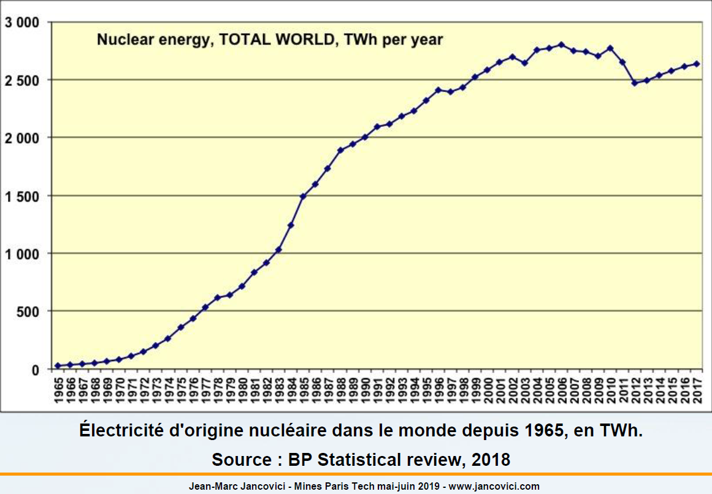
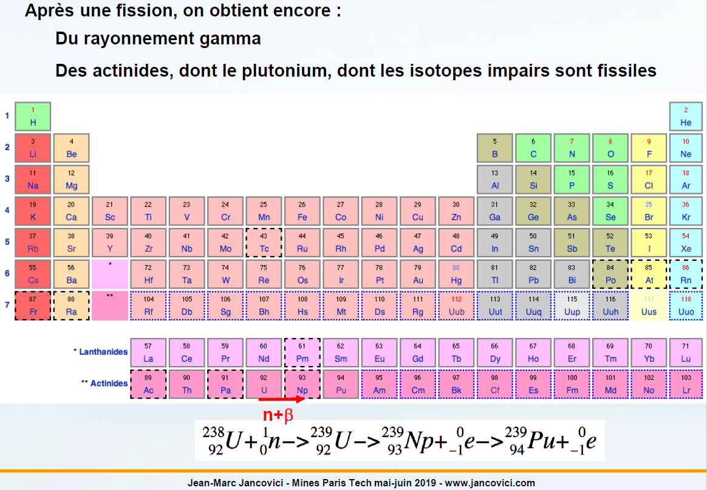
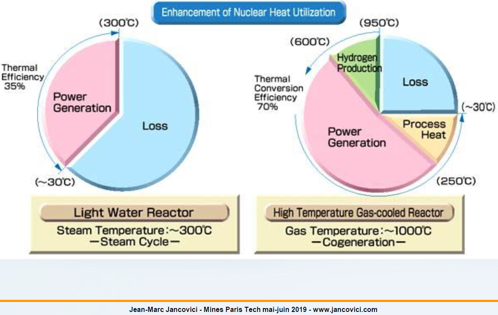

# ECC6 - Le nucléaire

On va aujourd'hui parler du sujet préféré des français quand il s'agit de débattre de l'énergie, c'est à dire du nucléaire.

## Principe de base

Une énergie nucléaire est tout simplement une énergie associée à une modification de noyaux atomiques (nucleus = noyau). Il y a deux manières distinctes d'avoir de l'énergie impliqué dans quelque chose qui ce passe au niveau d'un atome, on peut :

* soit avoir un ré-arrengement des couches électroniques, et à ce moment ca s'appelle soit une excitation, soit une réaction chimique;
* soit avoir un ré-arrengement des nucléons, et à ce moment ca s'appelle une énergie nucléaire.

Donc l'énergie nucléaire, c'est l'énergie du ré-arrengement des nucléons qu'on peut avoir avec des noyaux atomiques. Il y a deux manières d'avoir de l'énergie nucléaire :

* La première c'est l'énergie qui est associée à la fission : on prend un gros noyaux, on le casse en deux, ou plus exactement en deux gros morceaux et plein d'autre petits, et ca c'est une réaction qui libère de l'énergie.
* La deuxième manière c'est au contraire de prendre deux noyaux très légers et de les fusionner en un seul, et à ce moment c'est pareil, on a de l'énergie qui est disponible.

Dans les deux cas de figure, $e = mc^2$ la masse du/des noyaux à l'arrivée est plus faible que la masse du/des noyaux au départ, et la différence est de l énergie cinétique pour les produits de fission et rayonnement gamma.

En gros dans les deux cas de figure, on profite du faite que l'énergie de liaison dans les noyaux n'est pas la même quelque soit la taille du noyau et donc dans les petits et les très gros noyaux, l'énergie de liaison est un peu plus faible que dans les noyaux intermédiaire et donc en ré-arrengant la taille des noyaux, on peut obtenir de l'énergie. Donc en gros, ou bien on fait de la fission (i.e. casser un noyau en deux avec libération d'énergie; cette énergie est essentiellement contenu soit dans du rayonnement électromagnétique, soit dans l'énergie cinétique des bouts de noyau après fission), soit on fait l'exacte inverse c'est à dire de la fusion (on assemble, on joue au Lego, et à ce moment le différentiel d'énergie de liaison se retrouve libérer dans l'environnement sous forme également d'énergie cinétique et de rayonnement électromagnétique).

Quelque chose qui est important, c'est de savoir qu'il y a un énorme facteur multiplicateur entre l'énergie chimique (i.e. l'énergie du ré-arrengement des électrons que l'on peut avoir avec un atome) et l'énergie nucléaire (i.e. l'énergie du ré-arrenegement des nucléons). L'ordre de grandeur qu'on a entre les deux, c'est l'ordre du million. Dit autrement, on a un million de fois plus d'énergie dans la fission d'un gramme d'uranium que dans la combustion d'un gramme de pétrole. Dit encore autrement, fissionner un gramme d'uranium libère la même quantité d'énergie que de brûler une tonne de pétrole. La raison à cela c'est que l'énergie typique de ré-arrengement d'une couche électronique c'est quelques eV tandis que l'énergie typique d'une réaction de fission, c'est quelques centaines de millions d'eV. On perd une partie au passage mais peut importe. Donc la raison pour laquelle l'énergie nucléaire est très concentrée, c'est liée à ca, c'est liée au fait que l'énergie de ré-arrengement des noyaux dans un atome est quelque chose de beaucoup plus intense que l'énergie de ré-arrengement des électrons. La réaction nucléaire met en jeu des énergies de quelques centaines de MeV par atome fissionné ou fusionné alors que la combustion du carbone, c'est environ 5 eV (plus d’un million de fois moins) par atome de $C$. Il y a donc à peu près autant d'énergie dans la fission d'un gramme d'$U235$ (ou de $Pu239$) que dans la combustion d'une tonne de pétrole.

On a soit dit en passant une grosse bombe thermo-nucléaire permanante dans notre environnement qui nous rend bien service et qui s'appelle le Soleil. Le Soleil c'est un endroit ou on a de la fusion en permanance. Ce qu'il faut savoir c'est qu'en fait, toutes les énergies que nous utilisons sur Terre sont des dérivés directes ou indirectes de l'énergie nucléaire. Le rayonnement solaire à l'évidence est dérivé de l'énergie nucléaire; toute les énergies fossiles sont des résidus d'énergie solaire un peu cuites par la géothermie, des énergies dérivées de la photosynthèse, donc indirectement dérivée du rayonnement solaire, donc de l'énergie nucléaire; le vent c'est pareil, machine climatique, donc Soleil; hydroélectricité, cycle de l'eau donc Soleil; végétaux et dérivés, photosynthèse, ex-solaire; etc. Donc en gros, sans énergie nucléaire, nous ne sommes pas sur Terre. L'énergie nucléaire est à l'origine d'à peut prêt toute les sources d'énergie qu'on utilise sur Terre. Toutes les renouvelables - sauf la géothermie (qui provient de la radioactivité naturelle des roches) et les marées - sont des conséquences de l'énergie solaire donc nucléaire arrivée « récemment ». Tout ce qui compose la Terre (et la Lune, qui nous fournit les marées) a été « forgé » dans les étoiles de la génération précédant le Soleil, par la suite de réactions nucléaires.

Le nucléaire a une particularité qui n'en est pas une, c'est qu'il a démarrer son existence sur Terre sous forme millitaire. C'est pas tout à fait vrai puisque avant de faire la bombe atomique, il fallut faire la pile de Fermi, qui soit dit en passant avait la puissance totalement ridicule d'un demi watt. C'est la preuve qu'on peut faire de tout petit réacteur nucléaire. Mais après les premières manifestations visible ont était les manifestations millitaires et du coup, c'est une partie de la mauvaise presse qui est liée au nucléaire, cela étant, quand on regarde un peu dans l'histoire des technologies mise au point par les Hommes, beaucoup de ce qu'on fait aujourd'hui a titre civil (en parti malheuresement) née à cause des vélléités militaires, c'est notamment le cas pour la robotique, c'est le cas pour Internet, un parti des engins à moteurs, etc. On a d'abord chercher à en faire des usages militaires avant d'en faire des usages civils. Donc de ce point de vue, le nucléaire ne fait pas exception. Heuresement ou malheuresement.

Quand on s'intéresse à la production électrique, le nucléaire, fondamentalement, c'est une manière de faire bouillir de l'eau. Donc fondamentalement, une centrale nucléaire c'est une bouilloir compliquée. C'est quelque chose qui permet de faire bouillir de l'eau en grande quantité, sans utilisé d'oxydation du carbone c'est à dire sans combustion, et on va le voir nonobstant ce qui peut être dit ici et là pour pas très cher. On aura pas le temps de disserter dans ce cours sur tout les aspects parce c'est des débats technique et compliqué, mais en gros, c'est une grande quantité d'énergie, pas de combustion, et pas très très cher.

La différence entre une centrale nucléaire et une centrale à charbon (ou une autre centrale thermique), elle est donc dans la manière de produire la chaleur. En ce qui concerne une centrale à charbon, on fait brûler du charbon. En ce qui concerne une centrale nucléaire, on fait fissionner des atomes. Tout ce qui se passe derrière est identique. C'est à dire que dans un cas comme dans l'autre, ca va nous dégager des grandes quantité de chaleur, avec ces grandes quantité de chaleur on va créer de la vapeur, et avec cette vapeur on va faire tourner une turbine (un truck avec des ailettes), et il se passe la même chose que dans l'alternateur de notre voiture, c'est à dire qu'une fois qu'on a mis un rotor en rotation dans un champ magnétique, ca nous sort du courant. On peut avoir dans les deux cas de figure, ou pas, ce qu'on appelle un aéro-réfrigérant, cette grande tour qui fume (à droite), c'est l'image épinal de la centrale nucléaire à la télévision, alors qu'en fait cette grande tour fume n'est rien d'autre qu'une tour de refroidissement, c'est donc notre source froide de notre machine de Carnot, et cette tour de refroidissement on en a besoin que l'on est du nucléaire ou du charbon dès lors qu'on est en bord de rivière, et donc que l'on a besoin de la chaleur latente d'évaporation pour refroidir, parce que le débit de la rivière n'est pas suffisant pour refroidir simplement par conduction thermique. Quand on est en bord de mer, notre source froide c'est d'aller perdre des calories dans la mer et on a pas besoin d'aéro-réfrigérant. Quand on regarde une centrale nucléaire française qui est situé en bord de mer, Gravelines, Penli ou Blayais, on a pas d'aéro-réfrigerant. Par contre quand on a une centrale à charbon en bord de rivière, on a une tour de refroidissement comme celle la. Donc la tour de refroidissement c'est pas l'apanache du nucléaire, c'est l'apanache d'une centrale thermique en bord de rivière.

Le nucléaire c'est une manière de produire de l'électricité. C'est quelque chose que l'on voit apparaitre dans les énergies finale dans l'électricité. C'est aujourd'hui un peu moins de 15% de l'électricité mondiale. C'est une part qui a plutôt tendance à baisser un peu parce que le nucléaire en gros est plutôt une énergie qui n'a pas beaucoup la côte par rapport à d'autres.

## Production nucléaire dans le monde

Si on regarde combien on produit d'énergie nucléaire dans le monde, on voit ici la production depuis 1965 dans le monde. C'est une énergie qui est très récente, la pile de Fermi c'est 1942. On voit que c'est quelque chose qui c'est fortement accélerer après les chocs pétroliers, qui a fortement ralenti au moment des contre-chocs au moment des années 1980, qui c'est beaucoup calmé après le début des années 2000 (a un moment ou le pétrole n'était pas très cher). On observe une baisse en conséquence à la fois de la crise de 2009 et de Fukushima et depuis ca recommence à monté gentiment, on verra que les japonais redémarre des réacteurs les uns derrière les autres. La on a une image un peu globale en ce qui concerne le nucléaire, après on peut avoir des images qui sont extrêmement discriminé par pays.

La puissance typique d'un réacteur nucléaire c'est entre 1/2GW et 1GW. L'EPR c'est un très gros réacteur qui fait 1.5GW. Il y a 8760 heures dans l'année donc si on prend 1GW et que ca fonctionne à puissance maximale toute l'année, à la fin on a 8760GWh de production électrique, soit environ 8,8 TWh. Comme une centrale nucléaire ca ne fonctionne pas tout le temps, parce que de temps en temps il faut l'arrêter pour recharger, etc. et que de temps en temps ca fonctionne pas à pleine puissance dans certain pays (comme en France, dans la quasi-totalité des autres pays ca fonctionne à pleine puissance), en gros une centrale nucléaire d'1GW dans l'année va produire de 6 à 8 TWh. Donc ca nous donne une règle simple quand on voit la quantité de TWh produite dans l'année.

Une centrale peut avoir plusieurs réacteurs. En France la moyenne c'est 3-4 réacteurs par centrale. La plus grosse en Fracne, c'est Gravelines qui a 6 réacteurs. Ca peut descendre à 2 mais en général il y en a plusieurs sur un site.

On a ici l'exemple de l'Italie dont on voit qu'elle a d'abord un réacteur en fonctionnement, elle en met un deuxième en fonctionnement et en 1986 Chernobyl, réferendum en Italie, décision de sortie du nucléaire, et crack overnight, il n'y a plus rien.

On a ici un autre pays bien connue qu'est le Japon. On voit que le Japon a une production qui augmente, qui est quasi stable (avec de temps en temps des fermetures), puis en 2011 on a Fukushima, et puis ils ont commencer à en redémarrer environ 8-10.

On a ici l'Allemagne dont on sait qu'elle a décidé de sortir du nucléaire. L'année 2006 qui marque le début de la baisse de production nucléaire allemande correspond au début du plan Schröder. Fukushima est marqué par la ligne noire vericale. Donc en fait, au moment ou l'Allemagne accélère sa sortie du nucléaire au moment de Fukushima, elle ne fait qu'enterinner quelque chose qui a démarrer des années avant, au début des années 2000 et qui est quelque chose que Merkel avait essayer d'arrêter juste avant Fukushima, puis arrive Fukushima, puis elle dit "c'est bon, on plie".

On a ici un pays qui n'a pas vraiment décider d'arréter qui est la Chine et qui dit concentrer environ la moitié des réacteurs en construction dans le monde et qui a démarrer 1 puis 2 EPR, le deuxième venant d'entrer en service vers Mai 2019.

On a ici la Corée du Sud qui a une fraction assez significative de son électricité qui provient du nucléaire qui aussi récemment c'est tater sur la question de sortie du nucléiare.

On a ici le Royaume-Unis qui est un exemple intéressant de pays qui a très envie d'avoir du nucléaire, qui en a globalement actuellement plutôt de moins en moins par défaut d'investissement. Le Royaume-Unis est un pays assez libérale, c'est à dire qu'on compte beaucoup sur le privée pour faire des choses, or ce qu'on verra un peu plus tard c'est que le nucléaire par opposition au charbon ou au gaz à la particularité d'avoir une structure économique dans laquelle il faut payer à peut prêt tout avant de démarrer la centrale. On a une énorme part de l'investissement et derrière une part relative des coût de fonctionnement qui est très faible. Quand on est dans un contexte dans lequel il faut payer à peut prêt tout avant de démarrer la centrale, c'est un contexte dans lequel dans le monde du capital privée, ca a du mal à se faire. Dit autrement le capital privé aime bien ne pas trop pas attendre pour voir le rendement de l'argent arrivé en retour donc quand il faut mettre plein d'argent, construire 8 ans, éventuellement 10, éventuellement 12 avant de commencer à avoir 1€ de chiffre d'affaire, c'est quelque chose que le privé n'aime pas du tout. Donc le fait en Grande-Bretagne d'avoir mis dans le domaine privé (comme dans beaucoup d'autre endroit en Europe, mais eux encore plus tôt que les autres) le système de production électrique a conduit à un défaut d'investissement (il s'est passer exactement le même processus dans le train en Grande-Bretagne). En ce moment il sont en train de faire machine arrière toute, mais il n'empêche qu'on paye ce défaut d'investissement avec le fait que le nucléaire que les grand-bretons aiment bien à vu sa part baisser.

On a ici un pays qui a également un parc nucléaire significatif qu'est la Suède. La Suède a une production nucléaire conséquente. On voit que la zone encadrée en rouge correspond à une année ou les suédois ont décider de sortir du nucléaire. Ils ont fait un référendum et ont décidés de la sortie du nucléaire. La contrepartie du fait que le nucléaire est un système très lent à s'installer c'est que c'est aussi un système qui une fois qu'il est en place (le nucléaire amortis étant quelque chose d'extrêmement peu chère),s'en passer comme ca en disant on va s'en débarasser et puis en fait on va le remplacer et ca va pas nous coûter chère est quelque chose de très difficile, malheuresement ou heuresement. On verra qu'une fois qu'on a mis le doigt dans le nucléaire, c'est pas facile d'en sortir rapidement, ce qui n'est pas nécessairement quelque chose de très génant, mais c'est une caractéristique qu'il faut avoir en tête.

Ici, c'est pareil on a la Suisse ou dans la zone encadrée en rouge fait un référendum dans l'autre sens. Le suisses font un pas en avant, un pas en arrière. La zone cerclé en rouge est une année ou ils disent, avant il y avait un moratoire sur la construction de nouvelle centrale nucléaire, le cadre législatif en Suisse était de dire "on s'interdit de construire de nouvelle centrale", puis en 2003, ils votent en disant "on s'autorise à construire de nouvelle centrale si on veut". On voit le résultat sur la production tout à fait nulle. Ils ont juste dit on en fait si on veut et ils n'ont rien fait. Puis récemment ils ont voté dans l'autre sens en disant on décide d'en sortir et d'ici à 30 ans, il n'est pas exclut qu'il change d'avis au moins une fois.

On a ici l'Ukraine qui est un pays qu'on connait un peu puisque c'est dans ce pays qu'on a eu Tchernobyl (cerclé en rouge). Donc ce que peut de gens savent c'est qu'après Tchernobyl, l'Ukraine a doublé sa production nucléaire.

On a vu la un rapide tour de piste qui nous montre qu'en ce qui concerne le nucléaire on a des évolutions selon les pays qui sont contrastés et qui ne correspondent pas nécessairement à l'idée qu'on en a dans un sens comme dans l'autre. Maintenant on peut ranger les pays qui font du nucléaire de plusieurs manière, la première manière qu'on peut avoir de les ranger, c'est de les ranger par production en valeur absolue. La ce qu'on voit si on les range en production en valeur absolue c'est que le premier pays au monde en production nucléaire c'est les Etats-Unis ou le nucléaire représente à peut prêt 20% (on le verra juste après) de la production électrique et ils ont une production en valeur absolue qui représente à peut prêt le double (un peu plus) de la production française. Ils ont une centaine de réacteurs en activité dans ce pays.

Après, on peut ranger par part dans la production électrique. A ce moment la France arrive en tête mais on a quelques pays qui arrive juste derrière avec la production nucléaire qui représente une grosse moitié de la production électrique. Ils sont pas à 70% mais ils sont comme même à 50%.

Après on peut les ranger encore d'une autre manière, en production en valeur absolue par personne, c'est à dire la quantité de kWh nucléaire utilisé par personne et par an dans un pays. Et la ce qu'on voit c'est que le pays qui arrive en tête du classement c'est pas la France mais la Suède. Donc la Suède est le pays au monde qui a la plus grosse capacité installée et la plus grosse production annuelle par personne en nucléaire. Ca veut aussi dire qu'ils ont des consommation électrique par personne très élevé. Ils sont un peu après la Norvège qui a une consommation électrique par personne qui est environ le triple de celle de la France, et les suédois se balladent quelque part entre le double et le triple.

## La fission

On va maintenant rentrer un peu plus dans le détail. La fission c'est une manière d'exploiter le fait que quand on casse un très gros noyaux en deux, ca nous libère de l'énergie. En pratique, il y a deux première chose à savoir c'est que la fission n'arrive qu'a des noyaux atomiques qui ont un numéro atomique supérieur à 89, et par ailleurs, ce n'est possible qu'avec des isotopes impair (les isotopes pairs ne fissionnent pas). Donc par exemple l'Uranium 238 ne fissionne pas; l'Uranium 235 oui; le Plutonium 239 fissionne; le Plutonium 240 ne fissionne pas; etc. Dans la majeur partie des cas, cette fission il faut la provoquer, elle est assez rare. L'équation générale d'une fission est présenter ici :
$${}^{235}_{92}U + {}^{0}_{1}n \rightarrow {}^{n}_{p}X + {}^{n^\prime}_{p^\prime}Y + k {}_0^1n + \gamma$$
On a un noyau d'Uranium qui capture un neutron, ca lui donne une indigestion et il va éclater en $n$ morceaux avec 2 gros morceaux ($X$ et $Y$), plusieurs très petits, quelques neutrons et du rayonnement gamma. Donc on a $^{235}_{92}U$ le noyau fissile de départ; $^{0}_{1}n$ le neutron qu'il est capable d'absorber (tout les noyaux fissiles ne sont pas capable de fissionner avec tout les types de neutrons, il y a deux catégorie de neutron dans un réacteur nucléaire, on a les neutrons qu'on appelle rapide qui sontt les neutrons à l'énergie qu'ils ont juste après la fission qui les a créer, donc quand la fission a lieu et au moment ou elle a lieu, les neutrons qui sont éjecter $k_0^1n$ ont une énergie de quelque millions d'eV et ces neutrons il y a des noyaux fissiles qui sont capable de les absorber quand ils passent à proximité, donc on a le "Federer de la capture de neutron", quelque soit la vitesse il l'attrape, et puis il y "nous" c'est à dire que si ca passe trop vite à notre portée on ne sait rien en faire, il faut que ca passe lentement pour qu'on soit capable d'aller le chercher et ces neutrons qui passe lentement on les appelle des neutrons thermique, ca veut dire qu'ils ont une énergie cinétique de l'ordre de l'électron volt, beaucoup moins que le millions d'eV qu'ils ont au moment ou ils ont étaient créer); on a $^{n}_{p}X + ^{n^\prime}_{p^\prime}Y$ la création de ce qu'on appelle les produits de fission, c'est les deux noyaux qui sont issues de la fission de l'uranium; des neutrons $k_0^1n$ (1 à 4); et du rayonnement gamma $\gamma$.

On a en dessous un exemple : 
$${}^{235}_{92}U + {}^{0}_{1}n \rightarrow {}^{90}_{36}Kr + {}^{142}_{56}Ba + 4 {}_0^1 n + \gamma$$
on a la un noyau d'uranium qui fissionne et qui nous fait 1 noyau de Krypton (qui soit dit en passant est gazeux, donc dans les produits de fission on a des produits qui sont gazeux, qui vont spontannéement à ce moment, parce que chimiquement ils ne s'associe à rien, vouloir sortir du coeur), on a du Baryum et on a 4 neutrons et du rayonnement gamma. Donc c'est l'équation général de la fission, ca ressemble toujours à ca.

Nos produits de fission, la nature a decider de faire un peu de biodiversité dessus et donc nous n'avons jamais exactement les mêmes à chaque fission. En fait les produits de fission couvrent une très très large variété de numéro atomique comme on le voit sur la figure, cela étant il sont comme même centrés sur deux pics, c'est à dire qu'il y a deux endroits ou on va préférentiellement retrouvé nos produits de fission, on va en gros les retrouver, donc l'uranium initial c'est 92, et donc en gros on va retrouver 30 et 60 à l'arrivée, les neutrons ca compte pas évidemment, ca compte pas dans le numéro atomique, donc à l'arrivé on va retrouver 30 et 60 en ordre de grandeur. Beaucoup de ces produits de fission, on va retrouver en particulier de l'iode (I), du césium (Cs), du strontium (Sr), du krypton (Kr), etc. Les produits de fission, l'essentiel sont radioactifs avec des demi-vie qui vont d'une fraction de seconde jusqu'à des milliers d'années donc il y a un peu de tout la dedans. L'essentiel des produits de fission on des demi-vie qui n'excéde pas quelques dizaine d'années. La radioactivité des produits de fission est comme même une radioactivité qui décroit très vite, on va le voir derrière.

Les neutrons qui sont créer par notre fission, il y en a une partie également qui vont être absorbés par les noyaux d'uranium que l'on a dans le réacteur, et en particulier l'uranium 238 et qui vont nous créer des noyaux dont le numéro atomique est au-delà de l'uranium : du plutonium, du protactinium, de l'americium, du curium, etc. Ces trucks la s'appelle dans le tableau de Mendeleiv des actinides et souvent on appelle ca des actinides mineurs parce que de fait ils sont présent en petite quantité dans la barre d'oxyde d'uranium. Ces actinides, certain vont fissioné en cours de réaction soit dit en passant, d'autres non, et donc on va les récupérer dans le combustible usé qu'on ressort à la fin.

L'uranium 235, lui il aime bien les neutrons thermique, donc au moment ou ils sont éjecter les neutrons sont trop énergetiques pour être utiliser par un autre noyau d'uranium 235. Or l'idée, c'est que (1) une fission d'uranium 235, les neutrons qui sont émis à l'occasion de cette fission, on s'en sert pour allez fissionner ensuite d'autre noyaux d'uranium 235. Ca veut dire deux chose cette histoire, ca veut dire d'abord que le neutron qui va aller fissionner un nouveau noyau d'uranium 235, il ne doit pas aller trop vite, sinon ca marche pas (l'uranium 235 il est comme nous, c'est pas Federer donc il ne sait pas attraper les neutrons qui vont trop vite), et donc il faut le ralentir dans un premier temps. Pour ca, on va utiliser ce qui s'appelle un modérateur, et le modérateur c'est juste joué au billard avec le neutron qui a était créer jusqu'au moment ou il a perdu suffisament d'énergie par choc élastique sur d'autre petit noyaux pour devenir un neutron thermique. Quand on a un choc élastique entre deux objets de même masse, c'est la qu'on perd le plus d'énergie cinétique dans l'objet incident. Quand on a un choc élastique sur un mur parfait, on ne perd rien. Donc si on a une masse infini en fasse de nous, un choc élastique on ne perd absolument pas d'énergie. Le maximum d'énergie on va le perdre quand on va tapper contre un truck qui a exactement notre masse, c'est un exercice de mécanique classique ca. Si on tape contre un truck qui a une masse microscopique, on perd très peu d'énergie aussi, l'autre truck par contre par à toute vitesse, mais ca emporte pas d'énergie, il faut qu'on tappe contre un truck qui a la même masse que nous. Or qu'est-ce qui a la même masse que un neutron, et bien un autre neutron ou un proton. Donc le meilleur modérateur qu'on est c'est les noyaux d'hydrogène de l'eau. Et donc c'est donc la raison pour laquelle le modérateur qu'on met dans un réacteur par excellence, c'est juste de l'eau, qui soit dit en passant sert aussi de caloporteur, il sert aussi a évacuer la chaleur. Et du coup on a un élément de sécurité passive, c'est que si on perd le caloporteur, il y a une fuite dans le circuit par exemple, certe on n'est plus capable de refroidir notre coeur, mais par ailleurs la fission s'arrête. C'est un élément de sécurité passive important.

On a vu tout à l'heure qu'une fission ca faisait entre 1 et 4 neutrons. Si on veut que notre réaction en chaîne soit stable, c'est à dire qu'au cours du temps, elle nous produise toujours la même quantité d'énergie, il faut que le 1 à 4 neutrons que l'on a produit lors d'une fission se transforme en 1 neutron capturé par un autre noyau d'uranium 235 et juste 1. Si a partir d'un noyau qui fissionne, on fait capturer 2 neutrons par 2 autres noyaux, puis 4, puis 8, puis etc. ca s'appelle une bombe. On a quelque chose qui diverge très vite et c'est soit dit en passant exactement le principe de la bombe atomique. Dans la bombe atomique, on a les première fission qui font une réaction en chaîne qui va très très vite, et tout ca fait boum. Dans un réacteur ca peut pas aller au niveau d'une bombe atomique mais ca peut comme même fiche le truck en l'air, c'est exactement ce qui c'est passer à Tchernobyl et si on veut pas que ca arrive, il faut que quand on a plus d'un neutron qui est créer dans la réaction de fission, les neutrons excédentaires soit absorber par quelque chose qui a dans le réacteur et qui nous permet de n'avoir à l'arrivé qu'une seul nouveau neutron pour fissioner un autre noyau d'uranium 235. Et donc on a dans un réacteur, outre la matière fissile, deux constituants qui sont des éléments essentiels qui sont d'une part des absorbeurs de neutrons (notamment le Bore), et d'autre part un modérateur (typiquement de l'eau, il y a des réacteurs dans lesquelle le modérateur est du graphite mais aujourd'hui on fait plus ca, pour plein de raisons dont le fait que si on perd le caloporteur on ne perd pas le modérateur et donc ca empêche pas la réaction de continuer à se produire, donc la on est dans un très mauvais cas de figure dans lequel la réaction continue à se produire et on a pas de quoi refroidir le coeur). Donc les réacteur à graphite (et tchernobyl était un réacteur à graphite) on en trouve pas en fonctionnement en France, on en trouve en cours de démentellement mais pas en cours de fonctionnement.

Donc le but du jeu dans un réacteur, c'est qu'on est en régime permanant exactement un neutron capturé pour fissionner un autre noyau par fission. Si on veut faire monter notre réacteur en puissance, transitoirement on va faire passer de 1 à 1,0...01, un tout petit peu plus que 1, et si on veut calmer notre réacteur, on va faire exactement l'inverse, c'est à dire que pendant un temps, on va passer de 1 à 0,9...9 jusqu'au moment ou notre truck dessend un peu en puissance.

La dedans on a également l'émission de rayonnement gamma. Normalement les neutrons il n'en sort pas trop du réacteur parce qu'on les a absorbé avant, par contre on a plein de rayonnement gamma qui sort du réacteur, c'est pour ca qu'un réacteur en fonctionnement on évite d'aller se promener à côté, et donc qu'on a une enceinte du confinement qui est autour du coeur. Tout ca c'est dans une cuve en acier, on a nos assemblages d'oxyde d'uranium, et l'eau qui cicrcule autour qui sert à la fois de modérateur et de caloporteur. Et tout ce truck la qui nous crache allégrement du gamma est mis dans un endroit à l'intérieur d'un truck en béton ou on est sûre que les gamma vont pas aller à l'éextérieur et comme ca il n'y a pas de problèmes.

Les actinides c'est les produits plus lourds, au delà de l'uranium dans le tableau périodique des éléments qui sont créer par absorption successive de neutrons et désintegration radioactive. La on a l'exemple ou on passe de l'uranium 238 au plutonium en ayant commencer par absorber un neutron (l'uranium 235 si il absorbe un netron il fissionne). Dans un réacteur, il y a un mélange d'uranium 235 et 238. Dans les réacteurs français, l'uranium 235, au moment ou on enfourne l'uranium c'est à peut prêt 3.5% du totale, ca veut dire qu'environ 96.5% c'est de l'uranium 238. On a des réacteurs dans le monde qui fonctionnent avec de l'uranium dit naturel, donc à 0.7% d'uranium 235 mais à ce moment il nous faut de l'eau lourde en général pour que ca marche.

L'uranium qui est capable de monter dans le tableu périodique des éléments c'est l'uranium 238, en gros c'est assez simple, l'uranium 235 on lui envoi un neutron il fissionne, donc il ne peut pas monter en numéro atomique puisqu'il fissionne. Donc le seul qui peut monter en numéro atomique, c'est l'uranium 238, il absorbe un neutron, après il nous faut une désintegration $\beta^-$, et du coup ca nous créer un proton dans le noyau, et donc la ca monte en numéro atomique, et donc on va monter comme ca, on va créer du plutonium, du neptunium, de l'américium, du curium, etc. qui s'appelle tous des actinides. Dans les réacteurs actuelle une petite partie fissionne, mais dans le combustible usé en sortie de réacteur on va trouver comme même. Dans les dessins imaginer pour une partie de la génération quatre, il y a des gens qui souhaite qu'on fasse des réacteurs dans lesquelles ces trucks la sont brûlé au fur et à mesure qu'il sont produit, ce qui est possible.

On a ici (en haut) quelque chose qui va nous donner du plutonium. Le plutonium peut fissionner et à ce moment on peut imaginer un réacteur qui est basé non pas sur la fission de l'uranium 235 mais sur la génération en continu de plutonium puis la fission du plutonium. C'est ca qu'on appelle le surgénérateur, typiquement Phénix ou Superphénix, c'est un réacteur dans lequel c'est l'uranium 238 qui sert de combustible, sauf qu'il sert de combustible en ayant besoin de deux neutrons, donc c'est quelque chose qui est plus compliqué à piloter parce que c'est pas un truck instantanné, on doit tenir compte des temps de formation et des temps de décroissance radioactive pour avoir du plutonium derrière. Il y a deux avantages à ces réacteurs la, le premier c'est qu'on a pas besoin de modérateur, typiquement le plutonium il s'est fissionner avec des neutrons thermique et des neutrons rapide, donc on a pas besoin de modérer les neutrons, et le deuxième évidemment c'est qu'au lieu de bruler (ou plutôt d'utiliser, de profiter, parce que brûler est un terme impropre, l'uranium est un métal) une toute petite partie de l'uranium qu'on trouve dans la nature (l'uranium 235 c'est 0.7% de l'uranium qu'on trouve dans la nature), en utilisant des réacteurs de ce type la on utilise la totalité de l'uranium qu'on trouve dans la nature. Donc ca veut dire qu'on est capable de multiplier par un facteur 200 en ordre de grandeur le potentiel énergetique de l'uranium qu'on trouve dans la nature. Le caloporteur dans ce type de réacteur, pour Superphénix typiquement c'était du sodium. Il y a également une famille de réacteur qui fonctionne avec du sel fondu, on a un grand bain dans lequel tout est mélanger. Les réacteurs rapides qu'on a fait fonctionner longtemps en France, il y a eu un réacteur industriel qui s'appellait Superphénix, mais qui a était arrêter au titre d'un compromis politique et démanteler, par contre il y en a un autre qui était plus petit qui s'appellait Phénix qui lui a fonctionner pendant 30 ans de façon tout à fait normal, mais qui a aussi était arréter et qui est en cours de démentélement en ce moment.

On peut également se servir du thorium dans le même esprit. Le thorium après absorption d'un neutron se transforme en uranium 233 qui est fissile. Donc c'est exactement le même principe qu'avec le plutonium, ce qui veut dire qu'il y a deux couples dans la nature qui peuvent servir à faire des réacteurs nucléaires, à neutron rapide et surgénérateur, c'est uranium-plutonium ou thorium-uranium, mais c'est pas le même isotope (233). Cela étant, ces éléments (l'uranium 238 et le thorium 232) comme il faut leur envoyer des neutrons pour qu'ils se mettent à fissionner, ca veut dire qu'on doit avoir une source de neutron pour démarrer la réaction. Donc en fait on ne peut pas démarrer un réacteur nucléaire juste avec de l'uranium 238 ou avec du thorium 232, on est obliger de le démarrer avec quelque chose qui fissionne naturellement, donc l'uranium 235 et c'est une fois que le truck à démarrer qu'on peut rajouter derrière quelque chose, de l'uranium 238 ou du thorium 232. Donc en gros c'est des cycles qui permettent d'augmenter le potentiel d'une énergie nucléaire qui existe déjà à base d'uranium 235 mais ca permet pas de la remplacer en totalité.

## Cycle de vie

Les générations c'est comme les versions de Windows, c'est toujours le même principe mais on dit que ca s'améliore. On a eu la Génération 1, c'était les réacteurs à uranium naturel graphite-gaz. Il y en a un certain nombre qui ont était construit en France, ils ont tous était arréter au moment ou ce qui tenait lieu d'autorité de sûreté a dit à EDF que ces trucks la on trouve que ce n'est pas terrible et ou bien vous faites tel et tel type de travaux de mise en conformité, ou bien vous arréter; EDF a fait ses calculs et a dit on arrête. Donc on a déjà eu en France une première vague d'arrêt de réacteur avant terme, pas du tout pour des raisons politiques, pas du tout parce qu'on a dit c'est hyper-dangereux, etc et puis tel type d'électeurs souhaiterait qu'on les arrêtes, pas du tout; c'est l'autorité de sureté qui a dit ca ca me va pas. La deuxième génération qu'on a aujourd'hui c'est essentiellement des réacteurs en France = à eau préssurisé, l'autre grand dessein, c'est les réacteurs à eau bouillante. La troisième génération c'est en fait du 2+, puisque ca ne change pas vraiment dans le concept, donc c'est l'EPR ou d'autre truck de cette nature. Et enfin, il y a un certain nombre de gens qui réfléchissent à la génération d'après, qui aujourd'hui est un concept au sens ou la génération d'après on lui a donner un cahier des charges qui est : exploiter tout l'uranium, fermer le cycle (i.e. ne pas sortir des trucks qui peuvent encore servir du combustible usés, typiquement le plutonium ca peut encore servir, on peut encore tiré de l'énergie du plutonium, donc c'est dommage de sortir du combustible usé du réacteur et puis d'aller mettre ca directement dans un trou ou dans un stockage de déchets sans recycler, sans extraire de ce combustible ce qu'on peut encore valoriser à des fins énergetiques),minimiser les déchets, et sureté passive dans le réacteur. Donc il y a certain nombre de truck, ca doit satisfaire à ca, ca, ca, et ca, et il y a un certain nombre de concepts qui sont explorés en ce moment.

Voici un assemblage d'uranium tel qu'on les utilise dans les réacteurs français. On a la des grands tubes en alliage de zirconium à l'intérieur duquel on a des pastilles d'oxyde d'uranium, c'est comme ca que c'est enfourner. L'eau peut circuler entre ca, ca s'appelle des crayons ces petits tubes. On remarque que cet opérateur manipule cet assemblage pas à mains nues pour pas mettre des traces de graisse, mais sans aucune protection radiologique. Donc en fait l'uranium au moment ou il est enfourner dans le réacteur ne présente aucune radio-toxicité particulière, ca radioactivité naturelle n'est pas telle qu'il faille s'en protéger.

Si on parle des assemblages et de la manière dont c'est fait, voila en gros sur cette figure a quoi ca ressemble. L'uranium, comme toute les ressource que nous utilisons dans notre système économique, est gratuite. L'uranium a était fait par mère nature dans la génération précédente d'étoile. Si on retrace l'histoire de l'univers sur les 14 derniers milliards d'années, on a d'abord le Big Bang, une grande soupe de protons, la première génération d'étoiles, et dans cette première génération d'étoiles par fusion successives on a tout le tableau de Mendeleiv qui se créer. La dessus les étoiles pour certaines d'entres elles nous font des très belles supernovea, bazarde tout ca dans l'espace et une deuxième génération d'étoile se forme (il s'en forme évidemment en permanance) et ces poussières issues de la première génération d'étoile vont pour parti aller se mettre en orbite autour de la deuxième génération d'étoile, se condenser et faire des planètes telluriques, typiquement la Terre. Donc pour faire une Terre avec 92 éléments du tableau de Mendeleiv, il faut attendre 10 milliards d'années après le Big Bang. C'est une recette de cuisine qui prend un peu de temps. L'uranium est donc gratuit comme tout le reste, il faut juste aller le chercher. Aller le chercher ca va se faire comme pour tout les métaux dans des endroits ou il y a des concentrations particulière. On trouve n'importe quel métal, n'importe ou, si on est pas regardant sur la concentration. Ca veut dire que si on extrait 1 mètre cube de terre sous l'école des Mines, on va probablement y trouver tout les éléments du tableau de Mendeleiv mais certain sont présent dans des concentrations tel qu'on en fera jamais rien. Donc quand ils sont présent de manière plus concentré qu'ailleurs, ca s'appelle une mine. Dans une mine, on va chercher de l'uranium, on va le chercher sous forme d'oxyde en général, comme tout le reste, mais on a tout un tas d'autre truck qui ne nous intéresse absolument pas. Donc on sort tout d'abord notre minerai, et on concentre ce qui nous intéresse.

Une fois que l'on a récupérer notre uranium (sous forme d'oxyde), on va faire une opération qui s'appelle **l'enrichissement** pour les réacteurs français. L'enrichissement est un mélange compliqué de chimie et de physique qui consiste à prendre préférentiellement dans l'uranium l'isotope 235. Comme l'isotope 235 a très exactement les mêmes propriétés chimique que l'isotope 238, puisque les propriétés chimique ca dépend du nombre de protons, donc d'électrons. Il faut trouver un moyen pour séparer ces deux isotopes qui n'est pas un moyen chimique. On ne peut pas purifier chimiquement de l'isotope 235, ca ne marche pas. La façon dont ca marche, c'est avec des centrifugeuses, c'est ici le grand débat sur la prolifération. Une centrifugeuse c'est un petit cylindre dans lequel on fait tourné de l'hexafluorure d'uranium, un gaz, et on va mettre une écope à l'extérieur du cylindre et une écope à l'intérieur du cylindre près de l'axe de rotation. Une écope c'est un truck qui nous attrape ce qui passe. L'écope qui est prêt du bord du cylindre va nous prendre préférentiellement de l'uranium 238 parce que à cause de la force centrifuge, ou centripède plus exactement, le 238 va avoir tendance à être préférentiellement plus près du bord parce qu'il est plus lourd. L'écope qui est prêt de l'axe de rotation nous prend préférentiellement du 235. Ce préférentiellement, c'est une fraction de pour mille dans chaque centrifugeuse donc il faut les mettre en cascade, les unes derrières les autres jusqu'au moment ou ca nous a enrichit pour l'écope du centre notre uranium préférentiellement en 235 à hauteur de 3%. Mais c'est exactement la même chaîne qui permet de faire de l'uranium à 99,99% d'uranium 235, il suffit juste d'en avoir des milliers. Ces avec ca que les pays qui veulent accéder à l'arme nucléaire en général s'équipe, c'est la même technologie que la technologie civile de la chaîne de combustible sauf que si on en a suffisament, ca permet de faire une bombe. En gros, pour avoir une tonne d'uranium enrichit à 3,5% (ce qui permet de piloter une réaction de fission de façon confortable, si on en met 90% c'est une bombe, donc c'est incontrolable, et si on en met pas assez, ca nous fait pas assez de neutrons et on est pas capable d'avoir notre réaction en chaîne), il nous faut 5 tonnes d'uranium à 0,7%. Donc derrière on va avoir une tonne d'uranium propre à faire du combustible et 4 tonnes d'uranium qui nous serve "a rien". Ca s'appelle de l'uranium appauvrit. L'uranium appauvrit, une des exploitations qu'on en a fait à un moment, c'était des lests pour des voiliers de courses, parce que comme c'est un métal extrêmement dense, ca fait de très grande masse dans des petits volumes, et ca quand on fait des voiliers de courses, on met ca à 4 mètres sous la coque. C'est pas spécialement dangereux.

Une fois qu'on a notre uranium enrichi, donc on en fait des pastilles d'oxyde d'uranium, on met ca dans des tubes en alliage de zirconium, et ca nous fait nos assemblage qu'on met dans le réacteur. On le laisse produire, donc fissionner pendant quelques années, et une fois que c'est sortie, on a la deux écoles en fonction du pays ou l'on est. On a des pays qui dise je prend ca, et ca c'est un déchet, et je le stocke quelque part. Aux Etats-Unis sous Yuka Mountain, les suédois mettent ca dans des fut en cuivre et il collent ca sous terre, et en France on a une autre école qui est de dire on va faire du recyclage la dedans parce qu'il y a une partie de ce qui s'y trouve qu'on peut remmettre dans des assemblages qu'on va ré-enfourner dans des réacteurs, c'est à ca que sert l'usine de la Hague, et ce qui sert vraiment à rien, on s'en débarasse d'une autre manière, c'est ca "l'école française". Donc on a deux écoles dans le monde. Ce qui ne sert plus à rien pour le coût s'appelle vraiment des déchets.

Pour avoir quelques ordres de grandeur des masses en présence, pour 1MWh électrique, on a besoin de 10 kilos de minerai qui vont nous donner une petite vingtaine de grammes d'uranium. On voit que la concentration en uranium du minerai est de l'ordre du kilos par tonnes, donc c'est pas des concentrations importante. On a un métal qui est présent à des teneurs encore plus faible quand on exploite qu'est l'or ou on est typiquement à quelques grammes (environ 10) par tonnes de minerai. Donc la on est comme même très au dessus. On va faire de l'uranium enrichit et avec ca on va faire notre MWh. Ce que ce genre de diagramme nous montre c'est notamment que on a besoin de manipuler des toutes petites quantité de matière pour faire des grandes quantité d'électricité. C'est vraiment par excellence la caractéristique du nucléaire.

Bien évidemment, on a un rendement énergetique de notre affaire. Exactement comme pour le pétrole ou l'on doit utiliser une partie de l'énergie extraite pour pomper le pétrole, le raffiner, le transporter, en ce qui concerne l'uranium, on a besoin d'une partie de l'énergie fournit (pas sous la même forme puisqu'en l'occurence dans les mines c'est du pétrole) pour faire fonctionner la chaîne. On a besoin de mettre du diesel dans les engins de mines, de l'électricité dans l'usine d'enrichissement, etc. Et donc il y a une question qui est quel est le rendement énergetique de l'ensemble. Est-ce qu'on consomme 90% de l'énergie qu'on produit dans la chaîne ou est-ce qu'on en consomme juste une petite partie ? Ce que nous montre ce graphique c'est qu'on en consomme en fait juste une petite partie. Le rendement typique de la fillière nucléaire c'est de l'ordre de 1 pour 50 ou 1 pour 100, c'est à dire que la fraction de l'énergie qui est utilisé dans l'ensemble du cycle pour permettre à l'énergie nucléaire d'être produite c'est de l'ordre de 1 à 2% de l'énergie produite.

En fait c'est extrêmement dépendant de la teneur en uranium du minerai. Ce que nous dit ce graphique c'est qu'au teneur actuelle, on se balade plutôt vers la zone encadrée en bleu de minerai, mais si on a des minerai suffisament pauvre, il faut charier une telle quantité de terre et purifier une telle quantité de matière que l'on peut évidemment se rapprocher d'un rendement de l'ordre de la zone entouré en violet. L'échelle horizontal est logarithmique, en gros, il faut perdre un facteur 100 dans la teneur en uranium du minerai pour que notre affaire commence à ne plus être intéressante, donc en est encore évidemment extrêmement loin.

Par ailleurs, comme on a besoin de toute petite quantité de "combustible" pour produire des grandes quantités d'électricité, le nucléaire est une industrie qu'on appelle à coûts fixe. Dit autrement, l'essentiel du coût économique de production du nucléaire, c'est dans la construction de la centrale et dans la construction des installations amont et aval qui permettent de fonctionner. Les coûts variables, et notamment les coûts de combustibles sont des coûts extrêmements faible dans la chaîne. Dit autrement, une fois qu'on a construit notre centrale, qu'elle fonctionne ou qu'elle ne fonctionne pas, ca nous coûte la même chose. Et en cela, c'est exactement la même structure de coût qu'une éolienne ou qu'un panneau solaire. Une éolienne ou un panneau solaire une fois qu'on la construit ca nous coûte quasiment plus rien, une éolienne faut aller la maintenir un peu de temps en temps, le panneau solaire faut aller lui passer un petit coup d'éponge pour enlever la poussière de temps en temps, mais globalement, on a des coûts de maintenance qui sont faible et l'essentiel du coût est dans la construction du dispositif initial. Le nucléaire c'est exactement pareil, l'essentiel du coût est dans la construction du dispositif initial. Si on refait un tout petit peu de micro-économie, quand on a un dispositif ou on doit mettre tout l'argent d'abord, et avoir des clients et des recettes ensuite, le coût auxquelle on va leur vendre le MWh va dépendre de deux critères absolument central : le coût de construction (on comprend bien que si on construit pour deux fois plus chère, toute chose égale par ailleurs, on vendra pour deux fois plus chère), mais ca dépend également d'un autre élément qui est absolument central et qui rappellera des souvenirs à ceux qui ont vu passé un crédit immobilier, qui est ce qu'on appelle le coût de l'argent, c'est à dire le taux d'intérêt que l'on doit payer soit à notre actionnaire soit à notre banquier pour l'argent qui nous a était fournis pour construire la centrale. Donc quand on construit une centrale, l'argent ne tombe pas du ciel, l'argent vient de deux sources et de deux sources seulement : notre actionnaire et notre banquier. L'actionnaire investit dans le projet, il investit dans la centrale puis il dit "très bien j'ai mis mon argent mais tout les ans je veux que ca me rapporte des dividendes, je veux gagner de l'argent". Notre banquier va nous dire exactement la même chose : "je veux bien vous prêter de l'argent mais a condition que tout les ans vous me payer des intérêts sur la partie que vous m'avez pas encore rembourser".

Ce graphique nous montre combien coûte en euros par MWh pour une centrale qui était d'environ 5.000€ le kW installé en fonction du loyer de l'argent. Donc ce que l'on voit c'est que si on nous prête l'argent gratuitement, même avec un EPR construit chère et hors délai, le remboursement de l'investissement c'est 20€ le MWh, donc c'est pas beaucoup. Par contre, si on a un banquier ou un actionnaire qui considère que "c'est risquer cette histoire et qui nous demande 10%, donc tout l'argent que vous me devez encore ou que j'ai laisser investit dans la boîte, tant qu'il est la c'est 10% par an que vous devez me payer", c'est le rendement du capital. Si on est à 10%, la part de l'investissement dans le coût du MWh frise les 100€. Donc une très grosse différence entre le nucléaire pas chère et le nucléaire chère, c'est tout bêtement combien est-ce que les actionnaires et les banquiers vont nous demander en taux d'intérêts sur l'argent qu'il nous est nécessaire pour construire la centrale. Avec ce petit graphique, on peut faire le calcul inverse en ce qui concerne Hinkley Point (une centrale que les anglais sont en train de construire et c'est une filliale d'EDF, EDF Energies qui est le plus gros électricien anglais, qui est en train de le faire) et dans le milieu des gens qui s'intéresse à la question électrique, les gens qui n'aiment pas le nucléaire nous explique que c'est horriblement chère Hinkley Point parce que ca va produire des MWh à 110€, en fait, avec ce petit graphique, on est capable de savoir que ca vaut 110€ le MWh parce que les actionnaires et les banquiers demandent 10% de rendement sur capital investit, est c'est exactement le taux demander dans ce cas. Les différences avec les autres courbes sont dû au fait que la part du capital dans la structure de coût, la durée de construction et la durée de vie ne sont pas les mêmes. Mais l'important ici c'est la courbe sur le nucléaire et le sujet c'est de montrer que en ce qui concerne le nucléaire, ca augmente très très vite avec le loyer de l'argent, le taux avec lequel on nous demande de rembourser l'argent. Par ailleurs, et c'est aussi pour ca que le nucléaire n'aime pas l'investissement privé, le rendement des capitaux qu'on nous demande classiquement dans une entreprise côté en bourse se ballade entre 10-12%, donc si on nous demande un rendement sur capital investit au alentours de 10-12%, si on est une entreprise côté en bourse et qu'on fait du nucléaire, on ne sait pas le faire à moins de 100€ le MWh, et c'est juste ca le sujet, parce que si on est une société d'état et qu'on nous demande 0, on sait le faire, hors coût variable, pour beaucoup moins chère que ca.

Le nucléaire ne suppose pas d'oxyder des atomes de carbone pour obtenir la source primaire d'énergie, du coup c'est une énergie dont les émissions de CO2 par MWh sont faible. Il y a comme même un peu de CO2 en analyse de cycle de vie, parce que comme on la vu précédemment, il y a des engins de mines, du transports de combustibles, il y a des gens qui viennent bosser à la centrale en voiture, il fauut construire la centrale et donc couler du béton qu'il faut produire et donc des cimenteries et aciéries, il faut traiter les déchets à l'aval, etc. Tout ca fait qu'on a comme même des petites émissions de CO2 à droite et à gauche, mais comme même on voit que c'est des émissions qui sont significativement plus faible que celle des modes concurents fossiles, notamment lignite, charbon, fioul et gaz. Le coût carbone essentiel est dans l'amont du cycle, il est dans la mine et l'enrichissement. Le coût CO2 du démentellement est très faible parce que le démentellement c'est essentiellement passé avec une scie à diamant et découper le truck, quand on fait du démentellement, on a pas besoin de fondre de l'acier, on a pas besoin de faire du ciment, on a pas besoin d'avoir des engins de mine qui nous extrait une tonne pour récupérer 10 kilos de minerai à l'arrivé, donc en fait c'est des opération qui demandent beaucoup de temps parce qu'elles sont très réglementés, mais en terme de flux physique associé et donc d'émissions de CO2 associé à ces opérations la, c'est des toute petite quantité. En gros le démantellement d'une installation industrielle compliqué, que ce soit un réacteur nucléaire ou une raffinerie, c'est 10 à 15% du coût de construction, c'est très dépendant du niveau de réglementation applicable. Plus on a une réglementation qui est contraignante, un exemple typique c'est : n'importe quoi qui sort d'une centrale à l'arrêt est considéré comme un déchet nucléaire, indépendemment du fait que si on mesure la radioactivité ca soit effectivement contaminé ou pas; on a une réglementation à la chinoise pragmatique qui dit on mesure si c'est contaminé on stocke, si c'est pas contaminé ca va bien; et la réglementation française c'est ca sort du site c'est déchet, on traite en tant que tel. Simplement cette différence la augmente le coût et augmente les délais, et des trucks comme ca on en a pléthore dans ce genre d'opérations. On a une centrale aux Etats-Unis, Maine Yankee, qui a était ce qu'on appelle retourner au gazon, c'est à dire qu'à la place de l'ancienne centrale on a aujourd'hui un champ, et en fait l'opération de démentellement du réacteur a était fait pour 450 millions de dollars, sachant que le réacteur neuf coûte environ 5 milliards, on est dans ces ordres la, 10 à 15%, et venant du patron de Totale lui-même, pour une raffinerie c'est pareil, même ordre de grandeur, c'est 10 à 15%, c'est quelque-chose de compliqué avec des tas de produits qu'on a pas envie de se voir ballader partout dans la nature.

## Perception du risque

<!---->

La on a vue grosse maille qu'elle était le principe de l'énergie nucléaire : c'est une manière d'obtenir des grandes quantités d'énergie avec très peu de matière, sans combustion. Ca a ces avantages là, ca a également des inconvénients, ou contrepartie. Il y a quelque chose d'intéressant c'est que le nucléaire en France, pour des raisons toujours pas explicité, a une très très forte asymétrie entre les risques perçues et les risques réels, c'est à dire que c'est un domaine dans lequel les gens ont très très peur, et on va voit que ca se quantifie le fait qu'ils en ait très peur, ils se font plein d'idées qui ne sont pas conforme au fait, et on va voir aussi que ca se quantifie, qui n'existe pas nécessairement dans les autres industrie. On a ici l'IRSN qui a posé en 2014, mais ca varie assez peu d'une année à l'autre, a demander au français si un certain nombre de chose était risqué, un peu risqué, ou pas risqué du tout. Donc la c'est est-ce que vous pensez que les risques sont élevés, moyennement élevés, faibles, ou si on en a pas la moindre idée. On nous demande ca pour le tabagisme, la drogue, l'alcoolisme, etc., les trucks pour lesquelles les gens ont une idée raisonnablement fiable du fait que c'est comme même pas terrible. Et on voit en rouge quelques sujets qui concerne le nucléaire et on voit par exemple que pour les déchets radioactifs, les français considère que c'est plus risqué que tout ce qu'on a droite. Donc la population française a plus peur des déchets radioactifs que de l'obésité chez les jeunes, que des accidents de la route, que du sida, que du terrorisme, que des OGMs, que des maladies professionnelles, que des installations chimiques, que des produits alimentaires, que des inondations, que des incendies de forêts, que des risques médicaux, etc. Pareil pour les centrales nucléaires, les retombés en France de Tchernobyl, sur lesquelles ont reviendra, c'est considérer comme étant plus risqué que tout ce qu'il y a droite.

Ca c'est la perception de la population et maintenant on va regarder ce que nous disent les chiffres. Les chiffres nous disent que les causes de mortalité en France (rangées dans l’ordre de la perception des risques) sont :

* Tabagie ≈ 70.000 morts par an.
* Drogue ≈ 1.000 morts par an (y compris accidents de la route).
* Alcoolisme ≈ 30.000 morts par an.
* Pollution atmosphérique ≈ 10.000 morts par an.
* Les déchets nucléaires : 0 mort par an.
* Obésité ≈ 50.000 morts par an.
* Accidents de la route ≈ 3.000 morts par an.
* SIDA ≈ 300 morts par an.
* Terrorisme ≈ quelques dizaines de morts par an.
* Les centrales nucléaires : 0 mort par an.
* Les retombées en France de Tchernobyl : 0 mort par an.
* Maladies professionnelles et accidents du travail ≈ 500 morts par an.
* Accidents domestiques ≈ 10.000 morts par an.
* Le radon ≈ 2.000 morts par an.

Les chiffres nous disent que le tabac fait de l'ordre de quelques dizaines de milliers de mort prématurés par an, pour ce d'entre nous qui sont jeunes, bonne nouvelle pas tout de suite, encore que, deuxième bonne nouvelle, on peut très bien chopé une hémiplégie, un AVC a notre age. La drogue, etc. Les déchets nucléaire à ce jour ont fait 0 mort, absolument personne n'est mort d'avoir ingérer ou de s'être fait tomber un fut de déchets nucléaire sur la tête. L'obésité, il disait chez les jeunes, donc si on considère que les jeunes finiront par être moins jeunes, ca finirat par faire quelques dizaines de milliers de morts par an. Les accidents de la route sont montés jusqu'à 20.000 morts par an au millieu des années 70, maintenant c'est en ordre de grandeur 10 fois moins. Le SIDA, c'est quelque centaines, le terrorisme c'est quelque dizaines en moyenne. On a de nouveau 0 morts pour les centrales nucléaires et les retombées en France de Tchernobyl. Les maladies professionnels et accidents du travail, c'est quelques centaines. Pour les accidents domestiques, il y a mis 10.000 mais c'est plutôt 20.000 en fait; par exemple, les escaliers en France font considérablement plus de mort que les déchets nucléaires, ca fait a peut prêt autant de mort par an que les accidents de la route. Le radon est un gaz qui apparait par décroissance radioactive du radium et qui provoque un surplus de cancer du poumon et c'est un gaz qui est a décroissance radioactive assez rapide et il apparait préférentiellement sur les massifs granitiques et dans les habitations mal ventilés, donc si on est nous-mêmes ou nos parents ou grand-parents, ou oncles / tantes, etc. une maison à la cave mal ventilé en Bretagne ou en Auvergne par exemple, il vaut mieux ne pas y trainnées trop longtemp, ne vous y installé pas en logement quotidien. On inhale ce gaz et derrière il va nous bazarder des particules alpha dans les alvéoles qui n'aiment pas ca.

Donc on voit ici que la hiérarchie de perception des risques n'est pas du tout conforme au données d'observation. On évalue le nombre de mort sur les déchets nucléaires parce qu'on sait ou sont tous les déchets nucléaires, à la Hague dans une piscine. Pour les centrales nucléaires c'est pareil, les travailleurs du nucléaire sont surveiller avec des dosimètres, et on a une limite légale qui est 20 millisieverts par an. Le salarié français le plus iradié dans la totalité des gens qui sont payés dans ce pays est Thomas Pesquet. Thomas Pesquet prend quand il va faire un séjour de quelques mois dans la station spatiale internationale 9 fois la dose maximale admissible pour un travailleur du nucléaire. La deuxième catégorie et le personnel naviguant aérien qui prend chaque année entre le quart et la moitié de la dose maximale admissible pour un travailleur du nucléaire, et eux n'ont pas de dosimètre. Donc c'est surveiller ces trucks là, et soit dit en passant, le personnel aérien naviguant n'a pas non plus plus de cancer que la moyenne, ou du moins pas à cause des rayonnements ionisants, peut-être à cause d'autre conduite à risque qu'une ne connait pas, mais pas à cause de cela.

Une autre asymétrie intéressante sur la perception des français et des risques réels, on a la demander aux français est-ce que le nucléaire contribue ou pas aux émissions de gaz à effet de serre. Les gens qui sont en rouge foncés disent beaucoup, les gens qui sont en rouge clair disent un peu. Les jeunes filles sont l'archétype des gens qui pensent que ca contribue énormément. Les gens jeunes le pense plus que la moyenne et les femmes le pense plus que les hommes. On voit que la on est sur une dissonance cognitive, on a dissociation totale entre un fait, parce que la pour le coup, c'est sûre que casser un noyau de métal en deux, c'est pas oxyder un atome de carbone. Une explication possible de la part des gens qui suivent ca, c'est que comme l'image d'épinal du nucléaire c'est un truck qui fume, ce truck la c'est chaud, ca fume, donc ca contribue au réchauffement. C'est pas complétement idiot de se dire ca. Une autre explication possible, c'est de se dire que comme dans notre pays on arrête pas de dire il faut s'occuper du changement climatique et par ailleurs il faut fermer des centrales nucléaires, les gens boucle la boucle en se disant que les réacteurs doivent contribuer au changement climatique. C'est une autre possibilité. Pour rappel, la vapeur d'eau est un gaz à effet de serre mais les émissions humaines sont totalement marginales dans le cycle naturel de l'eau. Une des source de vapeur d'eau qui modifie significativement le climat local c'est le barrage d'Assouan en Egypte, parce que la on a fait une source d'évaporation massive par rapport à la surface du pays mais les tours de réfrigération d'une centrale thermique (que ce soit nucléaire ou charbon), c'est totalement epsilonesque sur une Terre qui est couverte au deux tiers d'océan.

## Contreparties

Vrais ou faux problèmes, le nucléaire a nourri et continue à nourrir de nombreux débats parfois houleux. Les contreparties du nucléaire ont va en parler un petit peu maintenant, les voici : Déchets, Accidents, Maladies, Coût, « opacité », Pas assez d'uranium, etc.

Il y a **la question des ressources** puisqu'il y a un inventaire de départ d'uranium sur Terre, exactement comme il y a un inventaire de minerai de cuivre, de diamant, de platine. Et donc la question c'est combien il y en a ? Comme pour tout métal, combien il y en a dépend de quel est la quantité de ressources énergetique et donc de ressource économique que l'on est prêt à mettre dans l'extraction de ce métal puisqu'on a des dépôts plus ou moins riche et comme dit précédemment, si on a une énergie infinie, il y a de l'uranium sous le sol de l'école des Mines, on peut y aller et l'extraire. Donc une ressource minière c'est toujours quelle quantité pour quel moyen mise en face. Les moyens mise en face on a coutume de les assimiler au prix payé. On a coutume de tout ramener à des euros en disant c'est comme ca qu'on a le meilleur proxy. Ce que nous dit ce graphique c'est qu'on a quelque part dans les métaux quelque chose qui ressemble à ce que l'on a dans le pétrole avec du 1P, 2P, 3P et ce que l'on doit retenir comme ordre de grandeur c'est que si on va râcler tout les fonds de tiroirs qu'on peut trouver à droite et à gauche on a de l'ordre de quelques dizaines de millions de tonnes d'uranium disponible sur Terre ou accessible sur Terre. On en a aujourd'hui qu'on exploite pas, par exemple il y en a dans les phosphates, on en a dans l'eau de mer (qu'on peut récupérer avec des polymères qu'on laisse tremper), etc.

Quelques dizaines de millions de tonnes est-ce que c'est suffisant pour qu'on colle des centrales nucléaires partout et qu'on soit débarasser des problèmes à la fois de disponibilité des combustibles fossiles et du changement climatique, finalement c'est ca la règle de trois qu'il est intéressant de faire. La réponse est oui et non, c'est à dire que si on considère que on reste sur les réacteurs à uranium 235 comme aujourd'hui, si on les augmente de 5 ou 10% par an pour faire face au problème qu'on a évoquer du au combustible fossile, avant la fin du XXIé siècle, on a comme même un problème de ressource. Par contre si on passe à partir de ce parc de réacteur la qui sert à démarre les réacteurs de la génération d'après, et qu'on passe en cycle fermé dans les réacteurs de génération IV, la on y arrive, c'est à dire que la ressource n'est plus un sujet majeur. Donc en gros, le sujet central pour un nucléaire "durable" au sens de ca doit contribuer significativement au problème évoquer précédemment, c'est de passer à la génération d'après qui exploite l'essentiel de l'uranium, ou qui exploite le thorium qui est 4 fois plus abondant que l'uranium, et à ce moment, la densité énergetique du matériaux est telle dans la fission qu'on a plus de problème de ressource d'ici à ce que l'humanité s'éteigne.

Après, on a un sujet en ce qui concerne le traitement à l'aval du cycle, c'est à dire **les déchets**. Notre assemblage quand on le rentre, on a donc de l'uranium à 3-4% d'uranium 235, on le sort au bout de quelques années, on a encore de l'uranium mais beaucoup moins, et ce qu'on voit c'est que la fraction d'uranium 235 à considérablement baissée mais il en reste encore. On a créer du plutonium et ce plutonium soit dit en passant, il y en a une partie qui est fissile, c'est du plutonium 239, du plutonium 241 et on en a une partie qui n'est pas fissile c'est le plutonium 240, voir le 242. On a tout ces isotopes du plutonium dans le plutonium qu'on sort d'une centrale or il se trouve que le plutonium qui sert à faire des bombes c'est le plutonium 239 à l'exclusion de tout les autres. Donc le plutonium que l'on sort en retraitement d'une centrale nucléaire est totalement impropre à faire une bombe. Pour pouvoir faire des bombes, il faut que le plutonium vienne d'un assemblage qui n'est rester que quelques mois dans le coeur du réacteur. C'est pour ca que les centrales qui sont plutonigène pour faire des bombes c'est des centrales qu'on appelle à déchargement en continu, c'est à dire que c'est des centrales dans lesquelles en cour de fonctionnement on peut charger du combustible et décharger du combustible. Soit dit en passant Tchernobyl c'était exactement ce type de centrale et c'est pour ca qu'il y avait des particularités dans le fonctionnement et le dessein de cette centrale qui la rendait par ailleurs beaucoup plus dangereuse que les centrales qu'on a en France, c'est parce qu'elle avait cette usage la qui était de fabrication de plutonium et donc elle avait la possibilité d'être charger et décharger en continue. Et on a les fameux produits de fission, c'est à dire les éléments qui sont centrés autour de numéro atomique 30 et 60 et qui n'ont pas déjà disparus dans le coeur du réacteur. Ces produits de fission c'est intéressant de les compare à l'ensemble des déchets que produise les Hommes, parce qu'il n'y a pas qu'avec le nucléaire qu'on produit des déchets, pour fabriquer nos t-shirts et l'école de Mines, il a fallu faire des déchets aussi, des déchets industriels. Donc on fait des déchets pour absolument tout dans notre activité et la question c'est est-ce qu'on en fait plus ou moins avec ca ?

En rapport à la conservation de la masse, on a $E = mc^2$. L'énergie qui a était libérer par la fission correspond à un défaut de masse. Le défaut de masse n'est pas de 0 sinon il y aurait 0 énergie. Dans $E = mc^2$, si $m = 0$, $c^2$ a beau être très très grand, $E$ est comme même égale à 0, donc c'est le défaut de masse la différence entre les deux.

Par personne, en France, nous faisons 2,5 tonnes de déchets industriels par an (évidemment on ne les voit pas, ils ne sont pas chez nous), c'est la contrepartie de tout les objets qu'on achette au cours d'une année. La dedans il y en a 100kg qui demande un traitement de fillières spéciale, qu'on appelle les déchets toxiques. Les déchets nucléaire par personne, tout type de déchet confondus, c'est moins de 1kg, et la dedans, ce qui sont vraiment emmerdant, donc ce qu'on va aller stocket à Cigéo, à Bure dans la Meuse, ceux la font quelques grammes par français et par an, donc c'est l'équivalent d'une pièce de 2€ par français et par an.

Dit d'une autre manière, pour 40 ans d'activité on en fait quelques milliers quelques milliers de mètres cube; ou encore par an on en fait le volume d'un appartement de 3 pièces soit environ 100 mètres cubes. La production totale de déchets emmerdant, les déchets à haute activité et à longue durée de vie on en fait environ 100 mètres cubes pour la totalité de la France. Donc c'est des trucks emmeradant, mais c'est pas des gros volumes.

Ou est-ce qu'il sont stockés ces déchets nucléaires, ca dépend de leur radio-toxicité. Pour ceux qui ne sont pas très radioactif, voila le genre de chose qu'on fait, on fait comme des abeilles à l'enver, on fait des alvéoles, on vient coller les déchets la dedans. Dans les déchets de faible activité, on a par exemple les combinaisons qui ont était utiliser par les opérateurs qui travaille à la Hague, c'est un exemple de déchet de faible activité. Par contre dans le combustible usé, la on a pas de déchets de faible activité, l'uranium et le plutonium repart dans le cycle du combustible, et les produits de fission vont directement en colis vitrifié. Donc les déchets de faibles et moyenne activité ils ne viennent pas la.
Donc voila le genre de stockage que l'on a et puis une fois que c'est truck la sont refermer, on met un gros tas de terre par dessus et on en parle plus.

Il y a eu des déchets immergés en mer mais ca fait au moins 40 ans que c'est arrêter.

Sur cette photo, on peut voir le plus vieux site de stockage de déchets au monde, il a 2 milliards d'années. On a ici la mine d'Oklo au Gabon dans laquelle a fonctionné naturellement, donc les Hommes n'ont même pas inventer ca, les brillants ingénieurs des Mines n'ont même pas inventés l'énergie nucléaire, l'énergie nucléaire a était inventer toute seule par la nature il y a deux milliards d'années dans des réacteurs naturelle dont on a eu un exemplaire dans cette mine d'uranium. Fait très rapide, il y a 2 milliards d'années, comme la demi vie de l'uranium 235, c'est 7 à 800 millions d'années, la teneur en uranium 235 dans l'uranium naturelle c'est 3.5%, ca tombe bien c'est comme dans l'uranium enrichi aujourd'hui, et dans cette mine on a infiltrations d'eau, donc on a le modérateur qui arrive spontanément par dessus, donc on a de l'uranium enrichit et le modérateur, crack, la réaction de fission se met en route. Evidement une fois que la réaction de fission s'est mise en route, ca chauffe, du coup ca vaporise l'eau, du coup il y a plus de modérateur, du coup sa s'arrête, du coup l'eau revient, du coup sa repart, etc. Et donc on a un réacteur pulsé comme ca qui a fonctionner pendant des centaines milliers d'années et il a fait des déchets, il a fait des produits de fissions donc il a fait des déchets. Question : Ou sont passé les déchets ? Réponse : Ils sont rester exatement la ou ils ont était créer, depuis 2 milliards d'années. Donc c'est intéressant, on a un site dont on s'est foutu, on a pas fait de débat national sur les déchets, rien, la nature a fait les choses n'importe comment, elle a foutu ca partout, comme dans votre chambre, dégeulasse, et il s'est rien passer de spécial, c'est à dire que les déchets sont rester très exactement à l'endroit ou ils ont était créer.

Heuresement les déchets qu'on créer nous ils vont pas attendre 2 milliards d'années. On voit sur cette figure la vitesse de décroissance radioactive des divers types de produits que nous avons en sortie de réacteur et en fait les déchets de fission comme il crache énormément de radioactivité, par contre-coup, leur demi-vie n'est pas extrêmement élevé. Donc sur la ligne horizontale, on voit l'activité de l'uranium initial qui se manipule à main nue, et on voit que les produits de fission ils vont pas durer 100.000 ans, au bout de quelques siècles, ils sont devenus innofensif. Ce qui va durer longtemps c'est le plutonium, mais le plutonium ici on le recycle, et les actinides mineurs, donc en fait le deuxième enjeux on va dire si on veut totalement être débarasser de tout les emmerdemants (même si c'est pas un gros emmerdement ca), c'est de faire des réacteurs de génération IV dans lesquelles le plutonium et les actinides mineurs ca brûle dans le réacteur et donc on sort pas ce genre de chose du réacteur; on ne sort que les produits d'activation et les produits de fission et ca ca va durer quelques siècles, ce qui n'est comme même pas un problème majeur, puisque le pont du Gare est beaucoup plus vieux.

Par ailleurs, très rapidement, tout les êtres vivants sont exposé à la radioactivité depuis qu'il y a de la vie sur Terre. L'élément qui va le plus agresser nos cellules et qui va briser l'ADN de chacune de nos cellules des centaines de fois par jour, c'est l'oxygène. L'oxygène est un oxydant, et donc ca nous fait des radicaux libre qui se balade dans notre corps et qui vont briser nos brins d'ADN de chaque cellule des centaines de fois par jour, et ca ne nous empêche pas de rester vivant parce que comme la vie est apparu sur Terre dans un monde hostile, soumis au rayonnement cosmique, au bombardement ultraviolet du soleil, etc. Plusieurs dizaines de pourcent du codage de l'ADN en fait c'est du codage d'auto-réparation de l'ADN, donc l'ADN des centaines de fois par jour aussi, s'auto-répare. De temps en temps, le truck part en vrille, et à ce moment on a une tumeur, mais même quand on a une tumeur, l'essentiel du temps, c'est une tumeur bégnigne, ou bien la cellule meurt, c'est un phénomène qui s'appelle l'apoptose. Donc dans le monde du vivant, il ne faut pas croire que les cellules sont sans défense fasse aux agressions en fait elles ont une panoplie de défenses. La radioactivité c'est un des trucks qui peut aggresser l'ADN mais c'est pas le seul, loins s'en faut. Donc tout les être vivants sont soumis au rayonnement ionisants, ils ne sont pas tous également vulnérable aux rayonnement ionisants comme on peut le voir ici.

Les Hommes sont exposés à de la radioactivité, ils sont exposés à de la radioactivité naturelle à cause du bombardement cosmique, le rayonnement cosmique c'est de la radioactivité naturelle, à cause de la radioactivité des roches, à cause du radon, etc. Et à cause, la première source pour nous, les populations occidentales, c'est les expositions médicales : on passe un scanner, on passe une radio des poumons, et ce qu'on ne souhaite à aucune des femmes, mais malheuresement les statistiques sont contre elles, si un jour on se fait traiter un cancer du poumon, on irradiera copieusement, en l'occurence pour sauver la vie, en tout cas c'est ce que pense le médecin et il n'a pas tort. Donc la première source d'irradiation et de très loin, c'est l'irradiation d'origine médicale.

Petite photo choc, ca c'est du rachitisme conjuqué à une déficience au fluor. Cette photo est la pour choquer un tout petit peu par l'image car il n'y a rien de plus facile que de détourner une image. Si on prend n'importe quel journalisme de France 3 et on lui dit que ca c'est Tchernobyl, il nous le passe directement au 20H. C'est pas parce que il y a quelque chose qui va de travers que c'est nécessairement Tchernobyl. Revenons aux conséquences radiologique du nucléaire, et par exemple au retombés de Tchernobyl. Dans la population qui a subit les retombés de Tchernobyl, on a de toute façon des gens qui meurt. On a de toute façon des gens qui meurt de cancer, il y avait des gens qui mourrait de cancer avant Tchernobyl. Donc pour savoir si Tchernobyl, ou si tout autre exposition au rayonnement ionisant provoque un surplus d'une pathologie quelconque, il faut faire ce qu'on appelle des **études de cohortes**. C'est exactement comme ca qu'on procède pour le tabac, pour savoir savoir que le tabac c'est mauvais, on prend 10.000 personne qui fument, et 10.000 personnes qui sont décomposés exactement de la même manière par sexe, par âge, par lieu de résidence, par habitude allimentaire, etc. tout égale, sauf qu'il ne fume pas, et puis on regarde au cours du temps comment les deux se comporte. Si ceux qui fument manifestement ont plus d'un certain nombre d'emmerdemant au cours du temps, des maladies cardio-vasculaires, des cancers, etc. que ceux qui fument pas, on dit : c'est la faute au tabac. C'est comme ca qu'on sait que le tabac provoque plus d'accident cardio-vasculaire, première source de surmortalité dû au tabac, des cancers du poumon, mais pas que, des cancers de la vessie par exemple. Donc on a un certain nombre de truck, et on sait que c'est ca, avec ce qu'on appelle des études de cohortes. Pour le nucléaire, on procéde exactement de la même manière, c'est à dire qu'on fait des cohortes et on regarde des gens qu'on était exposer avec des gens qui ne l'ont pas était. La difficulté avec le nucléaire, c'est que le tabac on sait combien les gens fument, ils vont chez le buraliste et ils achettent des paquets de cigarette. Pour la radioactivité, sauf a ce qu'on a un dosimètre sur nous, on ne sait pas combien on est exposer à la radioactivité. Donc la difficulté supplémentaire, c'est qu'il faut reconstituer cette exposition à la radioactivité pour savoir quelle sont ses conséquences possibles dans la population qu'on a sélectionner. Tant qu'on ne sait pas ca, on ne peut pas tirer de conclusion.

On a une unité qui est essentielle en ce qui concerne l'impact des rayonnements ionisants qui s'appelle le sievert (Sv) et sont sous multiple qui est le millisievert (mSv). Soit dit en passant, il n'y a probablement pas un anti-nucléaire nous parlant de millisievert qui sache définir ce que c'est qu'un millisievert parce que la définition fait 5 pages ou à peut prêt. Le millisievert est une unité dérivé du gray, le gray est une unité d'énergie transféré par le rayonnement à la matière et qui vaut 1 joules par kilo de poids. Quand on a reçu 1 gray c'est que le rayonnement nous a transférer 1 joules par kilo de poids. Une irradiation du cancer du sein typique, c'est 50 gray, donc 50 joules par kilo de poids, sur 3 mois. Donc c'est pas une très grande unité. Le sievert, c'est 1 gray fois un facteur multiplicatif qui dépend du type de rayonnement (le facteur multiplicatif c'est 20 pour les neutrons, 1 pour le bêta), qui dépend du type d'organes considérés, qui dépend du fait que c'est une exposition externe ou interne, enfin bref, c'est l'encyclopédie ce truck. Mais c'est ca l'unité de dose reçues qu'on utilise quand on parle de la dangerosité des rayonnements ionisants.

Avec cette unité la, en dessous de 100 mSv par an, on ne voit rien. Si on fait des études épidémiologique et qu'on compare des gens qui recoivent 80 et des gens qui recoivent 10, on ne voit pas de différence. C'est pour ca que Monsieur Thomas Pesquet prend le risque d'aller en prendre 180 dans l'espace en se disant normalement ca ne me fera rien, et il a bien raison, et c'est pour ca que les hotesses d'EasyJet en prennent 10 dans l'année en se disant ca ne me fera rien, et elles ont bien raison. Au dessus de 100 ou de 200 plus exactement, on commence à voir apparaître des effets qui sont proportionnelles à la dose reçues. Si on a une population qui est exposé à 400 mSv de tel type de rayonnement, ca nous fera, toute choses égales par ailleurs, 50% d'effet en plus que si on en a reçues 300, en supposant qu'à 200 il n'y a rien. C'est ca l'idée. Ca c'est les données d'observation.

Pour les conséquences de Tchernobyl, première chose, il faut reconstituer le rayonnement reçues, et comme les gens n'avaient pas de dosimètres sur eux, ca veut dire qu'on doit avoir un modèle qui nous reconstitue la circulation atmosphérique, la demi-vie des isotopes, etc. pour modéliser qui a était exposer à quoi. Ca déjà, c'est quelque chose avec des incertitudes.

Ensuite, on a un certains nombres de pathologies qui existait avant Tchernobyl. Ici par exemple, on a l'incidence des cancers de la thyroide dans la population française, Tchernobyle est représenter par la ligne en gras (1986). Question : Est-ce que ca a eu un effet discernable ? Une partie des gens peuvent dire ca monter, ca monter, puis la ca aurait du s'arréter. Une autre partie des gens nous dise non non, ce qui compte c'est la dérivé et la dérivé n'a pas changer. Alors en fait c'est les deuxième qui ont raison. Il se trouve qu'on trouve plus de cancer de la thyroide qu'avant pour plein de raisons, d'abord parce qu'on la cherche, c'est à dire qu'avant il y avait des tas gens qui mourrait et on allait pas leur ouvrir la thyroide donc on savait qui avait des nodules. Ensuite la détection des nodules s'améliore parce que l'imagerie devient plus précise et donc on détecte aujourd'hui des trucks à 1mm alors qu'avant on les détectait à 1cm, mais c'est toujours compter comme une détection. Donc on a tout un tas de truck, et puis on a vraiment une augmentation de l'incidence qui est dû à des facteurs environnementaux qu'on ne connait pas nécessairement, mais pas ca. Dernier point, il faut savoir qu'à Tchernobyl, il y a eu une augmentation de l'incidence des cancers à la thyroide chez les enfants au moment de l'accident, mais pas chez les adultes. Parce que quand on est enfant, notre thyroide est en train de se construire donc on absorbe de l'iode en quantité plus important que quand on est adulte. Donc en fait la radio-protection à base d'iode, pour saturer notre thyroide d'iode (si jamais il y a un accident on nous donne des pastilles d'iode), en fait chez les adultes ca ne sert à rien, ca sert chez les enfants, mais pas chez les adultes.

On va un cran plus loin. Le GIEC est une instance ONUsienne qui a était créer sous la double tutelle du programme des Nations Unies pour l'environnement et de l'organisation météorologique mondiale et dont le mandat est de faire une compilation de la littérature scientifique disponible sur l'impact de l'Homme sur le climat. Il se trouve qu'en 1955, il y a eu une grande soeur ou un grand frère du GIEC qui a était créer avec un même parent, le programme des Nations Unies pour l'environnement (à gauche), et un autre parent, l'organisation mondiale de la santé (à droite). Le mandat de l'UNSCEAR est très exactement le même que celui du GIEC mais dans un autre domaine. L'UNSCEAR a pour mandat de faire une compilation de la littérature scientifique disponible sur l'impact des rayonnements ionisants sur les êtres humains, parce qu'on sait depuis un siècle, depuis que Marie Curie en est morte que la radioactivité à haute dose, c'est pas bon.

Voila le rapport de l'UNSCEAR sur Fukushima sortie en 2013, ou on peut voir la phrase en rouge : "No discernible increased incidence of radiation related health effects are expected among exposed members of the public or their descendants". La conclusion *des* études publiées dans la littérature scientifique, en l'occurence les revues médicales, c'est qu'il n'y a pas de conséquence radiologique sur les Hommes venant de l'accident de Fukushima, il n'y en a pas. La reconstitution des expositions, conjugués à ce qu'on sait sur les seuils à partir desquelles c'est dangereux d'être exposer, font que on sait, on est capable de dire, qu'il n'y aura pas de conséquences radiologique. Il y a des conséquences à l'évacuation de la population, parce que ca ca créer du stress, des gens qui se mettent à fumer, à boire et à se suicider, ca on le sait. L'autorité de sûreté canadienne après Fukushima a décider de restreindre le périmètre d'évacuation autour des centrales justement sur la base de ca : les morts créer en stressant les gens en les évacuants, c'est plus en ésperance mathématique que ce que l'on va peut-être éviter à cause des retomber radiologique, donc on restreint le périmètre d'évacuation.

Ici on a un graphe qui a était publier également dans une revue médicale et qui nous donne les morts par TWh en ce qui concerne les diverses sources de production électrique et ce que l'on voit c'est que le nucléaire, accident compris, est le mieux placés. Parce que le charbon, c'est 30 morts par TWh, parce que maladie pulmonaire des mineurs de charbon, parce que mort par accident dans les mines et parce que mort par pollution urbaine. Donc si on met tout ca bout à bout, ca nous fait 30 morts par TWh, et on voit que le nucléaire est médicalement celle qui présente le moins de risque.

Après, on a un sujet évidemment qui est le sujet de la bombe. Le sujet de la bombe, il y a deux facteurs qui poussent dans le sens de quand on a du nucléaire civile c'est plus facile d'avoir la bombe : le premier c'est évidemment le corpus commun de compétence : un physicien nucléaire qui sait ce que c'est qu'une fission, il est pas très loin d'un physicien nucléaire qui sait ce que c'est qu'une fission dans une bombe, cela étant, sur le plan technologique par contre, c'est comme même des technologies qui sont assez distantes, heuresement. Et par ailleurs, comme on la vu précédemment, la fillière d'enrichissement du combustible et une fillière qui est potentiellement proliférante puisqu'il suffit de rajouter des étages et on passe de l'uranium qui sert dans une central à de l'uranium qui sert dans une bombe (235). Alors après, il se trouve que en fait les données d'observation sur ce qui c'est passer dans le monde nous montre qu'il y a énormément de pays qui ont eu la bombe qui n'ont jamais eu la moindre centrale (Israël par exemple fait parti de ces pays la, l'Afrique du Sud), donc on a un certain nombre de pays qui ont soit eu la bombe et y ont renoncés, soit l'on, le dise pas, et qui n'ont jamais eu la moindre centrale, ou en tout cas au moment ou ils ont eu la bombe n'avais pas la moindre centrale. Soit dit en passant, c'est aussi le cas des Etats-Unis et la Russie au moment ou ils ont eu accès à l'arme atomique. Donc ce que nous dit l'histoire, c'est que la bombe vient avant tout de l'envie de l'avoir, et pas avant tout du fait d'avoir des centrales civiles. C'est pas le premier déterminant, le premier déterminant c'est qu'on est envie de l'avoir. Inversement, le fait que l'on est des centrales civiles, si on décide de décommissionner des bombes, il faut qu'on sache quoi faire de l'uranium et du plutonium qu'il y a dans les bombes, et un truck très bien pour être sûre qu'on est plus la bombe, c'est de le cramer dans une centrale nucléaire. La on est sûre que l'on ne l'a plus. Si on le met juste dans un coin et puis qu'on garanti qu'on y touchera pas, on peut éventuellement se dire que c'est peut-être une promesse d'ivrogne. Alors que si on le met pas dans un coin mais dans une centrale et qu'on le brûle, la on est sûre qu'on y touche plus, parce qu'il y en a plus. Donc c'est plus compliqué qu'il n'y parait cette histoire entre civile et millitaire.

<!---->
<!---->

La question pour finir cette chose la, c'est que si on veut que le nucléaire il tienne dans le haut du graphique, c'est à dire qu'il soit un contributeur très significatif à la décarbonnation d'une société qui ne renoncerait pas à son confort, c'est ca la question à laquelle on arrive, et bien il faut qu'il soit capable de faire du +5 à +10% par an. Et la évidemment on tombe sur un certain nombre de question.

La question c'est est-ce qu'on a la possibilité de faire en quelques dizaine d'années un parc de quelque milliers de réacteur sachant qu'on en a aujourd'hui 450 dans le monde. Est-ce qu'on a l'argent, parce que comme on la vu tout à l'heure, il faut de l'argent. Alors l'argent il y en a et il y en a plein, la question c'est est-ce qu'on a l'argent qui accepte d'aller s'investir la dedans, c'est plutôt ca la question. Donc est-ce qu'on a soit des états qui dise c'est comme ca et on discute pas, c'est le cas de la Chine, soit un monde privée qui dit j'en ai vachement envie, parce que tout bien pesé c'est beaucoup moins risqué que le reste, et à ce moment qui le fait. Pour le moment on l'a pas, c'est plutôt l'inverse, l'Europe considère par exemple que le nucléaire c'est pas vert. Donc en ce moment il y a une réglementation qui est entrain de se mettre en place à la Commission Européenne sur ce qu'on appelle les investissements verts dans la finance, et le nucléaire est explicitement exclus comme étant un truck pas vert. Ce qui est du point de vue de JMJ une erreur, mais il n'est qu'une électeur parmi 400 millions d'européen. Autre question, est-ce qu'il y aura les compétences ? Parce que dans beaucoup de sujet, si on veut changer le système de bout en bout, il faut qu'il y est les gens qui soit capable de faire. Ensuite, est-ce qu'on saura s'y prendre suffisament à l'avance ? Parce qu'une centrale nucléaire ca se construit comme même un peu moins vite qu'une hute en paille. Une fois qu'on a décider de le faire, c'est pas la semaine d'après que nos centrales sorte de terre. Est-ce qu'on sait ou les mettre ? Ca en l'occurence oui, parce qu'on peut les mettre à la place des centrales à charbon.

On va finir avec un dernier élément qui n'est pas projeté la, mais qui vient du dernier rapport 1.5 du GIEC. Dans le rapport 1.5 du GIEC, tout les scénarios d'émissions qui permette de rester sous la barre des 1,5 degré sont des scénarios qui voient un nucléaire multiplié par 2 à 6 d'ici à 2100. Donc c'est tous des scénarios dans lesquelles le nucléaire se développe. Evidemment, il n'y a pas que ca qui se développe, il y aussi les énergies renouvelables et les économies d'énergie.

Pour finir cette exposé, pour donner une conclusion un peu plus personnel, quand on regarde les avantages et les inconvénients, donc les avantages du nucléaire et ses risques, un monde qui renonce au nucléaire et paradoxallement un monde qui accepte de courrir plus de risques que un monde qui souhaite en faire plus, en terme d'arbitrage des risques. Parce que si on en fait moins, ou bien on augmente l'envie de recourir à des modes fossiles qui sont potentiellement porteur de risque qu'on a vu moment du cours sur le changement climatique, qui sont à des échelles qui n'ont strictement rien à voir; ou bien on prend le pari qu'on va y arriver juste avec des renouvelables modernes, dont on parlera au prochain cours, et on verra que c'est un pari dont on est pas complétement sûre qu'il peut réussir comme ca compte tenu des éléments qu'on va voir; ou bien on prend le pari que la société va être capable de résister à une contraction rapide de son approvisionnement énergetique, puisqu'on ne fait ni fossile, ni nucléaire, et que les renouvelables sont pas suffisantes, tout en restant stable, compte tenu de ce qu'on a vu au premier cours sur le lien entre l'activité productive et l'énergie. Donc on a un arbitrage entre ces trois risques, il n'y a pas de repas gratuit dans cette histoire, il y a un arbitrage entre ces trois risques, et la conclusion personnelle de JMJ qu'il ne force pas à partager, c'est que dans cette arbitrage entre ces 3 risques, c'est très paradoxale de dire ca en France, mais plus on fait de nucléaire et moins on court de risque, en gros. Ca n'exclut pas du tout le fait qu'il faut faire énormément d'économie d'énergie et qu'il y aura plein de renouvelable intéressant dans un certain nombre de cas de figue, mais globalement c'est ca sa conclusion.

Question sur la politique française sur le nucléaire :
Aujourd'hui, la politique française est une politique monstrueusement jésuite, c'est à dire que c'est une politique qui consiste à dire : "j'en fais, tout en ayant honte d'en faire, tout en trouvant quand même que c'est pas mal d'en faire, et que je vais dire que je vais en faire un peu plus d'un côté tout en disant que je vais en faire un peu moins de l'autre". C'est exactement ca en France, donc c'est le genre de truck que nous sort notre gamin quand on l'a prit la main dans le pot de confiture et qu'il essaye de nous expliquer que non, non, non, il ne l'avait pas du tout. C'est exactement ca la position du pouvoir français en ce moment. Du côté plus, on a demander à EDF de commencer à regarder ou elle aller construire des nouvelles centrales. Donc on a mis en route la construction d'une centrale à Flammanville, qu'on a mise en route avant les deux EPR qu'on a commencer à construire à Taichan en Chine, qu'on terminera après. C'est assez rigolo, puisque plus la centrale à était commencer tôt, plus elle sera terminer tard. C'est pas tout à fait vrai puisque Olkiluoto en Finlande sera probablement lancé avant Flammanville quand même, mais bon peut importe. Les règles ne sont pas tout à fait les mêmes, un exemple caricaturale mais pour qu'on comprenne bien, c'est que en France, on a un couvercle de cuve que l'on laisse tombé par terre, l'ASN nous dit il faut qu'on le refasse. En Chine, on laisse tomber le couvercle de cuve par terre (information provenant d'un dirigant de Framatome), les chinois le passe aux rayons X, test à l'hélium, au machin, au truck, ils disent ca va bien et l'installe. Les deux se défendent, les chinois ont un truck beaucoup plus pratique et c'est pas sûre qu'ils courent beaucoup plus de risques. Donc la on a dit à EDF faite des nouvelles centrales. Mais dans le même temps, on lui dit on va descendre la part du nucléaire à 50%. On dit égalemetn cette descente à 50% est destiné à avoir moins de réacteur, sauf que (voir <https://jancovici.com/transition-energetique/electricite/50-ou-50/>) l'observation du cas allemand et du cas espagnol fait que 50% du nucléaire ca ne veut pas dire que on ferme un réacteur sur trois, ca veut dire qu'on va baisser de 30% le facteur de charge de l'ensemble du parc nucléaire parce que une nuit d'hiver sans vent, on acceptera pas que les trains n'avance pas, que le laminoire ne fonctionne pas, que l'ascenseur n'arrive pas, que l'on soit dans le noir et que notre cuisinière ne marche pas, on accepterait pas ca. Et donc on va garder les centrales nucléaires en sécurité, et on les fait fonctionner quand il n'y a pas de vent et pas de soleil, c'est exactement ce qu'on fait les allemands. Les allemands on la même puissance électrique pilotable aujourd'hui qu'il avait il y a 17 ans, la même, 100GW, sauf que le facteur de charge a baisser de 30%. Alors qu'est ce qui ce passe si on fait baisser le facteur de charge d'un système à coût fixe, on fait baisser ses recettes alors que les coûts sont les mêmes, donc en fait on a augmenter le risque nucléaire. Donc le programme français est un truck qui est destiné à augmenter le risque nucléaire (tout en nous disant que c'est l'inverse). C'est ca la conclusion. On dit en France c'est caca berk, mais si on pouvait avoir des succés à l'exportation se serait comme même vachement bien. Donc chez nous on va fermer Fessenheim, mais comme même si on pouvait en fourguer à Abu Dabi, se serait comme même bien. Et puis comme même le fait que les finlandais ils prennent le deuxième réacteur chez Rosatom, alors que nous on en a des vachement bien à leur fournir, comme même c'est des gens pas sympa. Eat your own food a un moment... Donc l'attitude française aujourd'hui sur le nucléaire est le truck le plus ambivalent qui soit et le plus mou, un espèce d'ectoplasme, un jour à gauche, un jour à droite. Et c'est le reflet notamment d'une opinion qui elle même est un peu hésitante, on comprend pas bien, etc. Les anglais ont une attitude beaucoup plus cache sur le nucléaire, ils disent nous on en veut. Si les français vous êtes pas capable d'en faire, on demandera au chinois. Les russes en font plein, et du reste le carnet de commande de Rosatom, il y a 30 réacteurs dedans, on ne sait même pas comment ils vont faire pour les construire tellement ils en ont, et puis ils continue à en engrenger encore plein. Les chinois doivent avoir 20 réacteurs en construction. Sur une intervention pour l'INSTN (voir <https://www.youtube.com/watch?v=JrqldPJmgNw>) en 2016, JMJ avait dit en conclusion : "Je suis absolument certain qu'il y aura du nucléaire dans 30 ans si d'ici la on a pas une météorite qui nous est tomber dessus, ou la guerre thermo-nucléaire, ou un virus qui nous a éradiquer, j'en suis certain. La seule question est de savoir si il sera chinois en Chine, chinois en France ou français en France. Mais sinon je suis sûre qu'il y en aura, si il y a toujours quoi que ce soit qui ressemble à une humanité à peut prêt industrielle." Voila donc du coup on prend du retard, puisque quand on a un actionnaire qui n'arrête pas de dire à sa filliale : "ce que tu fais c'est pas terrible mais fait le comme même, mais comme même c'est pas terrible et je vais dire publiquement que c'est pas terrible mais comme même fait le comme même." Le vent commence à se retourner un tout petit peu dans l'opinion, on rencontre de plus en plus de gens qui était classiquement prédestinnée à être anti-nucléaire, si vous me pardonner cette façon caricaturale d'étiquetter les gens, plutôt du bobo de gauche bien pensant, qui se mettent à dire que c'est complétement stupide de fermer des réacteurs nucléaire. Donc des gens innatendus, c'est intéressant de constater qu'on commence à en voir quelque uns et pas nécessairement des moindres.

La question est pourquoi est-ce que le nucléaire fait partie de ces quelques sujets, il y en a pas tant que ca, mais de ces quelques sujets ou la compression de la population sur les dangers est raisonnablement ortogonales à la réalité des dangers. On a un certain nombre de danger environnementaux sur lesquelles les gens peuvent avoir une idée un peu éxagérer, ou au contraire pas assez pregnantes quelque part, c'est à dire sous-estimer les risques, mais comme même comprendre qu'entre guillemet ca pu. Par exemple, sur la question du changement climatique, les gens n'ont pas nécessairement en tête la réalité des risques mais ils comprennent bien que c'est un truck emmerdant. Sur les phyto-sanitaires, les gens n'ont pas en tête la réalité des risques, mais ils comprennent bien qu'un truck qui est bazarder dans la nature pour tuer des êtres vivants, en l'occurence des insectes ou des herbes, il y a un moment ou ca doit pas être terrible pour nous, donc il faut aller regarder d'un peut près, c'est une question de dose, de machins, etc, mais comme même on peut se poser la question. Toujours sur la pêche par exemple, il y a des gens qui peuvent se dire en voyant les stocks de poissons baisser, il doit bien se passer quelque chose. Il y a quelques sujets environnementaux, pas tant, mais quelques uns, le nucléaire en faisant partie, ou il y a en France, on insiste sur le fait que ce soit français puisque c'est pas vrai dans tout les pays du monde, un écart assez significatif entre les faits documentés par la littérature scientifique, pas la technologie, la littérature scientifique au sens de "j'observe le monde" et l'opinion qu'on peut en avoir. Quelques hypothèses, c'est des hypothèses donc il faut vraiment les prendre comme tels, de différences entre les deux. La première c'est que dans la presse, l'anti-nucléarisme si on l'observe bien est essentiellement le fait des médias de service public ou qui se considère comme tel (par exemple Le Monde se considère comme un média de service public). L'hypothèse qui est faite, c'est que quand on est dans un média, on veut montrer qu'on est indépendant, le journaliste veut montrer qu'il est indépendant, qu'il est à la botte de personne, et si c'est l'Etat qui nous paye, la meilleur manière de montre qu'on est pas à la botte de l'Etat c'est de dire du mal de ce que fait l'Etat. Donc si on est journaliste de service public, et ca par contre c'est aussi quelque chose qu'on va pouvoir remarquer, on va dire préférentiellement du mal de la police, de la façon dont on organise le système d'enseignement, de la façon dont fonctionne l'Hopital, de la façon dont fonctionne la SNCF, etc. et à ce moment le nucléaire passe tout simplement dans ce grand ensemble, comme c'est un truck que fait l'Etat, crack sa passe dans dans tout les trucks que l'Etat fait de travers. On peut remarquer que quand on a une émissions tel que "Complément d'enquête", "Investigation Spécial", etc. sur France 2 ou sur France 3, ce n'est que de l'instruction à charge. On ne va pas nous ammenner un médecin, or c'est les médecins qui détiennent les clés de lecture sur est-ce que c'est dangereux pour la santé ou pas, on n'en verra jamais un. C'est les ingénieurs qui savent nous dirent comment fonctionne les réacteurs, on en verra jamais un, c'est les physiciens qui savent nous expliquer ce que c'est que le nucléaire, on n'en verra jamais un. On verra des millitants anti-nucléaires, et c'est toujours les mêmes. C'est un partie prit de la presse, c'est une explication putatives, mais ca reste une hypothèse. Après il y également un deuxième truck qui pèse en France, c'est le tandem franco-allemand, la France considère depuis très longtemp que le socle fondateur de l'Europe, c'est le couple franco-allemand. Il y a des tas de bonnes raisons de penser que c'est vrai. Il se trouve que les allemands eux le nucléaire est un sujet qui est historiquement beaucoup plus affectif que en France. Ils ont eu des fusées Pershing sur leur sol, c'est un traumatisme, etc. Ca rappelle la seconde guerre mondiale, c'est plein de trucks qui sont associés à des pensée beaucoup plus affective que pour nous français. Et donc dans le couple franco-allemand, il y a eu en gros c'est allemand qui font tout bien, ils ont une économie qui tient la route, une vraie industrie, etc. par ailleurs il n'aiment pas le nucléaire. La c'est pareil c'est une hypothèse, mais ca a peut-être jouer un rôle dans le fait que la France c'est progressivement écarté d'une industrie nucléaire dont au début elle a était extrêmement fier. Dans les années 70-80, la population incluse, alors aujourd'hui même la population, on a 50% de pro tiède, 30% d'anti tiède, et 15% de gens qui nous disent qu'ils ne savent pas si on regarde dans la manière dont les gens nous disent ce qu'ils en pensent. Ceci n'est pas une étude de cas sociologique pour savoir pourquoi la situation se présente comme ca dans notre pays, ca reste une question partiellement non résolu.

<!---->

La fusion nucléaire est-ce que ca marche ? Le problème c'est que comme réacteur industrielle, ca ne marchera pas avant qu'on soit mort. De manière courte mais bonne, aujourd'hui on est en train de construire ITER. La fusion c'est quoi ? C'est on met la matière sous forme de plasma, à quelques millions de degré, et pour porter la matière à quelques millions de degré il faut la chauffer, donc on a investissement initial en énergie pour porter la matière à quelques millions de degré. Par ailleurs une fois que la matière est à quelques millions de degré, c'est compliqué de mettre ca dans une boîte en plastique, ca tiendrait pas bien, donc la seul manière qu'on a de confiner ca, c'est dans un champs magnétique et ca tombe bien c'est une matière ionisé, donc dans un champ magnétique. Le principe de la fusion, c'est on fait un champ magnétique pour confiner le plasma sous forme de Tore et déclencher dans ce plasma une réaction de fusion. ITER est un engin qui est destiné à valider expérimentalement la possibilité de retire un peu plus d'énergie de fusion, que l'énergie qu'on a utiliser pour mettre le plasma en chauffe. Donc avec ITER, on sera content si on fait de la fusion sur quelque minutes. Actuellement dans les tokamaks, on est plutôt à quelques secondes. Donc c'est un gros tokamaks. Donc il faut encore 10 ans pour construire ITER. Premier plasma annoncé pour 2025. On fait fonctionner 10, 2035. Après on se grate la tête pendant 5 ans pour savoir ce qu'on va faire derrière, 2040. Puis on commence à construire le truck qui est derrière, éventuellement un prototype de réacteur de fusion, c'est à dire un truck ou la fusion dure pas 2 minutes mais 5000 heures. Parce que dans les réacteurs actuelle, la réaction dure 5.000 heures, voir elle dure 3 ans, donc 24.000 heures, sans s'arrêter. On ne peut pas faire un réacteur industrielle pour servir la population en électricité avec un truck qu'il faut redémarrer toute les 10 minutes, ca ne marche pas très bien. Donc il faut faire le truck d'après. Donc 2025, 2035, 2040, on décide de construire un démonstrateur de réacteur industrielle de fusion. En 2055-2060, il est prêt. En 2070, il a fonctionné 10 ans, et en 2075 on commence à construire une tête de série qui sera donc terminer d'être construite en 2090 ou 2095, c'est à dire qu'on sera mort, depuis longtemp. Donc la fusion, avec les échéances qu'on a vu à la fois sur le changement climatique et sur la question de l'approvisionnement en combustibles fossiles, dans les zones qui commencent à être un peu contrainte, notamment l'Europe, on oublie, ca ne fait pas partie des moyens du bord. Toujours pour rester dans le politiquement incorrect, JMJ fait partie des gens extrêmement pro-nucléaire qui n'aurait jamais mis 1 centime dans ITER. C'est à dire que si ca n'avait dépendu que de JMJ, ca n'aurait jamais était fait, l'argent aurait était mis dans un programme de génération IV accélérer, dans la fission.

Question sur la durée de vie des centrales nucléaires.
Il faut savoir qu'une centrale nucléaire, c'est un assemblage de Lego, donc ce n'est pas un objet mono-bloc qui a une durée de vie en tant qu'objet mono-bloc. C'est un assemblage de Lego, dans laquelle chaque brique a sa propre durée de vie. La seule brique qu'on ne peut pas changer dans une centrale nucléaire une fois qu'on la construite, c'est la cuve du réacteur. Tout le reste on peut le changer. Et donc un grand paradoxe par exemple, c'est que Fessenheim est une des centrales les plus neuves du parc français parce que comme elle a était construite il y a longtemps, il y a longtemps qu'on a changer tout ce qu'on pouver changer à l'intérieur : on a changer les alternateurs, les générateurs de vapeur, les groupes électrogène de secours, etc. on a à peut prêet tout changer. En fait, le constructeur nous dit qu'il fait les plans pour que ca dure au moins tant de temps, mais la seule pièce pour laquelle ce raisonnement vaut éventuellement quelque chose, c'est la cuve du réacteur. Du coup, comme tout le reste peut être changer, la manière dont ca se passe, c'est qu'on a l'autorité de sûreté qui vient tout les 10 ans, regarder le réacteur et nous dit "il est bon pour le service tel qu'il se présente pour les 10 ans qui viennent", "quoique l'on fasse dessus, on décide de l'arréter", c'est à dire que ce truck ne tient plus la route et donc en particulier la cuve, on estime que ses fragilités font que elle ne peut pas garantir un fonctionnement sûre pour les années qui viennent, ou bien quelque chose d'intermédiaire qui en France est plus souvent le cas, "on resigne 10 ans à condition que vous fassiez ca, ca, ca, et ca, vous me changer tel machin, vous me rajouter tel truck, etc." Post-Fukushima par exemple, l'ASN a demandé à EDF de mettre toutes ses centrales nucléaires en conformité avec des normes de sûreté plus élevé. Par exemple, mettre sous le batiment réacteur un radié pour récupérer le corium si le coeur fond, enfin voila un certain nombre de truck. Et donc dans le grand carrénage qu'EDF a démarrer, on a une partie des investissements qui sont une augmentation des normes de sûreté que l'ASN à demander au réacteurs français. Les réacteurs français, on avait dit au début, on se les donne pour 40 ans. Aujourd'hui, EDF dit on va les prolonger à 50 ou 60, si on peut. Et le "si on peut", c'est si l'ASN nous donne l'autorisation de le faire. Dit autrement, EDF considère que si l'ASN donne l'autorisation, ca ne fait pas courrir de risque de les exploiter à 50 ou 60 ans. Aux Etats-Unis, il y a une centaine de réacteurs en fonctionnement, la quasi-totalité des 100 réacteurs en fonctionnement ont étaient autorisés pour 60 ans. Cela étant, la philosophie de l'autorité de sûreté américaine est différente puisque eux ils considère qu'à tout instant, le réacteur doit être conforme à ses spécifications de départ. Alors qu'en France, les réacteurs doivent être conforme aux spécifications du moment, qui se durcissent avec le temps. Mais donc aux Etats-Unis, on dit que si à tout instant c'est conforme à ce que ca devait faire au moment ou on a construit le réacteur, ca va bien. Et donc ils ont tous demander leur extension à 60 ans et il y en a un certain nombre qui commence à réfléchir à l'extension à 80 ans. Et de fait, tant que l'on a pas de défaut sur la cuve, ca ne pose pas de problème de principe. Pour revenir au Pont du Gare de tout à l'heure, tant que les pierres du pont ne se fissure pas, il peut continuer à servir de pont, et ca fait 2000 ans qu'il sert de pont, et si ca se trouve il peut encore servir de pont 2000 ans. Alors qu'il y a longtemp que le pont de Gênes se sera casser la gueule. Ce qu'il faut comprendre c'est que cette notion de durée de vie n'a pas tellement d'intérêt, parce qu'encore une fois c'est pas mono-block, et que c'est un processus d'évaluation permanante de l'état de ce qu'on a en face de nous qui est la bonne réponse.

Question : ITER n'est pas le seul projet de fusion.
Ils en sont au mêmes stade, c'est à dire qu'ajourd'hui personne n'est capable de faire un plasma qui reste en fusion pendant 5.000 heures. ITER par ailleurs il était décider que sa coûte 30 milliards d'euros, la on doit être rendu à 50, 60 ou 90, après le facteur Pi. Admettons qu'on fasse un réacteur à fusion d'ici à ce que l'on meurt, ok, ca ne change strictement rien à ce qui a était raconter.

Ce qui explique que pour un réacteur de fusion on va mettre au moins 100 ans alors que pour les centrales nucléaires cela a mis moins longtemps, c'est parce que ce n'est pas la même chose. C'est quand même beaucoup plus simple de faire fissionner un matériau en laissant le matériau à quelques centaines de degrés, que de porter un plasma à quelques millions de degrés. C'est juste beaucoup plus simple.

Un philosophe a dit : "Tout ce que nous pourrons, nous le ferons". A un moment, il y a des physiciens qui ont découvert les interactions fortes. Ils ont commencés à regarder ce qui se passer à l'intérieur du noyau, il ont compris que sur le papier, on pouvait fusionner des noyaux et que ca faisait des noyaux plus lourd. Ils ont constaté que c'était ca qui se passer dans le soleil, et se sont dit tiens, se serait rigolo d'essayer de faire pareil. Et donc tout ce que nous pourrons, nous le ferons. Pourquoi est-ce que la RATP rêve de faire des taxi volants dans Paris ? D'abord on fait parce que on trouve ca rigolo, et ensuite on se pose la question de savoir si c'était une bonne idée. Pour tout. Si on regarde l'histoire des techniques, c'est ca du début à la fin.

Question : Pourquoi est-ce qu'on fait des réacteurs qu'on fait aujourd'hui ?
Au début des années 1950, les millitaires américains avait envisager de faire un avion de combat avec un réacteur à sel fondu, donc pas du tout la même technologie; parce que c'est des réacteurs qui sont extrêmement réactif et donc on est capable de piloter une puissance comme une pédale d'accélerateur. La raison pour laquelle on est partie sur la technologie qu'on utilise aujourd'hui, il faudrait vérifier, c'est parce que c'est dérivé des premiers réacteurs qui ont était mis au point pour des raisons millitaires qui était des réacteurs de propulasion de batiments de guerre, la marine. En fait les réacteurs qu'on fait aujourd'hui à coeur solide, à l'uranium, d'abord la fillière uranium on est parti dessus parce que c'est ce qui permet de faire des armes, l'uranium 235 et le plutonium, alors que la filière thorium non. Donc ca a était un des critères de choix entre uranium et thorium. Et ensuite, les réacteurs refroidit à l'eau, et à coeur solide, c'est une technologie avec laquelle on peut faire des réacteurs assez compact, que l'on peut embarquer sur des porte-avions ou des sous-marins, et donc c'est la raison pour laquelle on a commencer par développer ces réacteurs la qu'on savait faire; puis une fois qu'on savait faire cela, confère ce qui a était dit précédemment : "Tout ce que nous pourrons, nous le ferons", donc on les a fait, puis ensuite on s'est dit tient on peut en faire de l'électricité aussi. Et donc c'est cette technologie la qu'on a dérivé pour faire de l'électricté. A ce moment la on c'est pas dit on va reprendre la copie à zéro, et les réacteurs pour faire de l'électricté on va éventuellement utilisé une technologie totalement différente. On avait ca dans les cartons, et donc c'est ca qu'on a utiliser.

On avait déjà les réacteurs à sels fondus et les réacteurs à neutrons rapides, mais si on a pas directement embrayé sur ces technologies, c'est parque une fois qu'on a des industriels qui sont installés sur le marché avec une technologie dominante, on reste à ca. Tant qu'ils sont pas menacés, tant qu'on a pas inventé la photo numérique, c'est Kodak qui domine le marché. Donc la, tant qu'on a des gens qui ont mis au point des technologies qui avait déjà un premier usage, et donc qui avait déjà les brevets, qui avait déjà les ingénieurs qui savait le faire, etc. Si il suffit de faire les choses en plus gros, on a un avantage concurentiel terrible par rapport au gens qui reparte de zéro dans leur labo. C'est évident. C'est la fillière industrielle qui va aller de l'avant.

Aujourd'hui il y a un certain nombre de gens qui se gratte la tête. On est un peu en train de rabbatre les cartes. Mais il n'empêche que la technologie dominante et pour encore longtemps sur le marché, c'est la technologie coeur solide, uranium, uranium enrichi, refroidissement à l'eau.
