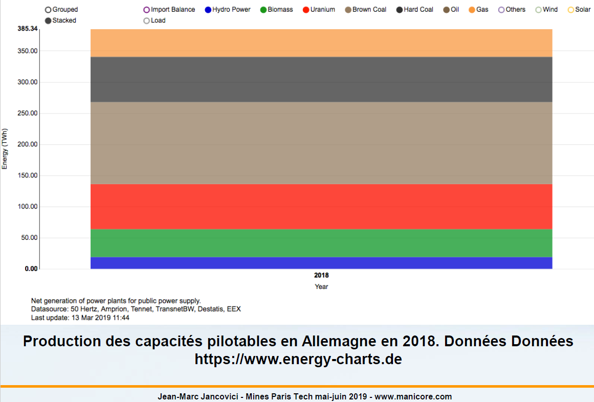
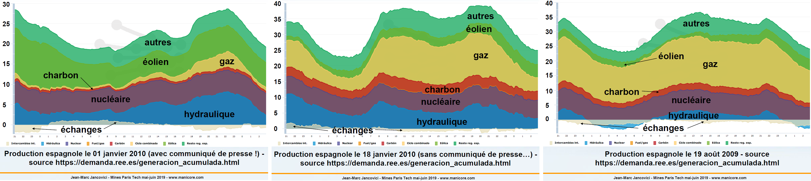
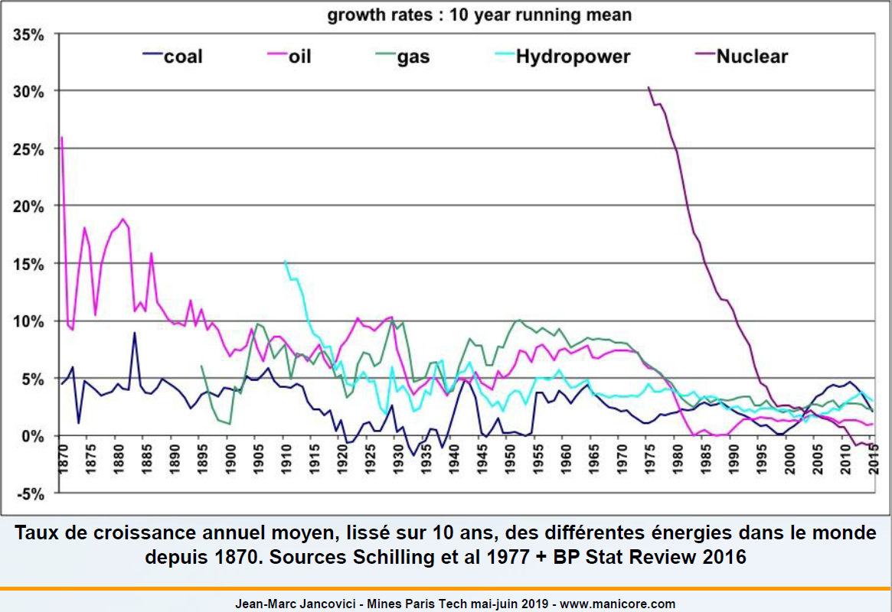

# ECC7 - Les énergies renouvelables

Nous allons parler ici des énergies renouvelables. Comme en France on aime beaucoup les définitions et commencer par les concepts, c'est exactement ce qu'on va faire cette fois ci.

## Introduction

Une énergie renouvelable est tout simplement une énergie dont le stock se renouvelle au moins aussi vite que la vitesse à laquelle on tape dedans, c'est à dire qui se renouvelle aussi vite que son utilisation par notre espèce. On remarquera que c'est une définition anthropo-centré, donc c'est renouvelable du point de vue des échelle de temps qui sont pertinentes en ce qui concerne l'espèce humaine, sinon, la formation des étoiles dans l'univers est renouvelable.

Si on regarde en pratique ce que recouvre cette affaire la, ca recouvre tout ce qui dérive de la photo-synthèse : donc la biomasse et ces dérivés dans la limite de ce qui a poussé dans l'année (agro-carburants, biogaz, etc.), ce qui en dérive en direct, évidemment le pétrole ne rentre pas dedans; tout ce qui dérive de l'action du Soleil, direct ou indirect sur les éléments, on a la mise en mouvement de l'atmosphère, donc le vent, la mise en mouvement de l'eau par le cycle de l'eau (évaporation / condensation : l'hydroélectricité, le cycle de l'eau se chargeant de remonter en altitude par précipitations puis ruissellement l'eau qui a été turbinée), le fait que du rayonnement électromagnétique nous arrive en direct, etc.

Evidemment, on ne trouve pas dedans ce qui ne correspond pas à cette définition, donc les énergies fossiles, puisque le temps caractéristique de reconstitution est hors de proportion avec les échelles de temps qui intéresse les Hommes, et on ne trouve pas non plus le nucléaire, qui n'est pas une énergie fossile mais qui est comme même une énergie qui dépend de l'existance d'un métal qui ne se renouvelle pas sur Terre. Il arrive parfois qu'on trouve dans la presse que le nucléaire est une énergie fossile, non c'est pas une énergie renouvelable, mais c'est évidemment pas une énergie fossile.

Ce qu'on va voir aujourd'hui c'est que les énergies renouvelables ne sont absolument pas équivalentes les unes avec les autres, ni en terme de potentiel, ni en rendement, ni en coût, ni en usage, ni en terme de facilité d'utilisation. On a en fait à faire à des choses qui sont extrêmement variées et pas du tout homogènes. Par ailleurs, on peut avoir quelque chose sur lequel on reviendra qui est que l'énergie peut très bien être renouvelable mais que son dispositif de capture ne l'est pas. Donc quand on a une énergie renouvelable avec un dispositif de capture qui est férocement non renouvelables. On va voir qu'on s'en rapproche pour certaine d'entre elles, à ce moment, ca se discute de savoir qu'elle est le terme dominant dans ce cas, quel est le gène dominant dans cette histoire. Est-ce que le gène dominant c'est que c'est renouvelable, ou est-ce que le gène dominant c'est que c'est pas renouvelable parce qu'on utilise un dispositif de capture qui ne l'est pas.

Il arrive aussi qu'on mette dans les renouvelables des choses qui sont non nécessairement totalement renouvelable. Il arrive qu'on mette dedans l'exploitation thermique des déchets, et en fait la fraction des déchets qui est issue de la biomasse, donc à la fois déchets organique divers et le papier, sont considérés comme renouvelable quand on les brûle en France dans un incinérateur et qu'on comptabilise cette partie à la contribution de la chaleur de l'incinérateur, qui est valorisée ensuite. Normalement, la chaleur de la combustion des plastiques non. Enfin, il y a une deuxième énergie qu'on met parfois dedans à tord qui est l'énergie géothermique profonde. On verra qu'il y a deux types d'énergie géothermique, en fait quand on abordera ce sujet, une de surface et une profonde. La géothermie profonde consiste quand même essentiellement à refroidir la Terre, mais enfin les ordres de grandeur sont tel qu'on sera tous mort, même si on avait de la géothermie profonde partout, avant qu'on est significativement refroidit la Terre en l'utilisant pour nos besoins. Donc le stock initial est extrêmement important, il n'empêche que ce n'est pas tout à fait une énergie renouvelable. La fraction qui est purement renouvelable dans la géothermie, c'est l'incrément de chaleur qui arrive tout les ans, par la désintégration radioactive des quelques éléments radioactifs que l'on trouve à l'intérieur de la Terre, ca c'est renouvelable (tant qu'il y a de la décroissance radioactive).

Les énergies renouvelables, depuis qu'on sait qu'on a un problème avec les énergies fossiles sont des énergies qui font beaucoup réver, et ce pour une raison assez simple, c'est que quand on regarde la quantité d'énergie renouvelable disponible sur Terre, on a à faire à des ordres de grandeur qui sont extrêmement important et considérablement supérieur à la quantité d'énergie utilisée par les Hommes. En particulier, un des ordres de grandeur qu'il est assez facile de calculer, c'est que l'énergie solaire qui arrive au sommet de l'atmosphère tout les ans (donc avant réflection par les nuages, les déserts, etc.) c'est 10.000 fois la quantité d'énergie consommer par les Hommes avec gaz, pétrole, charbon, etc. Ce facteur 10.000 fait réver énormément de gens, "10.000 fois rendez-vous compte, donc du coup ca va être très facile de remplacer des énergies fossiles par des énergies renouvelables", et en particulier par du Soleil. Ce qu'on va voir c'est qu'en fait c'est pas si simple que ca, parce que les énergies renouvelables abondante sont aussi souvent des énergies renouvelable diffuse, et comme on l'a vu au premier cours, exploiter de l'énergie pour les Hommes, c'est l'extraire de l'environnement la ou elle se trouve déjà et la mettre dans un convertisseur, or pour extraire de l'environnement une énergie qui est très diffuse, et de "basse qualité", c'est extrêmement difficile. Il y a une énergie qui n'est pas renouvelable mais qui est également disponible en quantité quasi illimité, c'est le rayonnement à 3Kelvin de l'univers, c'est la source d'énergie la plus considérable que l'on puisse regarder, et c'est celle dont on ne fera jamais rien. Donc le fait que l'on est une très grande quantité d'énergie disponible en théorie, est quelque chose qui ne nous donne pas nécessairement la facilité qu'il va y avoir à s'en servir en grande quantité pour remplacer les énergies fossiles qui sont elles particulièrement dense et commode d'emploi.

On se rappelle de ce graphique que nous avions vu sur la quantité d'énergie utilisé par les Hommes depuis un siècle et demi, sur cette figure est extrait juste la partie renouvelable. Ca c'est la partie énergie renouvelable dans le graphique qu'on a vu au premier cours avec la quantité totale d'énergie utilisé par les Hommes. Ce que l'on voit c'est qu'en quantité totale, les Hommes utilise depuis longtemp de la biomasse, qui reste aujourd'hui encore entre guillemet renouvelable puisqu'on va voir que c'est une appellation qui se discute pour la biomasse, et puis se sont rajouter 4 types d'énergie renouvelable qui sont purement électrique : l'hydro-électricité qui constitue aujourd'hui le gros de l'énergie renouvelable non-biomasse, et puis plus récemment l'éolien, le solaire, et biogaz et géothermie. Biogaz et géothermie sont dans une même catégorie dans les statistiques, on verra tout à l'heure une tentative de discrimination en ordre de grandeur. Ce que l'on voit c'est que ca c'est très récent, et même à l'échelle des énergies renouvelable c'est pas encore très important. Donc quand on voit "les énergies renouvelables", l'image d'épinale qu'on devrait coller dessus, c'est pas du tout une éolienne ou un panneau solaire, ce serait normalement une forêt ou un barrage, si on était cohérent entre la réalité d'aujourd'hui et les illustrations qu'on en fait.

Ca c'est à l'échelle des Hommes dans son ensemble, si on regarde à l'échelle d'un individu, donc pas de l'humanité, ce que l'on voit c'est que la quantité d'énergie renouvelable utilisé par personne sur terre, elle, a plutôt eu tendance à baisser un petit peu, depuis un siècle et demi. La biomasse a beaucoup baissé, par contre évidemment, les deux autres évidemment ont augmenté (la n'est pas discriminé les nouvelles énergies renouvelables).

La biomasse dans cette histoire, elle est compté comme énergie renouvelable alors que ca se discute, et ca se discute parce qu'une partie de la biomasse correspond à ce type de processus. On a ici, le nord de l'Europe (la péninsule danoise, la Baltique, le nord de l'Allemagne, les Pays-Bas, etc.) et l'on voit dans cette partie nord de l'Europe à quoi ressembler la couverture forestière en gros il y a 1.000 ans et à quoi elle ressemble aujourd'hui. On constate qu'il y a eu une déforestation extrêmement importante. En fait il y a 1.000 ans, 80% de l'Europe du nord était recouverte de forêts. A l'époque d'Astérix, le petit village était entouré de forêts, il n'y avais que ca. Et avec la croissance de la population, les Hommes ont défrichés une quantité croissante de forêts et le bois en général quand il est coupé, il est brûlé. Alors il peut être soit brulé et laissé sur place, c'est les fameux brûlis, soit il est emportés ailleurs pour servir de bois de feu au moment ou il est coupé. Si il est emporté ailleurs pour servir de bois de feu, un certain nombre de gens ont envie de mettre ca dans la catégorie énergie renouvelable. Sauf que si c'est du bois qui correspond à de la déforestation, normalement ca ne doit pas rentrer dans la catégorie "énergie renouvelable", ca doit rentrer dans la catégorie "déforestation", parce que la déforestation n'est pas tellement renouvelable.

Dans les courbes qu'on a vu juste avant, en fait il n'est pas fait de distinction entre la biomasse renouvelable et la biomasse non renouvelable. On verra un peu plus tard les statistiques pour la France, aujourd'hui, la superficie forestière française est plutôt stable ou en légère croissance, donc en France, le bois qu'on utilise peut être considérer comme renouvelable, mais même la c'est pas simple d'avoir des chiffres parce que le bois dans toutes les énergies que nous utilisons est la seule qui soit massivement non commerciale. Le pétrole est massivement une énergie commerciale, c'est à dire que les gens qui ont dans le fond de leur jardin un puit de pétrole dans lequel ils vont chercher leur pétrole comme on va chercher de l'eau, qu'ensuite ils distillent dans leur propre allambique dans leur cave pour allimenter leur voiture, il y en a quand même pas beaucoup. Des gens qui ont leur propre mine de charbon dans leur jardin pour allimenter ensuite leur poêle, il y en a pas beaucoup non plus, il y en a déjà un peu plus, une bonne partie des mines de charbon par exemple en Chine sont des mines artisanales et en Chine ont a une partie significative du chauffage qui est fait dans des poêles à charbon. Mais globalement, les énergies fossiles, et le nucléaire, et l'électricité d'une façon générale sont des énergies commerciales et si ce sont des énergie commerciales ca veut dire qu'il y a un vendeur, donc un sale capitaliste, parfois un sale communiste, qui a aucunement l'intention de nous servir gratuitement, et donc qui met des compteurs partout pour vérifier qu'on va pas consommer plus que ce qu'il nous vend, et du reste il a très envie de savoir combien il nous vend, donc on a des statistiques qui sont à peut prêt fiable. Donc dans toutes les énergies commerciales, on arrive à suivre les quantités utilisés parce que il y a quelqu'un à qui profite le crime, d'une part le vendeur, et d'autre part l'état, parce que toutes les énergies commerciales font l'objet d'une fiscalité et à partir du moment ou on a une fiscalité, on regarde l'assiette de très prêt. Par exemple en France, on sait très bien combien on consomme de carburant parce qu'on a une taxe sur les carburants, et donc on a le corps des instruments de mesure qui vérifie que toutes les pompes à essence sont exacts, etc. Le bois est essentiellement une énergie d'autoconsommation. A part quelques urbains qui installe des poêles à bois et qui achette du bois à d'autre, qui ne le déclarent pas toujours soit dit en passant, le bois est globalement une énergie d'auto-consommation, donc la pour le coup on va vraiment dans le fond de notre parcelle de bois rammasser quelques sterres que l'on va utiliser ensuite pour se chauffer. C'est une énergie de circuit court par excellence, et aux tropiques c'est égalemnt une énergie qui est très importante pour le bois de feu, donc pour faire la cuisine, avec une efficacité très déplorable, c'est un des problèmes du reste, et la c'est pareil, on a ou bien de l'économie informelle, ou bien de l'auto-consommation, et dans les deux cas de figure, beaucoup de difficultés à avoir des statistiques fiables. On peut éventuellement mesurer la quantité de bois qu'on utilise d'une autre façon, par exemple avec des photos sattelites on regarde qu'elle est la surface couverte par les forêts, mais même ca c'est pas simple parce que quand on a des arbres qui sont coupés dans une forêt et que ca se passe sur une échelle qui est sous la résolution du pixel, on ne voit pas. Donc si on coupe un arbre sur 100, ou un arbre sur 50, on ne voit pas ca sur les images sattelites. Donc la consommation de bois est quelque chose qui est estimé, donc ce qu'on voit sur les deux courbes précédentes, ce sont des estimations; on a l'ordre de grandeur, mais c'est beaucoup moins fiable, c'est à quelques dizaine de pourcent près seulement.

Donc une partie du bois qu'on utilise c'est de la déforestation, et la limite à l'utilisation du bois, c'est tout simplement la photo-synthèse, c'est à dire qu'on ne peut pas en mode renouvelable, utilisé plus de bois que ce que la photo-synthèse nous a fournit. Donc le seuil de renouvellement d'une forêt, c'est l'accroissement annuel, ce qu'on appelle dans le jargon forestier l'accru annuel, de la biomasse résultant de la photo-synthèse. Tant qu'on utilise ca ou moins, on est en mode renouvelable, si on utilise plus que ca, on est en mode non-renouvelable. Et comme il y a beaucoup de circuit qui sont des circuits non-commerciaux ou informelle, c'est difficile de savoir exactement combien est-ce que les gens vont piocher dans une forêt dans laquelle ils vont piocher.

Pour rappel, on a ici les trois familles d'énergie que nous utilisons sur terre aujourd'hui, les énergies renouvelables, les énergies fossiles, et l'énergie nucléaire. Ce que l'on voit c'est que l'énergie renouvelable qui représenter la quasi-totalité du fonctionnement de l'Humanité il y a deux siècle (et même la totalité il y a 3 siècles), ca part n'a pas cesser de diminuer au cours de l'essor industriel pour tomber à des valeurs très basse qui sont raisonnablement stable depuis.

Un monde 100% renouvelable, on a au moins un point d'échantillonage ou on voit très bien à quoi ca correspond, c'est le monde d'il y a 3 siècles et le monde d'il y a 3 siècles, c'est 700 millions d'habitant sur Terre avec une espérance de vie à la naissance légèrement inférieur à 30 ans et l'essentiel des gens agriculteurs. Donc 100% renouvelable, on a au moins une situation dans lequel on sait que ca marche, maintenant, la question évidemment c'est est-ce qu'on a le moindre espoir que ca marche aussi avec une humanité de 8 milliards d'individus, avec des baskets pour pas chère livrés par Amazon, et de pouvoir aller au cinéma quand ca leur chante, et de pas se casser le dos toute la journée. Et ca on va voir que la réponse c'est une réponse de normand "ptet bin que oui, ptet bin que non" avec probablement un "ptet bin que non" qui est un peu plus fort que l'autre.

Aujourd'hui les énergies renouvelables représente donc 16% de la quantité d'énergie primaire que nous utilisons, donc celle que l'on extrait de l'environnement. Sur les chiffres que l'on a la dessous (en Mtep), pour rappel il y a primaire et finale pour l'énergie et que pour l'électricité qui est faite avec de la chaleur, il y a une énorme différence entre les deux. Pour l'électricité qui n'est pas faite avec de la chaleur, typiquement le vent ou l'hydro-électricité, il y a toujours un éternel débat de savoir si doit être compter en équivalent finale ou en équivalent primaire. La c'est compter en équivalent primaire, c'est donc la version la plus favorable possible aux énergies renouvelables purement électrique.

Ce qu'on voit aujourd'hui, c'est que le bois au dernière nouvelle, parce que l'année dernière on pouvait pensez que c'était 10%, cette année on a d'autre chiffre qui nous disent que c'est 7%, donc comme dit précédemment on est à 30% prêt, c'est en ordre de grandeur un petit 10% de la quantité d'énergie qu'on utilise dans le monde. Mais la fraction renouvelable est surement pas de 10%, elle est plus basse.

L'hydro-électricité est donc la première des énergies renouvelables or biomasse que nous consommons et on voit qu'en équivalent primaire, ca fait a peut prêt pareil que le bois, en équivalent finale évidemment ca ferait 2,58 fois moins.

Ensuite arrive le vent qui a significativement augmenter ces dernières années, mais on voit que ca ne représente encore, avec la convention la plus favorable, que un gros 1% de l'énergie primaire. Par ailleurs, comme on l'a vu au premier cours, pendant que le vent augmenter, le charbon a augmenter 5 fois plus vite.

Après on a les agro-carburants qui représente une fraction de pourcent, et pourtant, les agro-carburants consomme déjà 40% du maïs cultivé aux Etats-Unis pour faire de l'Ethanol. Sachant que les Etats-Unis sont le premier producteur de maïs au monde avec à peut prêt un tiers de la production mondiale. Donc si on fait un tiers de 40%, ca nous fait a peut prêt 14% parce qu'il y a un peu de maïs qui est utiliser pour faire des agro-carburants ailleurs, y compris en France. En France on a également des agro-carburants qui sont fait avec du maïs, du blé et des bettraves. C'est ce qu'on a coutume d'appeller les agro-carburants de première générations. Les agro-carburants alimentent des engins de transports essentiellement. C'est mélanger / incorporer à l'essence ou au diesel et servi avec l'essence et le diesel. Par exemple, en France on a une obligation d'incorporation de bio-carburant à hauteur de quelques pourcent (6-7%) dans les carburants pétroliers. Donc aujourd'hui quand on achette un carburant pétrolier, il y a quelques pourcents de bio-carburant dedans. On verra plus tard dans le bilan carbone des bio-carburant tout à l'heure que si on a un biocarburant qui est issu de surface qui ont étaient soit déforesté pour l'occasion, soit qui était anciennement consacrés à des cultures alimentaires mais du coup avec une pression qui se reporte sur de la déforestation, c'est pire que si on utilise du pétrole, en gros.

Enfin, on a le solaire photovoltaïque, qui représente une fraction de pourcent; même si ca augmente rapidement, ca part de très très bas. C'est une fraction de pourcent de l'énergie mondiale aujourd'hui et la question qu'on peut se poser c'est est-ce que ca va continuer d'augmenter aussi vite qu'ajourd'hui ou est-ce qu'il n'y a pas des facteurs limitants qui font que c'est pas sûre que ca continue d'augmenter à cette vitesse.

Le biogaz est un gaz qui est fait avec de la fermentation de matière végétal ou de résidu animaux, typiquement des déjections, de la graisse que l'on veut pas après abbatages des animaux. Une fois traité, ca a plusieurs utilisations, la principale d'entre elle aujourd'hui en France, et encore plus en Allemagne, c'est de faire de l'électricité, donc en fait c'est une petite centrale à gaz sauf que le gaz est d'origine végétale. On peut également s'en servir pour le liquéfier et faire avancer des engins de transports qui roule au gaz naturel liquéfié (GNL); gaz naturel qu'on peut remplacer par du biogaz. On peut également l'injecter dans le réseau de gaz et à ce moment on l'utilise comme du gaz, pour du chauffage.

Tidal correspond à l'énergie des marées. On a environ trois centrales marée-motrice au monde dont une dans la Rance. "Wave and Tidal" correspond à l'énergie des vagues et des marées, mais les vagues ne sont même pas présente dans ce tableau.

Si on regarde maintenant la France, on constate qu'en France, la hiérarchie de l'utilisation des énergies renouvelables est exactement la même que celle que nous avons dans le monde, en gros. C'est à dire que ce qui arrive en premier c'est le bois, essentiellement pour le chauffage. Ce qui arrive en second, c'est l'hydro-électricité; si on regarde attentivement, on voit qu'il y en a un peu moins aujourd'hui que il y a quelques décennies, la raison étant que le régime pluviométrique a tendance à diminuer légèrement. Enfin, on a éolien et photovoltaique qui sont secondaires au sein des énergies renouvelables. On a une grosse exception en Europe qui est l'Allemagne dont on traitera le cas un peu plus en détails par la suite. On a des termes qui ne sont pas complétement négligables qui sont les agro-carburants (bioessence et biodiesel) et les pompes à chaleur.

## Solaire

On va maintenant rentrer dans l'inventaire, l'énumération de toutes ces énergies renouvelables. La première qu'on va regarder c'est l'exploitation direct du flux solaire, c'est l'exploitation de la partie qui arrive à terre évidemment, c'est pas la partie qui arrive au sommet de l'atmosphère, parce que celle la elle est réfléchit par les nuages et donc elle est un peu loin en ce qui nous concerne. Ce que l'on voit c'est que la partie qui arrive dans le cercle rouge représente un peu plus de 200W/m² en moyenne annuel. C'est une moyenne géographique et temporelle; donc ca inclut à la fois ce qui arrive près des pôles ou il arrive pas beaucoup, et ce qui arrive aux tropiques; et ce qui arrive en été et ce qui arrive en hiver quand on est au moyenne lattitude sachant que bien évidemment il n'arrive pas la même chose; et ce qui arrive le jour et ce qui arrive la nuit sachant que la nuit par définition il n'arrive rien.

Si on regarde le cas de la France, on voit que cette insolation au sol, sans grande surprise, augmente quand on va du nord au sud et que par ailleurs, même à lattitude donné, elle n'est pas homogène. La raison pour laquelle elle est plus faible à même lattitude c'est à cause des nuages. Les dépressions en France viennent de l'ouest, les dépressions amènent des nuages, et donc la nébulosité est plus importante près de l'Atlantique que près de la Méditerannée et donc l'insolation annuelle est plus importante près de la Mediterannée que près de l'Atlantique. On voit que le gradient n'est pas complétement ridicule, c'est pas une variation de 3%. Donc si on veut du Soleil, c'est mieux d'aller au Sud, et c'est mieux d'aller près de la Mediterannée. Il se trouve que le plus grand parc installé en Europe est au nord puisque c'est au nord du Rhein, c'est comme ca.

La première manière d'exploiter cette énergie, c'est tout simplement de chauffer de l'air ou de l'eau. Il y a une première planche qu'on aurait pu voir, mais qu'on ne verra pas, la première exploitation en fait en ordre de grandeur de l'énergie solaire, c'est le chauffage des batiment : on a pas besoin d'allumer le chauffage l'été; c'est de très loin le premier rapport dans l'utilisation de l'énergie par les Hommes. Et du reste, on peut accroître ce terme en mettant des fenêtres au sud, des verandas, etc. Donc dans la réhabilitation thermique des batiments par exemple, si on a pas de problème d'espace au sol et qu'on a une facade côté sud, une des opérations classique consiste à rajouter une veranda : on rajoute une surface vitré et l'hiver sa sert de radiateur, ca nous fait une serre, l'air chaud rentre dans la maison, ca marche très très bien. La deuxième manière qu'on peut avoir d'exploiter cette énergie thermique, c'est de faire de l'eau pour se laver ou de l'eau pour se chauffer. L'eau pour se laver c'est assez simple puisque on met une surface de capteur sur la toît, c'est la douche solaire pour ce qui en ont déjà utiliser une en camping, donc c'est une surface noir devant laquelle on fait passer de l'eau, ca chauffe l'eau, sauf que c'est plus gros qu'une douche solaire puisque quand on est chez nous on prend en général des douches qui sont plus copieuses, et à ce moment l'eau chaude va chauffer un cumulus (comme un cumulus normale), dont on se sert ensuite pour prendre des douches. L'autre option, ca peut être d'utiliser la chaleur fournit par cette eau pour chauffer un logement. Alors la on ne le chauffe pas avec le soleil qui rentre par les fenêtres ou l'air chaud qui rentre par la veranda, on va faire rentrer la chaleur par un circuit d'eau également, et ensuite ce circuit d'eau va relarguer les calories à l'intérieur de la maison. Cela étant comme un cicruit d'eau qui nous capte la chaleur, c'est pas à très haute température, c'est quand même moins chaud globalement ce circuit d'eau que ce qu'on a en sortie de chaudière pour un chauffage central, on a besoin de surface radiante qui sont plus importante que ce qu'on a avec un chauffage centrale classique. Donc malheuresement, on ne peut pas faire un retrofit sur les maisons existantes qui ont des radiateurs qui ont était dimensionnés pour de l'eau à 60 degrés pour y faire passer du chauffage solaire avec de l'eau qui a était chauffé en plein hiver à 40 ou 45 degrés. On ne peut pas donc ca ne marche que si on casse tout les radiateurs pour les remplacer par des radiateurs 4 fois plus gros ou bien si on a un planchet chauffant. C'est la raison pour laquelle les maisons qui sont chauffé au soleil avec des capteurs solaire sur le toit, en générale elles sont équipés, quand elle sont construite comme ca, d'un planchet chauffant et donc un chauffage par le sol, pour avoir une très très grande surface radiante à une température pas très élevé.

Cette énergie solaire la est assez en vogue sous les tropiques. Sous les tropiques, on a dans les territoires d'outre mer en France pas mal de logement qui sont équipés avec des chauffe eau solaire de cette nature. Notamment parce que les tropiques ne sont pas équipés de réseaux de gaz donc c'est soit de l'électricité, soit du fioul et les énergies concurrentes étant plus chère que le gaz; en France l'énergie la moins chère pour chauffer de l'eau c'est le gaz, mais sous les tropiques on a pas de réseaux de gaz en général donc à ce moment les énergies concurrentes c'est le fioul et l'électricité et les deux énergies concurrentes sont significativement plus chère et donc ca peut valoir le coup comme il y a beaucoup plus de soleil de mettre ce genre de chauffe-eau.

La deuxième exploitation du soleil, c'est l'effet photo-électrique. L'effet photo-électrique c'est la création d'un courant dans une matière qui est du silicium avec des petits trous et des petits électrons en trop avec des éléments qu'on a mis soigneusement la ou il fallait. C'est la création d'un courant quand on expose cette matière au soleil. Des panneaux solaire on en a de toutes les tailles, par exemple il y a des petits gadgets avec des sac à dos emabarquant des petits panenaux solaires. Donc on en a de toutes les dimensions et on en verra des plus gros que ca. Donc l'idée du panneau solaire, c'est évidemment que ca nous donne du courant quand il y a du soleil. C'est très bien parce qu'il y a beaucoup de soleil partout, mais on va voir que par ailleurs il y a un certain nombre de limitations parce que comme on l'a vu tout à l'heure, du soleil il n'y en a pas toute la journée, alors que l'électricité on aime bien l'utiliser toute la journée et puis on a par ailleurs une densité de puissance avec ce genre d'installation qui n'est pas extrêmement élevé. La manière dont fonctionne aujourd'hui en France l'installation de l'énergie solaire c'est que très peu de site font de l'électricité pour la consommer eux même en étant autonome. A part le refuge du Dome du Gouter, et quelques autres barraque de cette nature, en règle général c'est pas comme ca que ca marche. En fait on a favoriser les installations connectés au réseau parce qu'il y avait des objectis d'augmentation des EnR dans tout les pays européens et que les EnR qui ont était favorisés en premier dans tout les pays européens sont les EnR électrique et du coup, le but du jeu c'est pas nécessairement qu'on est un peu d'électricité pour nous, c'est qu'on est de l'électricité pour mettre sur le réseau. Donc la façon dont ca fonctionne en France c'est que quand on a une installation photo-électrique, on a deux contrats différents : on a un contrat qui concerne l'installation et qui nous fait injecter de l'électricité sur le réseau avec un tarif d'achat a prix fixe et garanti, et de l'autre côté pour notre consommation, on a un contrat normal de consommateur d'électricité, et les deux sont séparés. C'est une autre manière de dire que le développement du photo-voltaïque en France est fait comme une activité économique et non pas fait comme un élément de consommation personnelle. C'est essentiellement une activité économique, en gros on loue notre facade sud de toit exactement comme on louerait une surface pour une boutique. On est propriétaire du commerce mais c'est exactement ca le principe.

Ce graphique a était arréter après 2014 mais ca nous donne comme même une indication. L'image d'épinal jusqu'à récemment c'était le panneau sur le toit, en fait l'essentiel des surfaces photo-voltaïque qui ont était développer en France aujourd'hui sont des grandes surfaces PV. Donc l'énergie solaire PV en France comme dans beaucoup d'autre pays, ce n'est pas une énergie de particulier, c'est une énergie d'industrielle comme les autres. On a des développeurs de projets qui sont des gens qui trouvent des terrains ou trouve des grands batiments, font réaliser l'installation, signe le contrat à tarif garanti, paye les charges, encaissent les résultats, et ont un résultat net. C'est des opérateurs, des entreprises qui font ca pour l'essentiel des surfaces installés en PV en France.

On a par exemple ici une photo aérienne de la plus grande centrale solaire au sol installée en France. Le PV au sol est assez consommateur d'espace puisqu'on a besoin d'un hectare par MW de puissance. C'est un hectare qui est mobilisé en quasi-totalité. Il y a des gens qui se disent qu'on peut en faire des ombrières, les mettre à 3 mètres du sol, faire pousser des fraises en dessous, etc. Mais globalement, c'est comme même un hectare qui est mobilisé en quasi totalité. Une autre manière de dire ca c'est que sur 1 kilomètres carrés (l'emprise d'une centrale nucléaire sur laquelle on a 4GW de puissance), c'est à dire 10 hectares, on met 10MW de puissance (4GW c'est 400 fois 10MW). Donc le PV au sol est très consommateur d'espace, c'est un de ses incovénients.

On a ici une image du site de RTE fait le matin même. On a ici la puissance injecté sur le réseau jour après jour sur quasiment deux mois. On voit qu'on a évidemment un maximum tout les jours, mais que ce maximum peut varier d'un facteur deux à trois en l'espace de quelques jours, et ca c'est l'effet justement de la nébulosité (beaucoup plus de nuages, il fait mauvais, il pleut, etc.) et on se retrouve avec une puissance qui est fortement variable. Donc la partie prévisible, à long terme, de l'énergie solaire, elle est sur les pics les plus bas et pas sur les pics les plus haut, dans la mesure ou trois mois à l'avance, on connait l'inclinaison de l'axe de rotation de la terre sur le plan de l'orbite, donc on sait quelle sera l'insolation, par contre on ne sait pas quel sera la nébulosité. Donc ce sur quoi on sait qu'on peut tabler de façon absolument certaine, c'est la fraction du potentiel avec une forte nébulosité, un jour ou il flotte en gros. C'est la dessus que l'on peut tabler, pas sur autre chose. On voit qu'il y a un facteur d'incertitude de 2 à 3 par rapport à ce qu'on peut avoir au maximum. On voit également quelque chose d'absolument évident sur ce graphique et on y reviendra plus tard, c'est la fourniture s'interrompt toutes les nuits. La nuit par définition, c'est quand il n'y a pas de soleil. Ce qui veut dire que si on veut avoir un approvisionnement significatif en provenance de l'énergie solaire, dans certains scénarios très optimiste sur les énergies renouvelables à 2050, on a le soleil et l'éolien qui peuvent atteindre 30% chacun de l'approvisionnement énergetique mondiale (énergetique et non électrique !), et à ce moment ce qu'on voit immédiatement en regardant ce graphique c'est que ca pose à l'évidence la question de savoir qu'est ce qu'on fait quand on est dans la nuit.

Comme dit précédemment, on peut très avoir une énergie qui est renouvelable et son dispositif de capture qui ne l'est pas. En l'occurence, le solaire PV correspond aussi à cette définition, puisque le soleil est parfaitement renouvelable (enfin en tout cas, pour que le soleil ne se renouvelle plus il va falloir attendre 4 milliards d'années, donc ce ne sera plus vraiment notre problème), par contre pour capturer l'énergie solaire, aujourd'hui on utilise des panneaux PV qui nécessite d'utiliser un certain nombre de matériaux qui sont parfaitement non-renouvelables. Il faut utiliser de l'acier, du cuivre, du silicium, des dopants, de l'aluminium, du verre, etc. La dedans il y a des matériaux pour lesquelles le problème de stock on sera mort et l'humanité aussi qu'on aura toujours pas de problème de disponibilité (typiquement le fer), par contre, on en a d'autres pour lesquelles ont peu avoir un vrai problème de disponibilité, pas au sens ou il n'y en aura plus mais au sens ou on commencera a avoir de vrai problème pour avoir des mines avec des concentrations qui font que on obtient quelque chose avec un effort raisonnable. Et ca ce matérialise, le fait que les énergies renouvelables est un dispositif de capture qui n'est pas renouvelable, par le fait que l'on a du coup utilisation de matériaux non-renouvelables qu'il a bien fallu fabriquer dans le dispositif de capture. Et donc on a des émissions de CO2 liés à la fabrication du dispositif de capture. On a la des ordres de grandeur pour comparaison. Pour les émissions liées à la production d'un kWh au charbon, on retrouve le kg de CO2 par kWh décrit dans le deuxième cours (ca se ballade selon la technologie que l'on fasse de l'ultra super critique machin chouette ou qu'on soit dans une vieille centrale pourri, c'est ca la marge). On a ensuite les émissions sur une centrale à gaz à cycle combiné, c'est une technologie raisonnablement récente, il n'y a pas trop de centrales pourries, donc il n'y a pas de haut et de bas. Et après, on passe dans d'autres type de production qui sont dites non fossiles, on a le nucléaire, l'éolien sans stockage, le PV sans stockage (brut de fonderie en sortie de panneau), et enfin PV avec stockage sur batterie. En sortie de panneau on voit que ca peut varier et la raison pour laquelle ca peut varier c'est que ca dépend de la manière dont on a fabriquer le panneau, ou plus exactement du pays dans lequel on a farbiquer le panneau. Comme fabriquer un panneau solaire consiste à faire fondre du silicium, et que c'est de la métalurgie qui se fait avec de l'électricité, si on est en Chine, on va avoir un contenu carbone de notre silicium fondu qui sera très supérieur au contenu carbone si on fait ca en France. Par ailleurs, derrière, la quantité de kWh que l'on aura derrière dépend, comme vu précédemment, de la lattitude et de la nébulosité. Donc la les valeurs que l'on a c'est pour la France, selon que l'on est au nord ou au sud et qu'on a fait fabriquer le panneau ici plutôt que la, on voit qu'on se ballade entre 30 et 80 grammes de CO2 par kWh. Mais si on se pose également la question de savoir ce que l'on fait quand il n'y a pas de soleil et donc que l'on stocke, à ce moment avec l'hypothèse du stockage sur batterie (sur barrage réversible se serait évidemment beaucoup moins que ca), on a besoin de fabriquer la batterie, c'est de la métallurgie aussi et 1kWh stocké / restitué sur batterie c'est n'importe quoi entre 50 et 200g de CO2 par kWh électrique. Par ailleurs, quand on stocke et qu'on déstocke, on va perdre une partie de l'électricité que l'on a stocké, une perte de l'ordre de 20%, ce qui veut dire qu'on doit surdimensionné notre production pour la partie qui sera stocké de 1/0.8, donc un peut plus de 20%. Si on met bout à bout les émissions supplémentaires liées au fait que l'on a produit de l'électricité qui ne sert qu'a compenser les pertes de stockage et les émissions de fabrication de la batterie, on arrive à la conclusion que 1 kWh PV stocké sur batterie ca se ballade quelque part entre 100 et 250 grammes de CO2. La durée de vie prises dans l'ACV est de l'ordre de 25 ou 30 ans, après en fait on a des panneaux qui peuvent continuer à fonctionner avec des rendements dégradés. La question de la durée de vie est toujours quelque chose qui est très "piégeux" dans les analyses de cycle de vie parce que par exemple pour les batiments les durée conventionnel c'est 50 ans et bien évidemment on ne construit pas des batiments pour qu'il s'écrase au bout de 50 ans, sauf les espèce de boîtes métallique dégeulasses pour faire les commerces de banlieu la ou effectivement on ne compte pas trop dessus, mais sinon dès qu'on fait un logement, c'est évident qu'on ne le construit pas pour qu'il s'effondre tout seul dans 50 ans. Donc on a des durées conventionnels, sur le PV c'est entre 25 et 30 ans.

On a parler ici de l'empreinte carbone, après il y a un autre sujet c'est que quand on regarde le redement énergetique du PV, il y a une question intéressante de savoir ou est-ce qu'on arrête le périmètre de ce qu'on prend en compte. On a ici un ingénieur espagnole qui est un ancien du PV, il a passé son temps à installer et à gérer des parcs PV en Espagne, qui un jour c'est amuser à faire le calcul de que donne le retour sur investissement énergetique du PV, c'est à dire combien d'année de fonctionnement du panneau il faut pour rembourser l'énergie de fabrication du panneau, c'est ca le calcul qu'il a fait. Et il a dit je ne vais pas prendre que le panneau, je vais prendre le panneau, je vais prendre son installation, parce qu'il faut des camionettes au pétrole pour venir installer le panneau, il faut du ciment pour les fondations, il faut de l'acier, il faut venir laver le panneau a interval régulier (du reste le Quatar a des problèmes avec son PV parce que quand il y a des tempêtes de sable, ca colle plein de sable sur le panneau qu'on ne peut nettoyer comme ca parce que le sable raille le verre, on ne peut pas le nétoyer à l'eau parce qu'il n'y a pas d'eau, on ne peut pas le netoyer à l'eau de mer parce que ca laisse du sel partout, enfin bref, ils sont un peu enquiquinner avec cette opération), il faut mettre une clotûre autour, il faut passer à intervalle régulier pour vérifier que tout va bien, il faut mettre des onduleurs, etc. et cet ingénieur est aller jusqu'au bout, il faut également des gens dans des bureaux qui font des études pour savoir ou installer le parc PV, des autorisations administratives, etc. donc il a fait la contrepartie de tout ca, ca date de quelques années donc évidemment ca c'est améliorer depuis, mais il y a quelques années il disait bah voila, en gros, pour 1 d'investit dans la fabrication du panneau PV et de tout ce qu'il entoure, je vais ressortir 3 sur ca durée de vie. Dit autrement, si on considère que la durée de vie de l'installation c'est 25 ans, eh bien la fabrication de l'installation, et l'énergie qu'il faut utiliser pour faire fonctionner les ingénieurs qui dimensionne le machin, et etc., etc. en fait ca représente l'équivalent de 8 ans de fonctionnement. Encore une fois ca date de quelques années, c'es évidemment quelque chose qui c'est améliorer depuis, mais voila c'est un exercice intéressant parce que, sans rentrer dans les détails, il y a des gens qui ont théoriser que le rendement du système énergetique pour qu'on est une société élaborer il faut qu'il soit supérieur à 12 ou 13, c'est à dire qu'il faut qu'on est un retour sur investissement énergetique qui soit supérieur à 12 ou 13 pour qu'on est une société élaborer dans laquelle les gens ont le temps d'aller faire des études à l'école des Mines et non pas soit tous occuper à faire pousser leur nourriture. Sans avoir vérifier le multiple, en tout cas, ca parait a peu prêt évident qu'à 3 ca ne marche pas, et même à 5 ca ne marche pas bien.

Sur le pétrole à ces débuts, si on exlut le raffinage, on est à 1 sur 100, donc en gros il fallait investir 1 pour faire sortir 100 d'un puit de pétrole. Le pétrole aujourd'hui on est plutôt à 1 sur 10 en moyenne, le pétrole de schiste ou les sables bitumineux, on est à 1 sur 3 ou 1 sur 4, donc la ca commence à être vraiment pas terrible. Le nucléaire, si on demande au gens qui travaille dedans, ils nous disent 1 sur 60, si on demande au anti-nucléaire, ils nous disent 1 sur 5, mais en l'occurence si on fait les calculs on se rend compte qu'on est beaucoup plus proche du 1 sur 60; les anti-nucléaire nous sortent toutes les hypothèses les plus défavorables possibles (e.g. ils enrichissent l'uranium avec des centrales à charbon). L'hydro-électricité c'est pas mal, c'est 1 sur quelques dizaines. Les bio-carburant ca peut être 1 pour 1 ou 1 pour 1,2. Le gaz est aux alentours de 1 pour 30. Dans les énergies fossiles historique, on est à 1 pour plusieurs dizaines et c'est ca qui a permis de faire la société très sophistiqué dans laquelle on vit. Les énergies renouvelables diffuses, typiquement le soleil, ont en général des ratios beaucoup plus bas et c'est ca qui fait dire à un certain nombre de gens que ca sera compliqué d'avoir une société élaboré sur la base de ces énergies, c'est pas pour ca qu'il ne faut pas s'en servir, mais ca fait partie des contreparties.

On a une dernière manière d'exploiter le rayonnement solaire à des fins énergetiques, c'est toujours dans le domaine électrique mais cette fois ci c'est avec de la concentration. Le solaire à concentration, on prête à Archimède de l'avoir utiliser il y a longtemp pour mettre en déroute les bateaux énemmies avec des grands miroirs paraboliques. Plus récemment, on s'en sert pour faire des centrales électriques qu'on appelle des centrales thermodynamique. La le principe c'est de retrouver une machine de Carnot. Dit autrement on utilise l'énergie solaire que l'on concentre sur un point chaud pour faire une source chaude à notre centrale. Donc au lieu de brûler du charbon ou de casser des noyaux d'urnanium en deux, on va concentrer du rayonnement solaire, c'est ca notre source chaude, du coup chauffer un réservoir de saumur, et ce réservoire de saumur si notre champ de miroir est suffisement important, il peut être porter à une température suffisament élevé pour que ca permette de passer une partie de la nuit. Donc l'intérêt du solaire à concentration par rapport au solaire PV, c'est que ca nous supprime pour parti la question de quand il n'y a pas de soleil on fait quoi. Ce qui est un gros gros avantage dans la gestion des réseaux. Ces dispositifs sont souvent placés dans les désert, la source froide c'est l'air ambient, donc le rendement n'est pas très bon. C'est grave pour la consommation de matériaux parce que si on a besoin de trois fois plus de miroir, on a besoin de trois fois plus de verre, de métal, etc. par kWh produit, par contre c'est pas un problème d'espace puisqu'on a tout l'espace qu'on veut.

On a vu tout à l'heure la France, on a ici une carte de l'insolation en ce qui concerne le monde dans son ensemble et on voit que les endroits ou c'est pertinents d'aller mettre du solaire à concentration ou PV, c'est les endroits qui sont cerclés en noir. Malheuresement, ce que l'on voit également, c'est qu'à quelques exceptions prêt, en particulier la Californie (gros consommateur d'électricité; si la Californie était un état indépendant, ce serait la septième puissance économique mondiale, donc c'est comme même un gros paquet d'activités, donc une grosse consommation électrique), l'essentiel des zones qui sont très bien insolés sont dans des endroits ou il n'y a personne.

Dans les prévisions qu'on a vu dans le cours sur le changement climatique, on a vu l'asséchement et non l'augmentation de l'insolation. L'asséchement résulte d'une baisse de la pluviométrie, donc la ca vient d'une diminution de la nébulosité globalement, mais ca viens aussi d'une augmentation de l'évaporation et ca il n'y aura pas de liens avec les nuages. Donc ce qu'on a vu la dernière fois c'était l'assèchement du pourtour méditerannéen.

Ce qu'on voit la encore une fois c'est que les grandes zones d'insolation sont loin des grandes zones de consommation. Il y a des gens qui ont immaginés qu'on pouvait installer des batteries de centrale solaire PV ou à concentration dans ces zones la puis tiré des grandes lignes électriques qui irait jusque dans les pays ou les zones ou on consomment beaucoup d'électricité. Ces quelque chose qui n'est pas complétement idiot dans la mesure ou on a bien des grandes lignes maritimes, des grandes aériennes, donc on pourrait très bien faire des grandes lignes électriques, sur le fond c'est pas plus compliqué. Par contre, ca pose des questions intéressantes d'accord de partage, parce qu'il est évident que si on utilise le soleil des maliens, si les maliens sont bigornés normalement, il vont pas nous laisser l'utiliser gratuitement donc il y a une question de partage. Dans l'idée des gens qui disent que les énergies renouvelables c'est une manière de s'affranchir de la dépendance aux autres, c'est moins sympathique mais ca n'empèche pas de le faire, et en tout état de cause, ce n'est pas quelque chose qui peut se faire rapidement.

Soit dit en passant sur les matériaux qui sont nécessaire pour faire des panneaux solaire, on se rend également dépendant. Aujourd'hui, les 10 premier fabriquants de panneaux PV dans le monde sont chinois. Donc tout les plans de développement du solaire en Europe typiquement sont des plans qui favorise l'industrie chinoise. On peut le faire si on pense que c'est une bonne idée, mais ca a cette contrepartie.

On a ici quelque chose d'intéressant sur l'occupation de surface comparé entre le solaire à concentration et l'hydro-électricité. Au moment du cours sur le nucléaire, on avait parlé de l'influence des émissions de vapeur d'eau d'origine humaine dans les tours de refroidissement et on avait vu que ce n'était pas grand chose, par contre la vapeur d'eau qui vient du barrage d'Assouan, ca c'est quelque chose parce que le barrage d'Assouan est un très très gros barrage en superficie au regard de la zone dans laquelle il est implanté, et ca fait des évaporations artificielle de vapeur d'eau sur toute cette surface qui est loin d'être négligable. Ce que compare ce graphique, c'est la superficie qu'il faudrait couvrir en miroir, alors le barrage ne demande de couvrir en béton que le barrage lui-même, après la nature fait le reste, la nature a fait la vallée, la vallée se remplit toute seule. La c'est comme même quelque chose qu'il faudrait artificialisé nous tout seul, ca fait comme même la superficie d'une grosse ville, mais par contre en terme d'occupation globale d'espace on voit que ce n'est pas quelque chose qui est totalement délirant si on a pas de problèmes de matériaux. En fait on a des problèmes de matériaux évidemment si on veut commencer à remplacer la totalité de l'électricité qu'on consomme dans le monde par du solaire à concentration. Ce sera toujours le problème.

Par contre, ca a un avantage sur le PV, c'est que le PV est de la production de bout de réseau et le réseau a pas était fait pour ca. Le réseau est un système qui a historiquement était fait pour être un système descendant. Donc on a de la production en tête de réseau à très haut voltage, et puis après on perd du voltage comme on perd de l'altitude, et donc on a de l'électricité qui est progressivement distribué sur un nombre croissant de zone et de consommateur dans un processus qui est un processus de descente en tension et on a par ailleurs une mutualisation. Si on regarde la puissance que peut sous-tiré en France par la totalité des appareils électrique installé, c'est 4 à 5 fois la puissance électrique installée en production. La puissance installé en production, la puissance pilotable installée en production est de l'ordre d'une centaine de GW, la puissance totale de tout les appareils installés en France (aspirateur, ascenseur, batteur à mayonnaise, laminoir, train, etc.) c'est quelques centaines de GW, c'est 5 fois plus en gros. L'intérêt du réseau, c'est que ca mutualise la production parce que bien évidemment le conducteur du train au moment ou il conduit le train il n'est pas en train de se servir de son aspirateur chez lui. Toutes les machines ne sont pas utilisées en même temps et donc avec une puissance plus réduite que la puissance de la totalité des machines électriques installés dans ce pays, on est comme même capable de servir tout le monde par effet de mutualisation. Dans le rêve rifkiniens dans lequel chacun vit heureux chez soi avec son panneau solaire et sa batterie, sans réseaux, à ce moment on est obligé de dimensionné la puissance de pointe de toute les installations locales à la consommation de pointe de toutes les installations locales. Et donc a ce moment, on est obligé d'installé 4 à 5 fois plus de puissance de le pays. Donc le réseau est une source d'économie de puissance installée, c'est à ca qu'il sert et c'est justement parce que les pays qui se sont électrifiés il y a longtemp avez moins de moyens qu'aujourd'hui qu'ils ont créer des réseaux pour mutualiser les moyens existant et pas avoir à les dupliquer partout. Donc le solaire à concentration, il est intéressant parce qu'il est en tête de réseau et donc il bénéficie de cette effet de mutualisation de la tête de réseau versus le PV qui lui ne bénéficie pas de cet effet. Ce qui est dit la en indirect, c'est que l'auto-consomation PV, c'est à dire le fait que chacun est chez soi de quoi consommer sa propre électricité, contrairement à une idée couramment répendu, ca augmente très fortement les investissement globaux dans un pays, et donc ca augmente très fortement le prix totale de l'électricité dans un pays. Si on a quelqu'un qui localement paye son électricité moins chère grace à ca, c'est juste un effet de passager clandestin, la surcharge sera reportée sur tout les autres. Dit autrement, comme nous avons en France un système électrique qui est un système à coût fixe, puisque le nucléaire c'est des coût fixe et le réseau c'est des coût fixe, si on rajoute des panneaux solaire pour ne pas consommer l'électricité du réseau quand on a du soleil, on rajoute un troisième système à coût fixe par dessus deux systèmes à coût fixe, donc le coût globale de l'ensemble augmente, c'est extrêmement simple.

A la question : est-ce que pour un surplus de population, ça ne vaut pas le coup que ce surplus lui ait son installation de son côté ? Non car plusieurs réseau mutualisé c'est une duplication d'infrastructure. C'est un seul réseau qui est intéressant parce que comme ca on fait communiquer tout les consommateurs et tout les outils de production ensemble, donc c'est la qu'on a l'effet de mutualisation le plus important. Après si les consommateurs supplémentaires on les laisse hors réseau et ont dit qu'ils n'ont qu'a s'équiper chez eux, en fait la on les prive globalement de l'électricité marginale que le réseau et les appareils de production du réseau pourrait leur fournir et cette électricité marginale est beaucoup moins chère que le coût complet de production d'une installation autonome. Dans tout les cas de figure quand on a un réseau, on a intérêt à s'en servir.

Le réseau est un système maillé, c'est une toile d'araigné en gros, et donc on met à n'importe quel point de la toile soit un consommateur, soit un dispositif de production. Il est partiellement en étoile mais il est partiellement aussi en toile d'araigné. Quand il est purement en étoile on est dans ce qu'on appelle des presqu'îles électrique, typiquement la Bretagne ou le Sud-Est de la France et le gestionnaire de réseau n'aime pas ca. Il aime bien avoir de la redondance.

Quand on parle de tête de réseau ici on parle de voltage et pas d'une position géographique. C'est à dire que le réseau en France, c'est un backbone, un squeulette çà 400kV, en dessous un réseau à moyenne tension en 20 et 80kV, et encore en dessous un réseau de distribution à 220V, enfin 380V triffasé. Tête de réseau voulait dire des installations de production qui sont branchés sur la partie à 400kV, que la centrale soit à Gardane ou à Gravelines c'est pas le sujet, c'est d'être sur le réseau à 400kV. Quand on fait de rapide calculs, on se rend compte que la déperdition électrique à ses tensions là, à 400kV, pour aller d'un bout à l'autre de la France, c'est quelque pourcent (2-3%), donc du coup on peut mettre notre centrale un peu ou l'on veut, pourvut qu'on est la capacité de transport.

## Hydro-électricité

Un deuxième effet du soleil, c'est qu'il évapore l'eau et donc il la fait précipité.

Ce cycle de l'eau est à l'origine de la première électricité d'origine renouvelable que nous ayons en importance qui est donc l'hydroélectricité. L'hydroélectricité dans son principe c'est extrêmement simple, c'est le perfectionnement des moulins à eau. On a une énergie potentielle de chute qui est la masse fois la constante d'attraction fois la hauteur et donc ce que l'on va récupérer quand on va turbiner de l'eau, c'est exactement ca, c'est à dire c'est cette énergie potentielle qui devient de l'énergie cinétique quand on ouvre la vanne fois un coefficient de perte qui est dû au fait qu'on ai un peu de frottement. On a un peu de frottement dans la canalisation qui va du barrage vers la turbine et on a un peu de frottement sur la turbine elle même. Le rendement totale c'est 0,7 à 0,8. C'est mécanique. Et inversement le rendement du moteur électrique est très bon aussi. Donc la transmission mécanique de l'eau aux aillettes de la turbine a un très bon coefficient, et par ailleurs la transformation du mouvement en électricité à un très bon coefficient aussi.

La question c'est combien on peut en faire. Ici on a un petit calcul théorique pour l'Europe justement. En gros, de l'hydroélectricité on peut en faire facilement la ou mère nature fait tomber l'eau en altitude et qu'on peut assez facilement cette eau qui tombe en altitude, la collecter en altitude, faire une canalisation qui descend beaucoup plus bas et la turbiner beaucoup plus bas. Donc le seul endroit de relief qui nous offre cette oportunité ca s'appelle des montagnes. Les montagnes ont des vallées suspendus, c'est à dire des vallées que l'on peut fermer en altitude. L'eau qui ruiselle dans ces vallées, que ce soit de l'eau de fonte de glaciers, de l'eau de fonte de neige, ou de la pluie, on la collecte, ca s'appelle un barrage. Et du barrage on fait descendre, ou pas du reste ca dépend ou on a mis le barrage, mais du barrage on fait descendre un tuyau en bas de vallée. Et pour avoir la plus haute hauteur de chute possible, et en bas de vallée on turbine l'eau, c'est juste un jet d'eau qui va actionner une turbine. De temps en temps on a pas de grande hauteur de chute, par exemple au barrage de Serre-Ponçon on a pas de hauteur de chute, on a juste la hauteur d'eau du barrage parce que la turbine est au pied, on a pas de dénivelation à l'aval.

Question combien on peut en avoir de cette affaire, on regarde ici un certain nombre de massifs montagneux que l'on a en Europe (première colonne rouge), pour chacun d'entre eux on regarde leur superficie et leur hauteur moyenne au dessus des vallées (deuxième colonne rouge), donc ca nous donne, une fois qu'on a le nombre de millimètres de pluies par an fois la superficie on a le volume d'eau qui tombe, et une fois que l'on a la hauteur de la ou ca tombe par rapport au fond de vallée, on a la hauteur de chute. Donc la on a la masse d'eau tombé en altitude fois la hauteur de chute, il n'y a plus qu'à rajouter $g$ qui est le même pour tout le monde et ca nous donne le potentiel théorique qui peut venir de l'hydroélectricité (troisième colonne rouge). Le calcul d'ordre de grandeur est très simple. Et après on a le rendement qui s'applique (quatrième colonne rouge). Aujourd'hui en Europe l'hydroélectricité représente un peu moins de 1.000 TWh (entre 500 et 1.000) donc on voit qu'on est pas très très loin du maximum théorique de ce que l'on peut faire, on a équipé l'essentiel des montagnes suédoises, norvégiennes, dans les Alpes, etc. On peut plus faire grand chose. Ce qu'on peut encore faire, c'est des bassins de rétention artificiel. Par exemple on peut faire un petit calcul théorique sur la quantité d'eau qu'il faudrait pomper au dessus du Lémant si on voulait stocker de cette manière l'énergie intermittente des éoliennes ou des panneaux solaire, donc on peut imaginer noyer toutes les vallées qui sont au dessus du Lémant, pour tout les gens qui aiment bien aller faire du ski dans les stations qui sont juste au desssus du Lémant, on oublie, il n'y a plus de vallée il n'y a plus de station, on fait des barrages partout, mais ca peut pomper l'eau du Lémant et compenser l'intermittence des éoliennes. Mais c'est le seul genre de truck que l'on peut faire aujourd'hui. C'est à dire que l'eau de pluie qui tombe naturellement, on a à peut prêt tout construit.

L'hydroélectricité en fait tout le monde a en tête le barrage qui vient d'être évoquer, mais il y a une deuxième source de production électrique qui est importante qui est ce qu'on appelle l'électricité au fil de l'eau. La c'est l'exact inverse du barrage qui est beaucoup de puissance, puisqu'on a une forte hauteur de chute, et pas la possibilité d'assurer de la production toute l'année parce que sinon le lac de barrage se viderait rapidement. Le fil de l'eau c'est l'exact inverse, c'est une dérivation d'un fleuve, une faible hauteur de chute, et ca tombe toute l'année. Alors en fait, ca tourne toute l'année plus ou moins fortement. Par exemple, quand on parle du débit du Rhones, on parle du débit d'un fleuve qui au Printemps se ballade à presque 1.000 mètres cubes à la seconde à certain endroit, mais l'été ca peut être 10 fois moins (en 2018, le Dout a était totalement à sec sur une partie de son lit). Donc le débit, même d'un barrage au fil de l'eau, on peut avoir une production comme l'été qui est significativement inférieur à ce qu'elle est au printemps ou à l'automne. Et puis de l'autre côté, on a des barrages qui servent à faire de la régulation de pointe et donc la dedans on va retrouver ce qu'on appelle les éclusés (i.e. barrage de petite chutes, barrage avec un réservoir, une retenue, simplement on a pas une grande hauteur de chute derrière la retenue; e.g. Serre-Ponçon) et les barrages de haute chute (e.g. Grand'Maison).

Il y a une limite au nombre de barrages au fil de l'eau qu'on peut mettre sur un fleuve au sens ou à partir du moment ou il faut qu'on fasse 1 km pour avoir 10 mètres de hauteur de chute, si on a 300km de fleuve, on peut mettre 300 barrage au fil de l'eau, ca fait beaucoup mais ca fait que ca. Par ailleurs, sur 10 mètres de hauteur de chute on va comme même avoir beaucoup moins que sur 2.000 mètres comme on peut avoir dans les Alpes. Dernier point, le fleuve sert aussi de temps en temps pour la navigation, ca ne nous aura pas échapper, du reste ca sert tellement pour la navigation que la aussi pour les conséquences de la sécheresse de 2018, on a le bassin versant du Rhein qui s'est tellement asséché, et le niveau du Rhein est devenu tellement bas, qu'une partie des transports de marchandise qui permet à l'industrie allemande de tourner, et même à certaine centrale à charbon de tourner, ce qui peut être une très bonne nouvelle, les transports n'ont pas pu avoir lieu parce qu'il n'y avait pas assez d'eau dans le fleuve. Donc une partie de l'industrie allemande à tourner au ralenti à la fin de l'année 2018 et ca explique peut-être la petite récession qu'a connu l'Allemagne sur le dernier trimestre de l'année 2018. Donc les barrages au fil de l'eau, on a un nombre limite lié au faite que la hauteur de chute du fleuve entre son embouchure et le début de l'endroit ou on met des barrages au fil de l'eau est aussi limité.

Une fois que l'on a dit ca, la question c'est quelle est la fraction de l'hydro-électricité dans l'approvisionnement électrique des pays aujourd'hui. On voit ici la part de l'hydro-électricité dans l'approvisionnement électrique d'un certain nombre de pays. On voit que le champion mondiale toutes catégorie en proportion c'est la Norvège, qui est aussi le premier producteur européen en valeur absolue de TWh hydro-électrique. Un norvégien consomme environ 3 fois plus d'électricité qu'un français. La France est pas très loin de la moyenne europénne, à environ 10%. On voit également que il y a des continents qui sont mieu lotit que d'autre et en particulier l'Amérique du Sud est très bien lotit parce qu'on a beaucoup de montagnes, la Cordilière des Andes, beaucoup de flotte, il tombe beaucoup de pluie à l'Equateur et donc on a la possibilité de mettre beaucoup de barrages.

En Europe, les barrages on a un peu manger notre pain blanc, au sens de on a installer à peut prêt tout ce qu'on pouver installer. C'est pas aussi vrai que ca ailleurs dans le monde.

On a ici un graphique qui nous représente pour chaque zone ce qui a était équipé, ce qui est encore envisageable économiquement, et ce qui pourrait l'être techniquement si on se fout du prix, en gros. Ce que l'on voit donc c'est que pour l'Europe tout à droite, c'est que on est à environ 600 TWh d'électricité produite aujourd'hui; le petit calcul théorique qu'on a vu précédemment c'est que si on prend toute la flotte qui tomber sur toute les montagnes, on est plutôt à 1200 TWh et on voit que ca correspond a peut prêt au fait que la moitié est équipé, mais si on ne prend que ce qui est économiquement considéré comme pertinent aujourd'hui, on est plutôt au deux tiers ou au trois quart.

C'est en Asie en gros que l'on a le plus gros potentiel de barrage restant à construire. Une chose importante à retenir c'est que l'essentiel des barrages dans le monde ne servent pas à produire de l'électricité, il servent à faire des retenues d'eau pour l'irigation. En France, on a soit dit en passant aussi cet usage parfois sur certaine retenue d'eau et on a également des lacs de barrage qui servent pour le tourisme (par exemple sur la barrage de Serre-Ponçon, il y a une école de voile). Ce qui veut dire que l'on peut commencer à avoir avec les retenues de barrage des conflits d'usage, c'est à dire que les uns disent "turbinez moi l'eau pour avoir de l'électricité sans carbone", les autres disent "non non turbinez pas l'eau parce que je veux la garder pour l'irrigation", et les troisième disent "ne faite ni l'un, ni l'autre parce que je veux pouvoir faire de la voile sur le lac de barrage". Donc on a des conflits d'usage qui peuvent apparaître avec les retenues d'eau et notamment entre l'agriculture et la production hydro-électrique. Il y a également un dernier conflit d'usage qui est de soutenir les débits d'étiage puisque à la fois pour des raisons de production des centrales nucléaire en France, de refroidissement donc, mais aussi pour des raisons écologique, parce qu'il faut que les poissons est encore un peu d'eau pour survivre dans les fleuves. On a également des lacher d'eau dans les barrages qui ont pour principal déterminant le fait de soutenir le débit d'étiage et qu'il reste de l'eau dans le fleuve. Donc les barrages peuvent avoir des usages qui sont variés.

Voici un lac de barrage, il s'agit du barrage de Vajont (Longarone), en Italie qui au début des années 60 a connu un accident. Il y a eu des pluies dilluviennes et une partie de la montagne c'est détaché (on le voit sur la droite de l'image), a fait un énorme glissement de terrain qui est rentrée dans le lac de barrage, du coup le lac de barrage a débordé, toute la flotte est passé par dessus le mur de barrage, a dévalé la vallée très encaissé qui était à l'aval et ca a fait plus de 2.000 morts. On a également en France la rupture du barrage de Frejus Malpasset qui lui était une retenue d'eau à usage agricole qui a également fait plus de 400 morts. Enfin, l'accident d'unité de production électrique qui a fait le plus de mort dans le monde en instantanné, c'est pas Tchernobyl, c'est le barrage de Banqiao en Chine, un complexe de barrage qui au millieu des années 70 s'est rompu également à la suite de pluie diluvienne, alors évidemment les statistiques ne sont pas très fiable, mais qui a fait n'importe quoi entre 20 et 100.000 morts. La dedans, une partie des gens sont mort de la vague de crue et beaucoup d'autre sont mort parce que comme les voie de communication était coupées et qu'il y avais de l'eau croupi partout, ils sont mort du cholérat. Donc les barrages contrairement à une idée reçue, c'est pas des installations complétement anodine et une blague qu'on peut faire c'est que si on vous donne le choix entre habité près d'une centrale nucléaire et à l'aval d'un barrage, il faut choisir près de la centrale nucléaire sans hésiter. L'aval du barrage ca a fait beaucoup plus de mort dans le monde, historiquement.

On a également avec les barrages, ce qu'on disait tout à l'heure sur le fait de remonter l'eau du Lémant, on peut faire des stations de pompage. Les stations de pompage c'est des barrages réversibles, c'est à dire qu'on a à la fois une turbine qui permet de turbiner l'eau en provenance de la retenue, et quand l'eau a était turbinée, au lieu de la laisser repartir dans le fleuve ou dans la rivière, on la met dans une retenue à l'aval. Quand on a de l'électricité en trop sur le réseau, on fait le chemin inverse, c'est à dire qu'avec une pompe on prend l'eau de la retenue aval et on la remet dans la retenue amont. Cette installation la s'appelle une station de pompage. En France, on en a 5GW de station de pompage, sachant que la puissance installée, c'est 100GW. Mais c'est des installations qui permettent de récupérer un peu d'électricité, pas tant, et de fournir un peu d'électricité, pas tant, parce que en terme de fraction de la consommation quotidienne que ca permet, c'est une toute petite partie.

L'hydraulique c'est 10 grammes de CO2 au kWh.

En ce qui concerne la durée de vie de l'hydraulique, ca dépend si on parle de la durée de vie du mur du barrage, qui normalement est raisonnablement éternelle, parce que sinon les gens qui sont à l'aval ont du soucis à ce faire ou si on parle de sa durée de fonctionnement normale, et alors en fait si on le purge pas, ce qui se passe c'est que quand l'eau qui ruisselle à l'amont, notamment en montagne, arrive dans le barrage, elle est chargée de sédiment et donc on a exactement comme la sédimentation près des côtes dans les océans, on a une sédimentation au fond du lac de barrage qui se fait. Donc si on purge pas à un interval régulier pour enlever la boue qu'on a en gros au fond, effectivement au bout d'un moment on peu plus s'en servir, on ne peut plus se servir du barrage comme d'un lac de retenue, après on peut toujours s'en servir comme d'une installation au fil de l'eau, mais plus comme d'un lac de retenue. Si on pose cette même question sur la durée de vie de l'hydraulique au gens d'EDF, la réponse n'est jamais une réponse du genre "au bout de 80 ans on ne peut plus s'en servir", en fait c'est très très dépendant de la façon dont on l'entretien.

## Biomasse

Maintenant on va s'intéresser à la biomasse. Ici on voit que sur ce petit graphique sur le cycle du carbone, on a 120 milliards de tonnes de carbone qui sont chaque année séquestrer par les éco-systèmes terrestres sous forme de photo-synthèse. Ces éco-systèmes terrestres respirent dans le même temps, i.e. les arbres (exactement comme les animaux) respirent, ils ont un processus d'oxydation. Ce qu'on appelle la productivité primaire net, c'est à dire ce qui est séquestrer par la photo-synthèse moins ce qui est respirer par les plantes représente 60 milliards de tonnes de carbone par an. Comme le pétrole et le charbon c'est essentiellement du carbone, 60 milliards de tonnes séquestrés par la biomasse ca veut dire qu'en contenu énergetique, c'est 60 milliards de tonnes équivalent pétrole, en ordre de grandeur. La consommation actuelle de l'Humanité, c'est 14, donc il y a plein de gens qui se disent "miam miam, il y a tout ce qui faut dans la biomasse pour que on puisse substituer tout nos usages énergetique". La réalité est un peu plus compliqué que ca, puisque d'abord une bonne partie de cette biomasse, c'est pas idiot qu'elle reste la ou elle est parce que ca s'appelle des éco-systèmes. Ensuite, une bonne partie de cette photo-synthèse, elle sert à faire pousser des choses que nous mangeont. Le convertisseur c'est nous et le contenu énergetique c'est ce qu'on mange donc ca normalement c'est pas disponible pour faire fonctionner des convertisseurs extra-corporelle, c'est à dire des machines. Donc en fait quand on regarde la fraction de cette biomasse qui est disponible pour l'usage des Hommes, on a surement pas 60 milliards de tonnes équivalent pétrole par an, mais on pourrait quand même en avoir quelque milliards de tonnes, ca c'est pas complétement déraisonnable.

Après cette biomasse il y a plein de manière de s'en servir. On peut se servir directement du bois et le brûler ou directement de ce qui brûle et le brûler, on peut en faire des agro-carburants, et on peut en faire du biogaz. Donc en gros on en fait des combustibles solide, liquide ou gazeux exactement comme avec les combustibles fossiles et qui ont en gros a peut prêt les mêmes usages.

C'est à dire qu'avec le bois, on peut faire de la chaleur domestique ou de la chaleur industrielle, exactement comme avec le charbon, ou de l'électricité, exactement comme avec le charbon. Les rendements sont moins bons, c'est la faute à Monsieur Carnot, parce que la température de combustion du bois est plus basse que la température de combustion du charbon. Mais donc on peut utiliser du bois en substitut du charbon encore une fois dans tout un tas de truck, les cimenteries, les centrales électriques, etc.

On peut utiliser des agro-carburants en substitut des combustibles liquides, donc les voitures, les avions, etc. Le monde aérien ne réve que de ca, il rêve de faire voler tout les avions de la planète avec des agro-carburants et pour avoir tout de suite le résultat, il vaut mieux pas parier sur le faite que ca va marcher. Aujourd'hui le kérosène c'est 10% du pétrole qu'on consomme sur Terre, si on transforme toute les céréales que nous produisont sur Terre en agro-carburant, ca nous fait un quart du pétrole qu'on consomme, donc il faudrait que les compagnies aériennes captent à elles seuls la moitié de la production céréalières mondiales transformés en agro-carburant pour faire voler tout les avions du monde au agro-carburants.

Et on peut en faire des combustibles gazeux en substitut au gaz naturel et on peut à nouveau en faire de l'électricité, de la chaleur, ou du carburant.

Voila la version combustible solide, on a la évidemment des rendements qui sont bons puisque c'est des rendements de transmission de combustion à de la chaleur, si par contre on va dans l'électricité, on est plutôt à 20% de rendement, donc c'est des rendements qui sont pas bons, pas bons du tout.

Ensuite on peut en faire des combustibles liquides. Si on en fait des combustibles liquide, en fait on va pas pouvoir faire des agro-carburants de façon simple. La première fillière pour faire des agro-carburants c'est une fillière qui consiste à produire des choses qui peuvent se transformer en éthanol par fermentation, donc c'est soit de l'amidon (des céréales), soit du sucre (des bettraves ou de la canne), on donne ca à manger à des petites bactéries, les petites bactéries vont nous faire un jus sucré, le jus de fermentation, c'est exactement comme le vin, c'est le même principe, et exactement comme le vin on a un mélange d'eau et d'alcool, on doit séparer les deux donc on va devoir distiller et le gros problème du processus de production du bio-éthanol c'est exactement celui la, c'est qu'on a une opération de distillation donc on a une opération qui demande de consommer beaucoup de chaleur et donc c'est la raison pour laquelle le rendement à l'arrivé est pas bon du tout.

On a un deuxième processus de production d'agro-carburants qui lui passe par des oléagineux, donc à ce moment on va faire un substitut au diesel et non pas à l'essence, avec des plantes oléagineuse, donc typiquement du tournesol, du soja, des arcachides, etc. La le processus d'extraction lui est purement mécanique, par exemple la graine de tournesol on se contente de l'écraser donc on a pas besoin de grande quantité de chaleur et donc le rendement de transformation est bien meilleur. Par contre le rendement de production est plus mauvais, c'est à dire qu'avec des bettraves, on a plusieurs dizaines de tonnes de bettraves à l'hectare quand on les cultive alors qu'avec des oléagineux on a quelques tonnes à l'hectare de graines de tournesol, de graine de soja, ou de graine de colza. Donc le rendement de culture est beaucoup moins bon, par contre derrière le rendement de production est bien meilleur.

Question : C'est quoi le bilan carbone de cette affaire ? La question est compliquée parce que quand on produit des agro-carburants, en fait on ne produit pas que des agro-carburants, on produit ca et d'autres choses. Quand on fait de l'éthanol, en pratique on va avoir plusieurs manière de compter. On peut affecter selon la masse, on peut affecter selon la valeur économique, on peut affecter selon l'énergie de transformation qui a était nécessaire, enfin bref on a plusieurs règles et en fonction de la règle qu'on utilise, on a pas le même résultat.

Prenons l'exemple de l'éthanol. L'éthanol consiste à faire des culture. La culture nous produit du grain et de la paille. Question : est-ce qu'on affecte une partie des intrants de la culture à la paille ou pas ? Ensuite, une fois qu'on va faire notre fermentation (betteraves c'est pareil), on va obtenir un jus sucré, est-ce qu'on affecte une partie des intrants à l'eau ou pas, au CO2 qui s'échappe ou pas, etc.

En fonction de la méthode que l'on utilise, on a des résultats très différents. On a également des co-produits. Les co-produits par exemple en ce qui concerne l'éthanol c'est des dreches de bettraves, donc c'est des résidus végétaux que l'on a une fois qu'on a presser nos bettraves. Ca sert en alimentation animale. Est-ce qu'on le valorise au contenu énergetique, parce que ca a un contenu énergetique, sinon ca n'aurait aucun intérêt en alimentation animale. Est-ce qu'on le valorise à la valeur économique, versus celle de l'éthanol. Ou est-ce qu'on dit que c'est un déchet, parce qu'on a pas fait de l'éthanol pour avoir des dréches, on a fait de l'éthanol pour avoir de l'éthanol, et donc ca vaut zéro. Donc en fonction de la méthode que l'on utilise on a pas le même résultat.

Ici, sans s'étendre longuement, on a le gain que l'on a à la fois en CO2 et en énergie par rapport à un litre de pétrole ordinaire, selon la méthode que l'on utilise. On voit qu'entre la méthode la plus favorable et la méthode la plus défavorable, dans un cas de figure on a quasiment 60% d'économie à la fois en CO2 et en contenu fossile par rapport à un litre de pétrole ordinaire; et avec la plus défavorable des méthodes que l'on peut utiliser, on a que 10%, dit autrement on est pas loin du 1 pour 1. Aux Etats-Unis, une des raisons d'avoir développer massivement l'éthanol à partir de maïs c'est que comme la distillation est faite avec du gaz et du charbon qu'ils ont en abondance chez eux, alors qu'ils sont importateurs de pétrole, ca permet d'utiliser une énergie domestique pour allimenter les voitures en substitution d'une énergie importée alors même que le rendement est pas très loins de 1 pour 1. Pour rappel, les Etats-Unis utilise 40% de leur maïs pour faire de l'éthanol.

Le potentiel de cette affaire. On y revient en prenant la France. On voit que l'insolation moyenne de la France c'est environ 1500 kWh/m² en moyenne. Le rendement de la photo-synthèse c'est moins d'un pourcent. Dit autrement, l'énergie qui va être contenue dans le glucose que la plante va synthétiser à partir de l'énergie solaire, c'est moins de 1% de l'énergie solaire reçues par la plante au cours de l'année. Donc c'est pas très très bon le rendement de la photosynthèse.

On peut voir le calcul sur la quantité d'énergie que ca nous permet d'avoir.

En France nous avons 55 millions d'hectares, donc on voit que si on a une substitution au carburant avec des processus de production d'agro-carburant qui ont 1 tep à l'hectare, on pourrait faire l'équivalent de 55 millions de tonnes de pétrole. Pour rappel, aujourd'hui, rien que du pétrole, on en consomme en France 75 millions de tonnes.

Est-ce qu'on peut augmenter la photosynthèse ? Avec les espèces végétales actuelles pas tant que ca, parce que la fourchette qu'on voit la est globalement... enfin voila. Par contre on a des espèces, en particulier les algues, qui peuvent croître plus vite avec la même quantité d'énergie solaire, mais par contre on a pas la surface pour les faire pousser, parce qu'on ne va pas recouvrir la moitié de la France d'eau salée et si on veut utiliser des bassins d'eau salée flottant qui représente un tiers de la superficie de la France ca va comme même faire beaucoup. Donc on est comme même fortement limité à la base par le fait que la photo-synthèse est une petite fraction de l'énergie solaire reçues.

Donc on voit bien que dans un pays dans lequel on utilise 245 millions de tep d'énergie primaire, c'est ca la consomation de la France, même en utilisant du bois en direct, et en ne mangeant plus évidemment, on est limité à 150. Si on continue à manger et donc qu'on utilise que le quart de la superficie française qui est constitué de forêt, on a le quart de cette valeur, donc plutôt aux alentours de 30, ce qui est un peu moins (on utilise la moitié) de ce qu'on utilise aujourd'hui en provenance de la biomasse dans le pays. On voit donc qu'on a un petit potentiel d'augmentation mais c'est pas comme si ca allait remplacer la totalité par ailleurs de ce qu'on utilise dans la chaleur.

## Géothermie

Après la biomasse, on va regarder la géothermie, en commencant par la géothermie profonde. La géothermie profonde ca se voit également comme une machine de Carnot pour faire de l'électricité, le principe est toujours le même, on a une source chaude, une source froide, et ce qui nous fait la source chaude, c'est un puit d'injection dans lequel on injecte de l'eau qui dans le sous-sol très chaud se transforme en eau très chaude, sous-pression, et qui remonte par des puits de récupération et ca nous fait notre source chaude.

C'est quelque chose qui marche bien la ou on a des grandes quantité de chaleur dans les tréfonds du sol, et donc dans les zones volcaniques, c'est à dire la ou on a des failles ou on peut aller chercher de la chaleur. Il y a un problème technique non négligeable liés à l'exploitation de cette technologie qui est que comme c'est un circuit ouvert dans le sous-sol, au moment ou l'eau circule dans le sous-sol, elle se charge en toutes les cochoneries oxydantes qu'elle peut trouver en ces endroits là, et donc l'eau qui remonte est chargée en tout un tas de truck et elle est très corrosive, et donc c'est un des problèmes qu'il y a en général, c'est que les installations ont besoins d'être blindés contre la corrosion qui remonte du sous-sol.

On a une version intermédiaire (qui sert à chauffer la maison de radio france) qui est d'aller pomper de la chaleur dans une nappe intermédiaire mais cette fois ci pour faire du chauffage urbain (dans la nappe du Dogger sous l'Ile de France) et donc la c'est toujours pareil, on va chercher de l'eau chaude mais on ne s'en sert pas pour faire de l'électricité c'est pas assez chaud de toute façon, ca doit être à 80 degrés.

Enfin la troisième manière de se servir de ce qu'on appelle la géothermie en fait c'est des pompes à chaleur et les pompes à chaleur servent à nous extraire des calories soit de l'air, soit de l'eau, donc le principe est toujours le même, en fait c'est un frigo inverser une pompe à chaleur. Un frigo on voit bien ce que c'est, ca nous refroidit l'intérieur du frigo, ca nous chauffe l'extérieur, et bien la c'est un frigo que l'on met sur l'extérieur et donc il nous refroidit l'extérieur et il nous chauffe l'intérieur. Soit on a une pompe qu'on appelle eau-eau, c'est à dire que le circuit qui va chercher les calories à l'éxtérieur c'est un circuit d'eau, il va chercher les calories dans le sol et il les transfert dans le logement et la on un circuit de chauffage centrale, une boucle d'eau chaude. Soit ca va chercher les calories dans l'air et ca les transfert à un circuit, une boucle d'eau chaude dans l'intérieur du logement, et à ce moment ca s'appelle air-eau. Si c'est simplement un appareil à air conditionné réversible, que l'on a dans un certain nombre d'endroit, à ce moment ca s'appelle une PAC air-air, donc la ca va chercher les calories dans l'air et ca nous les colles dans l'air. Ca ca ne marche évidemment que sur une seul pièce alors que les PAC air-eau ou eau-eau elles peuvent servir de chauffage centrale et ensuite distribué la chaleur via un réseau de chauffage central.

## Vent

Maintenant on va parler du vent. Le vent c'est la deuxième grande EnR très en vogue que l'on a en ce moment. Le vent est dû à des différences de pression atmosphérique que l'on peut avoir soit de façon chronique avec des grandes circulations, par exemple les alizés, soit de façon conjoncturelle voir très conjoncturelles, typiquement les thermiques pour ceux qui font du bateux.

Quand on regarde la carte des vents en France ou en Europe, on constate qu'il y a deux grandes zones en France ou il y a pas mal de vent, c'est le couloir rhodanien et la façade Atlantique.

Et plus largement en Europe, on voit qu'on a le golfe du Lion, et la façade Atlantique et en particulier le nord de la façade Atlantique.

Pour récupérer l'énergie du vent, on fait un moulin à vent, ca s'appelle une éolienne. Les éoliennes ont une puissance qui dépend de la section efficace c'est à dire de la section qui va être couverte par les pâles de l'éolienne. Par ailleurs, la puissance étant la moitié de la masse fois la vitesse au carré que divise le temps, en fait on se rend compte que cette affaire la est une fonction du cube de la vitesse du vent. Donc la puissance d'une éolienne varie comme le cube de la vitesse du vent et donc c'est quelque chose qui est rapidement variable au cours du temps. On peut avoir des grandes variations de puissance. Par exemple avec le parc installé en France, après le passage de la tempête Miguel, la puissance injecté sur le réseau est passé de 10GW à moins de 1GW en l'espace d'une journée. On a diminué la puissance injecté par les éoliennes de 9GW, comme les journalistes adorent comptés en centrale nucléaire, ca fait 9 centrales nucléaires, en l'espace d'une journée, donc ca fait comme même des grosses variation. On envisage également maintenant de mettre des éoliennes flottantes, on a envie de mettre les éoliennes sur la mer parce que sur la mer on a moins de résistance au vent, et donc on a des vents qui sont plus réguliers, et donc on a une production annuelle qui est plus importante. Par contre on a des coûts qui augmente fortement parce que à terre, on plante directement l'éolienne dans la terre, plus on va en mer et plus on a besoin d'une infrastructure sous-marine qui est importante, et si on a une éolienne flottante, on a besoin d'une infrastructure qui est encore plus importante parce qu'il faut faire une grande plateforme d'ancrage, des câbles, etc.

L'éolienne comme elle nous produit (comme le solaire soit dit en passant) une électricité qui arrive quand les conditions le détermine et non pas quand on en a besoin, elle va mordre sur notre production dite de base. Donc la production de base dans un pays, c'est celle qui tourne tout le temps, c'est la production dont on a besoin tout le temps. Ici on a une semaine typique d'hiver en France. La base c'est tout ce qui se trouve sous le creux (début de graphe), en l'occurence c'est de la semi-base parce que la base c'est plutôt annuel, donc c'est ce qu'on a absolument toute l'année. La ce qu'on a sur une semaine s'arrête au niveau du creux et donc pour assurer le surplus qui va au dessus, il faut des moyens qui soit pilotable parce qu'on a deux pointes dans la journée : la pointe du matin aux alentours du milieu de la matinée, et la pointe de 19 heures du soir qui a lieu à 19 heures du soir elle a pas lieux à 15 heures parce qu'il y a du vent à 15 heures. Donc comme on a besoin de moyens pilotables pour assuré la pointe au moment ou elle à lieu, pour le moment en tout cas, on considère que les moyens intermittents s'ampute sur la base. Quand on en a qu'un peu, ca n'oblige pas à changer la façon dont on envisage la base.

Quand on en a beaucoup, évidemment, ca devient un peu plus un problème.

Donc ca l'éolien une fois qu'on a vu ca on a a peut prêt tout vus sur la façon dont ca marche, après quelques éléments complémentaires pour savoir si on peut en faire beaucoup ou pas. Un des premiers éléments sur l'éolien est de savoir si si on couvre une superficie suffisament importante, on est assurer qu'il y est toujours du vent quelque part de tel sorte qu'on puisse compter sur une puissance garantie. Ici on a un nuage de point ou on a pour deux pays adjacent qui sont la France et l'Allemagne, heures par heures, donc on a 8760 points sur ce graphique, l'abcisse du point c'est la fraction du parc allemand qui est utilisé. Dit autrement, c'est la fraction de la puissance installée qui est effectivement produite. Donc si on a 20% sur cette valeur et que le parc installé est de 50GW, ca veut dire qu'à ce moment la, on a 20% de 50, c'est à dire 10GW de produit. C'est en pourcentage du parc installé, ou de la valeur maximale plus exactement et non pas en puissance fournie pour éviter d'étaler le nuage, puisque les puissances installés dans les deux pays ne sont pas du tout les mêmes. La on a 100 d'un côté et 100 de l'autre de manière absolument certaine puisque c'est à chaque fois la fraction de la puissance installée qui produit effectivement. Si on avez un foisonnement parfait, c'est à dire si quand il n'y a pas de vent chez l'un, il y en a chez l'autre, et réciproquement, tout les points devrait se trouver dans une zone qui ressemble à la barre grise. Dit autrement, quand sa tourne à plein d'un côté, ca tourne pas du tout de l'autre, comme ca on a pas trop d'électricité. Quand ca tourne un plein de l'autre côté, on en a pas du tout dans le premier pays, comme ca on a pas trop d'électricité. Et moins on en a dans un pays donné, et plus on en a dans le pays adjacent de tel sorte que la somme des deux est constante. Ca c'est une situation dans laquelle ca correspond effectivement à il y a toujours du vent quelque part et non seulement il y en a toujours quelque part, mais il y en a assez. Ce que l'on voit sur ce graphique, c'est que ce n'est pas ca qu'on observe, ce qu'on observe c'est que la probabilité maximale de ne pas avoir de vent en Allemagne c'est quand on a pas de vent en France. Donc une autre manière de dire ca, c'est que le fait de regarder deux pays ensemble plutôt qu'un seul pays ne nous augmente pas de manière significative la puissance garantie sur laquelle on peut compter. C'est ca la conclusion de ce nuage de point.

C'est quelque chose que l'on peut retrouver sous une autre forme avec ici la puissance qui est injecter sur une année, alors la on ne voit même pas les minima annuel parce que ca peut descendre quasiment à zéro, mais la puissance injecter sur le réseau européen avec tout les pays qui sont à droite, et ce que l'on voit c'est que d'aller d'un bout à l'autre de l'Europe, on voit que ca ne nous évite pas quand même de très très grande variation de puissance en ce qui concerne la puissance éolienne injecter. Par ailleurs, on voit ici que la puissance installée en Europe actuellement c'est 170GW et on voit que ca ne monte quasiment jamais au dessus de 90GW. Donc ca veut dire qu'à un instant donné, on ne peut jamais avoir la totalité de la puissance installé qui produit, si on regarde toute les éoliennes européenne, et par contre à tout instant, la puissance minimale qui est garantit par ces 170GW elle est pas plus élevé que 10GW, et en fait si on avait une résolution plus fine, on verrait que de temps en temps ca descent même un peu en dessous.

## Modes fatales et modes pilotables

Cela porte une conséquence importante à avoir en tête sur la manière de comparer les modes fatales (PV et éolien) avec les modes pilotables. Ici on a la puissance installée en Allemagne depuis 2002. On voit qu'en 2002, l'Allemagne avait 10GW d'éolien, aujourd'hui elle a 100GW solaire, éolien offshore, éolien onshore, ce qui soit dit en passant l'ordre de grandeur c'est que ca lui a coûté à peut prêt 250 milliards à installés.

Voila maintenant à quoi ressemble la production électrique renouvelable. On a un peu tricher la dedans parce qu'est rajouter le biogaz mais qui est pilotable et l'hydro-électricité qui est pilotable, mais peut importe. Même si on ne regarde que la partie éolienne et solaire, on constate que c'est en forte augmentation.

Ce que l'on constate également si on regarde la consommation allemande sur les 10 dernières années, c'est qu'elle est à peut prêt flat. On voit que le maximum de la consommation allemande est toujours à peut prêt le même. Ce que l'on constate par contre c'est que les exportations augmente, donc ca veut dire que l'augmentation de la production électrique allemande en fait sert essentiellement à augmenter ses exportations. Mais ni ca ne baisse, ni ca n'augmente sa consommation domestique. Soit dit en passant ce qu'on voit aussi implicitement sur ce graphique, c'est que l'idée parfois avancée que si on a un panneau ou une éolienne dans le fond de son jardin sa rend l'énergie citoyenne, c'est à dire qu'on voit ce qui produit et du coup on fait attention à notre facture, on voit que c'est pas totalement probant quand on voit que ca ne bouge absolument pas au niveau de la consommation allemande. Avec ce qu'on vient de voir : de plus en plus de puissance installée, de plus en plus de production, une consommation qui ne bouge pas. Maintenant vient la question : la puissance installée dans les autres moyens, comment elle a évolué ?

Réponse : Ca na pa bouger. Ici on a la puissance installée en moyen pilotable dans lequel est remis l'hydro-électricité et le biogaz; on a le nucléaire dont on voit la forte chute quand ils ont baissés les réacteurs; après on a lignite, charbon, gaz. Ce que l'on voit c'est qu'on avait 100GW de puissance pilotable en 2002, ca monte un peu, ca descend un peu, ca monte un peu, ca descend un peu, on a 100GW aujourd'hui. Donc l'augmentation pourtant pas négligable, puisqu'il avait 100GW de moyen pilotable, ils ont rajouté 100 autres GW de moyen intermittent (éolien et solaire). Ce que l'on voit c'est que l'augmentation de ces moyens intermittents ne permet pas ou n'a pas conduit, à baisser la quantité de moyen pilotable qu'avais l'Allemagne. Du coup qu'est ce qu'il c'est passer si la puissance installée n'a pas variée ? Il l'utilise moins.

En 2002, c'est moyen pilotable fournissait pas loin de 500TWh d'électricité.

Aujourd'hui ils en fournissent un peu moins de 400TWh. Donc en fait ils ont toujours la même puissance installée, ils ont baissés son facteur de charge. Conséquence logique, que ce passe t'il pour les comptes d'exploitation de ces électriciens ? Ils se cassent la gueule. Et en fait c'est un processus que l'on observe partout en Europe, c'est à dire que les électriciens qui possédait des moyens dit conventionnels avant l'émergence des EnR sont tous en train de faire grise mine, on ne dit pas ici que c'est une bonne ou une mauvaise chose, on dit que c'est quelque chose que l'on voit partout en Europe, c'est pas propre à EDF qui a aussi ses comptes qui font un peu grise mine.

Sur la vente de production d'EDF, le surplus d'électricité conduit à la fois à baisser le facteur de charge et à augmenter les exportations. Si ils n'avaient pas augmenter les exportations, ils baisseraient encore plus le facteur de charge. C'est un arbitrage entre les deux. Les exportations soit dit en passant conduisent aussi à baisser le facteur de charge des voisins pour exactement les mêmes raisons.

Sur le marché de l'électricité, pour le moment on ne parle pas de marché, on parle d'électron et de physique. Il ne peuvent pas, sans expliqué longuement en détails pourquoi, mais on peut regarder si il y a des conférences de Percebois qui tourne sur Internet, il ne peuvent pas parce que la manière dont le marché de l'électricité est organiser c'est qu'à tout instant le marché s'aligne sur le coût marginal de production le plus élevé des moyens disponible à un instant donné. Or le coût marginal de production des EnR est nul, et donc ca nous tire globalement le marché vers le bas et donc il ne peuvent pas faire monter les prix, il n'y arrive pas à cause de ce mécanisme la. On a inventer une rustine soit dit en passant qu'on est en train de mettre en place qui s'appelle "les mécanismes de capacité", donc justement comme on sait qu'on a besoin de garder de la puissance pilotable, l'opérateur dit "vous me garantisser que ce truck la est activable si j'en ai besoin et je vous paye pour ca".

Voila le cas espagnol. Les espagnols ont installés 25GW d'éoliennes depuis la fin des années 90, dans le même temps, parce que eux ils étaient en train d'équiper leur parc, ils ont installés 25GW de centrale à gaz, donc en fait ils ont installés très exactement 1 pour 1 entre les modes non pilotables et les modes pilotables. Si les modes non pilotables étaient auto-suffisant, ils auraient bien évidemment pas construit des centrales à gaz à coté. C'est un deuxième élément qui montre que ca ne suffit pas d'avoir des moyens non pilotables.

Et du coup ce qu'ils font les espagnols c'est que quand il y a beaucoup de vent, ils utilisent le vent puis quand il y a pas beaucoup de vent ils utilisent le gaz.

La conclusion qu'on en tire pour la France c'est que si en France nous développons fortement les modes non pilotables donc éoliens et solaire, quelque en soit les raisons. Après ce qu'on vient de voir et avec notre propre argent est-ce qu'on a plutôt envie de parier qu'on garde autant de réacteur nucléaire et qu'on baisse le facteur de charge ou plutôt envie de parier qu'on va supprimer des réacteurs nucléaire ? Il est plus probable qu'on baisse le facteur de charge. Qu'est ce que ca donne sur la sureté du parc cette histoire ? Ca donne qu'on a un parc qu'on est obliger de garder pour avoir la puissance garantie, et comme il tourne moins souvent, ou bien il encaisse moins d'argent parce que le prix du MWh n'augmente pas et donc on a besoin d'entretenir un parc qui est un système à coût fixe, en gagnant moins d'argent. Est-ce que ca augmente la sûreté ? C'est pas complétement sûre. Ou bien on arrive à faire ce qui a était suggérer précédemment, c'est à dire qu'on vend notre kWh plus chère, et à ce moment on a toujours le même nombre de réacteur, on paye toujours l'électricité nucléaire le même prix au total pour moins de kWh et on a rajouter en plus le coût des modes intermittents. Donc le pari, c'est que si nous allons au bout de l'éxpérience du 50% de nucléaire en France et on sera vivant au moment ou on verra si le pari va au bout ou on l'abandonne. Le pari c'est que l'essentiel va être fait non pas en fermant des réacteurs nucléaire, peut être qu'on va en fermer 2 ou 3, mais ca va être fait en baissant le facteur de charge des réacteurs existant et à un moment ou à un autre, soit on recapitalisera, soit on ré-encadrera les prix, soit il se passera quelque chose de très bizar, soit EDF n'aura plus les moyens d'assurer la sûreté avec l'argent qu'elle gagnera, on fermera des réacteurs et il y aura des black outs. De toute façon, il va se passer un truck bizar. La seule chose sur laquelle il vaut mieux ne pas parier c'est que on va réussire à remplacer des moyens pilotables par des moyens non-pilotables de façon massive, parce que pour le moment aucun pays n'arrive à le faire.

Sur le caractère pilotable du nucléaire, on arrive aujourd'hui à faire baisser la puissance du nucléaire de 80% en une demi-heure. Et à la faire remonter dans les mêmes proportion en une demi-heure aussi. On a une marge de 30MW par minute sur les réacteurs nucléaire français. C'est pas le cas de tout les réacteurs nucléaire dans le monde, mais comme en France on a un gros gros parc, et donc qu'on a besoin notamment de couvrir la variation quotidienne avec du nucléaire, ce qui était montrer sur la courbe de charge (Fig 47), on voit que le nucléaire varie un peu dans la journée. Quand une tempête précédente à la tempête Miguel est passé, le parc nucléaire français a baissé sa capacité de 10GW en l'espace d'une journée, parce qu'il a du s'effacer notamment devant l'éolien allemand. Donc le nucléaire français, comme il est dominant dans la production, il est capable de faire du suivi de charge, on lui a demander de faire ca. Dans les autres pays, quand il fait 20, 30% de l'approvisionnement, alors la c'est clair qu'il tourne en base à 100% de sa puissance toute l'année.

Dernier point sur l'éolien (qui reste partiellement vrai pour le solaire), il y a quelques chose auxquelle il faut faire attention aussi c'est qu'on a vue que les exportations allemandes avaient augmenter avec les temps, en fait il y a un pays qui encore plus intéressant à regarder de ce point de vue c'est le Danemark. Ici on a au Danemark l'exportation net, donc la ils sont en importation, 0 équilibré, en surplus / en exportation, en fonction de la puissance éolienne au Danermark. On voit de manière extrêment clair que en gros quand les éoliennes ne tournent pas, le Danermark importe son électricité de ses voisins, notamment du charbon allemand, pas que mais, et parce que quand il n'y a pas beaucoup au Danemark, il n'y en a pas beaucoup en Allemagne non plus, donc c'est justement le moment ou l'Allemagne fait tourner ses centrales à charbon à plein régime. Et quand on a énormément de vent le Danemark exporte son surplus et alors il exporte en autre vers les pays scandinave qui ont plein de barrage, qui arrête leur barrage, qui achette l'électricité la (en haut à droite) à zéro voir à moins de zéro et par contre qui revende l'électricité des barrages fort chère au Danemark quand on est la (en bas à gauche). Donc les suédois et les norvégiens adorent le programme éolien danois qu'il ne remercieront jamais assez.

On a également le même processus avec l'Allemagne. Le nuage de points est un peu moins ressérés, mais on voit comme même une tendance très net au fait que plus on a d'éoliennes en Allemagne et plus les exportations net sont élevés.

Ce graphique nous montre que les prix de marché ont tendance à baisser quand la puissance éolienne injectée augmente. A partir du tiers de la puissance installée, on commence à avoir ce qu'on appelle des prix négatifs, c'est à dire que ca coûte moins chère au producteurs de payer le consommateur pour prendre l'électricité, donc on paye le consommateur pour prendre l'électricité à ce moment la, pas longtemp mais on le paye, plutôt que de débrancher l'éolienne parce que c'est une opération plus compliqué de la débrancher et de la rebrancher.

Voila quel est la part de l'éolien dans la génération électrique d'un certain nombre de pays. C'est pas pour rien qu'on a vue le cas du Danemark parce qu'en fait c'est la part dans la génération électrique, c'est pas la part dans la consommation effective, puisqu'une bonne partie de son électricité est exporter, son électricité éolienne est exporter. Donc la part dans la consommation effective est beuacoup plus faible que ca. En fait l'Union Européenne ne communicant pas avec ses voisins, au Danemark comme ailleurs, ce qui est intéressant c'est de raisonner plutôt avec ca (le barre verte de l'UE), donc aujourd'hui on est aux alentours de 10%. Dans l'UE prise globalement, l'éolien mord comme même sur un peu de fossil, c'est clair.

## Matériaux et Prix

Question après : Si on veut passer à des modes décentralisés de manière significative, est-ce qu'on a des limites ailleurs ? Il y en a une qui est importante, qui est peu évoquer mais qu'on voit sur ce graphique, et qui nous donne les quantités de matériaux, et en particulier de métaux qui sont utilisés par MWh (c'est le rapport de proportion qui est important) en fonction des modes de production. Ce que l'on constate en gros c'est que quand on passe des modes concentrés (dont notamment le nucléaire qui est décarbonner, mais pas que) à des modes diffus (le vent et le solaire PV), on a une multiplication par quelques dizaines à quelques centaine, par exemple le cuivre, le verre, le ciment, l'acier. Enfin bref, on a un facteur multiplicateur très important en ce qui concerne les matériaux qui sont utilisés par MWh produit. Or c'est matériaux sont aujourd'hui produit avec des énergies fossiles. La mine elle fonctionne aujourd'hui avec des engins de mines, la méttalurgie fonctionne avec du charbon et de l'électricité fossile, les transports intermédiaires fonctionne avec du pétrole, donc tout ca fonctionne avec des moyens qui sont des moyens fossiles. L'importance des matériaux que l'on a la fait que si on devait produire tout ces matériaux juste avec des panneaux solaire et des éoliennes, c'est à dire que si on devait boucler le système, il est évident que le prix de production du solaire et de l'éolien serait considérablement supérieur à ce qu'il est aujourd'hui. Dit autrement, le solaire et l'éolien aujourd'hui ne coûte pas chère parce que le dispositif de capture non renouvelable est fait à bas prix parce qu'on utilise des énergies non renouvelables pour faire ce dispositif de capture.

Du coup, avec ce qui vient d'être dit, quand on compare le coût d'un système pilotable avec un système non pilotable, il faut faire très attention avec le fait qu'on compare des choux et des carottes. On ne peut pas considérer qu'un kWh qui fait que notre cuisinière fonctionne quand on a faim vaut la même chose qu'un kWh qui arrive quand il y a du vent parce que si on a faim que quand il y a du vent c'est parfait, mais si on a faim a d'autres moment que quand il y a du vent ca marche moins bien. De même qu'un kWh qui permet au train de partir à 8 heures quoi qu'il arrive n'a pas la même valeur qu'un kWh qui permet au train de partir que quand il y a du vent. Il n'y a que deux manières de comparer les choses. Ou bien on considère que le mode non pilotable n'évite pas le mode pilotable, ce qu'on a vue précédemment, quand on a des modes pilotables installés, on rajoute du non-pilotable, ca ne nous permet pas d'enlever du pilotable, par contre ca nous permet de nous en servir moins, quand on ne s'en sert pas ce que l'on économise c'est le coût du combustible au moment ou on ne s'en sert pas. Le coût du combustible quand on ne s'en sert pas dans une centrale à lignite allemande c'est 10€ du MWh, dans une centrale à charbon dans le monde c'est quelques dizaine d'euros (eviron 20€) du MWh, et dans une centrale à gaz c'est 50€ du MWh, dans une centrale nucléaire c'est de l'ordre de l'euro du MWh. Donc le coût du combustible éviter peut se comparer au coût complet du mode non pilotable. Ca c'est une première comparaison qui est légitime.

La deuxième comparaison c'est dire qu'on supprime carrément le mode pilotable, à ce moment on doit rajouter le coût du stockage au mode non pilotable. On doit refaire un système pilotable. Le coût du stockage ca nous conduit à multiplier n'importe quoi entre 2 et 5 le coût de production du mode non pilotable. Et donc quand on fait réintervenir le coût du stockage, ca va évidemment rendre l'équation totalement différente. Donc si on prend un MWh éolien, en sortie d'éolienne il vaut 50€, très bien, mais une fois qu'on la stocké / restitué, ca va plutôt se rapprocher de 100 à 150€. Et ca encore une fois, c'est dans un monde dans lequel on a des énergies fossiles pour nous faire l'éolienne et le dispositif de stockage.

C'est très difficile de calculer un coût de changement d'habitude. L'ADEME quand elle a sorti son rapport 100% EnR a supposé qu'il y avait les deux tiers de la puissance applés dans le pays qui était déplaçable sans investissement nécessaire. C'est un postulat ardis, pour ne pas dire plus. Parce que les habitudes, sauf à ce qu'on arrive chez tout le monde avec le fusil, c'est pas si simple que ca a changer, parce qu'il y en a plein qui correspondent à des contraintes que l'on ne change pas si facilement. Un exemple : si on habite tout seul et qu'on lave ses chemises tout seul, ou bien on lave nos chemises quand on est chez nous et pas en cours, ou bien on lave nos chemise quand il y a du vent et pour ca il faut qu'il y est une machine programmeable, il faut soit dit en passant que l'on rentre chez nous pas longtemp après la fin de la lessive parce que si on rentre deux jours après la fin de la lessive on peut recommencer parce que tout à moisi; donc on a besoin d'investir dans quelque chose qui est soit une machine programmable alors que l'on ne la pas, soit une machine programmable plus le voisin qui passe passez notre linge ou une femme de ménage que l'on paye; mais dans tout les cas de figure, c'est pas quelque chose de totalement annodin. Donc l'idée qu'il n'y a pas d'argent à mettre dans l'adaptation à une offre fluctuante, c'est une hypothèse qui semble parfaitement farfelue. C'est pour ca que l'on peut dire que c'est coût implicite à une adaptation à une offre qui n'est plus garantie, ils sont réels. Soit il y a des coût d'adaptation, soit il y a des coût de stockage. Et donc quand on dit l'éolien c'est moins chère que le nucléaire parce que l'éolien c'est 60€, le nucléaire c'est 100€, on compare des choux et des carottes. Ce qu'il faut comparer c'est soit le coût du combustible évité dans le nucléaire quand on ne s'en sert pas, ca oui, soit le coût de l'éolier stocké / restitué + renforcement réseau (voir règle de trois ci-dessous) comparer au nucléaire, ou au charbon ou au gaz soit dit en passant.

Voila une petite règle de trois que l'on peut tenter pour nous donner un ordre de grandeur. A gauche on a un système 100% nucléaire, qui est possible soit dit en passant parce que comme dit précédemment, avec le nucléaire on peut faire du suivi de charge, donc on peut très bien avoir un système dans lequel on a que du nucléaire si c'est des réacteurs mode français. A droite on a un système dans lequel on a que de l'éolien avec évidemment du stockage. Le facteur de charge si on a que du nucléaire il va se ballader aux alentour de 70% sur l'année parce qu'on ne peut pas avoir 100% puisqu'on a des fluctuations. L'éolien continentale il est aux alentour de 20%, c'est avec ca que les calculs sont fait, si on met de l'offshore c'est plutôt 25 ou 30, mettons que ce soit 20%. Ca veut dire que pour une même quantité d'électricité à la fin de l'année, on a besoin de 3 à 4 fois plus de puissance installée en éolien qu'en nucléaire puisque le facteur de charge est 3 à 4 fois plus bas. Après notre éolienne va durer 20 à 30 ans, le réacteur il peut durer 60 donc on doit rejouer une fois ou deux quand on est en éolien versus quand on est en nucléaire. Après si on est en nucléaire, il n'y a pas besoin de coût additionnel dans le réseau, il existe déjà alors que si on met des éoliennes partout, il y a des raccordement à faire dans tout les sens, et puis si on a 3 à 4 fois plus de puissance installée instantanné, ca veut dire qu'il va y a voir des moments ou au lieu de cracher 100GW, l'appareil de production va en cracher 250, il arrivera jamais au total des 300 à 400 mais il va comme même en cracher 250 et aujourd'hui le réseau n'est pas dimmensionner pour ca sa veut dire qu'il faut renforcer le réseau. Après il va falloir stocker une partie de l'électricité produite, si on est en pure éolien, on a plus l'hiver et moins l'été, si on est en pure solaire, c'est l'exact inverse, si on a un mélange des deux on lisse un peu sur l'année mais on a comme même besoin de stockage inter-saisonnier et donc ca ca nous augmente notre coût (avec la l'hypothèse qu'on construise des step dans les Alpes, les stations de pompage avec l'eau du Lémant), par contre le nucléaire reste plus chère au kW installé, quand on fait vraiment n'importe quoi c'est 7.000€ (comme à Flammanvile), si on fait venir les chinois ca sera 3.000 puisque c'est à peu prêt ce qu'ils ont payés à Taishan, c'est pour ca qu'on a 3 à 5.000 en série. Par contre l'éolien c'est beaucoup moins chère, c'est 1.500 voir éventuellement 1.000. Donc la on a un facteur de 3 voir 4 en défaveur du nucléaire. Mais si on fait la somme des fois et des divisé ici, on se retrouve à l'arrivé avec au premier ordre un besoin en capitaux qui est d'un ordre de grandeur au dessus si on a un système totalement basés sur du non pilotable. Donc voila une règle de trois, c'est un peu rustique, mais ca nous permet de sentir l'ordre de grandeur, et ca nous permet de constater que contrairement à une idée couramment répandue en terme d'investissement qui sont nécessaire pour que le système fonctionne, en mode pilotable, si c'est en mode non pilotable il faudrat rajouter les investissement, on évite le stockage mais on rajoute les investissements chez les particuliers pour qu'il s'adapte au fait que de temps en temps il n'y a pas d'électricité, donc on rajoute les batteries chez les particuliers, on rajoute tout les appareils programmable chez les particuliers, etc. Donc ca nous rajoutera du CAPEX, du capital chez les particuliers. Donc voila c'est juste pour dire en fait contrairement à une idée couramment répendu, le système 100% éolien est beaucoup plus chère que le système 100% nucléaire, et la raison pour laquelle on a fait dans un premier temps des modes centralisé de grosse puissance avec un réseau, c'est justement parce que c'est moins chère. C'est justement pour ca que tout les pays au monde on fait justement comme ca, des gros modes centralisés avec un réseau.

## Vagues et marées

On peut mettre l'éolienne au dessus de la surface, on peut également la mettre sous la surface. Quand on met l'éolienne sous la surface de l'océan ca s'appelle une hydrolienne.

L'hydrolienne c'est fait pour capter les courants marées qui sont particulièrement fort en Manche et puis sur le pourtour de la Grande-Bretagne et puis ils sont particulièrement fort près de la Hague.

L'intérêt des courants de marées par rapport au vent et au soleil, c'est qu'ils sont totalement prévisible non seulement calendérement mais en amplitude. Pour les bretons, si on regarde les tables de marées, on connait les coefficients de marées et les moments ou il faut aller chasser les palourdes 32 ans à l'avance. Donc on a l'amplitude de la marée qui est connue très longtemp à l'avance et le moment dans la journée ou elle arrive aussi. Ce qui veut dire qu'en mettant des hydrolienne au bon endroit, c'est à dire espacer d'un quart de longueur d'onde, on peut avoir un approvisionnement garantis assez significatif, c'est ca l'idée. Par contre les hydroliennes posent un certain nombre d'incovénients : on travail en milieu salée; il y a un conflit d'usage avec les pêcheurs parce que les pêcheurs on envie d'aller raclés les fonds pile la ou met des hydroliennes; ca demande beaucoup beaucoup de matériaux par MW de puissance installée. Donc voila c'est intéressant, mais c'est pareil, il y a des petite limites.

On peut utiliser l'énergie des vagues. si on regarde la puissance de cette affaire, avec 750kW, il y a 100GW de puissance électrique installé en France, donc on peut en faire quelque un si on veut faire des reportages télévisés amusant, mais ca va pas faire beaucoup plus que ca.

On peut utiliser des machines thermodynamiques, des machines de Carnot particulièrement inneficace qui exploite la différence de température entre la température de surface qui est aux alentour de 25-30 degrés et l'eau profonde qui est à 4 degrés partout dans le monde, et à ce moment on exploite la différence avec une grande circulation d'eau, voila c'est quelque chose qui peut s'envisager.

Si on regarde à l'arrivée ce que coûte ces différentes choses, voila à quoi ressemble les énergies que nous avons aujourd'hui dans le "concentré" :

* Un baril de pétrole en sortie de puits à 10$ (coût d'exploration compris) : 0,4 centime le kWh
* ~ 2 à 3 centimes par kWh pour le gaz sur le marché de gros
* 3 à 10 centimes le kWh électrique nucléaire
* ~ 4 centimes le kWh électrique pour le charbon (hors coût du CO2)

Et dans le "déconcentré", voila ce que nous avons :

* Eolien : 6 à 8 centimes par kWh (hors coût d'intermittence)
* Photovoltaïque : ~2 à 20 centimes par kWh (hors cout intermittence)
* Solaire à concentration : ~15 centimes par kWh
* Une taxe carbone à 200 € t CO2 : +20 centimes par kWh électrique pour le charbon, +10 pour le gaz.

Il est important de re-préciser que le "déconcentré" est aujourd'hui produit grâce au "concentré". On a pas un système autonome "déconcentré". Quand on aura que des panneaux solaire et de l'éolienne pour faire de la mine et de la métallurgie et des transports, on reparlera du coût des éoliennes et des panneaux solaire. Ca ne veut pas dire qu'on peut pas en faire plus, ca veut juste dire que pour le moment, la baisse de coût très forte qu'on a eu est un effet de la mondialisation.

Enfin on peut finir en disant que l'on peut également utilisés l'énergie des marrées. Ca c'est le barrage hydro-électrique de la Rance, les bretons connaissent, sauf ceux qui habite dans le Morbihan, mais ce ne sont pas de vrai bretons.

Une fois qu'on a fait le panorama, on a ici la part des énergies renouvelables dans l'approvisionnement énergetique d'un certain nombre de pays. On voit que c'est pas la Norvège qui gagne, c'est l'Islande, parce que dans la partie vert clair en bas, nouvelle renouvelable, en fait c'est pas des nouvelles renouvelables, la dedans on a la géothermie qui est une ancienne renouvelable, donc l'Islande est aussi un très très gros consommateur d'électricité par personne et les islandais utilisent à la fois beaucoup d'hydro-électricité mais aussi beaucoup de géothermie, donc la Norvège n'arrive qu'en deuxième position. On voit que dans cette affaire la, si on regarde la France, elle n'est pas extrêmment bien placée, on est bas, on est à 10% en gros, et en fait la raison à cela, c'est que dans les pays qui sont assez plat, et assez densément peuplé, il y a bien pire que nous en Europe, les hollandais, les belges, on peut oublié en fait les énergies renouvelables en substitution rapide parce que les deux grandes énergies renouvelables dans le monde, pour rappel, c'est l'hydro-électricité et la biomasse, c'est la qu'on a du stock, la biomasse a une fonction de stock, le barrage a une fonction de stock que ni le vent, ni le soleil n'ont et on a besoin d'espaces et de montagnes si on veut avoir beaucoup de forêts et beaucoup de barrages. Donc si on est dans un pays qui est richement dotés en forêts et richement dotés en barrages, ce qui en Europe par exemple est le cas de la Scandinavie, ce qui en Amérique du Sud est par exemple le cas du Brésil, ou par exemple le cas de la Colombie, ou par exemple le cas du Canada en Amérique du Nord, et on a une population pas trop importante dans le pays, a ce moment on peut réver d'un approvisionnement qui serait 100% renouvelable. Si on est dans un pays plat et densément peuplé, typiquement la Belgique, ca devient très compliqué.

En fait l'équation commence à être un peu plus jouable à partir du moment ou on fait rentrer la totalité du décarbonner et notamment le nucléaire.

Pour autant, pour finir avec est-ce qu'on va devenir un jour 100% renouvelable, 100% renouvelable dans un contexte de PIB croissant, car même le scénario NégaWatt considère que le PIB va croître, un économiste qui a proposer le volet économique du scénario NégaWatt en disant que le PIB aller croître, exactement comme dans la stratégie nationale bas carbone. A ce moment ca veut dire que l'on doit satisfaire une équation de ce type, on doit avoir de plus en plus d'énergie parce que le PIB répond essentiellement à la quantité de machines en fonctionnement, donc à l'énergie, et on doit avoir de moins en moins de fossile et donc le rythme de croissance que l'on doit avoir pour le décarbonner c'est 7% par an si on veut tenir les accords de Paris, et la dedans est inclus le nucléaire. Si on ne met pas le nucléaire, le rythme de croissance sur les autres EnR c'est plutôt 10% par an.

Alors voila, on va jouer comme le banquier avec les intérêts composés. Si on fait 7% par an sur 30 ans, ca fait fois 7. Question : est-ce qu'on peut multiplier par 7 l'approvisionnement en biomasse ? Si on est toujours aussi nombreux, qu'on culive toujours autant, même si on mange moins de viande mais que l'agriculture devient moins productive parce qu'on met moins d'engrais, moins de phyto-sanitaire... On retombe sur ce qu'il s'est passer à l'origine quand on était 100% EnR avec un problème de concurence d'usage des sols qui est qu'on ne peut pas utiliser les sols pour faire tout à la fois. Donc utiliser les sols pour faire à la fois de l'agriculture très extensive, et plein de forêts, et tout ca avec une planète à 8 milliards d'individus, c'est compliqué.

Pareil pour l'hydro-électricité, est-ce qu'on peut multiplier les lacs de barrage par 7 ? Il faut insister sur le fait que c'est tout cela *en même temps*, puisque c'est 7% pour l'ensemble de l'approvisionnement renouvelable. C'est tout ca en même temps, ca ne peut pas être la biomasse ou les barrages. C'est tout en même temps. Donc est-ce qu'on peut dans le même temps et en 30 ans multiplier par 7 les lacs de barrages...

On a vue les agro-carburants, donc dans un monde dans lequel on doublerait la mobilité, et ou se serait fait avec des agro-carburants, on voit aujourd'hui on consomme environ 4,2 milliards de tonnes de pétrole par an, il faudrait donc passer à 8 milliards de tonnes de carburant, sachant que aujourd'hui les agro-carburants ne font que 70 millions. Est-ce qu'on va y arriver ? C'est pas complétement sûre. Etc.

La réponse, c'est qu'il n'est pas complétement certain quand on joue avec les règles de 3 qu'on retombe sur les résultats des modèles sophistiqués qui disent que 100% EnR on va y arriver. Pour rappel, une règle essentiel qu'il faut garder en tête toute notre vie proffesionnel durant, quand une règle de 3 qui ne nous semble pas complétement déconnante invalide les résultats d'un modèle très sophistiqués auquel on ne comprend rien, c'est que le modèle à tord. La seule bonne question, c'est de savoir ou. Mais c'est pas parce que le modèle est sophistiqués et qu'on y comprend rien que le modèle est plus intelligent que nous. Si il n'est pas capable de retrouver les ordres de grandeur auxquelles on parvient avec une règle de trois bien posé, c'est que le modèle est faux. Il y a plein de modèle juste dans la vie, le modèle qui fait voler l'avion, il est juste, l'avion ne s'écrase pas à chaque atterissage, donc il y a plein de modèle juste. Mais si encore une fois, ce à quoi on arrive avec une règle de trois ne recoupe pas un modèle sophistiqué, c'est que le modèle à tord.

Alors est-ce qu'on peut faire 7%, 10%, 15%, 20%, parce qu'il est évident que si on est limité sur les premiers termes (biomasse, hydro-électricité, etc.), ca veut dire que l'on doit faire sur les autres termes, et en particulier sur le solaire et l'éolien, des pourcentages de croissance de 20%, 30%, 40% par an. Question : Est-ce que dans le passé, on a sû faire quelques dizaines de pourcents de croissance par an, longtemp ? Et bien si l'on regarde un ensemble de courbe que l'on avait précédemment vu juste pour pétrole (le rythme de croissance de la production de pétrole dans le monde sur le dernier siècle et demi, on avait vu que partant de 15% par an c'était descendu maintenant quasiment à zéro), on peut faire ca avec toute les énergies sur lesquelles on a des séries longues. Ce que l'on voit c'est que des énergies qui reste en taux de croissance au dessus de 10% pendant très longtemp, ca n'arrive jamais. Et même le nucléaire qui était parti de très très haut. Parce que quand on part de espilon, c'est facile d'avoir de fort taux de croissance tout les ans. Très très vite, on retombe sur des taux de croissance qui sont inférieur à 5 ou 10%. Donc si on prend le problème à l'envers, si on applique 10% de taux de croissance à l'éolien et au PV en 30 ans, on tombe absolument pas sur ce qui permet d'éviter les deux tiers ou les trois quarts des combustibles fossiles en 30 ans.

Donc la conclusion de ce cours sur les énergies renouvelables c'est par la ou on a commencer, c'est à dire que ca regroupe des réalités très diverses, c'est très dépendant de la géographie d'un pays, donc tout les pays ne partent pas à armes égales dans la course. Si on a beaucoup de soleil, pour exploiter le soleil, on est quand même mieux partie que la Suède ou l'Antarctique. Si on a beaucoup de forêts, c'est quand même beaucoup plus facile de chauffer tout le monde au bois ou de chauffer quasiment tout le monde au bois comme en Suède que si on est en Belgique. Si on a beaucoup de montagnes, et en plus beaucoup de montagnes par habitants, c'est beaucoup plus facile comme les norvégiens d'avoir plein de barrages et de consommer trois fois l'électricité qu'on a en France que si on est à nouveau en belgique. etc. etc. Donc les énergies renouvelables sont très très dépendantes des conditions géographique locale et considéré que partout dans le monde c'est énergie vont permettre de nous débarasser des énergies fossiles alors même que historiquement c'est l'inverse qui c'est passer et tout ca pour pas chère est un résultat sur lequel il faudrait mieux ne parier son argent. Donc il est vraisemblable que l'avenir qui va s'écrire et dont on parlera la prochaine fois de la méthode qui va avec, donc de la comptabilité carbone, l'avenir qui va s'écrire sera dans tout les cas de figure fait d'un mélange d'économie d'énergie et donc pour partie de contraction économique, de nucléaire, et d'énergie renouvelable, dans des proportions qui dépendront pour le coup, des contextes géographique, politique, sociaux et culturelle locaux.

Voila, et bien à la prochaine fois.
